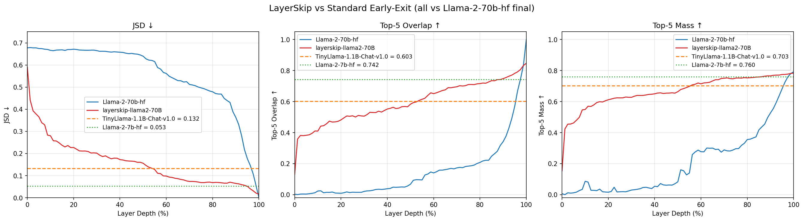
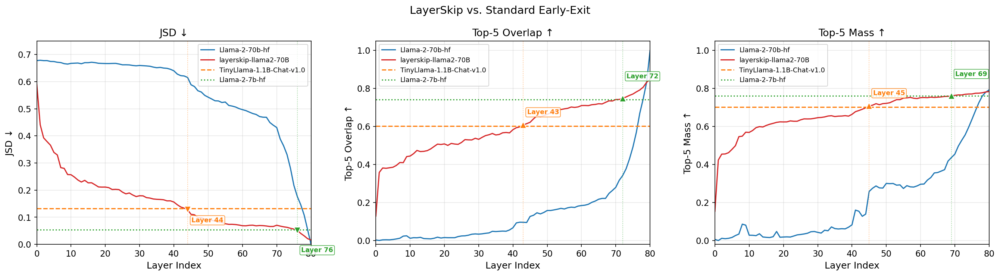
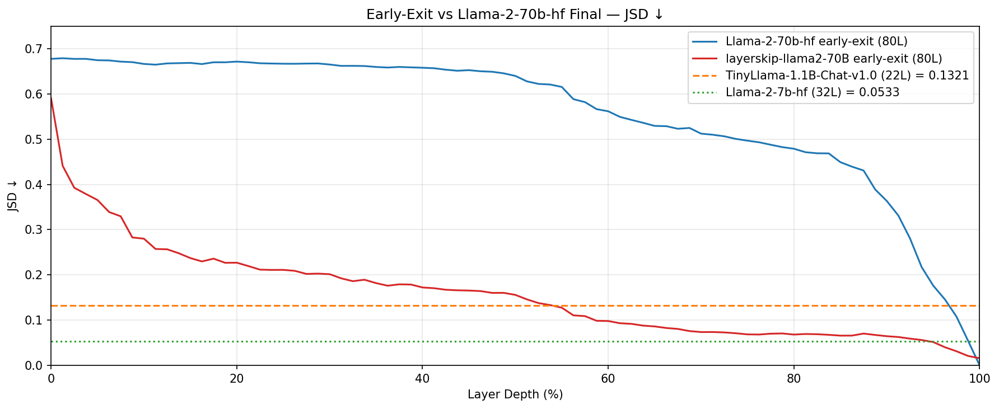
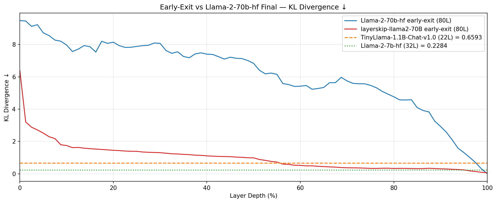
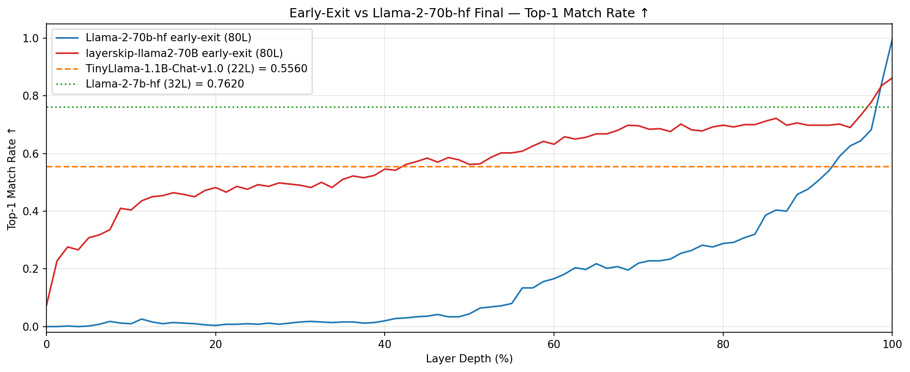
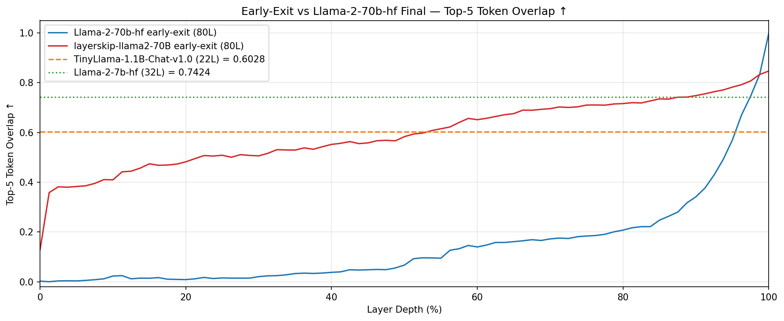
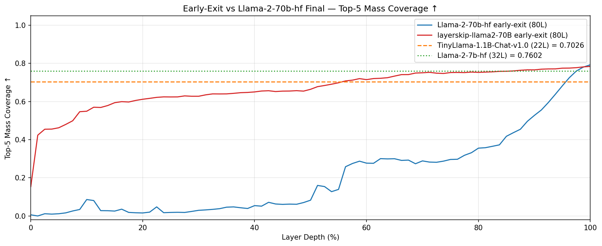
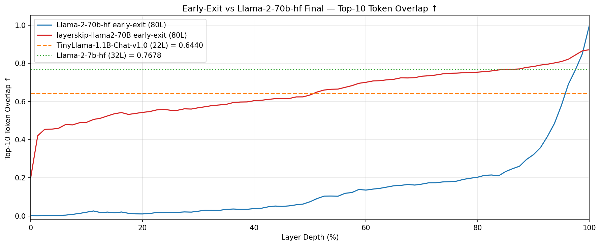
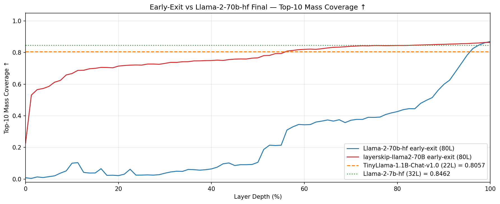

# LayerSkip vs. Standard Early-Exit Analysis Report

## Llama-2-70B-hf — Early-Exit Distribution Analysis

---

## 1. Experiment Overview

| Parameter | Value |
|---|---|
| **Target Model** | Llama-2-70b-hf (80 layers) |
| **LayerSkip Model** | layerskip-llama2-70B (80 layers) |
| **Draft Models** | TinyLlama-1.1B-Chat-v1.0 (22 layers), Llama-2-7b-hf (32 layers) |
| **Dataset** | GSM8K |
| **# Samples** | 50 |
| **# Tokens per sample** | 10 (greedy generation) |
| **# Total positions** | 500 |

**목적**: Target 모델(Llama-2-70B)의 중간 레이어에서 early-exit한 분포가 최종 출력 분포를 얼마나 잘 근사하는지 분석.  
Standard early-exit (logit lens)과 LayerSkip (early-exit 학습된 모델)을 비교하고, 소형 draft 모델 2종의 성능을 baseline으로 설정.

---

## 2. Metrics 정의

| Metric | 방향 | 설명 |
|---|---|---|
| **JSD** (Jensen-Shannon Divergence) | ↓ Lower is better | Early-exit 분포와 최종 분포 간 대칭적 발산 |
| **KL** (KL Divergence) | ↓ Lower is better | Early-exit 분포 → 최종 분포 방향의 KL 발산 |
| **Top-1 Match** | ↑ Higher is better | Early-exit argmax == 최종 argmax 일치 비율 |
| **Top-5 Overlap** | ↑ Higher is better | \|top5(p\_E) ∩ top5(p\_T)\| / 5 |
| **Top-5 Mass** | ↑ Higher is better | Σ p\_T(v) for v ∈ top5(p\_E), early-exit의 top-5 토큰이 target 분포에서 차지하는 확률 질량 |
| **Top-10 Overlap** | ↑ Higher is better | \|top10(p\_E) ∩ top10(p\_T)\| / 10 |
| **Top-10 Mass** | ↑ Higher is better | Σ p\_T(v) for v ∈ top10(p\_E) |

---

## 3. Overview: LayerSkip vs. Standard Early-Exit

### Figure 1. Overview (Layer Depth %)

핵심 3개 metric (JSD, Top-5 Overlap, Top-5 Mass)을 하나의 그래프에 요약. 파란색(Llama-2-70b-hf)은 standard early-exit, 빨간색(layerskip-llama2-70B)은 LayerSkip early-exit. 수평 점선은 각 draft 모델의 baseline.

- **JSD (좌)**: Standard는 Layer Depth 80%까지 0.5 이상으로 높은 반면, LayerSkip은 Depth 5%부터 급격히 낮아져 Depth 50% 부근에서 TinyLlama baseline(0.132)과 교차.
- **Top-5 Overlap (중)**: Standard는 Depth 90%까지 거의 0에 머물다가 급상승. LayerSkip은 초반부터 지속적으로 상승하여 Depth 50%에서 이미 ~0.6.
- **Top-5 Mass (우)**: LayerSkip은 Depth 10%에서 이미 0.5를 넘으며, Depth 50% 이후 TinyLlama baseline(0.703)에 근접. Standard는 Depth 60%까지 0.3 이하.

### Figure 2. Overview — Revised (Layer Index, Crossover 표시)

Figure 1을 개선한 버전. X축을 Layer Index (0~80)로 변환하고, LayerSkip이 각 draft 모델을 능가하는 **crossover 시점**을 마커와 레이블로 표시.

- **JSD**: TinyLlama 능가 → Layer 44 (주황 마커), Llama-7B 능가 → Layer 76 (초록 마커)
- **Top-5 Overlap**: TinyLlama 능가 → Layer 43, Llama-7B 능가 → Layer 72
- **Top-5 Mass**: TinyLlama 능가 → Layer 45, Llama-7B 능가 → Layer 69

---

## 4. Draft Model Baselines

Draft 모델의 최종 출력 분포를 target 모델의 최종 출력 분포와 직접 비교한 결과:

| Metric | TinyLlama-1.1B (22L) | Llama-2-7B (32L) |
|---|---|---|
| **JSD ↓** | 0.132 | 0.053 |
| **KL ↓** | 0.659 | 0.228 |
| **Top-1 Match ↑** | 0.556 | 0.762 |
| **Top-5 Overlap ↑** | 0.603 | 0.742 |
| **Top-5 Mass ↑** | 0.703 | 0.760 |
| **Top-10 Overlap ↑** | 0.644 | 0.768 |
| **Top-10 Mass ↑** | 0.806 | 0.846 |

Llama-2-7B가 모든 metric에서 TinyLlama-1.1B보다 우수하며, target 분포에 훨씬 더 가까운 근사를 제공.

---

## 5. Detailed Per-Metric Analysis

### 5.1 JSD (Jensen-Shannon Divergence) ↓

**Figure 3. JSD per Layer**

JSD는 early-exit 분포와 target 최종 분포 간의 대칭적 발산을 측정하며, 전체적인 분포 유사도를 가장 잘 반영하는 핵심 metric.

- **Standard (파란선)**: L0~L50 구간에서 0.65~0.68로 거의 변화 없이 매우 높은 값 유지. L55부터 완만하게 감소하여 L70에서 0.43, L79에서야 0.054로 draft baseline 수준에 도달.
- **LayerSkip (빨간선)**: L0에서 0.591로 시작하여 L10까지 급격히 감소(0.257). L10~L40 구간에서 0.15~0.25로 안정화. L45 부근에서 TinyLlama baseline(0.132)을 하회하며, L76에서 Llama-7B baseline(0.053)도 하회.
- **해석**: LayerSkip 학습은 중간 레이어의 JSD를 60~86% 감소시키며, 특히 L10~L50 구간에서 standard 대비 가장 큰 절대적 차이(0.3~0.5 gap)를 보임.

### 5.2 KL Divergence ↓

**Figure 4. KL Divergence per Layer**

KL divergence는 비대칭 metric으로, early-exit 분포가 target 분포를 얼마나 잘 "커버"하는지를 측정. JSD보다 tail 분포에 민감.

- **Standard**: L0에서 9.5로 매우 높으며, L40에서도 6.8. 마지막 L79에서야 0.30으로 감소.
- **LayerSkip**: L0에서 6.4로 시작하여 L10에서 1.6, L40에서 0.98. Standard 대비 **79~94% 감소**.
- **해석**: KL은 JSD보다 더 극적인 개선을 보이는데, 이는 LayerSkip이 target 분포의 tail까지도 더 잘 근사하고 있음을 의미. 단, LayerSkip L60~L80 구간에서 KL이 0.3 수준에서 정체되는 현상이 관찰됨 (LayerSkip 모델의 근본적 한계).

### 5.3 Top-1 Match Rate ↑

**Figure 5. Top-1 Match Rate per Layer**

Greedy decoding에서 가장 직접적인 metric. Early-exit의 argmax가 target의 argmax와 일치하는 비율.

- **Standard**: L0~L40에서 거의 0. L50에서 0.20, L70에서 0.40. L79에서 0.85.
- **LayerSkip**: L1에서 이미 0.23으로 시작. L10에서 0.45, L40에서 0.56. L34에서 TinyLlama(0.556) 능가. Llama-7B(0.762)는 L78에서 능가.
- **해석**: LayerSkip은 초기 레이어부터 비교적 높은 Top-1 Match를 보이지만, 50~70% 구간에서 0.56~0.70으로 정체. 이는 분포 자체는 유사해지더라도 최빈값의 순위가 쉽게 뒤바뀔 수 있음을 시사.

### 5.4 Top-5 Token Overlap ↑

**Figure 6. Top-5 Token Overlap per Layer**

Early-exit 분포의 top-5 토큰과 target 분포의 top-5 토큰이 얼마나 겹치는지 (집합 기반 metric).

- **Standard**: L0~L40에서 거의 0. L50에서 0.16, L70에서 0.28. L79에서야 0.83.
- **LayerSkip**: L1에서 0.36으로 시작. L20에서 0.51, L43에서 TinyLlama(0.603) 능가. L72에서 Llama-7B(0.742) 능가.
- **해석**: Standard와 LayerSkip의 차이가 가장 극적으로 드러나는 metric. L10~L60 구간에서 standard는 거의 0인 반면 LayerSkip은 0.4~0.7로, 실질적으로 의미 있는 토큰 겹침이 존재.

### 5.5 Top-5 Mass Coverage ↑

**Figure 7. Top-5 Mass Coverage per Layer**

Early-exit의 top-5 토큰이 target 분포의 확률 질량을 얼마나 커버하는지 (확률 가중 metric). Overlap은 토큰 개수만 세지만, Mass는 해당 토큰들의 target 확률 합을 측정하여 **중요한 토큰을 잡았는지**를 평가.

- **Standard**: L0~L30에서 0.01~0.04. L50에서 0.30, L70에서 0.45. L79에서 0.78.
- **LayerSkip**: L1에서 이미 0.42. L10에서 0.57, L20에서 0.62. L45에서 TinyLlama(0.703) 능가. L69에서 Llama-7B(0.760) 능가.
- **해석**: LayerSkip은 Overlap보다 Mass에서 더 높은 절대값을 보임. 예를 들어 L20에서 Overlap=0.51이지만 Mass=0.62로, 겹치는 토큰들이 높은 확률의 중요 토큰임을 의미. 이는 speculative decoding에서 acceptance probability와 직접 연결되어 실질적인 draft 품질을 반영.

### 5.6 Top-10 Token Overlap ↑

**Figure 8. Top-10 Token Overlap per Layer**

Top-5보다 넓은 범위(top-10)에서의 토큰 겹침. Standard와 LayerSkip 간 패턴은 Top-5와 유사하나, 절대값이 약간 더 높음.

- **Standard**: L0~L40에서 ~0.03. L70에서 0.26.
- **LayerSkip**: L1에서 0.42. L41에서 TinyLlama(0.644) 능가. L68에서 Llama-7B(0.768) 능가.
- **해석**: Top-10은 Top-5보다 약간 더 높은 값을 보이며, 트렌드는 동일. Crossover 시점도 Top-5와 거의 동일(TinyLlama: L41 vs L43, Llama-7B: L68 vs L72).

### 5.7 Top-10 Mass Coverage ↑

**Figure 9. Top-10 Mass Coverage per Layer**

Top-10 토큰이 커버하는 target 확률 질량. 모든 metric 중 가장 높은 절대값을 보임.

- **Standard**: L0에서 0.01. L50에서 0.36. L70에서 0.52.
- **LayerSkip**: L1에서 0.53. L10에서 0.69. L45에서 TinyLlama(0.806) 능가. L67에서 Llama-7B(0.846) 능가.
- **해석**: LayerSkip L10에서 이미 target 분포 확률 질량의 69%를 top-10으로 커버. 이는 early-exit 시점에서 높은 확률의 토큰 후보군을 안정적으로 추출할 수 있음을 의미하며, speculative decoding에서 verification 단계의 효율을 높일 수 있는 근거가 됨.

---

## 6. LayerSkip vs. Standard Early-Exit 정량 비교

### JSD 감소율 (LayerSkip / Standard)

| Layer | Standard JSD | LayerSkip JSD | 감소율 |
|---|---|---|---|
| L10 | 0.667 | 0.257 | **61.6%** |
| L20 | 0.667 | 0.211 | **68.3%** |
| L30 | 0.660 | 0.179 | **72.8%** |
| L40 | 0.640 | 0.156 | **75.6%** |
| L50 | 0.543 | 0.092 | **83.1%** |
| L60 | 0.497 | 0.069 | **86.2%** |
| L70 | 0.431 | 0.070 | **83.7%** |

LayerSkip은 모든 레이어에서 standard early-exit 대비 **60~86%의 JSD 감소**를 달성.

### KL 감소율

| Layer | Standard KL | LayerSkip KL | 감소율 |
|---|---|---|---|
| L10 | 7.717 | 1.629 | **78.9%** |
| L20 | 7.884 | 1.386 | **82.4%** |
| L30 | 7.420 | 1.147 | **84.5%** |
| L40 | 6.834 | 0.981 | **85.6%** |
| L50 | 5.231 | 0.486 | **90.7%** |
| L60 | 5.473 | 0.329 | **94.0%** |
| L70 | 3.829 | 0.335 | **91.2%** |

KL divergence에서는 **79~94%의 감소율**로, JSD보다 더 극적인 개선.

### Top-5 Overlap 향상

| Layer | Standard | LayerSkip | 차이 |
|---|---|---|---|
| L10 | 0.012 | 0.444 | **+0.432** |
| L20 | 0.016 | 0.508 | **+0.493** |
| L30 | 0.034 | 0.532 | **+0.499** |
| L40 | 0.067 | 0.583 | **+0.516** |
| L50 | 0.158 | 0.664 | **+0.506** |
| L60 | 0.184 | 0.710 | **+0.526** |
| L70 | 0.280 | 0.742 | **+0.462** |

Standard early-exit에서 거의 0에 가까운 Top-5 Overlap이 LayerSkip에서는 0.44~0.74로 크게 향상.

---

## 7. Crossover Analysis: LayerSkip이 Draft 모델을 능가하는 시점

LayerSkip의 early-exit 분포가 각 draft 모델의 최종 분포 성능을 넘어서는 첫 번째 레이어:

### vs TinyLlama-1.1B-Chat-v1.0

| Metric | Draft Baseline | Crossover Layer | LayerSkip Value | 전체 대비 비율 |
|---|---|---|---|---|
| **JSD ↓** | 0.132 | **Layer 44** | 0.128 | 55% |
| **KL ↓** | 0.659 | **Layer 45** | 0.596 | 56% |
| **Top-1 Match ↑** | 0.556 | **Layer 34** | 0.562 | 43% |
| **Top-5 Overlap ↑** | 0.603 | **Layer 43** | 0.608 | 54% |
| **Top-5 Mass ↑** | 0.703 | **Layer 45** | 0.708 | 56% |
| **Top-10 Overlap ↑** | 0.644 | **Layer 41** | 0.650 | 51% |
| **Top-10 Mass ↑** | 0.806 | **Layer 45** | 0.809 | 56% |

→ **Layer 34~45 (전체의 43~56%)** 부터 TinyLlama-1.1B를 능가.

### vs Llama-2-7B-hf

| Metric | Draft Baseline | Crossover Layer | LayerSkip Value | 전체 대비 비율 |
|---|---|---|---|---|
| **JSD ↓** | 0.053 | **Layer 76** | 0.052 | 95% |
| **KL ↓** | 0.228 | **Layer 77** | 0.176 | 96% |
| **Top-1 Match ↑** | 0.762 | **Layer 78** | 0.778 | 98% |
| **Top-5 Overlap ↑** | 0.742 | **Layer 72** | 0.748 | 90% |
| **Top-5 Mass ↑** | 0.760 | **Layer 69** | 0.760 | 86% |
| **Top-10 Overlap ↑** | 0.768 | **Layer 68** | 0.768 | 85% |
| **Top-10 Mass ↑** | 0.846 | **Layer 67** | 0.847 | 84% |

→ **Layer 67~78 (전체의 84~98%)** 부터 Llama-2-7B를 능가.

### 핵심 시사점

- LayerSkip은 **절반 레이어만 사용해도 TinyLlama-1.1B (22L) 수준의 분포 근사** 가능.
- 그러나 Llama-2-7B (32L) 수준에 도달하려면 **80~95% 이상의 레이어**가 필요.
- Standard early-exit으로는 TinyLlama-1.1B를 능가하려면 Layer 80 이후 (JSD 기준)가 필요하여, **사실상 full forward pass가 필요**.

---

## 8. LayerSkip의 수렴 특성

LayerSkip 모델의 early-exit 분포 품질은 레이어에 따른 뚜렷한 3단계 패턴을 보임:

### Phase 1: 급격한 개선 (L0 ~ L10)
- JSD: 0.591 → 0.257 (56.5% 감소)
- Top-5 Overlap: 0.129 → 0.444 (+0.315)
- LayerSkip 학습 효과가 가장 극적으로 나타나는 구간

### Phase 2: 점진적 안정화 (L10 ~ L45)
- JSD: 0.257 → 0.128 (50.2% 추가 감소)
- Top-5 Overlap: 0.444 → 0.608 (+0.164)
- 개선 속도가 둔화되지만 꾸준히 개선

### Phase 3: 미세 조정 (L45 ~ L80)
- JSD: 0.128 → 0.016 (87.5% 추가 감소)
- Top-5 Overlap: 0.608 → 0.847 (+0.239)
- 최종 레이어로 갈수록 target 분포에 수렴

---

## 9. Speculative Decoding 관점에서의 함의

| Exit Point | JSD | Top-5 Overlap | Top-5 Mass | 의미 |
|---|---|---|---|---|
| **L20 (25%)** | 0.211 | 0.508 | 0.624 | TinyLlama보다 JSD는 낮지만 Top-k 성능은 아직 미달 |
| **L40 (50%)** | 0.156 | 0.583 | 0.664 | TinyLlama와 대등하며 Top-k 일부 능가 |
| **L60 (75%)** | 0.069 | 0.710 | 0.752 | TinyLlama 크게 능가, Llama-7B에 근접 |
| **L70 (88%)** | 0.070 | 0.742 | 0.764 | Llama-7B와 대등 |

Speculative decoding에서 LayerSkip을 draft로 사용할 경우:
- **L40 exit (50% 연산)**: TinyLlama-1.1B 수준의 draft quality
- **L60 exit (75% 연산)**: TinyLlama-1.1B를 크게 능가하는 draft quality
- **L70 exit (88% 연산)**: Llama-2-7B 수준의 draft quality

다만, 연산량 절감 효과(25~50% skip)와 draft 품질 간 trade-off가 존재. L70 exit는 draft 품질은 높지만 연산 절감이 12%에 불과하여, 별도 draft 모델 대비 이점이 제한적.

---

## 10. Layer별 수치 참고표

### Standard Early-Exit

| Layer | JSD ↓ | KL ↓ | Top-1 Match ↑ | Top-5 Overlap ↑ | Top-5 Mass ↑ |
|---|---|---|---|---|---|
| L0 | 0.677 | 9.485 | 0.000 | 0.003 | 0.006 |
| L10 | 0.667 | 7.717 | 0.016 | 0.012 | 0.028 |
| L20 | 0.667 | 7.884 | 0.008 | 0.016 | 0.018 |
| L30 | 0.660 | 7.420 | 0.012 | 0.034 | 0.043 |
| L40 | 0.640 | 6.834 | 0.044 | 0.067 | 0.083 |
| L50 | 0.543 | 5.231 | 0.204 | 0.158 | 0.301 |
| L60 | 0.497 | 5.473 | 0.264 | 0.184 | 0.296 |
| L70 | 0.431 | 3.829 | 0.400 | 0.280 | 0.455 |
| L79 | 0.054 | 0.297 | 0.846 | 0.834 | 0.780 |

### LayerSkip Early-Exit

| Layer | JSD ↓ | KL ↓ | Top-1 Match ↑ | Top-5 Overlap ↑ | Top-5 Mass ↑ |
|---|---|---|---|---|---|
| L0 | 0.591 | 6.375 | 0.074 | 0.129 | 0.154 |
| L10 | 0.257 | 1.629 | 0.450 | 0.444 | 0.569 |
| L20 | 0.211 | 1.386 | 0.492 | 0.508 | 0.624 |
| L30 | 0.179 | 1.147 | 0.516 | 0.532 | 0.646 |
| L40 | 0.156 | 0.981 | 0.562 | 0.583 | 0.664 |
| L50 | 0.092 | 0.486 | 0.650 | 0.664 | 0.722 |
| L60 | 0.069 | 0.329 | 0.682 | 0.710 | 0.752 |
| L70 | 0.070 | 0.335 | 0.698 | 0.742 | 0.764 |
| L80 | 0.016 | 0.064 | 0.862 | 0.847 | 0.784 |

---

## 11. Summary

1. **Standard early-exit (logit lens)은 Llama-2-70B에서 매우 비효과적**: 마지막 ~5개 레이어를 제외하면 draft 모델보다 성능이 낮음.
2. **LayerSkip은 모든 레이어에서 standard 대비 60~94% 성능 개선**: 특히 초반 10개 레이어에서 가장 극적인 개선.
3. **LayerSkip L40~L45 (50~56%) ≈ TinyLlama-1.1B**: 절반 연산으로 22-layer 모델 수준 달성.
4. **LayerSkip L67~L78 (84~98%) ≈ Llama-2-7B**: 7B 모델 수준에는 상당한 레이어 필요.
5. **Speculative decoding draft로서의 효용**: L60 (75%) exit가 연산 절감(25%)과 draft 품질 간 최적 균형점으로 보임.
