# MESA-SSD Correction Distribution Analysis Report

**Experiment**: Can the correction distribution at a rejected SD position
be approximated by an early-exit (logit lens) proxy from an intermediate target layer?

- **Dataset**: GSM8K (200 samples)
- **Window size**: 10 draft tokens
- **Checkpoints**: cp0, cp128, cp256, cp512 (number of target-generated context tokens)
- **Rejection**: Probabilistic SD — accept with prob min(1, p_T(y)/p_D(y))
- **Metrics computed at first reject position only**

---

## Llama 70B+1B

- Target layers: 80
- Samples: 200

### Overview

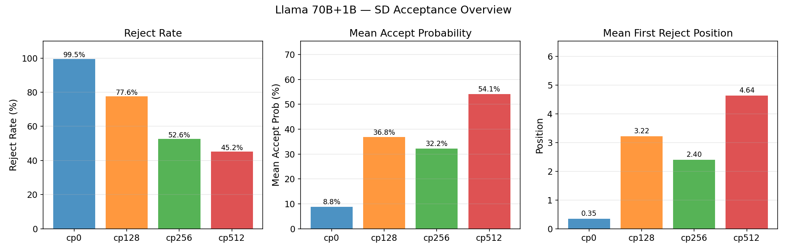

| Checkpoint | Valid Samples | Rejected | All-Accepted | Reject Rate | Accept Prob | First Reject Pos |
|:---:|:---:|:---:|:---:|:---:|:---:|:---:|
| cp0 | 200 | 199 | 1 | 99.5% | 0.0881 | 0.35 |
| cp128 | 58 | 45 | 13 | 77.6% | 0.3681 | 3.22 |
| cp256 | 38 | 20 | 18 | 52.6% | 0.3220 | 2.40 |
| cp512 | 31 | 14 | 17 | 45.2% | 0.5414 | 4.64 |

### Rejection Position Distribution

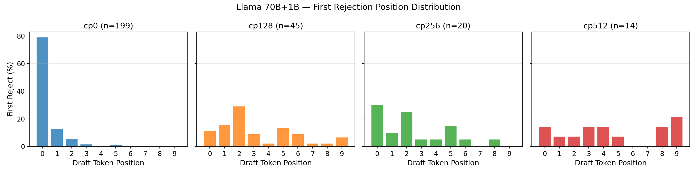

Shows where in the 10-token draft window the first rejection occurs.
Position 0 = first draft token.

### JSD: Correction Distribution vs Early-Exit Proxy

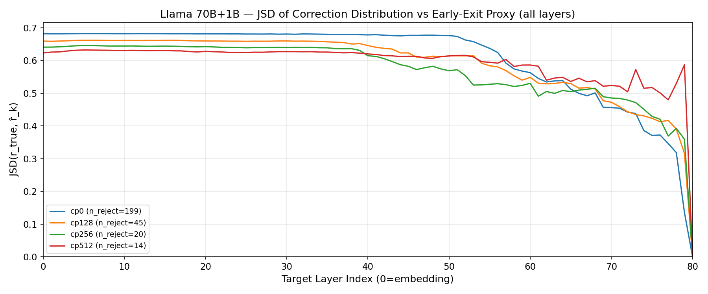

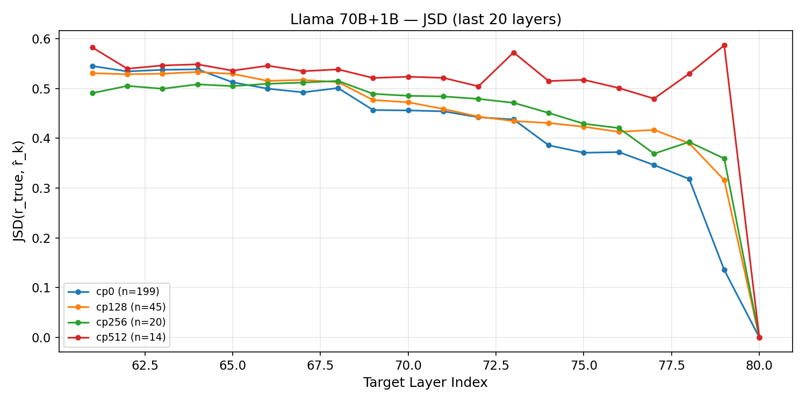

**JSD at key layers:**

| Checkpoint | L76 | L77 | L78 | L79 | L80 |
|:---:|:---:|:---:|:---:|:---:|:---:|
| cp0 | 0.3723 | 0.3463 | 0.3185 | 0.1357 | 0.0000 |
| cp128 | 0.4128 | 0.4169 | 0.3903 | 0.3161 | 0.0000 |
| cp256 | 0.4205 | 0.3691 | 0.3925 | 0.3594 | 0.0000 |
| cp512 | 0.5009 | 0.4796 | 0.5296 | 0.5866 | 0.0000 |

### Top-1 Match

Whether the proxy's argmax correction token matches the true correction token.

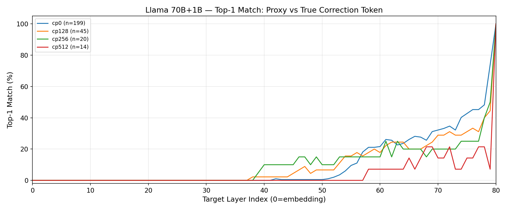

### Top-5 Coverage

Whether the true correction token falls within the proxy's top-5.

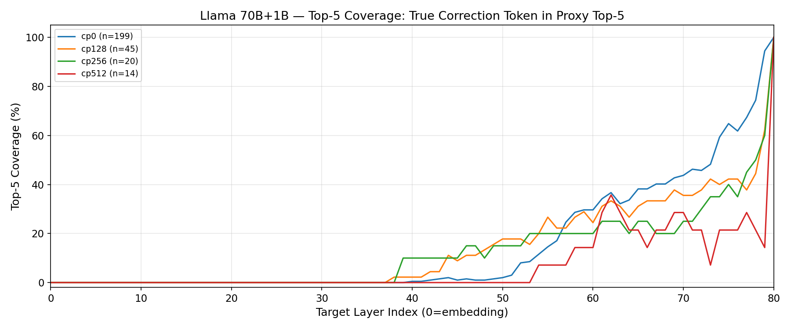

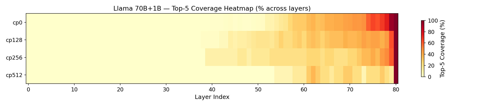

### Top-5 Recall

Overlap ratio: |proxy_top5 ∩ true_top5| / |true_top5|

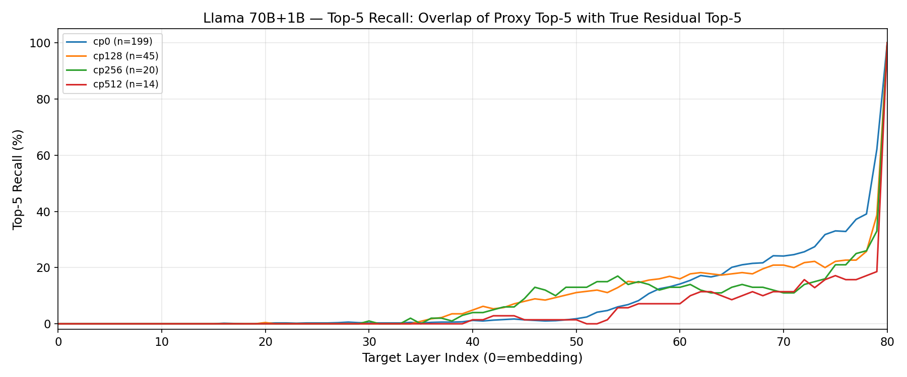

### Early-Exit Proxy L[-2] vs Draft Baseline

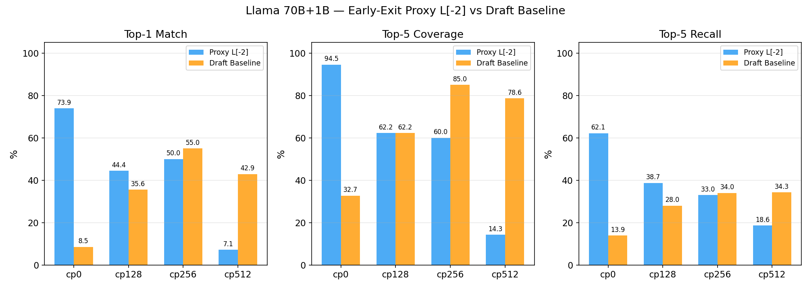

| Checkpoint | Proxy L[-2] Top1 | Draft Top1 | Proxy L[-2] Top5 | Draft Top5 | Proxy L[-2] Top5R | Draft Top5R |
|:---:|:---:|:---:|:---:|:---:|:---:|:---:|
| cp0 | 73.9% | 8.5% | 94.5% | 32.7% | 62.1% | 13.9% |
| cp128 | 44.4% | 35.6% | 62.2% | 62.2% | 38.7% | 28.0% |
| cp256 | 50.0% | 55.0% | 60.0% | 85.0% | 33.0% | 34.0% |
| cp512 | 7.1% | 42.9% | 14.3% | 78.6% | 18.6% | 34.3% |

---

## Qwen3 32B+0.6B

- Target layers: 64
- Samples: 200

### Overview

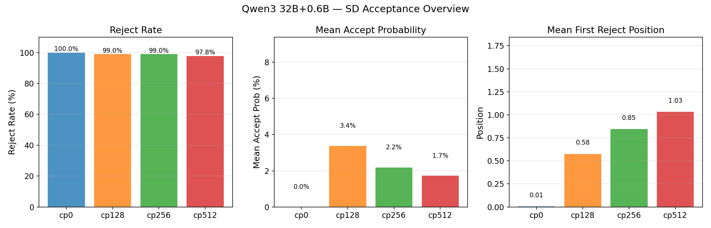

| Checkpoint | Valid Samples | Rejected | All-Accepted | Reject Rate | Accept Prob | First Reject Pos |
|:---:|:---:|:---:|:---:|:---:|:---:|:---:|
| cp0 | 200 | 200 | 0 | 100.0% | 0.0000 | 0.01 |
| cp128 | 200 | 198 | 2 | 99.0% | 0.0337 | 0.58 |
| cp256 | 197 | 195 | 2 | 99.0% | 0.0218 | 0.85 |
| cp512 | 185 | 181 | 4 | 97.8% | 0.0172 | 1.03 |

### Rejection Position Distribution

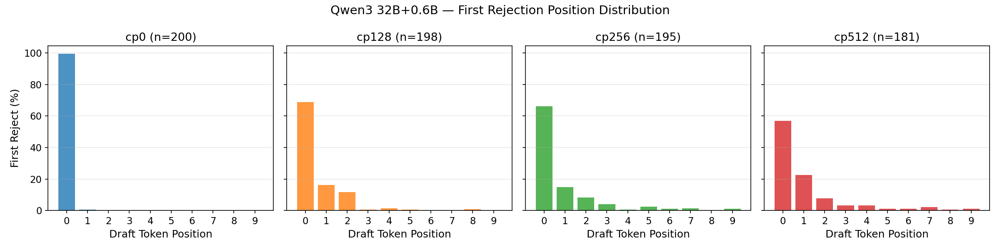

Shows where in the 10-token draft window the first rejection occurs.
Position 0 = first draft token.

### JSD: Correction Distribution vs Early-Exit Proxy

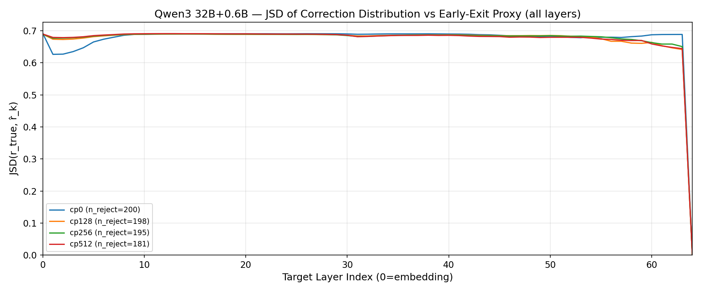

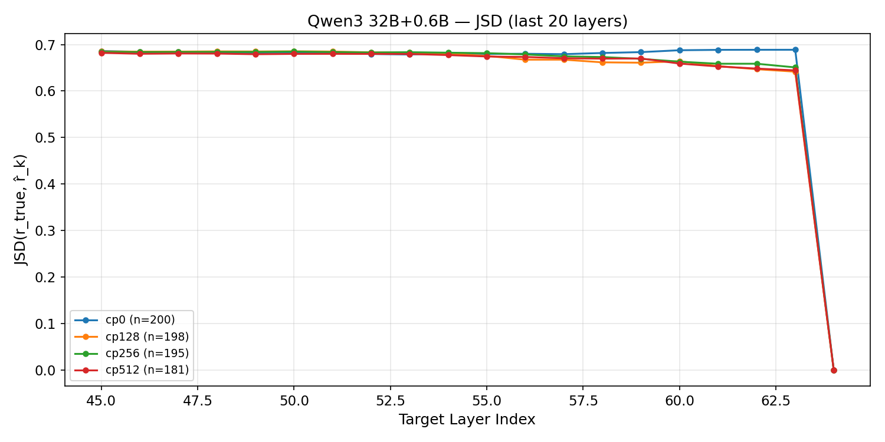

**JSD at key layers:**

| Checkpoint | L60 | L61 | L62 | L63 | L64 |
|:---:|:---:|:---:|:---:|:---:|:---:|
| cp0 | 0.6877 | 0.6885 | 0.6886 | 0.6887 | 0.0000 |
| cp128 | 0.6640 | 0.6536 | 0.6469 | 0.6417 | 0.0000 |
| cp256 | 0.6631 | 0.6587 | 0.6587 | 0.6508 | 0.0000 |
| cp512 | 0.6590 | 0.6528 | 0.6483 | 0.6444 | 0.0000 |

### Top-1 Match

Whether the proxy's argmax correction token matches the true correction token.

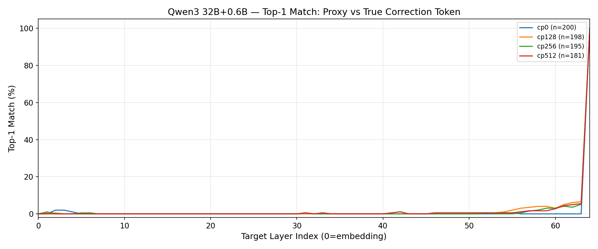

### Top-5 Coverage

Whether the true correction token falls within the proxy's top-5.

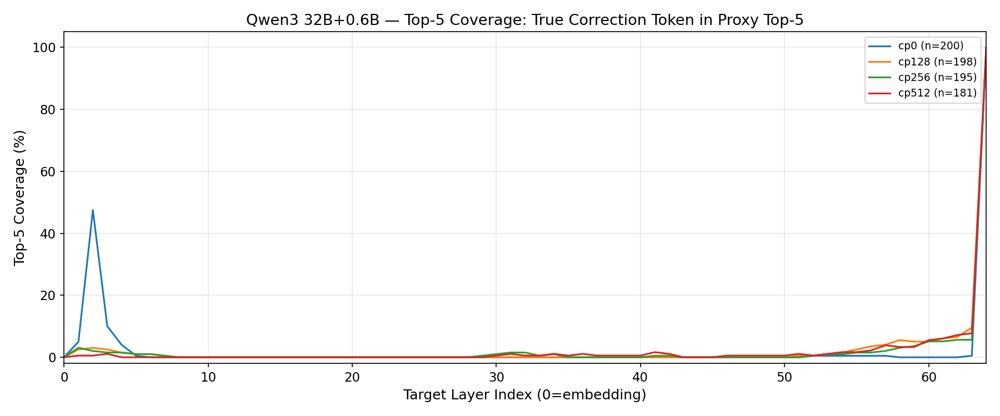

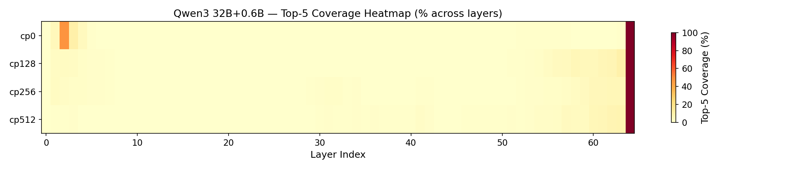

### Top-5 Recall

Overlap ratio: |proxy_top5 ∩ true_top5| / |true_top5|

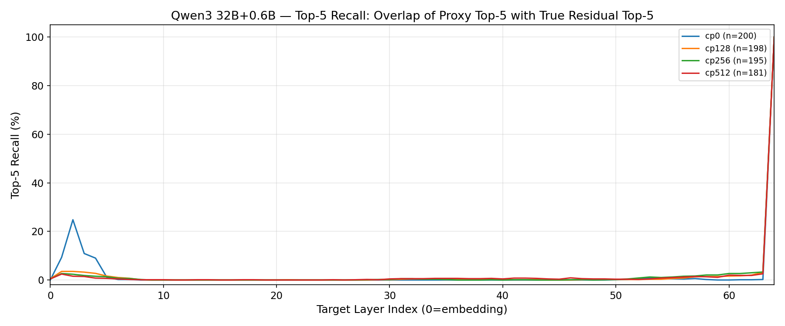

### Early-Exit Proxy L[-2] vs Draft Baseline

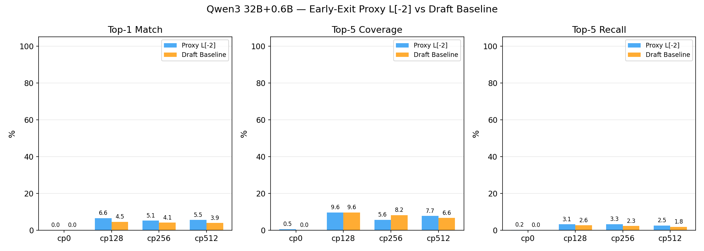

| Checkpoint | Proxy L[-2] Top1 | Draft Top1 | Proxy L[-2] Top5 | Draft Top5 | Proxy L[-2] Top5R | Draft Top5R |
|:---:|:---:|:---:|:---:|:---:|:---:|:---:|
| cp0 | 0.0% | 0.0% | 0.5% | 0.0% | 0.2% | 0.0% |
| cp128 | 6.6% | 4.5% | 9.6% | 9.6% | 3.1% | 2.6% |
| cp256 | 5.1% | 4.1% | 5.6% | 8.2% | 3.3% | 2.3% |
| cp512 | 5.5% | 3.9% | 7.7% | 6.6% | 2.5% | 1.8% |

---

## Cross-Model Comparison

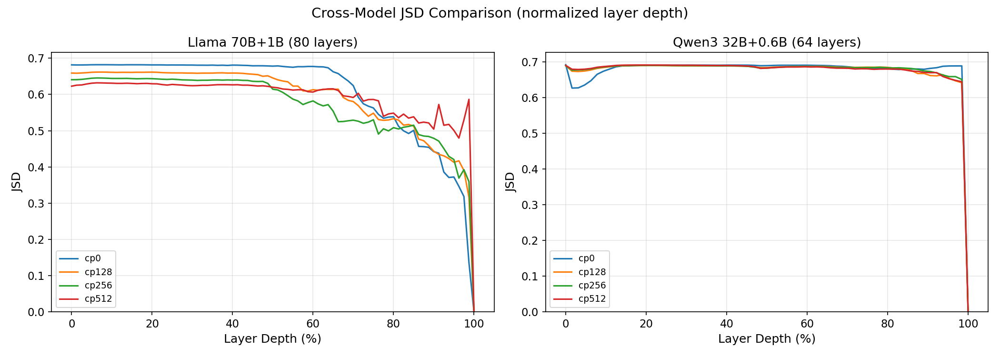

---

## Key Findings

### Llama 70B + 1B

1. **Early-exit proxy is highly effective at cp0**: L79 (second-to-last) achieves
   94.5% top-5 coverage and 73.9% top-1 match for the correction token.
   JSD drops to 0.136 — the proxy closely approximates the true correction distribution.

2. **Proxy outperforms draft baseline at cp0**: Draft top-5 coverage is only 32.7%
   vs proxy's 94.5% — a ~3x improvement, validating the MESA-SSD hypothesis.

3. **Longer context reduces proxy advantage**: At cp128+, reject rate drops (77.6%→45.2%)
   and remaining rejections are harder cases where even the proxy struggles.
   At cp512, draft baseline (78.6%) actually surpasses the proxy (14.3%).

4. **Rejection concentrates at position 0**: At cp0, 79% of rejections occur at
   the first draft token. With more context, rejections spread across the window.

5. **Statistical caveat**: cp256 has only 20 rejections, cp512 has 14 — interpret with care.

### Qwen3 32B + 0.6B

1. **Fundamental draft-target mismatch**: Accept probability ≈ 0 across all checkpoints.
   The 0.6B draft model's distribution barely overlaps with the 32B target.

2. **Early-exit proxy fails completely**: JSD remains ~0.64–0.69 even at L63
   (second-to-last). Top-5 coverage is 0.5–9.6%. The proxy provides almost
   no useful information about the correction distribution.

3. **Draft baseline also fails**: Both proxy and draft baselines are near 0%,
   indicating the correction distribution is unpredictable from either source.

4. **Implication**: MESA-SSD requires draft and target models from the same family
   with sufficient representation similarity. Qwen3-0.6B/32B pairing is too distant.

### Overall

- The MESA-SSD hypothesis (early-exit layers can predict correction tokens) is
  **confirmed for Llama** and **rejected for Qwen3** with current model pairings.
- The proxy is most valuable in low-context scenarios where draft-target divergence is high.
- A cp1 experiment (1 target token of context) is needed to validate under realistic
  SD conditions, since cp0 is artificially harsh (no bonus token from prefill).
