# MESA-SSD Correction Distribution Analysis — Llama 70B + 1B

## Experiment Setup

- **Target**: Llama-3.1-70B-Instruct (80 layers)
- **Draft**: Llama-3.2-1B-Instruct
- **Dataset**: GSM8K, 200 samples
- **Draft window**: 10 tokens (greedy)
- **SD rejection**: Probabilistic — accept with prob min(1, p_T(y)/p_D(y))
- **Checkpoints**: cp0 (prefill only), cp1 (1 target token), cp128, cp256, cp512
- **Metrics computed at first reject position**

### Metric Definitions

| Category | Metric | Description |
|:---|:---|:---|
| Correction (residual) | JSD(r_true, r̂_k) | JSD between true and proxy correction distributions |
| Correction (residual) | KL(r_true \|\| r̂_k) | Forward KL from true to proxy correction distribution |
| Correction (residual) | Top-1 Match | Proxy argmax matches true correction token |
| Correction (residual) | Top-5 Coverage | True correction token in proxy top-5 |
| Correction (residual) | Top-5 Recall | \|proxy_top5 ∩ true_top5\| / 5 |
| Raw distribution | JSD(p_T, p_E) | JSD between final and early-exit probability |
| Raw distribution | KL(p_T \|\| p_E) | Forward KL from final to early-exit probability |
| Mirror-SD | Top-k Overlap | \|topk(p_E) ∩ topk(p_T)\| / k |
| Mirror-SD | Top-k Mass | Σ p_T(v) for v ∈ topk(p_E) |
| Draft baseline | Draft Top-k | p_D top-k (excluding rejected token) covers correction token |

---

## 1. SD Acceptance Overview

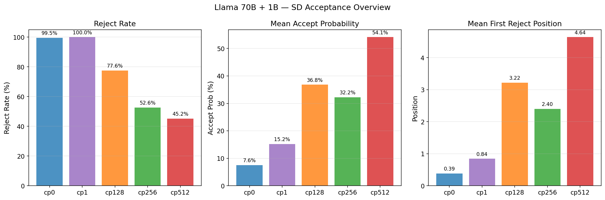

| CP | Samples | Rejected | All-Accept | Reject Rate | Accept Prob | First Reject Pos |
|:---:|:---:|:---:|:---:|:---:|:---:|:---:|
| cp0 | 200 | 199 | 1 | 99.5% | 0.0755 | 0.39 |
| cp1 | 200 | 200 | 0 | 100.0% | 0.1522 | 0.84 |
| cp128 | 58 | 45 | 13 | 77.6% | 0.3681 | 3.22 |
| cp256 | 38 | 20 | 18 | 52.6% | 0.3220 | 2.40 |
| cp512 | 31 | 14 | 17 | 45.2% | 0.5414 | 4.64 |

## 2. Rejection Position Distribution

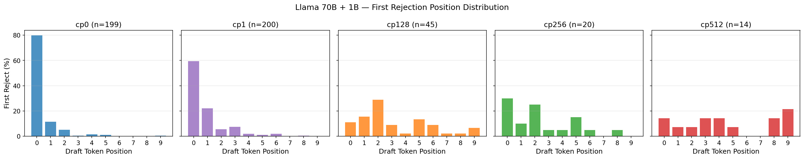

## 3. Correction Distribution Divergence

### 3.1 JSD (all checkpoints)

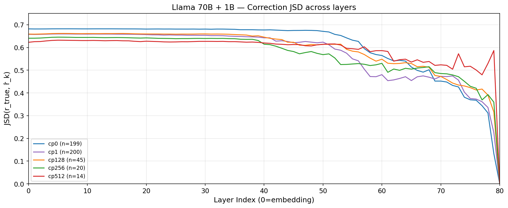
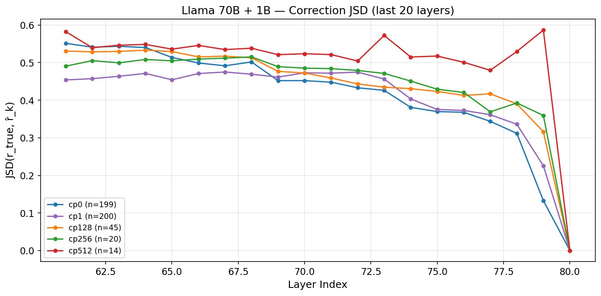

### 3.2 KL Divergence (cp0, cp1)

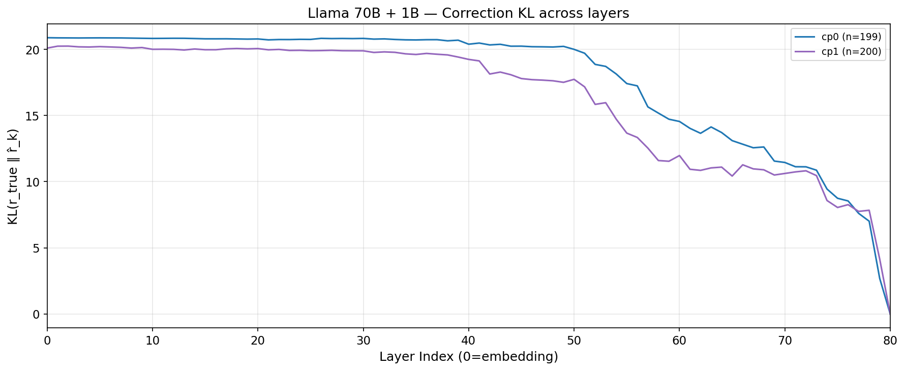
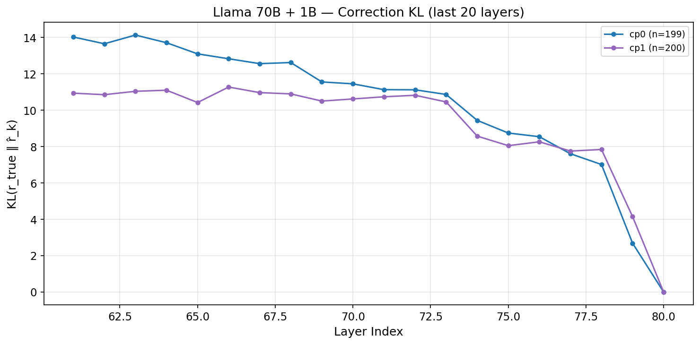

**Correction divergence at key layers (L79 = second-to-last):**

| CP | JSD@L79 | KL@L79 | JSD@L78 | KL@L78 | JSD@L77 |
|:---:|:---:|:---:|:---:|:---:|:---:|
| cp0 | 0.1327 | 2.6880 | 0.3118 | 7.0142 | 0.3437 |
| cp1 | 0.2255 | 4.1512 | 0.3360 | 7.8407 | 0.3613 |
| cp128 | 0.3161 | — | 0.3903 | — | 0.4169 |
| cp256 | 0.3594 | — | 0.3925 | — | 0.3691 |
| cp512 | 0.5866 | — | 0.5296 | — | 0.4796 |

## 4. Correction Token Prediction

### 4.1 Top-1 Match
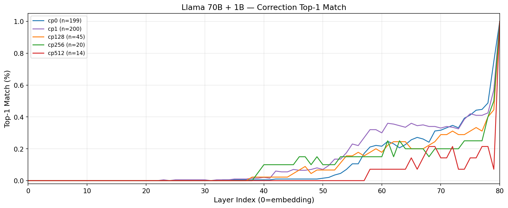

### 4.2 Top-5 Coverage
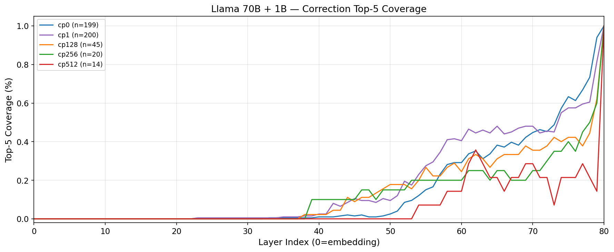
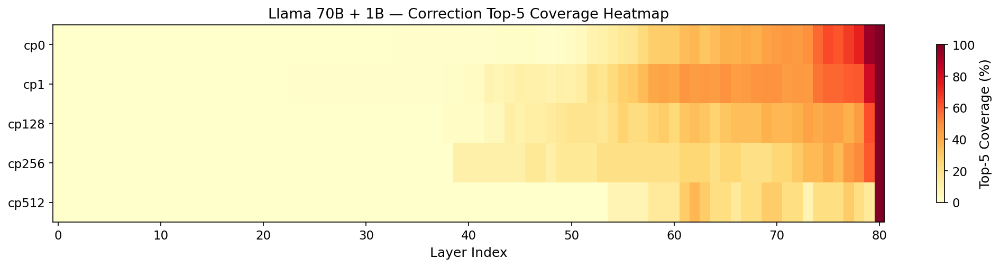

### 4.3 Top-5 Recall
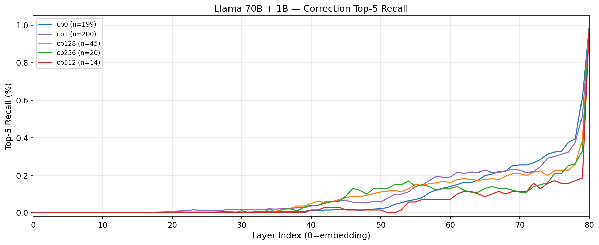

## 5. Early-Exit Proxy vs Draft Baseline

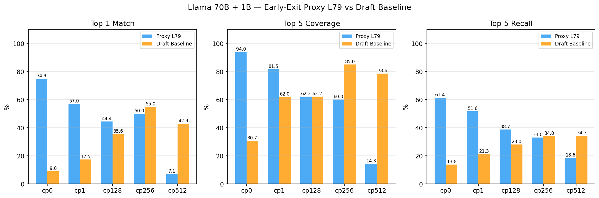

| CP | Proxy L79 Top-1 | Draft Top-1 | Proxy L79 Top-5 | Draft Top-5 | Proxy L79 Top-5R | Draft Top-5R |
|:---:|:---:|:---:|:---:|:---:|:---:|:---:|
| cp0 | 74.9% | 9.0% | 94.0% | 30.7% | 61.4% | 13.8% |
| cp1 | 57.0% | 17.5% | 81.5% | 62.0% | 51.6% | 21.3% |
| cp128 | 44.4% | 35.6% | 62.2% | 62.2% | 38.7% | 28.0% |
| cp256 | 50.0% | 55.0% | 60.0% | 85.0% | 33.0% | 34.0% |
| cp512 | 7.1% | 42.9% | 14.3% | 78.6% | 18.6% | 34.3% |

## 6. Raw Distribution: Early-Exit vs Final (p_E vs p_T)

### 6.1 JSD
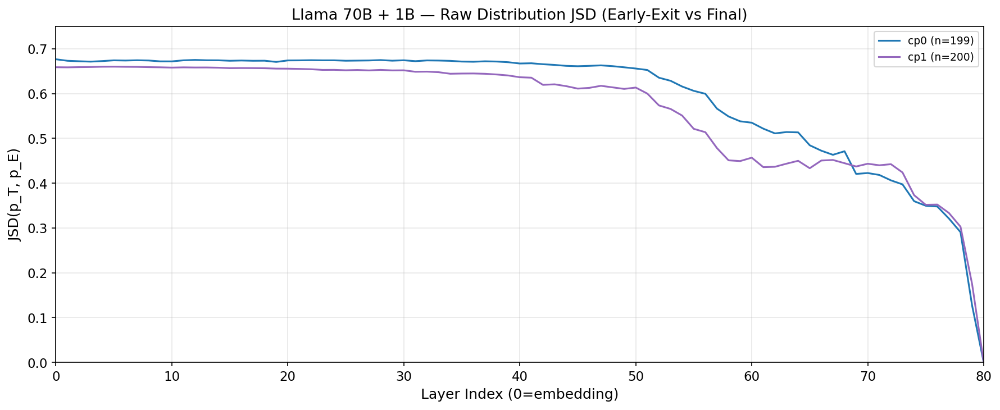
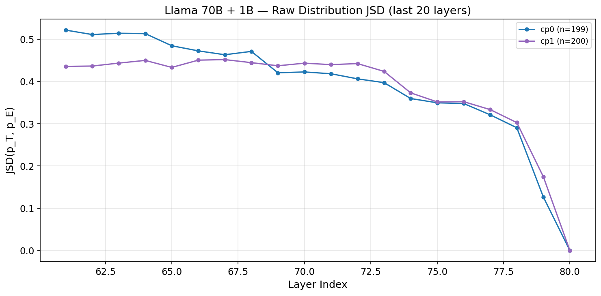

### 6.2 KL
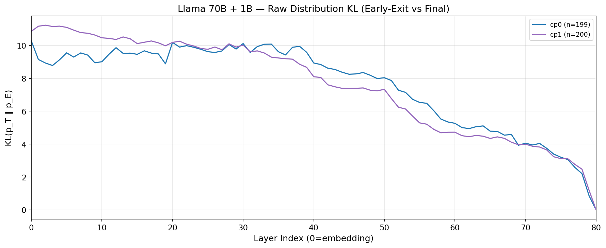
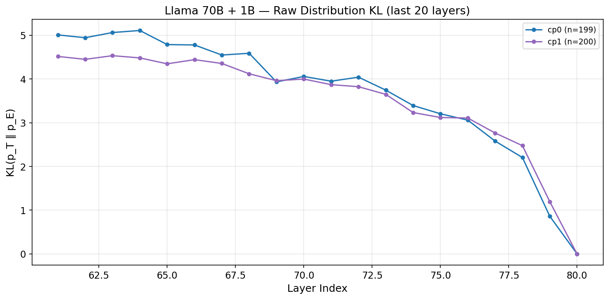

### 6.3 Correction vs Raw Comparison
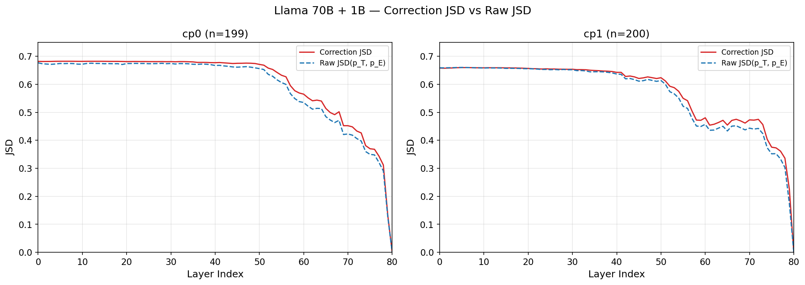
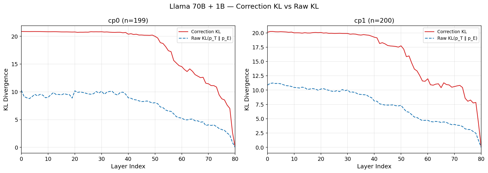

**Raw distribution divergence at L79:**

| CP | Raw JSD@L79 | Raw KL@L79 | Corr JSD@L79 | Corr KL@L79 |
|:---:|:---:|:---:|:---:|:---:|
| cp0 | 0.1266 | 0.8627 | 0.1327 | 2.6880 |
| cp1 | 0.1746 | 1.1969 | 0.2255 | 4.1512 |

## 7. Mirror-SD Top-k Analysis

### 7.1 Top-5 Token Overlap
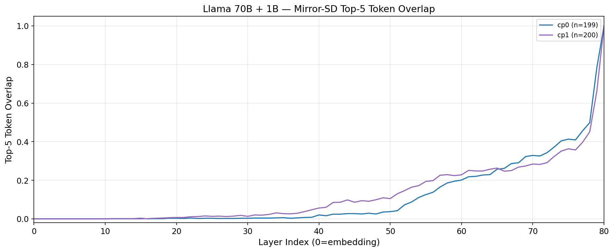

### 7.2 Top-5 Mass Coverage
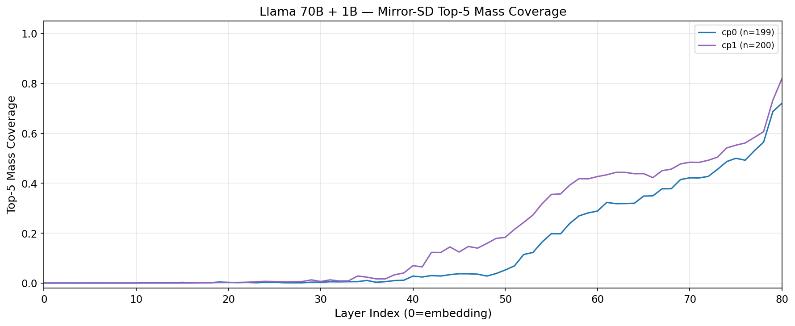

### 7.3 Top-10 Token Overlap
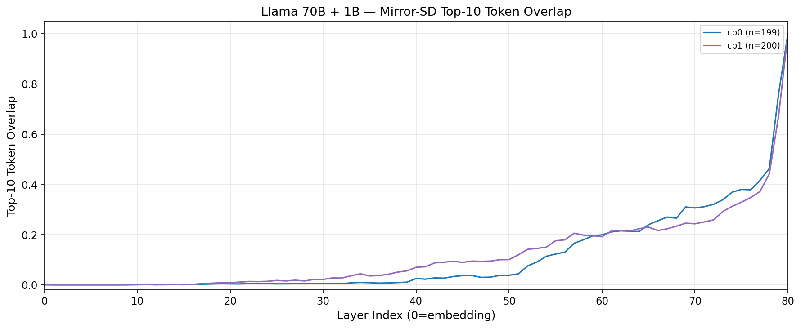

### 7.4 Top-10 Mass Coverage
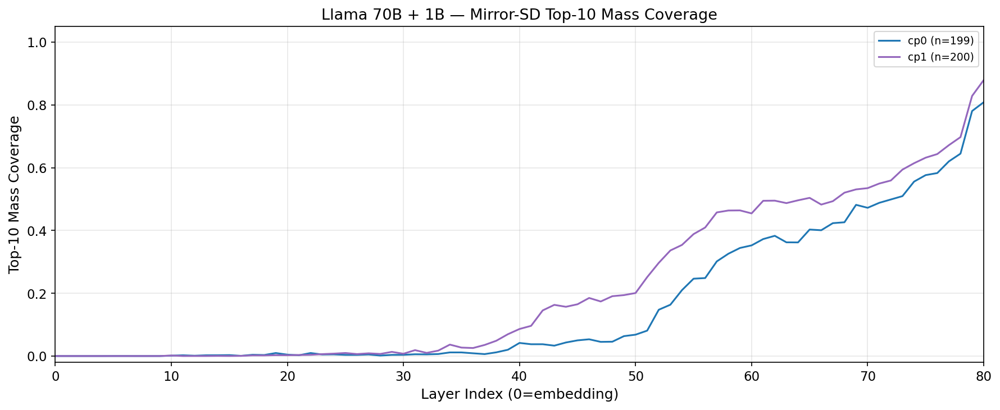

**Mirror-SD metrics at L79:**

| CP | Top-5 Overlap | Top-5 Mass | Top-10 Overlap | Top-10 Mass |
|:---:|:---:|:---:|:---:|:---:|
| cp0 | 0.785 | 0.687 | 0.762 | 0.780 |
| cp1 | 0.663 | 0.732 | 0.674 | 0.828 |

---

## Key Findings

### 1. cp0 vs cp1: Proxy remains effective under realistic SD conditions

| Metric (L79) | cp0 | cp1 | Change |
|:---|:---:|:---:|:---:|
| Correction JSD | 0.1327 | 0.2255 | +69.9% |
| Correction KL | 2.6880 | 4.1512 | +54.4% |
| Proxy Top-1 | 74.9% | 57.0% | -17.9pp |
| Proxy Top-5 Cover | 94.0% | 81.5% | -12.5pp |
| Draft Top-5 | 30.7% | 62.0% | +31.3pp |
| Raw JSD | 0.1266 | 0.1746 | +37.9% |
| Top-5 Overlap | 78.5% | 66.3% | -12.2pp |
| Top-5 Mass | 68.7% | 73.2% | +4.5pp |

### 2. Proxy advantage over draft baseline

At cp0 (most critical for MESA-SSD), the early-exit proxy L79 achieves:
- **94.0% top-5 coverage** vs draft's 30.7% (3.1x improvement)
- **74.9% top-1 match** vs draft's 9.0% (8.3x improvement)

At cp1 (realistic SD starting condition):
- **81.5% top-5 coverage** vs draft's 62.0% (1.3x improvement)
- **57.0% top-1 match** vs draft's 17.5% (3.3x improvement)

The proxy advantage narrows at longer contexts (cp128+) as draft alignment improves
and remaining rejections become harder cases.

### 3. Correction KL reveals tail sensitivity

While correction JSD shows moderate increase (cp0: 0.133 → cp1: 0.226, +70%),
correction KL increases more (2.69 → 4.15, +54%), exposing that the proxy
struggles with low-probability correction tokens in the distribution tail.

### 4. Raw vs Correction divergence

Raw JSD(p_T, p_E) at L79 is lower than correction JSD (0.127 vs 0.133 at cp0),
indicating the residual operation amplifies divergence in the non-overlapping region.
This gap widens at cp1 (0.175 vs 0.226), confirming that correction distribution
approximation is inherently harder than raw distribution approximation.

### 5. Mirror-SD top-k metrics

Top-5 overlap at L79 is 78.5% (cp0) / 66.3% (cp1), meaning ~4 of 5 top tokens match.
Top-5 mass coverage is 68.7% (cp0) / 73.2% (cp1) — the early-exit captures a large
fraction of the final distribution's probability mass, even when individual tokens differ.

### 6. Statistical caveats

- cp0/cp1: robust (n=199/200 rejections)
- cp128: moderate (n=45 rejections out of 58 valid)
- cp256: low (n=20), cp512: very low (n=14) — interpret with care
- cp128/256/512 lack KL, raw JSD/KL, and Mirror-SD metrics (run with older code)
