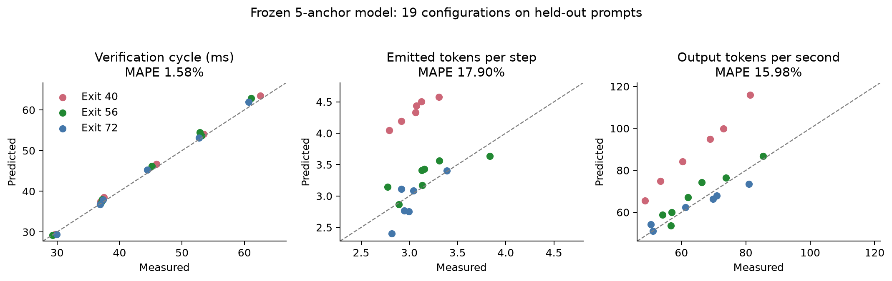
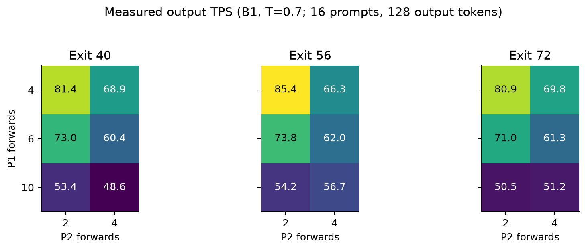
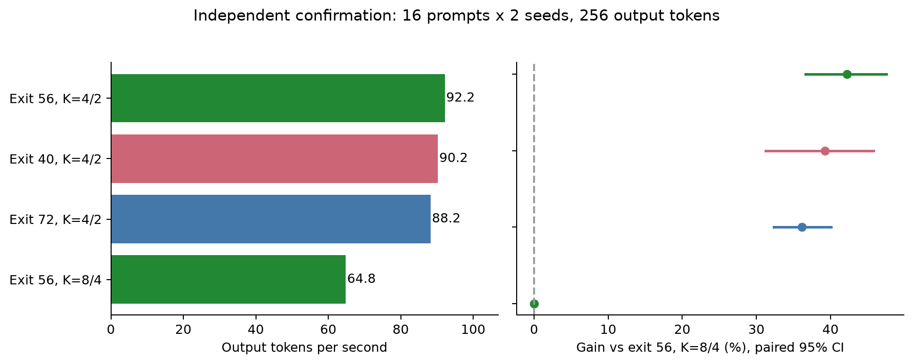
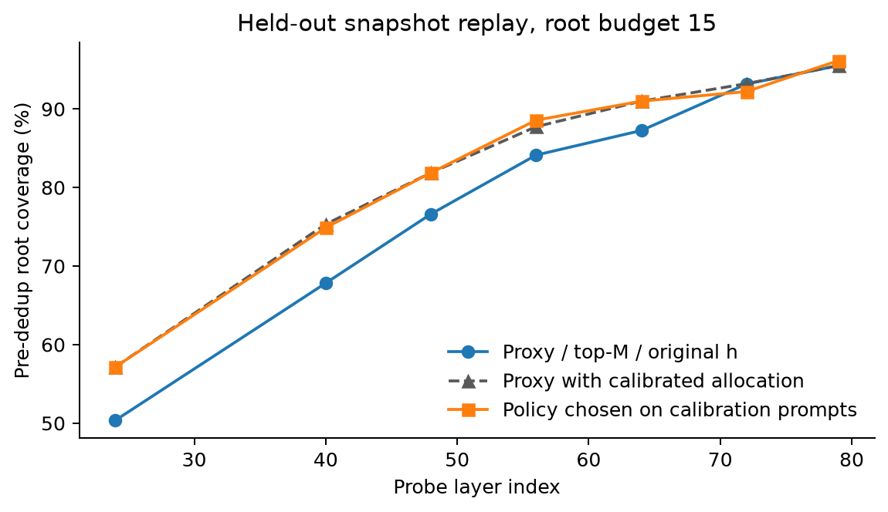

# DUET Calibrator feasibility — 새 설계와 실측 결과

9/22 최신 후속: [Tree 사후 분석 결론](../duet_tree_posthoc/FINDINGS.md).
Full480문항×두 정책의 37,869개 tree를 분석해 frozen table의 첫 형제 우선 한계와,
기존 calibration만 사용하는 추가 AL 기반 fanout 배분의 국소 개선 가능성을 확인했다.
국소 gain +2.95%는 새로운 end-to-end AL 결과가 아니다. [전체 수치·범위](../duet_tree_posthoc/REPORT.md)를 함께 본다.

직전 실제 AL 연구는 [Full Spec-Bench AL 평가](../duet_tree_al_full/REPORT.md)에서
3,360턴 실행과 검증을 완료했다(9/22). AL은 2.0651→2.1003(+1.70%)지만
95% CI에 0이 포함되어 전체 우위는 미확정이다. 사용자 지시에 따라 root 후보 선정의 목적은 cache hit, tree draft
구성의 목적은 AL이며, 이 보고서의 TPS 중심 calibration과 목적을 구분한다.

2026-09-21 진행 기록: [전체 연구의 완료 작업·미확정 결론·재개 순서](../DUET_PROGRESS.md).
아래는 9/13 실험 보고서이며, 후보 수식 개선과 calibration의 TPS 성과는 구분한다.

9/21 후속 [tree 감사·실험](../duet_tree_analysis/REPORT.md): G>M인 q-score
rerank는 closure만으로 lossless가 보장되지 않는 반례를 확인했다. 아래 tree
보조 실험 중 해당 경로를 쓴 설정은 그 전제에서 재검토해야 한다. 최종 선택의
P1/P2 tree-off chain 설정과 그 timing 측정까지 반박한 결과는 아니다.

2026-09-13. **사전 calibration으로 탐색을 줄이는 접근은 유효하지만, 시간식만으로
품질과 전역 최적 설정까지 결정할 수는 없다.** 새 max-overlap 시간 모델은 최초
19개 검증 설정에서 평균 오차 1.58%였으나, step당 생성 토큰 수의
예측 오차는 17.90%였다. 따라서 시간을 이용해 후보를 줄인 다음
작은 실제 실행으로 품질과 처리율을 확인하는 절차가 현재 근거에 맞는다.

최종 선택은 **exit 56, K1/K2=4/2**다. 별도 16개 프롬프트와 2개 seed에서
**92.15 output tokens/s**를 측정했다. 아래 범위 밖의 모델·GPU·문맥 길이·
tree 방식에 대한 추천은 아니다. 저장소에 있던 calibration 추천 로직은 채택하지
않았고, 새 측정기·시간 모델·추천/검증 절차를 `results/duet_calibration/`에 만들었다.
이전 후보 선정 수식을 다시 설명할 일은 [TODO](../residial_dist/training_free/TODO.md)에
미완료로 보존했다.

## 1. 사용자 설계에서 유지한 것과 수정한 것

Exit 위치가 proxy 도착 시각을 정하고, draft가 남은 시간 안에 수행할 수 있는 일의
양이 제한된다는 생각은 맞다. 다만 다음 구분이 필요하다.

1. **시간은 두 GPU 경로의 합이 아니라 준비 시각의 max다.** P1이 아직 실행 중이면
   proxy가 조금 늦게 도착해도 P2 시작 시각은 그대로일 수 있다. "exit를 늦추면
   항상 P2 forward 수를 줄여야 한다"는 관계는 성립하지 않는다.
2. **Cache miss에서도 토큰이 생성된다.** 현재 JIT-short 경로의 miss 보상과 시간을
   포함해야 한다. P1/P2 hit도 서로 다른 proposal 길이와 후처리 비용을 가진다.
3. **같은 forward의 시간은 형상 안에서 측정해야 한다.** K1/K2, root 폭, 검증 node 수,
   context length 및 CUDA graph bucket을 바꾼 뒤에도 같은 상수를 쓰면 안 된다.
4. **시간 밖으로 일을 더 하는 설정도 후보가 될 수 있다.** 늘어난 생성 토큰 수가
   늘어난 시간보다 충분히 유리하면 처리율이 높아진다. 완벽한 시간 균형은 목적함수가 아니다.

## 2. 실제 사용한 수식

한 step의 실제 결과 source를 miss=0, P1 hit=1, P2 hit=2로 기록한다.
π는 배타적인 각 결과의 비율, A는 그 경우 수락한 speculative token 수의 평균이다.
매 step의 recovery/bonus 한 개를 포함하면

    U = 1 + π0 A0 + π1 A1 + π2 A2
    G = E[U] / E[T]

이다. 최종 비교 지표는 `실제 출력 토큰 합 / generate wall time 합`이다. Prefill과
요청 경계 및 마지막 step의 토큰 잘림을 포함하며, 모델 로딩과 제외 warmup은 포함하지 않는다.
각 요청이나 step의 TPS를 단순 평균하지 않는다.

Target verify 시작을 원점으로, x=P1 시작, D1=P1 실행 시간, P=proxy 도착,
D2=P2 실행+merge, F=target의 다음 요청 준비, S=두 경로 준비 후 lookup/JIT/다음 verify
준비 비용으로 측정했다. 구현에서 merge 시간은 D2에 포함했다.

    C = max(x+D1, P) + D2
    T = max(F, C) + S

국소적으로 한 forward 시간이 d1,d2라면 남는 예산을 나눠 forward 수를 추정할 수 있다.
그러나 실제 추천에는 횟수뿐 아니라 폭·문맥 길이·상태를 포함한 성분별 근사식을 썼다.
추가 일이 유리한 정확한 비교는 ΔT>0일 때 `ΔU/ΔT > U/T`이다.
자세한 유도와 적용 조건은 [THEORY.md](THEORY.md)에 있다.

## 3. 실험 계약

- Target: 80-layer LayerSkip Llama2 70B, AWQ, TP4. Draft: TinyLlama 1.1B BF16, TP1.
- GPU: RTX 4090 다섯 장(3–7). B=1, generation temperature=0.7.
- Alpaca, C4, GSM, HumanEval의 기존 prompt bank에서 캠페인 내 중복 없는 56개 prompt.
  Calibration 8, validation 16, 추가 선택 16, 최종 confirmation 16으로 분리했다.
  과거 다른 연구에서 사용한 prompt도 있으므로 전체 연구에서 처음 본 데이터라고 주장하지 않는다.
- 입력 16–768 tokens, max_model_len=2048, raw prompt. 모델/hardware/context 범위가 바뀌면 재측정한다.
- P1/P2 모두 사용하는 chain. P1 fanout=3, P2 root budget=15가 주요 검증 격자의 고정 조건이다.
- 주 실험은 기존 residual candidate 구현을 유지했다. 그 구현의 후보 softmax는 T=1이며,
  실제 생성/verification은 T=0.7이다. 별도 후보 실험은 후보도 T=0.7로 맞췄다.
- Exit 수치는 엔진의 0-based layer 설정값이다.

| 단계 | 설정 실행 수 | 설정당 prompts | output tokens/request | profiler |
|---|---:|---:|---:|---|
| 최초 calibration | 5 | 8 | 128 | ON |
| 동결 모델 validation | 19 | 16 | 128 | OFF |
| 보완 shortlist 선택 | 6 | 16 | 128 | OFF |
| 독립 confirmation | 4 × 2 seeds | 16 | 256 | OFF |
| root/tree/경계 등 보조 측정 | 13 | 8 | 128 | ON |
| tree 큰 지연의 후속 반복 | 1 | 8 | 128 | ON |
| 여러 exit의 분포 저장 | 2 | 8 / 16 | 128 | 분포 tap ON |

원시 prompt별 기록, 실행 인자, seed, 결과 hash와 profile은 `runs/`에 보존했다.
Production verifier/sampler는 이번 작업에서 수정하지 않았다. 이것은 기존 구현에 대한
새로운 완전한 losslessness 증명/검증 캠페인을 수행했다는 뜻은 아니다.

## 4. 최초 5개 측정으로 어디까지 맞았나

5개 anchor는 56·10/4, 56·6/4, 56·10/2, 40·10/4, 72·10/4였다.
측정 후 `frozen.json`을 저장하고, 모델 코드·계수·입력 hash를 동결했다.
그 뒤 exit={40,56,72}, K1={4,6,10}, K2={2,4}의 18개 조합과
비교 기준 56·8/4를 실행했다. **K1=4는 측정한 6–10보다 짧은 외삽**이다.

| 항목 | 19개 설정의 결과 |
|---|---:|
| cycle time MAPE | 1.58% |
| emitted tokens/step MAPE | 17.90% |
| output TPS MAPE | 15.98% |
| TPS 순위 Spearman | 0.712 |



| 선택 방법 | 실제 TPS | 19개 격자 최고 대비 regret |
|---|---:|---:|
| 새 모델 top-1: chain_e40_k4_2_w15 | 81.381 | 4.65% |
| 새 모델 top-3 중 실제 최고: chain_e40_k4_2_w15 | 81.381 | 4.65% |
| 시간 gap만 최소화한 대조군: chain_e72_k4_2_w15 | 80.906 | 5.21% |
| 실측한 anchor 중 최고: chain_e56_k6_4_w15 | 62.034 | 27.32% |
| 검증 격자 최고: chain_e56_k4_2_w15 | 85.351 | 0% |
| 비교 기준: 56·8/4 | 56.960 | — |

시간 모델은 유용했지만 최초 exit 추천은 틀렸다. 특히 exit40·10/4의 calibration
U=4.575가 다른 prompt의 validation에서는 3.307이었다. Additive한 phase 비율과
조건부 AL 외삽이 이 차이를 충분히 흡수하지 못했다. 두 prompt/dataset, 한 seed에서
얻은 품질 추정치를 고정된 exit 효과로 일반화한 것이 취약했다. 상관된 phase별 AL은
hit가 고른 문맥의 구성에도 영향을 받으므로 개별 값을 독립 성질처럼 해석하면 안 된다.

또한 최초 모델은 gap-only보다 약 0.48%p 낮은 regret을 보였을 뿐이다.
이 결과만으로 복잡한 모델의 우수성이나 전체 기존 최적 설정 대비 우위를 입증하지는 못한다.
큰 TPS 차이는 주로 길었던 forward 예산을 줄인 효과와 연결된다.

예를 들어 같은 validation에서 56·4/2는 U=2.892, cycle=29.285ms였고,
56·8/4는 U=3.313, cycle=52.858ms였다. 긴 설정이 step당 토큰을 더 얻기는 하지만,
추가 보상/추가 시간은 약 **17.9 tokens/s**로 짧은 설정의 U/T≈**98.7 tokens/s**보다
작다. 따라서 이 평균 측정에서는 긴 설정으로 바꾸는 것이 처리율을 낮춘다.
실제 finite-request TPS는 prefill 등을 포함하므로 각각 85.35와 56.96이었다.
이 비교는 서로 다른 생성 경로의 관측 평균이며, 특정 prefix에서의 인과 효과를
정확히 분해한 실험이라는 뜻은 아니다.



## 5. 보완: exit를 다양하게 남기고, 탐색 경계도 확인

최초 top-3가 모두 exit40에 몰렸으므로 exit별 대표 후보를 하나씩 실제로 확인하는
보완 절차를 만들었다. 이는 최초 validation 일부를 본 뒤 설계한 **secondary 분석**이다.
같은 validation을 다시 독립 검증이라고 부르지 않고, 별도 선택/confirmation prompts를 사용했다.

또한 최고의 K가 처음 정한 범위 하단에 모였으므로, 원래 동결 모델로
K1=1..10, K2=1..min(K1,4)를 점수화했다. 추가 후보는 각 exit의 4/1이었다.
이는 19개 validation을 본 뒤, 추가 선택 실행 전에 `boundary_plan.json`에 기록했다.
따라서 최종 shortlist는 각 exit의 4/2와 4/1, 총 6개다.

| 독립 선택 데이터의 후보 | 측정 output TPS |
|---|---:|
| exit 40, K1/K2=4/2 | 82.008 |
| exit 56, K1/K2=4/2 | 86.512 |
| exit 72, K1/K2=4/2 | 83.868 |
| exit 40, K1/K2=4/1 | 84.965 |
| exit 56, K1/K2=4/1 | 82.645 |
| exit 72, K1/K2=4/1 | 84.730 |

승자를 `refinement_frozen.json`에 저장한 후, 별도 16개 prompt에서 seed 2913/3913으로
각 256 tokens를 생성했다. 두 번째 seed는 설정 실행 순서를 뒤집었다.

| 최종 confirmation | output TPS | 비교 기준 대비 변화 | prompt bootstrap 95% CI |
|---|---:|---:|---:|
| exit 56, K1/K2=4/2 **선택됨** | 92.154 | +42.19% | [+36.60, +47.52]% |
| exit 40, K1/K2=4/2 | 90.244 | +39.24% | [+31.26, +45.81]% |
| exit 72, K1/K2=4/2 | 88.226 | +36.13% | [+32.35, +40.09]% |
| exit 56, K1/K2=8/4 | 64.811 | +0.00% | [+0.00, +0.00]% |

선택 설정은 이번 confirmation의 관측 최고 대비 0.00% 낮았다.
보완 추천과 최초 19-grid 최고는 동일한 설정이므로 한 실행 arm으로 통합했다.
JSON의 두 선택 간 0% 차이/CI는 같은 관측값을 가리키며 별도의 통계적 우열 검정이 아니다.
CI는 dataset별 prompt를 4,000번 재표집하며 두 seed는 같은 prompt 묶음으로 유지했다.
16개 prompt의 범위에 대한 불확실성이지 모든 workload의 보장은 아니다.

Seed 2913에서는 exit56·4/2가 가장 높았지만 seed 3913에서는 exit40·4/2가 높았다.
따라서 exit56을 유일한 최적 exit라고 결론 내리지 않는다. 선택 설정과 각 대조군의
paired 차이/CI는 `confirmation_summary.json`의 `selected_pairwise_comparisons`에 있다.



19개 격자의 최고도, confirmation 몇 설정의 최고도 전역 최적이 아니다.
K2=1을 포함한 확장 영역 전체를 다시 sweep한 실험도 아니다.

## 6. 극단적으로 짧은 forward와 시간 모델의 적용 범위

최초 5개 anchor에서는 P1이 proxy 도착보다 늦었다. 따라서 uncensored 통신 지연을
직접 관측하지 못해 0.1ms를 사용했다. 보조 K1=K2=2 실행에서는 proxy 도착을
기다리는 구간을 관측할 수 있었다.

| exit, K=2/2 | 관측 transport | 실제 cycle | 예측 cycle | 오차 |
|---|---:|---:|---:|---:|
| 40 | 0.125 ms | 28.40 ms | 24.55 ms | 13.56% |
| 56 | 0.159 ms | 27.48 ms | 25.26 ms | 8.10% |

낮은 K의 다른 실행 구간에서는 오차가 커졌다. 따라서 1.58%를 모든 설정으로 확대하면
안 된다. 다음 profiling 설계에는 draft가 늦는 anchor와 proxy가 늦는 anchor를 함께
넣는 것이 필요하다. 성분별로는 D2 오차가 0.1ms 이내였지만 F는 약 1.7–2.0ms,
S는 약 1.2–1.5ms 작게 예측했다. Forward 횟수의 선형 관계뿐 아니라 어느 경로가
마지막으로 준비되는지에 따른 target/서비스 비용을 보정할 필요가 있다는 진단이다.
정확한 미시적 원인까지 이 측정만으로 확정하지 않는다.
기존 trace timestamp로 다시 조립한 약 0.004ms reconstruction
오차는 같은 trace의 일관성 확인이며, 미측정 설정에 대한 예측 정확도가 아니다.

## 7. Root 수, fanout, tree 파라미터

P2 root budget 8/24, P1 fanout 1/2, P2-tree, 양 phase tree를 실제 실행했다.
이 측정들은 profiler ON의 짧은 진단이다. 다음 표의 TPS로 장기 성능 순위를 확정하지 않는다.

| 보조 설정 | 측정 TPS | emitted tokens/step | P2일 때 target verify 평균 |
|---|---:|---:|---:|
| p2tree_e56_k10_4_w15_n12v8_n8v8 | 47.04 | 3.797 | 63.67 ms |
| chain_e56_k10_4_w8 | 58.77 | 4.000 | 23.76 ms |
| chain_e56_k10_4_w24 | 49.23 | 3.387 | 23.67 ms |
| chain_e56_k10_4_w15_f1 | 54.74 | 3.678 | 23.64 ms |
| chain_e56_k10_4_w15_proxy__topm__original | 58.91 | 3.970 | 23.68 ms |
| p2tree_e56_k10_4_w15_n12v8_n8v4 | 53.73 | 3.929 | 23.88 ms |
| chain_e56_k2_2_w15 | 74.40 | 2.286 | 24.06 ms |
| p2tree_e56_k10_4_w15_n12v8_n12v8 | 46.86 | 3.668 | 52.76 ms |
| chain_e56_k10_4_w15_proxy__full__expected_mix0.25 | 53.98 | 3.609 | 23.42 ms |
| chain_e40_k2_2_w15 | 73.43 | 2.350 | 24.63 ms |
| p2tree_e56_k10_4_w15_n12v8_n8v6 | 60.12 | 4.329 | 26.08 ms |
| chain_e56_k10_4_w15_f2 | 61.10 | 4.153 | 23.38 ms |
| fulltree_e56_k10_4_w15_n12v8_n8v8 | 50.45 | 3.818 | 27.71 ms |

Tree의 N_gen=8, N_verify=4/8 두 anchor로 중간 N_verify=6의 조건부 target verify
시간을 예측했다. 예측 **43.779ms**, 실측
**26.075ms**, 오차 **67.89%**다.
같은 N_verify=8에서 N_gen=8→12도 따로 측정했다. [tree_validation.json](tree_validation.json)
에 각 설정의 시간과 phase 보상을 보존했다. 이는 tree 전체 TPS 최적화가 아니라
**generation/verification 크기를 분리해서 비용을 보정할 수 있는지**를 확인한 실험이다.

**평균값의 단순 보간은 실패했다.** N_verify=8 anchor에 692.64ms와 1,497.09ms의
큰 지연이 있어 P2 verify 평균이 63.67ms까지 올라갔다. 이를 사후 삭제하지 않고
같은 설정/프롬프트/seed를 새 process로 반복한 결과, 100ms 초과 사건은 없었고
평균은 28.55ms였다. 중앙값은 최초 27.95ms,
반복 28.01ms로 비슷했다.

사후에 anchor 중앙값으로 보간하면 N_verify=6 중앙값 대비 오차가
0.78%지만, 이는 실패를 본 뒤 수행한 진단이므로
새 모델의 독립 검증 성공으로 계산하지 않는다. 정상 상태의 비용과 드문 지연/준비
비용을 분리하고, live-node 수와 padding 등 실제 실행 형상을 충분히 준비한 뒤
측정해야 한다. 지연의 정확한 원인은 이번에 분리하지 못했다.
[tree_diagnostics.json](tree_diagnostics.json)


현재 `dynamic`/그 별칭인 `eagle` 경로에서 `duet_tree_beta`는 root budget 계산에
사용되지 않고, legacy fanout policy는 ctensor로 강제된다. 실제 CPU selector를
beta={0,.5,1,2} × {backbone,ctensor}로 실행했을 때 같은 tree/4 rounds가 나왔다.
GPU executor의 해당 분기도 확인했다. 다른 legacy policy나 후보 점수의 smooth beta가
무효하다는 뜻은 아니다. [inactive_knobs.json](inactive_knobs.json)

즉 모든 노출 인자를 무조건 sweep할 이유는 없다. `spec_k=K1+K2` 같은 유도값,
wire/top-M의 유효성 하한, 현재 경로에서 비활성인 인자를 먼저 분리해야 한다.
N_gen을 늘렸다고 N_verify가 반드시 늘지는 않고, threshold로 보관 node가 줄어도
고정 CUDA graph의 forward 폭은 그대로일 수 있다.

Tree 선정기 교체를 고려해 [adapters.py](adapters.py)에 config/shape 경계를 만들었다.
현 chain 계수는 다른 fanout/root/tree 설정에 그대로 적용되지 않도록 지원 범위를
구분한다. 새 tree의 비용/보상 predictor까지 완성된 범용 plugin은 아니며, 교체 시
새 shape의 profiling과 후보 선택 품질 측정이 필요하다.

## 8. 후보 수식의 계수도 calibration할 수 있나

가능하다. Full-DUET 경로에서 p,q와 7개 exit의 e를 한 번 저장한 다음,
모델을 다시 실행하지 않고 **1,050개 정책 조합**을 CPU로 평가했다.
5 sources × 5 h 혼합 계수 × 2 정규화 × 3 root budgets × 7 layers다.
Source는 proxy, residual, smooth beta=.5/1, floor rho=.75를 포함한다.

Calibration snapshots 47개, validation snapshots 104개를
warmup 제외 후 사용했다. CPU replay 시간은 각각 2.18초,
3.30초다. 분포를 얻는 GPU probe 비용은 별도이며 `cost_audit.json`에 있다.
이는 추가 모델/head를 학습하는 방식이 아니다.

각 layer에서 B=15의 정책을 calibration으로 고른 후 validation scoring 전에 동결했다.
Proxy만 사용하되 정규화/혼합을 똑같이 calibration한 대조군도 따로 선택했다.

| layer | 기본 proxy coverage | 선택 정책 coverage | 기본 대비 | calibration한 proxy 대비 |
|---|---:|---:|---:|---:|
| 24 | 50.36% | 57.16% | +6.802%p | +0.000%p |
| 40 | 67.83% | 74.89% | +7.056%p | -0.446%p |
| 48 | 76.62% | 81.88% | +5.254%p | +0.000%p |
| 56 | 84.13% | 88.57% | +4.444%p | +0.828%p |
| 64 | 87.26% | 91.00% | +3.739%p | +0.000%p |
| 72 | 93.18% | 92.22% | -0.964%p | -1.003%p |
| 79 | 95.52% | 96.16% | +0.641%p | +0.641%p |



선택한 수식/계수와 prompt bootstrap CI는 [candidate_summary.json](candidate_summary.json)에 있다.
여기서 coverage는 **P1 중복 제거 전, 저장된 경로에서 실제 correction (위치,토큰)을
포함하는 이론적 root coverage**다. 실제 DUET wire packing/tie/dedup 이후 cache hit,
그 root의 continuation AL, 준비 시간, TPS를 대신하지 않는다. 새로운 경로를 생성하는
정책의 장기 결과를 counterfactual replay만으로 계산할 수도 없다.

동일 temperature의 proxy-topM-original과 proxy-full-mix.25는 실제 엔진에서도
실행했지만, 이번 보조 측정은 TPS 개선을 확인하지 못했다. 따라서 replay의 선택값을
최종 TPS 추천에 자동으로 끼워 넣지 않았다. Mirror-SD 전체 시스템을 실행한 비교도 아니다.

### 추가 진단: 품질 calibration의 accept 난수 잡음 줄이기

실제 검증한 chain에서 alpha_i=min(1,p_i(y_i)/(q_i(y_i)+epsilon))를 알면

    E[U | 현재 prefix와 draft suffix] = 1 + sum(j=1..K) product(i=1..j) alpha_i

를 계산할 수 있다. 이는 각 토큰을 실제로 accept했는지 관측한 값 대신 그 조건부
기대값을 사용하는 방식이다. 전체 분산 공식으로, 기대값을 취하면 accept coin에
의한 조건부 분산을 제거할 수 있다. Prompt/후보 경로/phase 선택의 변동은 남는다.
이미 verification에서 쓰는 p/q만 필요하며 새 head를 학습하지 않는다.

현재 추천을 이 값으로 재학습하지는 않았다. 동일 분포 snapshot과 실제 AL을 대응해
다음 진단을 수행했다. 아래 분산은 유한 표본의 기술 통계다.

| 데이터 | snapshots | 실제 U 평균 | 조건부 기대 U 평균 | 실제 U 분산 | 기대 U 분산 |
|---|---:|---:|---:|---:|---:|
| calibration | 47 | 2.915 | 2.902 | 2.163 | 1.621 |
| validation | 104 | 2.683 | 2.624 | 2.255 | 1.932 |

대응 prompt의 실제값−기대값 CI, 조건부 분산, 관측 잔차는
[reward_expectation.json](reward_expectation.json)에 있다. K=1..8에서 terminal 확률로
직접 계산한 평균/분산과 위 식의 일치도 확인했다. 이 진단이 현재 추천의
17.9% 품질 예측 오차를 해결했다는 결과는 아니다. 다음 calibrator에서 사용할 수 있는
분산 감소 통계량과 그 적용 범위를 확인한 것이다.

## 9. 비용: 매 요청마다 할 일인가

최초 5개 profiling과 보완 6개 실제 후보 선택 비용은
**632.5초 (10.54분)**다.
19개 설정 전체 검증은 **1312.4초 (21.87분)**였다.
이번 실행량 기준 51.8% 적은 wall time이다. 다만 calibration은 설정당 8 prompts,
추가 선택/validation은 16 prompts이고, 보완 후보에는 원래 격자 밖의 K2=1이 포함된다.
동일 크기의 모든 탐색 문제에서 이 비율이 보장된다는 비교는 아니다.

위 calibration 비용을 이번 비교 기준 56·8/4 대비 TPS 차이로 회수하는 데 필요한
생성량은 **약 138,162 output tokens**다. 따라서 단일 짧은 요청마다 calibration하는 방식은 부적합하고,
동일 모델/quantization/GPU/TP/batch/temperature/문맥 bucket에서 결과를 재사용하는
설계가 맞는다. 이는 관측 TPS가 지속된다는 가정의 비용 계산이다.

탐색법 자체를 검증하기 위해 쓴 19개 격자, 보조 실험, confirmation, 분포 probe 비용을
숨기지 않았다. 이 캠페인의 성공한 GPU 실행 전체 wall 합은
**59.98분**이며 단계별 내역은 [cost_audit.json](cost_audit.json)에 있다.
덮어쓰기 문제로 제외한 첫 probe 두 실행에는 별도로
107.5초가 들었다.
실패한 초기화/대기/CPU 분석은 이 성공 실행 합계에 포함되지 않는다. 현재 harness는
설정마다 모델을 다시 로드하며, 로딩/제외 warmup은 calibration wall 비용에 포함된다.

## 10. 지금 정할 수 있는 것과 남은 것

| 파라미터 | 현재 실험으로 확인한 범위 |
|---|---|
| exit, K1, K2 | 같은 chain/하드웨어 범위에서 소수 anchor로 후보 축소 + 실제 shortlist 선택 가능 |
| P1 fanout, P2 root budget | 실제 실행 가능성과 시간/품질 변화 측정; 최적 공동 조합은 미확정 |
| N_gen / N_verify | 별도 축으로 profiling 가능; 중간 verify 크기 비용 검증 |
| tree C_tensor / threshold | 새 selector의 graph/선정 효과에 맞는 추가 calibration 필요; 이번에 최적값 결정 안 함 |
| 후보 source / beta / rho / h mixing | 저장 분포 replay로 저렴하게 후보 축소 가능; 실제 TPS 확인은 별도 필요 |
| spec_k / top-M / wire / 비활성 인자 | 유도/유효성 제약/제외 대상으로 처리, 독립 grid sweep 불필요 |

**완전한 sweep을 해야만 하는 것은 아니다. 하지만 모든 값을 시간식 하나로 정하는
것도 현재 근거와 맞지 않는다.** 권장 구조는 "활성/유도 인자 정리 → 비용 profiling →
수식·replay로 후보 축소 → 서로 다른 exit/실행 구간을 포함한 작은 실제 비교 → 독립 확인"이다.
이번 실험은 이 구조의 feasibility를 확인한 연구용 prototype이며, 모든 모델에 대한
범용 자동 튜너나 전역 최적 해법을 완성한 결과는 아니다.

## 11. 논문에서의 의미와 다음 실험

Hardware profiling과 goodput 기반 speculation 예산 선택 자체를 새 기여라고 주장하면
부족하다. [Sequoia](https://arxiv.org/abs/2402.12374)는 hardware-aware tree 크기/깊이 선택,
[TurboSpec](https://arxiv.org/abs/2406.14066)는 execution profiling과 feedback에 기반한 goodput 최적화를 다룬다.
DUET의 두 phase, early-exit 도착, 배타적 cache source, 생성/검증 tree 크기 분리에서
얼마나 적은 측정으로 낮은 regret을 얻는지가 구체적인 검증 대상이다.

다음 단계는 또 다른 큰 grid부터 돌리는 것이 아니다.

1. 새 tree 선정기의 `shape → 비용`, `선정 정책 → coverage/AL` 계약을 먼저 고정한다.
2. CPU/GPU shape가 달라지는 경계와 proxy-wait/draft-wait 양쪽에서 anchor를 잡는다.
3. 여럿의 후보를 남기고, 목표 workload의 소량 prompt/seed를 늘려 품질 추정의 분산을 줄인다.
4. 목표 모델쌍·GPU·문맥 bucket을 늘려 동일한 calibration 예산에서 regret/비용을 비교한다.
5. 최종 DUET와 실제 Mirror-SD를 같은 correctness/temperature/예산 조건에서 비교한다.
   이번의 proxy 점수 대조만으로 그 시스템 비교를 대신하지 않는다.

## 12. 산출물과 재현

- [추천 JSON](recommended.json), [추천 CLI 인자](recommended_args.txt)
- [원래 동결 모델](frozen.json), [보완 선택 동결](refinement_frozen.json)
- [전체 19개 결과](VALIDATION.md), [독립 확인](CONFIRMATION.md)
- [수식](THEORY.md), [검증 결과](checks.json), [인계](HANDOVER.md)

집계/그림은 GPU 실행 없이 아래처럼 다시 만든다.

```bash
ssd/.venv/bin/python results/duet_calibration/assess.py
ssd/.venv/bin/python results/duet_calibration/diagnostics.py
ssd/.venv/bin/python results/duet_calibration/tree_diagnostics.py
ssd/.venv/bin/python results/duet_calibration/finalize.py
ssd/.venv/bin/python results/duet_calibration/reward_expectation.py
ssd/.venv/bin/python results/duet_calibration/checks.py
ssd/.venv/bin/python results/duet_calibration/make_figs.py
ssd/.venv/bin/python results/duet_calibration/build_report.py
```

Tree N_verify=8의 첫 128MiB workspace 시도는 초기화 중 실패했다. 실패 로그를
보존하고 이후 tree 실행은 256MiB로 재시도하여 별도로 검증했다. 성공하지 않은 실행을
TPS에 섞지 않았다. 최초 분포 probe는 요청별 verifier 재생성과 종료 시 마지막
collector만 flush하는 동작으로 이전 요청의 분포가 유실됐고, 누락 검사가 이를 거부했다.
해당 두 실행과 명시적 flush가 빠졌던 warmup 재시도는 `failed_attempts/`에 보존했다.
`run_probe.py`에서 요청별 파일명과 요청 종료 시 flush를 함께 적용하여 새로 수집했다. 이 문제는
주요 TPS 실험의 prompt별 metric 기록과 무관하다.
Freeze hash, prompt 분리, 출력 길이, phase 보상 항등식,
metric 정렬과 adapter 범위 검사를 통과한 성공 실행 수는 54개다.
