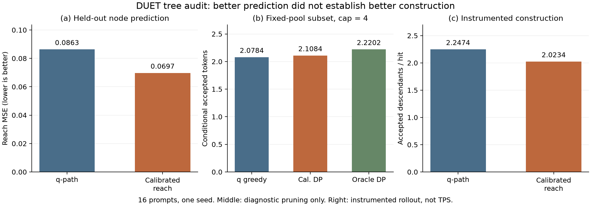
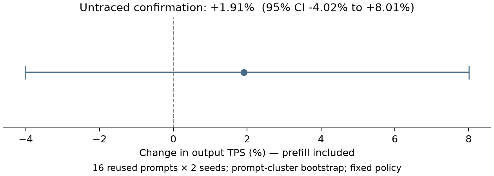

# DUET tree 구성 감사와 수락 확률 기반 점수 실험

후속 사용자 지시: **Root 후보 선정은 cache hit, tree 구성은 AL**을 우선한다.
아래는 소규모 감사 기록이며, 새 [Full Spec-Bench AL 평가](../duet_tree_al_full/REPORT.md)는
root 정책·예산 설정을 고정하고 AL을 주 지표로 확대했다. 9/22에 3,360턴을 완료했으며,
AL은 2.0651→2.1003(+1.70%), 차이의 95% CI는 [−0.0025,+0.0721]로 전체 우위 미확정이다.
아래 16 prompts의 +9.82%를 full dataset 효과로 일반화하지 않는다. TPS를 AL 정책의 선택 기준으로 쓰지 않는다.

2026-09-21. 사용자 논문, 실제 CUDA graph 실행 경로, sampling/verification,
작은 분포의 완전 열거, 실제 70B/1.1B 모델의 full-distribution probe를 함께
검토했다. 상세 증명은 [THEORY.md](THEORY.md), 전체 연구 기록은
[DUET_PROGRESS.md](../DUET_PROGRESS.md).

## 1. 현재 결론

1. **논문 식 (4)의 root prior × draft 경로 확률 곱은 현재 구현에 있다.**
   다만 frontier 제한·threshold·root별 cap·사후 rerank가 붙어 논문의 간단한
   알고리즘 설명과 실제 tree 생성 결과가 같다고 볼 수 없다.
2. **그 경로 확률은 현재 residual verifier에서의 node 수락 확률이 아니다.**
   올바른 사후 reward는 parent 도달 확률 × 앞선 형제 거절 확률 × 현재 형제
   조건부 수락 확률이다. 모든 node reward의 합이 기대 수락 길이다.
3. 추가 neural model 없이 phase/sibling/q-bin scalar calibration을 적용한
   점수를 구현했다. Holdout의 node reach MSE는 **0.086325 → 0.069688
   (19.27% 감소)**였다. 모든 prompt/지표가 개선된 것은 아니다.
4. **현 G>M q-score rerank는 closure를 지켜도 일반적으로 lossless하지 않다.**
   실제 rerank와 실제 tensor verifier 함수의 모든 분기를 열거한 반례에서
   target (0.4,0.3,0.3)이 (0.4,0.31875,0.28125)로 변했다. TV=0.01875.
5. 개선 score를 실제 draft construction에 쓰는 연구용 CUDA graph hook을
   별도로 만들었다. 기존 production source/default는 수정하지 않았다.
   G=M을 강제하고 기존 sampling/verification q를 보존한다.
6. **분포 저장을 끈 2-seed 실행에서는 개선 가능성을 관찰했지만 우위는 미확정이다.**
   Hit당 descendant AL은 1.90497→2.09211(+9.82%), 처리율은
   68.96784→70.28607 tokens/s(+1.91%). 처리율 변화의 95% CI는
   [−4.02%,+8.01%]다. Production default로 바로 채택할 근거는 아직 부족하다.
   Full-p/q 저장을 켠 별도 실행은 AL이 반대로 낮았으므로 그 자료와 분리했다.

이것은 Mirror-SD 시스템 대비 우위 실험이 아니다. 기존 후보 선정의 e(1-q),
root h 혼합, calibration의 +42.19% TPS와도 다른 실험이다.

## 2. 논문과 현재 구현은 어디가 다른가

논문: `(KCC2026 우수논문) DUET 조기 종료 프록시 기반 캐시 구성을 활용한
비동기 추측 디코딩 기법.pdf`, 4.3절, PDF 4페이지. 텍스트를 추출하고 식 (4)는
페이지를 직접 렌더링해 확인했다. [추출문](paper.txt), [페이지](paper_page4.png).

| 항목 | 논문 설명 | 현재 실행 경로 |
|---|---|---|
| Node score | root P(i,v) × 경로 q 곱 | 동일한 log 누적식 |
| 확장 후보 | 매 forward 모든 후보의 말단 node | `depth == 현재 round`인 미확장 node만 |
| 이전 round에서 밀린 leaf | 명시적 제한 없음 | 다음 round 경쟁에 다시 들어오지 못함 |
| Root별 예산 | 전역 점수 경쟁으로 배분 | 경쟁 + root별 최대 node cap + 미래 round reserve |
| Threshold | tree 절에 별도 명시 없음 | P2 root prior 0.01 / raw q 0.03 기본값; P1 기본 0 |
| 형제 생성 | 구체적인 WOR 규칙은 명시하지 않음 | exponential-race WOR, 순서가 중요함 |
| W×K 예산 | 생성 node 최대 W×K라고 표현 | W×K는 forward query/cell 예산, 한 query에서 C개 token 표본 가능 |
| 검증용 최종 subset | 별도 score rerank 설명 없음 | G>M일 때 q-path + closure rerank |

따라서 ‘논문과 전혀 다른 점수’가 아니라, **논문과 같은 기본 점수에 추가된
알고리즘 제약이 있고, 기본 점수 자체의 목적함수 해석도 개선할 필요가 있다**.
논문 개정에서는 forward된 node, logits에서 뽑은 child token, target 검증에
보내는 node를 구분해 세야 한다. 마지막 leaf에 별도 draft forward가 없어도
그 token의 proposal q는 parent forward에서 얻으므로 그것 자체는 오류가 아니다.

실제 기준 함수:

- [CUDA executor](../../ssd/ssd/engine/helpers/p2_tree_executor.py): `run_once`,
  초기 root log prior와 `lp = parent_logpri + log(raw_q)`.
- [Tree helpers](../../ssd/ssd/engine/helpers/p2_tree.py):
  `_arena_select_global`, `_arena_fanout_global`, `tree_sample_wor`,
  `rerank_tree_indices`, `tree_verify_walk_tensor`.
- [P1 roots](../../ssd/ssd/engine/helpers/p1_tree.py):
  `build_uniform_p1_roots`; draft context reach × 원래 root q. 제외 후
  재정규화 q를 사용하지 않는다. 이 값은 true first-rejection 확률은 아니다.
- [Draft runner](../../ssd/ssd/engine/draft_runner.py):
  `_rerank_tree_hit_view`, P1 cached rerank 및 GPU P2 rerank 연결.
- [Verifier](../../ssd/ssd/engine/verifier.py): `_tree_verify_walk`,
  parent logits에 실제 draft temperature/sampler 변환을 적용한 q 사용.

공개 `on` 정책은 내부 dynamic을 선택한다. P1 allocation을 backbone/hybrid로
바꾸면 또 다른 알고리즘이 된다. Legacy beta/fanout option이 dynamic에서도
동일하게 작동한다고 가정해서는 안 된다. 이번에는 P1/P2 dynamic만 시험했다.

## 3. 무엇을 어떻게 바꾸었는가

기존:

\[
s(v_j)=s(u)q_u(t_j).
\]

개선 prototype:

\[
\boxed{s(v_j)=s(u)\widehat\alpha_{u,j}
 \prod_{k<j}(1-\widehat\alpha_{u,k})}.
\]

Root s는 기존 prior를 그대로 사용했다. \(\widehat\alpha\)는 해당 phase,
형제 순서, q 구간의 조건부 수락률 calibration이다. 정확한 alpha는 R/D로
계산되며, 미래 p를 알 수 없는 inference에서는 이를 scalar lookup으로 예측한다.

[score_hook.py](score_hook.py)는 production `run_once`의 점수 한 문장만
실험 process 안에서 교체한다. sampler가 만든 원래 raw q와 parent logits,
verifier, fanout의 사전 결정, depth 제한, threshold를 보존한다. 결과적으로
‘개선된 점수로 다음 forward를 어디에 배정하는가’만 바꾼 ablation이다.
이 hook은 production default로 설치되지 않으며 환경변수로 켜야 한다.

이 수식은 기대 수락 목적함수에서 유도되었다. 그러나 scalar calibration이
정확한 alpha를 알게 해 주거나 기존 방법보다 항상 좋게 해 주는 정리는 없다.
실제 성능을 보려면 estimator, 확장 기회, fanout, 시간 제약을 함께 평가해야 한다.

## 4. 수학·코드 검사 결과

[audit_math.py](audit_math.py), [math_checks.json](math_checks.json):

| 검사 | 결과 |
|---|---|
| Production residual ladder와 독립 NumPy 계산, 100개 random tree | 최대 절대 차이 4.88e-9 |
| Exact prefix-constrained DP와 모든 subset 열거 | 800/800 일치 |
| 선택 subtree의 기대 AL = 유지 node의 원래 reach 합 | 800/800 일치 |
| 기존 q greedy가 q 목적함수 자체의 최적해인가 | 반례 1개 재현; 일반적인 최적성 없음 |
| p=q일 때 첫 형제 수락/나머지 형제 미시도 | q-path와 true reach가 다른 반례 확인 |
| 실제 production rerank + tensor verifier의 편향 | 18개 tree 상태 및 모든 coin 분기에서 재현 |

800개의 random-budget fixture 중 실패 수는 실서비스 오류 빈도 추정치가 아니다.
실제 LLM snapshot에서는 q greedy와 q DP의 결과가 같았다. 이번 관측에서
‘greedy를 DP로만 교체하면 좋아진다’는 근거는 없다.

기존 tree 문서에서 closure가 proposal law까지 보존한다고 한 설명은 충분하지
않다. closure 검사는 연결·순서의 구조적 검사이고, token을 본 뒤의 선택 편향은
별도 문제다. 이번 반례는 **G>M인 score-dependent pruning 경로**를 대상으로
한다. Chain, G=M, 기존 calibration의 chain winner에 대한 편향 증명은 아니다.

## 5. 실제 모델 probe와 holdout 분석

| 조건 | 설정 |
|---|---|
| Target / draft | LayerSkip Llama2-70B AWQ TP4 / TinyLlama-1.1B BF16 TP1 |
| GPU | RTX 4090 5개, physical GPU 3–7 |
| Sampling | B=1, T=0.7, seed=921, prompt당 출력 128 |
| DUET | exit56, K1/K2=4/2, P2 width/roots15, C=3 |
| Tree | P1 G=M=8, P2 G=M=6; 사후 rerank 없음 |
| 자료 | 4개 dataset에서 calibration 8 / validation 16 prompts |
| 표본 | 4번째마다 실제 tree hit의 전체 p/q 저장; warmup 제외 |
| 수집량 | calibration 77 trees, validation 161 trees; 총 238 |

Prompt bank는 이전 calibration에서 재사용했다. 이번 fitting에서는 cal/val이
분리되어 있으나, 연구 전체에서 한 번도 본 적 없는 새로운 dataset은 아니다.
Policy, bin 경계, shrinkage=5는 probe plan에 먼저 기록했다. 검증 결과를 보기
전에 [calibration_frozen.json](calibration_frozen.json)을 저장했고,
실제 실행 비교의 score도 [rollout_plan.json](rollout_plan.json)에 먼저 고정했다.

Snapshot마다 p/q/token/parent/sibling/path와 checksum을 저장했다.
사후 exact AL은 저장한 p/q를 정규화한 float64 확률 계산이다. 실제 FP32
verifier와의 bitwise 일치나 모든 KV/TP 실행 경로의 새 인증을 뜻하지 않는다.
CPU 복사·압축·동기화가 있으므로 **run.log의 처리율/latency는 성능 결과가 아니다**.
그 지연은 비동기 overlap과 cache 준비 상황에도 영향을 줄 수 있으므로,
그 실행의 hit 구성/AL이 원래 서비스와 같다고 가정하지도 않는다.
초기 all-bucket/128MiB workspace 실행은 OOM, 64MiB는 FlashInfer workspace
부족으로 실패했다. 로그를 각각 `probe_failed_oom/`, `probe_failed_workspace/`에
보존했다. 성공 실행은 필요한 1–4 bucket을 128MiB로 준비했다. 의미상 score나
sampling 설정을 실패에 맞춰 바꾸지는 않았다.

### 5.1 정확한 node reach를 얼마나 잘 예측하는가

Prompt마다 tree 평균을 구하고 16개 prompt를 동일 가중했다.
MSE는 각 tree의 node별 예측 reach와 정확한 reach의 제곱오차 평균이다.

| 예측기 | Node reach MSE | 기존 q-path 대비 |
|---|---:|---:|
| 기존 q-path | 0.086325 | 기준 |
| alpha=q로 두고 형제 거절 순서만 반영 | 0.081748 | −5.30% |
| Phase/sibling 평균 수락률 | 0.088595 | +2.63%, 악화 |
| Phase/sibling/q-bin calibration | **0.069688** | **−19.27%** |

개선 calibration의 paired MSE 차이 bootstrap 95% CI는
[-0.02948, -0.00473]. Prompt 16개 단위 재표집이며 1-seed 결과다.
P1 MSE는 0.077378→0.063885, P2는 0.109081→0.079301이었다.

반면 tree 전체 AL의 절대 예측 오차는 0.617195→0.600327로 소폭 개선에
그쳤다. 평균 수락률을 넣기만 하는 방법은 오히려 악화했다. 평균 AL 예측이
가깝다는 것과 유용한 node 순위를 잘 맞힌다는 것도 구분해야 한다.

### 5.2 같은 생성 pool에서 최선의 subset은 얼마나 나은가

다음은 이미 실현된 tree를 줄여 보며 **고정 tree의 조건부 기대 AL**을 재계산한
진단이다. 새로운 생성 알고리즘의 실제 성능도, 배포 가능한 lossless pruning도
아니다. 각 cap보다 node가 많은 tree만 포함하므로 행별 모집단이 다르다.

| Cap | Trees | 기존 q greedy | 개선 score DP | 정확한 reach oracle DP |
|---|---:|---:|---:|---:|
| 2 | 161 | 1.22045 | 1.24527 | 1.28046 |
| 4 | 141 | 2.07842 | 2.10839 | 2.22016 |
| 6 | 99 | 2.66418 | 2.66342 | 2.71691 |

Cap4에서 개선 평균 +0.02996 token(+1.44%)지만 CI [-0.02466,+0.09183]으로
확실한 우위는 아니다. Oracle 여유는 +0.14174(+6.82%)로 남는다.
Cap6에서는 평균이 약간 악화했다. ‘19.27% MSE 개선’을 ‘19.27% AL 개선’으로
바꾸어 주장하면 안 된다. Oracle도 생성하지 않은 경로의 가치는 모른다.

### 5.3 형제 순서와 phase가 다른 이유

Validation의 시도 확률 가중 조건부 수락률:

| Phase | 첫 형제 | 둘째 형제 | 셋째 형제 |
|---|---:|---:|---:|
| P1 | 0.81885 | 0.30113 | 0.26624 |
| P2 | 0.53962 | 0.27028 | 0.16387 |

P1 둘째/셋째 형제의 수락률을 모든 node의 marginal reach로 그대로 넣으면 안
된다. Parent에 도달하고 앞선 형제를 거절한 다음의 값이다. 해당 시도 질량은
P1 첫/둘째/셋째 각각 324.74/32.50/21.02로 크게 다르다. P2는 70.07/27.86/19.10.
나중 형제의 calibration 자료가 훨씬 적으며, phase별 차이도 크다.

## 6. 실제 tree 생성 점수 교체 실험

### 6.1 Full-distribution observer를 켠 생성

실제 실행 비교는 `run_rollout.py`의 q-path 및 phase/sibling/q-bin 두 정책이다.
위에서 쓰지 않은 새 score를 검증 성적을 보고 추가하지 않는다. 같은 validation
16 prompts, 같은 seed, 같은 model/graph/예산에서 각각 처음부터 생성한다.
두 정책의 RNG 소비와 출력 경로는 달라지므로 token-for-token paired replay는
아니다. Prompt 단위 비교이며 observer로 인해 TPS는 평가하지 않는다.

두 정책 모두 16×128=2,048 output tokens를 정상 생성했다. 수락 coin 변동을
적분한 exact AL도 매 4번째 hit의 snapshot에서 따로 계산했다.

| Prompt 균등 평균 | 기존 q-path | 개선 calibrated reach | 차이 |
|---|---:|---:|---:|
| 전체 hit에서 실제 descendant AL | 2.24736 | 2.02337 | −0.22398 (−9.97%) |
| P1 hit descendant AL | 2.47462 | 2.24079 | −0.23383 |
| P2 hit descendant AL | 1.42723 | 1.35613 | −0.07110 |
| Snapshot의 exact 조건부 AL | 2.21135 | 1.98061 | −0.23075 |
| 실제 hit rate | 0.83275 | 0.84368 | +1.09%p |
| 실제 출력 tokens / target steps | 3.06501 | 2.84639 | −0.21862 |
| Hit tree node 수 | 7.00354 | 6.77738 | −0.22615 |

주요 AL 차이의 prompt-paired bootstrap 95% CI는 [-0.50412,+0.02473].
개선된 prompt는 6/16이었다. P1/P2 개별 AL 차이, hit rate 차이, step당 출력
차이도 CI에 0을 포함한다. 따라서 ‘통계적으로 확정된 악화’라고 확대하지는
않지만, **이 계측 실행만으로 새 점수의 실제 성능 우위를 판단하지 않는다**.
관측 snapshot의 exact AL도 낮았으므로, 이 자료에서 차이가 단지 verification
coin 운에 의해서만 생겼다고 설명할 수도 없다. 출력/context 자체가 달라진
1-seed 비교이므로 어떤 구성 요소가 원인인지 확정하지는 못한다.

왜 MSE와 AL이 엇갈릴 수 있는가:

- Node별 squared error를 줄이는 것은, 제한된 graph slot에서 최선의 **다음
  확장 행동**을 고르는 목표와 다르다. 의사결정 경계의 오차가 더 중요하다.
- \(\rho(u)\)는 u 자체의 수락 가치다. 확장 이득에는 앞으로 생성할 자식의
  \(g(u,c)\)가 더 필요하며 이번 hook은 이 항을 동일하다고 간주했다.
- Scalar bin이 세밀한 context 정보를 지우고 calibration 밖의 생성 context로
  이동한다. P2 alpha를 과대 예측하는 경향도 holdout에서 남았다.
- Root prior, depth-only frontier, 고정 C, cap/reserve는 그대로다. 올바른 node
  목적함수를 넣어도 이 결합 최적화가 자동으로 해결되지는 않는다.

이 네 항목은 이론적으로 가능한 설명과 후속 가설이다. 이번 결과만으로
특정 항목 하나를 성능 하락의 확정 원인이라고 지정하지 않는다.

원시 근거: [rollout_analysis.json](rollout_analysis.json),
`rollout_q_path/manifest.json`, `rollout_phase_sibling_q_bin/manifest.json`.
후자는 CUDA graph 초기화와 실제 replay에서 score hook이 동작한 실행이다.
기존 q-path와 새 점수의 전체 원시 p/q를 모두 보존했다.



왼쪽은 예측 오차, 가운데는 고정 pool의 진단용 subset, 오른쪽은 실제 생성
수락 길이다. 이들을 서로 같은 개선율로 해석하지 않는다.

### 6.2 Full-distribution observer를 끈 실제 실행 확인

계측 지연으로 비동기 동작이 달라질 수 있다는 우려를 검증하기 위해 같은
frozen policy를 **다시 조정하지 않고** 16 prompts×2 seeds(921,922)로 실행했다.
모델, root 후보 source, tree budget, score 표는 동일하다. Seed921은 기존→개선,
seed922는 개선→기존 순서다. 모델 초기화와 제외 warmup 이후 request generation
wall time을 측정했다. 전체 p/q 복사·저장, 추가 verifier observer는 껐다.

처리율은 `실제 출력 tokens 합 / request generation wall time 합`이며 **prefill을
포함**한다. 이전 보고서의 decode-only TPS나 논문의 다른 GPU/길이 수치와 직접
비교하지 않는다. 두 정책 각각 32 requests, 4,096 output tokens를 생성했다.

| 조건 | 기존 q-path TPS | 개선 TPS | 상대 변화 |
|---|---:|---:|---:|
| Seed921 | 69.18591 | 70.66460 | +2.14% |
| Seed922 | 68.75114 | 69.91156 | +1.69% |
| 합산 tokens / 합산 wall time | **68.96784** | **70.28607** | **+1.91%** |

| Prompt×seed 균등 평균 | 기존 | 개선 |
|---|---:|---:|
| Hit당 descendant AL | 1.90497 | 2.09211 |
| Hit rate | 0.83764 | 0.82668 |
| 실제 output tokens / target steps | 2.74789 | 2.90507 |
| Target steps / request | 48.1250 | 45.5625 |
| Hit tree node 수 | 6.80889 | 6.90158 |

같은 prompt의 두 seed를 함께 묶어 2,000회 bootstrap한 결과:

- AL 차이 +0.18714 token, 95% CI [−0.03824,+0.40389].
- TPS 상대 변화 +1.91%, 95% CI **[−4.02%,+8.01%]**.
- Step당 실제 출력 차이 +0.15718, 95% CI [−0.03451,+0.34193].

따라서 점수가 수학적으로 더 맞는 방향이고 두 seed의 점 추정도 긍정적이지만,
**현재 표본으로 성능 우위가 확정되었다고 말할 수 없다.** 2-seed만으로 seed
변동 전체를 추정할 수도 없다. 이 16 prompts는 앞 분석에서 사용한 bank이며,
정책을 다시 고르는 데 쓰지는 않았지만 새로운 완전 독립 confirmation 자료도
아니다. 개선 후보로 유지하되 production default로 승격하지 않는다.

계측 실행의 음수 변화와 이 실행의 양수 변화를 평균 내지 않는다. 원래 비동기
실행의 성능 판단에는 이 절의 untraced 결과를 사용하고, full-p/q 자료는
정확한 조건부 확률·점수 분석에 사용한다. 차이의 원인을 계측 하나로 확정한
factorial 실험은 아니며, asynchronous timing과 생성 경로 변동도 존재한다.

근거: [benchmark_plan.json](benchmark_plan.json),
[benchmark_analysis.json](benchmark_analysis.json), 각 `bench_*/result.json`.



## 7. 어떤 알고리즘으로 발전시켜야 하는가

현재 근거가 지지하는 순서는 다음과 같다.

1. **Lossless 구성 계약부터 고정한다.** 당분간 G=M으로 실행한다. 생성한 token의
   내용을 보고 최종 inclusion을 결정하는 q rerank는 보편적 lossless 경로로
   사용하지 않는다. Verify budget은 sampling 이전 admission에 반영한다.
2. **전체 frontier와 현재 depth-only를 분리 비교한다.** 논문대로라면 이전
   round에서 밀린 leaf도 살아 있어야 한다. 확장 횟수/잔여 depth와 KV mask,
   graph shape를 함께 점검해야 하므로 점수 변경과 한 번에 섞지 않는다.
3. **확장 priority를 pi×예측 reach×예측 continuation gain으로 만든다.** 이번
   prototype은 가운데 항만 바꿨다. 새로 얻을 자식의 수락 가능성이 다르면
   reach만 높은 parent가 항상 최선은 아니다.
4. **C를 고정 상수가 아니라 사전 예산 배분으로 본다.** 같은 parent의 추가
   형제와 다른 leaf 아래 깊이 추가의 한계 이득을 비교한다. 새 형제 token을
   보기 전에 fanout을 정하고, 확정된 표본은 최종 tree에 유지한다.
5. **Root cap과 미래 round reserve를 목적함수로 대체/완화한다.** 작은 root
   cap은 큰 pi를 가진 root가 예산을 더 가져갈 기회를 막을 수 있다. 반대로
   pi가 부정확하면 전역 탐욕 배분도 낭비하므로 root 확률 calibration과 연결한다.
6. **비용과 deadline을 실측한다.** Fixed graph의 padding 때문에 논리 node 감소가
   곧 시간 절약은 아니다. 기존 calibration의 max-overlap 시간식에 graph width,
   hit별 verify row, 다음 P1 폭을 넣고, shortlist의 실제 TPS로 최종 선택한다.

구체적인 다음 설계는 다음과 같다.

```text
입력: 기존 root 및 pi_hat, phase의 잔여 시간/forward/verify 예산
frontier := 모든 root
반복:
    각 살아 있는 leaf u에 대해 pi_hat × rho_hat(u) × g_hat(u, c) 계산
    graph width와 잔여 verify 예산 안에서 확장 parent와 fanout c를 사전 확정
    선택한 parent를 draft forward; 정해진 개수의 자식을 원래 q의 WOR로 생성
    생성한 자식은 보존; alpha_hat lookup과 앞선 형제 거절 항으로 rho_hat 계산
    확장된 parent는 frontier에서 제거, 새 자식은 추가; 미선택 leaf는 유지
    deadline 또는 예산에 도달하면 종료
확정 tree를 원래 q/residual verifier에 전달
```

이 알고리즘의 모든 구성요소를 전역 최적화했다고 주장하는 것은 아니다.
현재 구현·실험 완료는 **목적함수/편향 감사, 정확한 사후 DP, scalar estimator,
현 depth-frontier에서의 실제 score 교체 prototype**까지다. 전 frontier,
가변 fanout, cost-aware planner는 분리된 다음 ablation이다.

현재 probe는 적중한 root만 보여 주므로, 다음 사후 분석에서는 자료를 넓혀야
한다. 각 forward에서 선택·탈락한 frontier, root key와 pi_hat, score, depth,
fanout, 남은 예산을 저장한다. 이후 원래 target 검증이 끝나면 그 결과로 true
root 사건 질량을 계산하고, 선택하지 않았던 유력 분기는 별도 offline
teacher-forcing으로 p를 평가한다. 이 추가 target 연산을 온라인에서 무료로
가능한 기능처럼 취급하지 않는다. 검증 분포를 얻은 동일 decision snapshot에서
현재 선택과 최선의 한 단계 확장 이득을 비교하면 다음 원인을 분리할 수 있다.

| 질문 | 필요한 분리 실험 |
|---|---|
| Wrong root에 예산을 쓰는가? | pi_hat 대비 사후 true root 질량; node score 고정 |
| Node 수락 예측이 틀리는가? | 같은 root와 같은 frontier에서 예측 reach 대비 true reach |
| Reach가 높아도 continuation이 약한가? | 같은 parent의 next-level g와 실제 확장 이득 |
| 이전 leaf를 버려 좋은 분기를 놓치는가? | 같은 score·예산의 depth-only 대 all-frontier |
| C=3이 breadth에 과투자하는가? | 사전 fanout 1/2/3 또는 DP shape, 동일 forward/verify 예산 |
| AL 이득이 시간 비용을 상쇄하는가? | Snapshot/trace 없는 실행에서 동일 bucket·deadline별 TPS |

이때 root를 고정하지 않은 node 점수 비교나, 생성 pool이 달라진 정책을 같은
pool의 순위 실험처럼 해석하는 것을 피한다. 새로운 calibration 목적은 모든
node의 MSE 하나보다 **실제로 경쟁하는 확장 행동의 순위와 regret**에 가깝다.
작은 scalar/context 통계나 sampling 이전 shape DP부터 비교할 수 있으며,
추가 언어모델/head 학습이 필수라는 결과는 아니다.

논문 기여로 발전시킬 후보는 일반적인 tree DP 자체보다, **비동기 다중 root의
사건 확률과 continuation 이득을 phase deadline·graph 비용 아래에서 함께
배분하는 방법**이다. 그 기여를 주장하려면 현재 남은 구성 ablation과 독립
성능 검증이 필요하다.

## 8. 재현 및 연구 범위

```bash
ssd/.venv/bin/python results/duet_tree_analysis/audit_math.py
ssd/.venv/bin/python results/duet_tree_analysis/analyze_probe.py
ssd/.venv/bin/python results/duet_tree_analysis/analyze_rollout.py
ssd/.venv/bin/python results/duet_tree_analysis/analyze_benchmark.py
```

GPU launch: `run_probe.py`, `run_rollout.py`, `run_benchmark.py`. 원시 결과 덮어쓰기를 거부하도록
했다. 재실험은 새 디렉터리와 plan으로 진행한다. 결과만 보려면 위 CPU 분석을
사용한다. Detailed commands/env는 각 run의 `command.json`에 있다.

- 새 파일은 이 디렉터리에 격리했다. 작업 시작 전의 production 9개 파일 변경
  (256 insertions/15 deletions)을 그대로 보존했다.
- Full p/q의 tree 조건부 분석은 수락 coin 변동을 제거하지만, 작은 prompt 수,
  한 seed, 기존 정책이 방문한 context에 대한 selection은 남는다.
- 정확한 residual score·prefix tree DP 자체를 새 논문 contribution으로
  포장하면 안 된다. EAGLE-2/Sequoia/D-cut과의 관계는 [THEORY.md](THEORY.md)의
  1차 문헌 링크와 조건을 참조한다.
- G>M rerank를 사용한 과거 tree speed 수치는 당시 측정으로 보존하되, 그
  설정에 대해 lossless 비교라고 주장하려면 선택 편향을 해결하고 다시 검증해야 한다.
