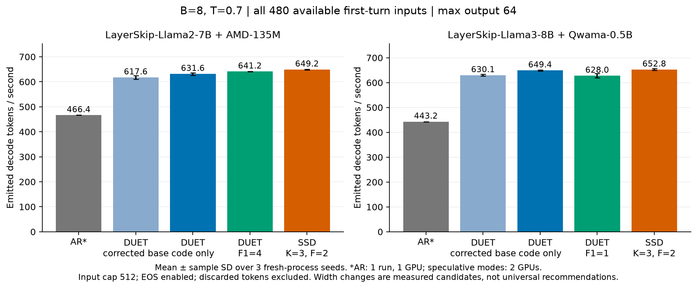
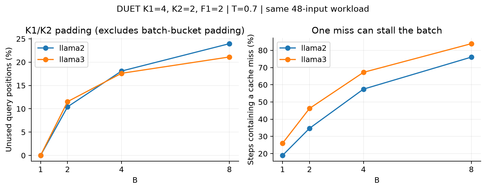

# 논문 branch 기반 full-model / batching / greedy 검증

**통합 검토 문서:** [MERGE_REVIEW.md](MERGE_REVIEW.md)에 전체 변경·SSD와의 공통 수정·과거 논문 영향 조건·사용자 질문 14개·이전 tree 연구·merge 체크리스트·남은 최적화를 모았다.

**최신 상태:** B>1 dynamic tree 통합·full-model 검증은 [round3/REPORT.md](round3/REPORT.md), 재현은 [round3/HANDOVER.md](round3/HANDOVER.md). 아래는 1차 실험의 역사적 기록이다.

실험일: 2026-10-06~07. 기준: `feat/duet-p2tree-g0@a82f7d2`.
작업 branch: `feat/duet-mlsys-coverage`, worktree: `/home/chokwans99/PSD-mlsys-coverage`.

## 1. 결론

- 요청한 두 모델 조합을 **양자화하지 않은 전체 가중치**로 실행했다. Target 1 GPU + draft 1 GPU 구성이다.
- B=1,2,3,4,8,16, T=0/0.7, 요청 종료·배치 축소·재충전, prefix cache, 메모리 부족에 따른 preemption을 점검했다.
- B>1의 기존 오류를 수정하고, proxy CUDA Graph·verification·greedy sampler를 개선했다.
- **단순히 실행되는지만 확인하지 않고**, 프로파일링 → 설정 비교 → 전체 480개 입력 반복 측정까지 진행했다.
- B=8, T=0.7에서 기존 설정을 유지한 코드 개선: **Llama2 +2.3%, Llama3 +3.1%**. 두 모델 × 3 seed × 480개 출력, 총 **2,880개 출력이 기존 경로와 토큰 단위로 동일**했다.
- Llama2는 P1 후보 폭을 2→4로 늘리면 기존 대비 **+3.8%**였다. 반면 Llama3의 후보 폭 2→1 축소는 작은 표본에서 좋아 보였으나 전체 입력에서 재현되지 않았다.
- T=0에서 Llama2의 K1=4→6 변경은 두 전체 입력 비교에서 **+4.0%, +3.9%**였다. Llama3에는 같은 설정을 적용하지 않는다. T=0 전용 sampler 자체의 차이는 0.5% 미만이었다.
- **같이 튜닝한 SSD 대비 확실한 우위는 아직 없다.** Llama2의 최선 측정 설정은 SSD보다 약 1.2% 낮고, Llama3는 약 0.5% 낮다. 현재 수치로 “B>1에서도 DUET가 항상 빠르다”고 주장하면 안 된다.

**범위 정정(2026-10-07): 이 보고서는 1차 chain 중심 결과다.** 실제 사용자 논문 4.3절·식 (4)와 표 2의 Tree는 dynamic branching 자체를 포함한다. 서버 가이드의 chain 설정만으로 논문 확장을 모두 완료했다고 볼 수 없다. 후속 구현·검증과 남은 작업은 [round2/REPORT.md](round2/REPORT.md)를 기준으로 확인한다.

## 2. 측정 조건과 수치 해석

| 항목 | 조건 |
|---|---|
| GPU | RTX 4090 24 GiB; TP=1 target + 별도 draft GPU |
| Llama2 조합 | `facebook/layerskip-llama2-7b` + `amd/AMD-Llama-135m`, runtime fp16 |
| Llama3 조합 | `facebook/layerskip-llama3-8B` + `turboderp/Qwama-0.5B-Instruct`, runtime bf16 |
| 런타임 | torch 2.8.0+cu128, transformers 4.57.1 |
| 전체 입력 | 기존 실험 corpus 480문항의 **첫 turn 전부**; 6개 group × 80 |
| 입력 처리 | 원문 첫 turn을 `tokenizer.encode`; chat template 미적용; 최대 512 tokens |
| 출력 | 최대 64 tokens, 자연 EOS 사용 |
| 반복 | B=8, T=0.7: 새 프로세스로 seed 2026/2027/2028; target와 draft 모두 설정 |
| 기본 DUET | K1=4, K2=2, exit_layer=21, P1 fan-out=2, P2 fan-out=1 |
| 공통 최적화 | chain proxy graph, async proxy send; TP=1에서는 exit replica off |

- 480개 문항 전체를 사용했지만 **원 데이터셋 전체 / 560개 turn 전체 / 무제한 context**를 평가한 것은 아니다.
- 입력 512-token 제한으로 Llama2 141개, Llama3 136개 문항이 잘렸다. 긴 입력은 별도 32문항, cap=1536, B=4/8로 확인했다.
- 모델 로딩·graph capture·warmup·tokenization은 TPS에서 제외했다. `end_to_end_tps`는 **이미 tokenization한 요청의 prefill+decode generation wall time** 기준이다.
- AR는 1 GPU, SSD/DUET는 2 GPU다. AR 대비 비율을 같은 GPU 예산의 효율로 해석하면 안 된다.
- 프로파일링 실행의 TPS는 성능 표에서 제외했다. GPU 사용자를 2초 간격으로 기록했으며, 선택 GPU에 다른 프로세스가 나타난 실행은 성능 근거에서 제외한다. 호스트 전체를 독점한 실험은 아니다.
- 원래 논문의 외부 runner와 원본 `specbench_full.jsonl`은 이 서버에 없다. **동일 engine source 기반의 새 검증 harness**이며, 기존 논문 실험 driver의 완전 재현이라고 표현하지 않는다.

### TPS 집계 오류도 수정했다

- 기존 speculative `decode_total_tokens`는 EOS/출력 상한으로 **버려진 수락 토큰까지** 포함했다.
- 새 엔진은 scheduler가 실제로 반영한 토큰 수를 센다.
- 아래 표와 그래프는 이전에 저장된 실행까지 모두 **실제 출력 토큰 수 / decode 시간**으로 재계산했다. 원본 JSON의 옛 `summary.decode_tps`를 그대로 인용하면 약간 다른 숫자가 나온다.
- Speculative prefill은 첫 recovery token을 보류하므로 실제 출력 토큰 전부가 decode에 속한다. AR는 prefill에서 첫 토큰을 출력하므로 AR의 기존 decode counter를 사용한다.
- AL은 기존 verifier의 `accepted_suffix_lens_with_recovery`를 사용한 진단 지표다. EOS/상한 clipping 이전의 수락 길이이므로, 실제 출력 토큰 수와 혼용하지 않는다.
- 최종 기준 파일: [FINAL_NUMBERS.json](FINAL_NUMBERS.json), 재계산: [analyze_results.py](analyze_results.py).

## 3. 전체 입력 성능

**B=8, T=0.7, 480개 입력, 3 seed. 실제 출력 decode TPS, 평균 ± 표본 표준편차.**

| 구성 | Llama2 + AMD | Llama3 + Qwama |
|---|---:|---:|
| 오류 수정 후 기준 DUET | 617.6 ± 6.7 | 630.1 ± 3.6 |
| 코드 개선만 적용, 동일 파라미터 | **631.6 ± 5.0** | **649.4 ± 2.1** |
| 후보 폭 변경까지 적용 | **641.2 ± 0.7** — P1 fan-out=4 | 628.0 ± 8.1 — P1 fan-out=1 |
| 튜닝한 SSD, K=3 / fan-out=2 | 649.2 ± 1.1 | 652.8 ± 3.6 |
| AR 참고값, 1회 / 1 GPU | 466.4 | 443.2 |

- 코드 개선 전후는 K1/K2·exit·후보 폭·출력이 동일하다. 이 비교가 **구현 최적화의 효과**를 가장 직접적으로 보여준다.
- 표의 기준은 **공통 correctness 수정이 들어간 뒤 fast verifier와 batched proxy graph를 끈 경로**다. 수정 전 `a82f7d2` 그대로의 모든 경로가 실행 가능했던 것은 아니므로, 이 표를 원래 논문 TPS의 직접 전후 비교로 표현하지 않는다.
- 후보 폭 변경은 다른 cache 구성과 RNG 진행을 유발한다. 코드 개선과 구분해서 보고해야 한다.
- Llama2의 P1 fan-out=4는 전체 입력의 세 seed에서 확인했다. Llama3 fan-out=1은 채택하지 않는다.
- Generation wall TPS: Llama2 기준 484.9 → fan-out=4 적용 501.4, Llama3 기준 475.7 → 코드 개선 487.4.
- 작은 표본에서 Llama3 fan-out=1이 좋아 보였던 결과를 최종 결론으로 사용하지 않았다. 전체 입력에서 반전된 사례를 그대로 보존했다.

## 4. B>1에서 추가적인 가속이 제한되는 이유

배치가 커지면 총 TPS는 증가한다. 문제는 **B에 비례해서 증가하지 않고, AR/SSD 대비 추가 이득도 보장되지 않는다**는 점이다. 예를 들어 48문항 보조 실험에서 Llama2 DUET의 T=0.7 TPS는 B=1의 105.4에서 B=8의 608.0으로 5.77배 증가했다. B가 8배가 된 만큼 늘지는 않았다. 아래 수치는 이 현상의 비용을 구분해 측정한 것이다.

### 4.1 한 행의 긴 K1 때문에 다른 행도 긴 폭을 사용한다

- 각 요청의 실제 proposal 길이가 `k_i`일 때, 현 구현의 target batch는 `K_max=max_i k_i` 폭으로 검증한다.
- 실제 필요한 query 수는 `Σ_i(k_i+1)`, 실행하는 query 수는 `B(K_max+1)`이다.
- 짧은 P2/JIT 행도 긴 P1 행과 함께 검증하면 padding 비용을 부담한다.
- 이 비율은 **불필요한 query 위치의 비율**이다. 같은 비율만큼 latency를 줄일 수 있다는 의미는 아니다. Weight 읽기와 GPU kernel 효율 때문에 query 수와 시간이 비례하지 않는다.

### 4.2 개별 cache hit가 높아도 배치 전체가 기다릴 수 있다

- 한 행이라도 miss이면 그 행의 JIT draft 응답을 기다린 뒤 batch verification을 시작한다.
- 독립이라는 단순 가정 아래 개별 hit가 `h`일 때, miss가 하나 이상 있는 확률은 `1-h^B`다.
- 예: h=0.8, B=8이면 약 83.2%. 이는 직관을 위한 식이며 실제 요청의 독립성을 주장하지 않는다.

동일한 48개 입력, T=0.7, K1=4/K2=2에서 직접 센 결과:

| 모델 | B | query padding | miss가 하나 이상 있는 step |
|---|---:|---:|---:|
| Llama2 | 1 | 0.0% | 18.9% |
| Llama2 | 4 | 18.1% | 57.4% |
| Llama2 | 8 | 24.0% | 76.1% |
| Llama3 | 1 | 0.0% | 26.0% |
| Llama3 | 4 | 17.6% | 67.2% |
| Llama3 | 8 | 21.1% | 83.9% |

### 4.3 Proxy 계산만 빠르게 해서는 전체 TPS가 크게 오르지 않는다

- Llama3 B=8 프로파일: target의 pre/post graph 약 17.9 ms, draft 응답 대기 약 6~7 ms. Proxy 후보 계산 자체는 약 0.2 ms였다.
- Eager proxy → batched proxy Graph의 효과는 작거나 변동 범위에 있었다. TP=1에서는 exit replica가 제거할 TP collective도 없다.
- Verification의 불필요한 GPU→CPU 판정·마스킹·임시 버퍼를 줄인 결과, chain acceptance 구간은 약 **1.42→0.71 ms (Llama3)**, **1.45→0.74 ms (Llama2)**였다.
- 프로파일 구간은 중첩될 수 있고 instrumented run의 시간이다. 합산해서 전체 TPS 개선율을 만들지 않았다.

### 4.4 AL만 올리거나 padding만 없애는 설정도 최선은 아니었다

- K1=K2 설정은 padding을 없애지만, 짧게 끝낼 수 있던 P2/JIT까지 길게 실행한다.
- Llama3에서 K1=K2=4는 AL이 증가했어도 TPS가 하락했다.
- 작은 AMD draft는 넓은 P1 후보를 target 실행 뒤에 숨기기 쉽다. 더 큰 Qwama는 draft 계산이 대기 시간으로 드러나기 쉽다.
- 따라서 **모델·B·temperature별 설정이 필요**하며, 이번 비교는 확인한 설정 범위 내 결과다. 전역 최적해를 증명한 것은 아니다.

## 5. 실제 변경한 구현

| 수정 | 효과 / 확인 방법 |
|---|---|
| Ragged greedy recovery | `valid_k`로 잘라낸 뒤 복구 위치 결정. Padding 뒤 토큰을 잘못 출력하던 오류 수정 |
| Prefix-cache prefill | 실제 page table과 각 요청의 KV 길이 사용. Cached/uncached 행이 섞인 batch에서 dense attention 기준과 비교 |
| 완전히 cached된 prompt | 마지막 logit 계산용 query 1개 보존 |
| Batch admission | `max_num_seqs`가 prefill admission에도 적용되도록 수정 |
| AMD draft dtype | float32 checkpoint를 target의 fp16 runtime으로 일관되게 변환 |
| Token-ID wire | 15-bit 제한 제거, 32-bit token field 사용. Llama3의 큰 token ID와 실제 tree 실행 확인 |
| 일반 SSD wire | DUET가 꺼졌을 때 기본 P2 설정 때문에 wire가 커지던 오류 수정 |
| Stochastic verification | CPU metadata로 적용 가능성을 판단하고, GPU에서 같은 수식·같은 난수 순서를 수행. 혼합 temperature는 일반 경로 유지 |
| Batched proxy graph | B>1 및 ragged/padded batch에서도 기존 eager 정책과 같은 후보를 생성 |
| Exit replica | B>1 gate 해제 및 기존 side-stream 수명 보호 유지. 이 하드웨어의 기본 권장은 off |
| T=0 전용 sampler | `greedy_only=True`에서 softmax/난수 생성 생략. 비호환 temperature 요청은 거부 |
| Preemption | 최초 prompt 경계를 따로 보존해 이미 생성한 출력과 남은 budget을 잃지 않도록 수정 |
| 생성 중 block 경계 통과 | 완료된 block의 hash를 잘못된 마지막 page에 기록하던 오류 수정 |
| TPS counter | EOS/max-token clipping 후 실제로 반영한 토큰만 계수 |
| 동시 실험 IPC | 프로세스별 공유 메모리 이름, 다른 작업의 semaphore를 지우지 않는 cleanup |
| Colocated SD | 서로 다른 RMSNorm epsilon을 가진 target/draft의 CUDA Graph capture 오류 수정 |

코드와 실행 방법은 [README.md](README.md), 정확한 명령은 각 `*_plan.json`에 있다.

## 6. 정확성 검증과 greedy 해석

- 최종 관련 회귀 검사 **184개 통과**. 실행 스크립트: [run_regressions.sh](run_regressions.sh), 로그: [regression_184.log](regression_184.log).
- Stochastic fast verifier: CPU/GPU·fp32/fp16/bf16·ragged 길이에서 동일 난수 결과 비교, 40,000개 독립 proposal의 첫 출력 분포 검사.
- 실제 full model: 코드 개선 전후 두 모델 각각 3 seed × 480개 출력 **전부 동일**.
- 초기 AR vs DUET greedy 비교: Llama2 78/80, Llama3 75/80 시퀀스가 완전히 일치했다.
- 차이가 난 최초 prefix를 독립 HF native-dtype 모델로 재계산했다. 두 후보는 top-2 근방이며 logit 차이가 작았다. B=3/8/16 stress 비교의 차이들도 HF top-3 내에 있었다.
- **Near tie 진단은 bitwise AR 동일성의 증명이 아니다.** 현재 “T=0에서 실행·검증 가능”은 확인했지만, 모든 batch에서 AR과 토큰이 100% 같은 구현이라고 표현하지 않는다.
- P2 dynamic tree: 두 full model에서 B=1, T=0.7, G=M=4 실행. Llama2 150회 / Llama3 79회 실제 tree verification 확인. B>1/T=0은 지원으로 표기하지 않는다.
- Preemption에서 budget 유지와 cached KV 재사용을 별도로 검사했다. 압박 실험은 논문 TPS 표와 분리한다.
- 최종 압박 실험: Llama2 dense, B=8, 입력 240/output 320 tokens, GPU memory fraction 0.125, 24개 요청. **76회 preemption**, 그중 생성 진행 후 58회, 가장 늦은 시점은 274개 생성 후였다. 24×320=7,680개 출력이 보존됐고, 중복과 생성 전 이벤트를 제외한 **24개 재개 prefix**의 다음 출력이 독립 HF 모델의 최대 logit 토큰과 모두 일치했다. [HF audit](closing/llama2_pressure_long_audit.json).
- 뒤늦게 확인한 block-hash 오류가 기존 full-corpus 수치에 영향을 주었는지도 조사했다. 30개 저장 실행에서 재-prefill이 없었고, 생성으로 완성된 block과 prompt block의 재사용 가능성이 없었다. 근거: [block_hash_exposure_audit.json](block_hash_exposure_audit.json), 재생성: [audit_block_exposure.py](audit_block_exposure.py). Prefix hash와 요청 순서까지 무시하고 block 토큰열 일치 가능성을 넓게 잡아 확인한, 해당 실행들에 한정된 사후 검사다.

## 7. T=0 처리량과 설정 선택

**B=8, 전체 480개 입력, max output=64. 각 행은 같은 GPU pair에서 비교.**

| 비교 | 변경 전 TPS | 변경 후 TPS | 해석 |
|---|---:|---:|---|
| Llama2, 일반 sampler → T=0 전용, K1/K2=4/2 유지 | 773.1 | 775.0 | +0.25%; 480/480 출력 동일 |
| Llama3, 일반 sampler → T=0 전용, K1/K2=4/2 유지 | 780.0 | 783.3 | +0.42%; 480/480 출력 동일 |
| Llama2, T=0 전용, K1/K2=4/2 → 6/2 | 775.0 | 805.8 | +3.97%; AL 2.240 → 2.383 |
| Llama2, 같은 K 변경 별도 반복 | 777.7 | 807.8 | +3.88%; 같은 경향 재현 |

- 전용 sampler는 불필요한 softmax/난수 생성을 제거한다. 실제 wall time에서는 다른 계산 뒤에 숨는 부분이 있어 큰 TPS 개선으로 연결되지 않았다. 1회씩의 작은 차이이므로 0.25~0.42%를 유의미한 속도 향상이라고 주장하지 않는다.
- K 변경 비교는 각 반복에서 454/480 시퀀스가 완전히 같았다. 달라진 26개 최초 prefix를 독립 HF 모델로 검사했으며, 양쪽 후보 모두 top-2, 최대 logit 격차 0.015625였다. **수치적 near tie와 일관된 현상이지만, K를 바꿔도 모든 출력이 같다는 보장은 아니다.** [진단](greedy_repeat/llama2_kchange_audit.json).
- Llama3의 48문항 탐색에서 K1=6/8은 K1=4보다 느렸다. 전체 입력 최종값은 K1=4를 사용했다.
- 수치 재생성: [GREEDY_NUMBERS.json](GREEDY_NUMBERS.json), [analyze_results.py](analyze_results.py).

이 하드웨어/입력 길이/B=8에서의 **재실험 시작 설정**:

| 모델 | T | K1/K2 | P1/P2 fan-out | 공통 |
|---|---:|---|---|---|
| Llama2 + AMD | 0.7 | 4/2 | 4/1 | exit=21, chain, fast verifier + proxy graph |
| Llama3 + Qwama | 0.7 | 4/2 | 2/1 | 동일 |
| Llama2 + AMD | 0 | 6/2 | 2/1 | `--greedy-only`; near-tie 재현성 한계 위 참조 |
| Llama3 + Qwama | 0 | 4/2 | 2/1 | `--greedy-only` |

TP=1에서는 exit replica off를 권장 시작값으로 사용한다. 다른 B/context/GPU/TP에 대한 최적값은 아니며, B=16은 ragged correctness stress 범위다. 상세 인수인계와 다음 실험은 [HANDOVER.md](HANDOVER.md)에 기록했다.

## 8. 보고서·논문에 사용할 수 있는 범위

- 사용 가능: 두 dense model pair, B>1 correctness 수정, 같은 출력에 대한 구현 최적화, 모델별 parameter tradeoff, batching의 padding/동기화 비용.
- 사용 금지: “모든 데이터셋 전체 검증”, “모든 batch에서 strict greedy 동일”, “DUET가 SSD보다 항상 빠름”, “B>1 dynamic tree까지 완료”.
- 최종 논문용 추가 범위: 실제 외부 paper runner의 prompt 처리와 output length로 재현, 긴 context/다른 GPU 또는 TP 구성, 같은 GPU 예산의 serving 비교. 현재 AR/SSD 수치는 **이 저장소 엔진 내부 baseline**이며 다른 serving engine의 최선 성능을 대표하지 않는다.
- Root 후보 수식 및 tree 점수 연구는 원래 연구 branch에 보존했다. 이번 최적화 branch에 새로운 후보 선정 수식을 섞지 않았다.

배치별 비교 그래프: [02_batch_scaling.png](figs/02_batch_scaling.png). 이 그래프는 48개 입력의 보조 실험이며, 전체 입력 성능은 위의 480문항 표를 기준으로 한다.
