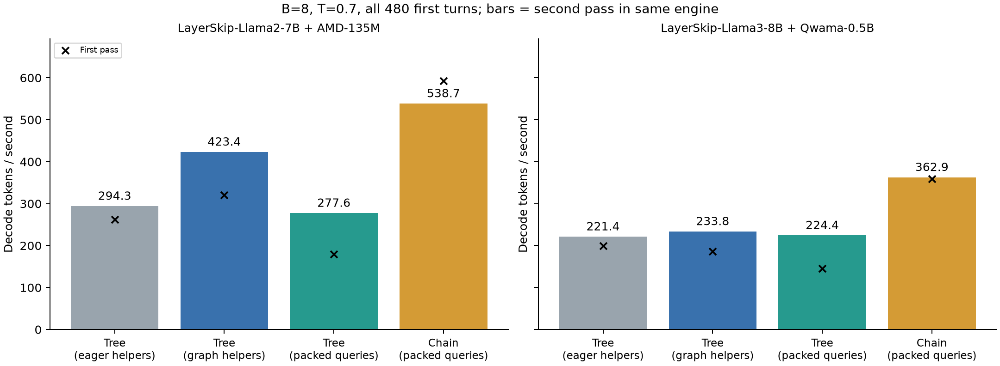

# B>1 dynamic tree 통합·최적화·full-model 검증

**전체 작업과 질문 답변:** [통합 merge 검토 문서](../MERGE_REVIEW.md). 기존 B1 tree 기능과 이번 B>1 확장, 공통 SSD 수정, TPS 집계 방향, 이전 selector 연구와 미완료 최적화를 구분한다.

기준: `feat/duet-p2tree-g0@a82f7d2`. 작업: `feat/duet-mlsys-coverage`, `/home/chokwans99/PSD-mlsys-coverage`. 실험일: 2026-10-07.

## 이번 작업의 결론

- 2차 작업에서 남아 있던 **B>1 dynamic tree의 실제 serving 경로**를 연결했다. Primitive만 배치화한 상태에서 벗어나 cache 조회, P1/P2 forest 생성, target ancestor attention, 검증, KV commit/복원까지 동작한다.
- **두 full model pair**에서 B=1/2/3/4/8/16, T=0/0.7을 실행했다. B8 주요 비교와 P2-only B8/16은 저장소 480개 first turn 전체를 사용했다.
- Tree는 chain보다 AL을 높였지만, 이 7B/8B·4090 환경에서는 AL 증가만으로 tree 생성/검증 비용을 상쇄하지 못했다. **기능 구현 완료와 chain 대비 TPS 우위는 별개의 결론**이다.
- 동일 GPU pair 순차 A/B, packed-query 추가 비교, GPU 배치 대조와 독립 HF 출력 검사를 모두 완료했다. 수치: [SUMMARY.md](SUMMARY.md), [NUMBERS.md](NUMBERS.md), [regressions_final.log](regressions_final.log).
- 재현·소스 위치·환경 변수는 [HANDOVER.md](HANDOVER.md)에 정리했다. 원래 연구 checkout의 root-selection 수식 파일은 변경하지 않았다.

## Dynamic tree가 의미하는 것

사용자 논문의 4.3절, 식 (4), 표 2의 Tree다. Root 후보 `(i,v)` 아래 노드의 점수는 다음 형태다.

\[
s(x_{1:d})=P(i,v)\prod_{j=1}^{d}p_D(x_j\mid i,v,x_{<j}).
\]

- Root 후보 선정은 **cache hit**를, root 아래 분기 구성은 **AL**을 목표로 한다.
- 매 draft round에서 한 요청에 속한 모든 root의 frontier를 비교해 상위 W개를 확장한다. Root마다 다른 깊이/폭의 tree가 생긴다.
- 이번 batching은 **각 요청의 top-W 예산을 독립적으로 유지하고 model forward를 합치는 것**이다. 서로 다른 사용자 요청이 하나의 W 예산을 나눠 갖는 새로운 알고리즘이 아니다.
- 기존 논문 branch의 P1 및 Policy-B proxy 점수를 유지했다. 별도 연구 branch의 `e(1-q)`는 이번 비교에 포함하지 않았다.

## 구현과 병목 개선

| 기존 상태/병목 | 이번 변경 | 확인한 효과/계약 |
|---|---|---|
| B>1에서는 dynamic tree end-to-end 미연결 | 요청 ID 기반 cache/wire/verification/KV 전체 연결 | Hit tree와 miss chain이 같은 batch에 존재 가능 |
| 요청별 model forward 반복 | 요청별 arena를 유지하고 round별 forward 배치화 | 요청마다 독립 예산·RNG·KV 유지 |
| geometry별 대형 attention scratch 중복 | 같은 stream에서 float workspace 공유 | 초기 B8 OOM 해결, full model B16 실행 |
| 짧은 tree도 항상 최대 너비로 검증 | 실제 valid 수에 맞춘 target/glue query 버킷 | 작은 view의 padding 감소 |
| Python에서 root/arena/accept의 작은 GPU 연산 반복 | 각각 CUDA graph로 통합 | 동일 GPU에서 graph on/off를 직접 비교 |
| 서로 다른 tree 길이를 최대 너비로 padding | 선택적 packed target query 경로 추가 | 별도 attention reference와 full-model A/B로 평가 |
| 배치 row 이동·재충전 시 상태 혼동 가능 | seq_id별 cache key와 draft KV staging | batch shrink/refill, 생성 도중 preemption 검사 |

최적화된 기본 경로는 `SSD_BATCH_TREE_{ROOT,INPUT,ACCEPT}_GRAPH=1`이다. Packed tree query는 별도 `SSD_PACKED_TREE_VERIFY=1` 실험 옵션이며, 기존 chain용 `SSD_PACKED_VERIFY`와 다르다. 두 모델의 전체 입력 비교에서 느려졌으므로 **기본값0을 유지**한다. Query 감소를 throughput 개선으로 착각하지 않는다.

Packed 경로는 요청별 유효 query를 이어 붙이고 정렬용 query는 별도 가상 sequence에 둔다. KV 위치·RoPE·ancestor 관계는 요청 기준으로 유지한다. FlashInfer persistent plan의 구조가 replay 사이에 바뀌면 명시적으로 오류를 내며, 이 설치 버전의 pre-packed mask offset은 byte 단위로 보정한다. 라이브러리 버전이 달라지면 attention parity 검사를 다시 실행한다.

전체 기록은34개 campaign job 중 최종30개 성공, 초기4개 실패를 보존한다. 성공한 전체-input cell은64개(각480개 입력)이며 설정·반복을 포함한 수다. 독립된30,720개 문항이라는 뜻은 아니다. 선택한 GPU에서 다른 process가 겹친 기록은 없다.

## 성능 비교의 조건

| 항목 | 설정 |
|---|---|
| 모델 1 | LayerSkip-Llama2-7B + AMD-Llama-135m, 전체 가중치, runtime fp16 |
| 모델 2 | LayerSkip-Llama3-8B + Qwama-0.5B-Instruct, 전체 가중치, runtime bf16 |
| GPU | RTX4090 24 GiB; 주요 성능은 target TP1 + draft 1 GPU |
| 데이터 | 저장소 corpus의 480개 first turn 전부, input cap512/output cap64, 자연 EOS |
| 프롬프트 | 기존 harness와 동일한 원문 tokenization; chat template 미적용 |
| 공통 파라미터 | exit_layer=21, K1=4, K2=2, draft fan-out=2, proxy fan-out=1 |
| Tree | P1 generation/verify cap8, P2 cap4, G=M; P1/P2 모두 tree 또는 별도 P2-only |
| Chain | 같은 K1/K2, packed chain verification 사용, mixed-miss AR 변환은 끔 |
| AL | verification event별 accepted draft tokens + recovery token; 요청 event 가중 |
| TPS | 실제 반환 decode token 수 / decode 시간; prefill을 포함한 end-to-end TPS도 raw에 별도 저장 |

- 여기서 full dataset은 **이 repository의 480 first turns**다. 원 데이터셋의 모든 turn, 무제한 context, 긴 입력 전체를 뜻하지 않는다.
- 한 engine 안의 seed cell은 target RNG만 다시 설정한다. Draft RNG는 계속 진행한다. 이를 독립 프로세스 반복이라고 부르지 않는다.
- 모델 로딩, engine 초기화와 16-token warm-up은 성능 계측 밖이다. 첫 pass의 추가 capture 비용은 아직 생성되지 않은 geometry에 한정한다.
- 짧은 warm-up으로 모든 tree geometry가 생성되지는 않는다. 첫 full pass에는 graph capture가 포함되므로 첫 번째/두 번째 pass를 모두 표시한다. 두 번째 pass도 새 geometry가 나오면 추가 capture가 가능하므로 완전한 steady-state 보장으로 부르지 않는다.
- 초기 full-model wave는 서로 다른 GPU pair에서 일부 동시 실행했다. Llama2는2,3, Llama3는4,5(둘 다PIX), 마지막 graph/packed 비교는0,1(NODE)다. 모델/코드 효과는 **같은 pair 안에서의 순차 비교**를 우선한다. Llama3는4,5에서도 같은 코드를 추가 비교한다. 서버 전체 독점 측정은 아니다.
- 원 논문의 70B/Blackwell/TP2 결과와 하드웨어·모델 크기가 다르다. 이 결과로 원 논문 표 2를 재현했다고 하지 않는다.

## 같은 GPU에서 측정한 graph 최적화 효과

B8/T0.7, 480 first turns, GPU0·1 순차 실행. 각 경로에서 같은 engine으로 두 full pass를 수행했다. 아래 `eager`는 model forward까지 모두 eager라는 뜻이 아니라 **root/arena/accept 보조 연산의 graph만 끈 대조군**이다.

| 모델 | Tree eager 첫/두 번째 TPS | Tree graph 첫/두 번째 TPS | 두 번째 pass 개선 | Chain 두 번째 TPS |
|---|---:|---:|---:|---:|
| Llama2 | 262.49 / 294.33 | 320.82 / 423.43 | +43.86% | 538.72 |
| Llama3 | 199.41 / 221.36 | 186.43 / 233.81 | +5.62% | 362.86 |

- Llama2에서는 보조 연산을 graph로 합치는 효과가 컸다. Llama3에서는 이 변경만으로 얻은 개선이 작았다. Llama3의 +5.62%는 이 두 pass의 관측값이며, 독립 반복 없이 통계적으로 확정된 향상이라고 주장하지 않는다.
- **Llama3 첫 pass는 graph 경로가 더 느렸다.** Capture를 포함한 시작 비용은 숨기지 않는다. 한 engine을 오래 재사용할 때와 짧게 한 번 실행할 때를 구분해야 한다.
- Graph는 RNG 소비 순서도 바꾸므로 sampling 출력이 bitwise 같은 A/B가 아니다. 같은 검증식과 파라미터를 사용했고, 각 경로의 AL/hit을 함께 기록했다. 두 pass는 독립 반복의 신뢰구간이 아니다.
- 초기 full wave와의 절대 TPS 차이는 GPU pair, revision, 실행 순서도 다르다. 새 revision의 GPU4·5 재실행에서 tree의 두 번째 TPS는225.97로 GPU0·1의233.81보다 높지 않았다. 따라서 초기 full wave의 더 높은 TPS를 GPU 연결만으로 설명하는 가설은 확인되지 않았다. 이 보고서는 같은 revision·같은 pair의 마지막 대조값을 우선하며, 초기 wave와의 차이 원인을 단정하지 않는다.

## Packed query 실험: 연산량 감소와 TPS는 달랐다

두 모델 모두 B8/T0.7의 두 번째 pass에서 이득이 없어 **`SSD_PACKED_TREE_VERIFY=0`을 유지한다.**

| 모델 | 기존 graph TPS | Packed TPS | 변화 | 기존/packed query 사용률 | 기존/packed 검증 중앙값 ms |
|---|---:|---:|---:|---:|---:|
| llama2 | 423.43 | 277.57 | -34.45% | 65.2% / 93.1% | 24.77 / 28.93 |
| llama3 | 233.81 | 224.40 | -4.02% | 65.6% / 93.2% | 36.36 / 38.89 |

Packed는 실제 model query 수를 줄였지만 per-step re-plan, 불규칙한 attention 실행 및 달라진 kernel shape의 비용도 생긴다. 개별 원인의 시간을 분리한 실험은 아니므로, 이 중 하나만을 손실의 확정 원인이라고 하지 않는다. 확인된 사실은 query 사용률이 높아져도 이 구현의 end-to-end decode TPS는 개선되지 않았다는 것이다.

[PDF 그림](throughput_comparison.pdf). 막대는 같은 engine의 두 번째 pass, ×는 첫 pass다. Tree의 첫 pass에는 아직 생성하지 않은 geometry capture가 포함될 수 있다. 모델 초기화와 warm-up은 계측 밖이다.

## GPU 배치 대조: 더 빠른 결과가 재현되지는 않았다

같은 최신 코드와 CLI를 GPU4·5(PIX)에서 순차 재실행했다. 두 번째 pass는 다음과 같다.

| Llama3 경로 | GPU0·1 NODE TPS | GPU4·5 PIX TPS |
|---|---:|---:|
| Tree graph | 233.81 | 225.97 |
| Packed chain | 362.86 | 282.42 |

GPU pair를 바꾸는 것만으로 기존 full wave의 높은 수치가 재현되지는 않았다. 특히 초기 full wave의 Llama3 sampling330TPS를 현재 구현의 안정적인 성능이라고 인용하지 않는다. Revision, T0→T0.7 실행 순서, engine 재사용 상태와 서버 상태가 함께 달랐으므로 그 차이의 원인은 분리되지 않았다. 표의 pair 변경을 PCIe 한 요소만의 효과라고 해석하지 않는다. **최종 tree/chain 비교는 같은 pair 안의 대조 결과를 사용한다.**

## AL과 cache hit: 전체 입력의 결과

아래는 T별 3개 target seed cell의 AL 산술평균이다. Raw: `llama{2,3}_full1/`.

| 모델 | T | Tree AL | Chain AL | AL 증가 | Tree hit | Chain hit |
|---|---:|---:|---:|---:|---:|---:|
| Llama2 | 0 | 2.3737 | 2.2407 | +5.94% | 84.68% | 87.91% |
| Llama2 | 0.7 | 2.0006 | 1.9055 | +4.99% | 77.31% | 79.26% |
| Llama3 | 0 | 2.8707 | 2.7507 | +4.36% | 80.28% | 84.08% |
| Llama3 | 0.7 | 2.3929 | 2.3559 | +1.57% | 72.48% | 73.68% |

- Tree의 분기가 **AL을 높이는 효과는 관찰됐다.** 그러나 cache hit는 낮아졌다. Tree가 늘린 terminal context에 기존 후보 예산을 배분하는 영향과 trajectory 변화가 함께 있으므로, 이 집계만으로 단일 원인을 확정하지 않는다.
- Llama2 마지막 sampling cell에서 P1 hit 조건부 AL은 tree2.622/chain2.435, P2는1.724/1.575였다. Llama3 P1은2.845/2.836, P2는2.092/1.954였다. [critical_path.json](critical_path.json).
- Target verification 중앙값은 그 cell에서 Llama2 tree25.12ms/chain20.59ms, Llama3 tree31.72ms/chain22.46ms였다. 이는 **연산비용의 진단**이며 최종 순차 TPS 비교와 섞어 인과 효과 크기를 계산하지 않는다.
- `target_step_times`에는 prefill도 포함되어 `target_verify_times`와 길이가 다르다. 두 배열을 같은 인덱스로 빼서 “draft 대기시간”이라고 해석하지 않았다.

## B>1에서 AL 증가가 TPS 증가로 이어지지 않는 이유

동일한 활성 batch B와 정상 상태를 가정하면 대략 `TPS ≈ B × E[AL] / E[step time]`이다. 따라서 tree가 더 빠르려면 다음 조건이 필요하다.

\[
\frac{E[AL_{tree}]}{E[AL_{chain}]}>
\frac{E[t_{tree}]}{E[t_{chain}]}.
\]

이번 AL 증가는 약1.6~5.9%다. 반면 tree는 한 요청당 여러 분기의 hidden/logit을 계산하고, node별 parent-q를 전송하며, P1/P2 forest 입력·mask·KV 경로를 관리한다. 이 추가 비용이 AL 증가보다 크면 TPS는 낮아진다. 식은 활성 batch가 같은 경우의 설명이며, 실제 aggregate TPS는 요청 종료·batch 변화·capture까지 포함한 직접 측정값을 사용한다.

- 초기 병목에는 모델 연산 이외에도 요청별 작은 GPU 연산과 Python launch가 있었다. Root/arena/accept graph A/B가 그 비용을 줄이는 효과를 보여 준다.
- Graph 적용 뒤에도 tree의 target query 수가 chain보다 많다. 길이가 다른 tree를 같은 너비에 맞추면서 padding도 생긴다. Packed query는 이 낭비를 줄이는 추가 실험이다.
- `Avg draft step time`은 통신/대기까지 포함할 수 있으므로 순수 draft forward 시간이라고 인용하지 않는다. 총 TPS·검증 구간·query 수를 함께 본다.
- 두 full model을 사용했다는 사실만으로 target70B의 비용 비중까지 재현되지는 않는다. 작은 target에서의 순위를 원 논문 하드웨어에 일반화하지 않는다.

## P2-only, 더 큰 batch

P2-only tree도 B8/16 × T0/0.7 × 480개 입력 × 2개 target seed cell을 모두 실행했다. 첫 cell보다 shape capture 영향을 덜 받는 두 번째 cell을 아래에 표시했다.

| 모델 | B | T0 TPS | T0.7 TPS |
|---|---:|---:|---:|
| Llama2 | 8 | 555.4 | 490.3 |
| Llama2 | 16 | 726.1 | 597.6 |
| Llama3 | 8 | 452.7 | 389.1 |
| Llama3 | 16 | 621.2 | 546.1 |

P1 tree를 끄는 것이 이 조건에서 유력한 비용 절감 선택이다. 다만 B16 tree와 B8 chain을 비교해 tree 우위라고 하지 않는다. 이 round에는 B16 chain의 일대일 성능 대조군이 없다. 전체 cell: [NUMBERS.md](NUMBERS.md).

## 정확성·경계 조건 검증

최종 전체 회귀 **280개 통과(85.124초)**. 새 serving 관련17개 검사를 기존263개에 추가했다.

| 검증 | 결과 및 한계 |
|---|---|
| 독립 dense ancestor attention | 실제 CUDA attention과 비교; 요청별 pages, branch, prefix 변경, ragged packed 경계 변경 포함 |
| Stochastic residual 검증 | 독립 scalar 계산, 200개 고정 coin 전체 경로 비교, 40,000회 first-token 분포 검사 |
| WOR support 소진 | 30,000회 degenerate proposal 검사; zero-probability padding 수락 방지 |
| Graph RNG | 25,600회 recovery draw로 replay가 같은 sample을 반복하지 않는지 검사 |
| T0/T>0 혼합 batch | T0 tie는 argmax one-hot으로 처리; 작은 temperature 근사로 무작위 tie가 생기지 않도록 수정 |
| Greedy vs AR, 48문항 | Llama2 B1/2/4/8 완전 일치46/46/45/46개; Llama3 40/37/36/38개 |
| Greedy 차이의 독립 HF 진단 | 첫 분기 Llama2 총9건 모두 top2, 최대 logit gap0.015625; Llama3 총41건 모두 top4, 최대0.125 |
| 생성 도중 preemption | 합성 page 경계 입력16개: Llama2 243회 중196회, Llama3 81회 중70회는 이미 출력한 뒤 preempt |
| Preemption 후 continuation | 중복 제거 HF 검사 Llama2 12지점/Llama3 10지점에서 이전 prefix 보존, 다음 token 모두 HF max-logit |
| TP2 target + draft | 두 모델 B2/T0·0.7,16문항48token 실행 완료; greedy Llama2 16/16, Llama3 15/16 AR 완전 일치 |

TP2에서 Llama3 첫 차이 1건도 near-tie(logit gap0.0625)다. 이것은 **FP16/BF16의 모든 실행 경로가 bitwise 같은 결과라는 증명은 아니다.** 서로 다른 kernel/query shape의 rounding 차이를 관찰했으며, 별도 HF reference로 첫 차이를 진단했다. Stochastic losslessness는 실제 사용한 target/proposal 분포에 대한 알고리즘 계약이다.

기존 자연 입력의 low-memory 실행은 preemption이 있어도 output_position=0인 경우가 많았다. 이 실패한 진단을 숨기지 않고 별도 page 경계 workload를 추가했다. 진단 workload TPS는 주요 성능 표에 넣지 않는다.

### Packed 경로의 추가 독립 검사

Packed는 성능 때문에 기본값에서 제외했지만, 출력 차이도 끝까지 검사했다. 두 모델의 T0 반복은 각각480/480개 출력이 완전히 같았다.

| 모델 | AR48개와 완전 일치 | 기존 full tree480개와 완전 일치 | full 비교의 모든 첫 분기 HF 순위 | full 비교 최대 selected logit gap |
|---|---:|---:|---|---:|
| llama2 | 47/48 | 451/480 | top2 이내 | 0.015625 |
| llama3 | 35/48 | 358/480 | top3 이내 | 0.25 |

전체480개 비교에서는 달라진 **모든 첫 분기 지점**을 독립 HF forward로 평가했다. 여러 token이 가까운 logits를 가진 경우의 수치 차이를 확인했지만, 이것을 bitwise 동일성이나 모든 차이가 무해하다는 증명으로 부르지 않는다. AR48개 검사의 최대 gap은 Llama2 0.015625/Llama3 0.125였다.

원본: [Llama2 full HF audit](llama2_packed_vs_tree_full_audit.json), [Llama3 full HF audit](llama3_packed_vs_tree_full_audit.json). `audit_packed.py`로 같은 prompt를 정렬하고 재실행한다.

### 검증 노드 수를 줄이는 경우

새 배치 경로에서 G>M이면 **generation-order prefix**를 유지한다. Ancestor와 ordered WOR sibling prefix를 보존하며, 후보 자신의 sampled value로 후보 사용 여부를 다시 결정하지 않는다.

단순히 ancestry/sibling closure를 지키는 것만으로 value-dependent pruning의 proposal 법칙까지 보장되는 것은 아니다. 예를 들어 `q=(0.5,0.5)`, `p=(0.9,0.1)`에서 후보가1일 때만 검증하고 후보가0일 때는 바로 p에서 샘플링하면, 원래 q를 분모로 쓰는 결과의 token0 확률은 `0.5×0.9+0.5×0.8=0.85`가 된다. 기대하는0.9가 아니다. 이번 새 경로는 이런 선택을 피한다. **이번 실험은 G=M이므로 기존/수정 cap 정책이 결과를 바꾸지 않는다.** 기존 B1 reranking의 별도 사용을 이번 검증으로 인증하지 않는다.

## 실패를 통해 수정한 내용

- 최초 smoke: `argsort(stable=...)` 호출 형식 오류 → 수정 후 재실행.
- 두 번째 smoke: siblings의 parent-q reference가 공유되지 않음 → 같은 부모의 첫 child reference로 통일.
- 최초 B8 screen: geometry별 중복 workspace 때문에 OOM → workspace 공유 및 불필요 capture 제거 후 두 모델 전 matrix 성공.
- 최초 packed plan probe: 결과 JSON으로 TVM 객체를 저장하다 실패 → integer tuple로 직렬화. 수치 비교와 full 실행 기록을 별도로 보존.

실패 JSON에 raw `status=running`이 남아 있어도 campaign의 exit code를 따라 실패로 분류한다. [RUN_INVENTORY.csv](RUN_INVENTORY.csv)에 성공/실패를 모두 남겼다.

## 다음 서버에서 유지할 기준

- 현 branch는 두 full dense pair의 B>1 tree 실험을 시작할 수 있는 통합 구현이다. 모형 AL 이득을 TPS 우위로 바꾸려면 해당 하드웨어에서 phase/tree 예산을 선택해야 한다.
- **AL 우선** 실험에는 tree와 P2-only를 모두 유지한다. **TPS 우선**에는 이번 비교의 chain 결과를 기준선으로 유지한다. Tree가 항상 빠르다고 전제하지 않는다.
- 70B/Blackwell에서 실제 논문 설정, 장문 context, 독립 프로세스 반복, target TP2 throughput을 다시 측정한다. 이는 이 서버에서 완료한 7B/8B 검증과 구분한다.
- EAGLE, raw proxy-on-draft, exit top-m gather는 새 경로에서 명시적으로 지원하지 않는다. Dense full-vocabulary 두 조합의 성공으로 다른 model family까지 지원한다고 주장하지 않는다.
