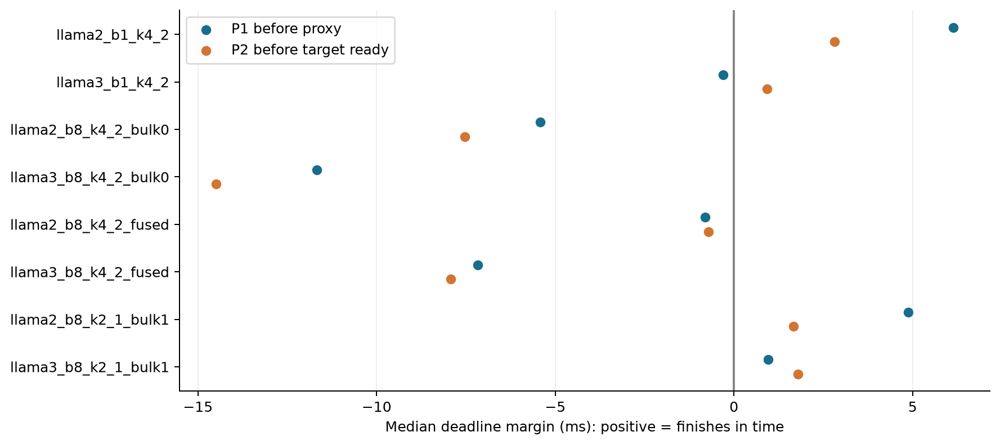
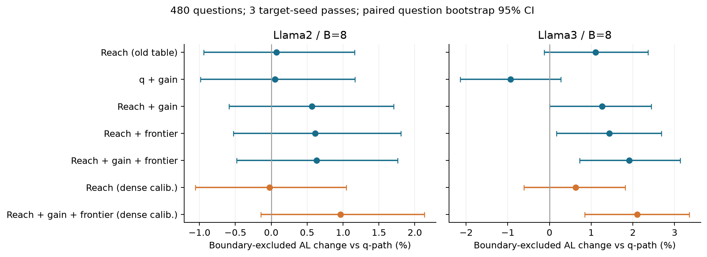
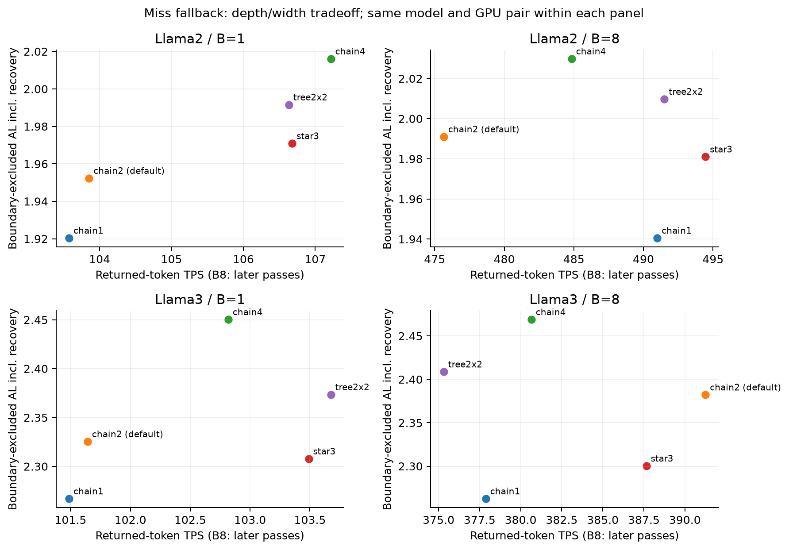
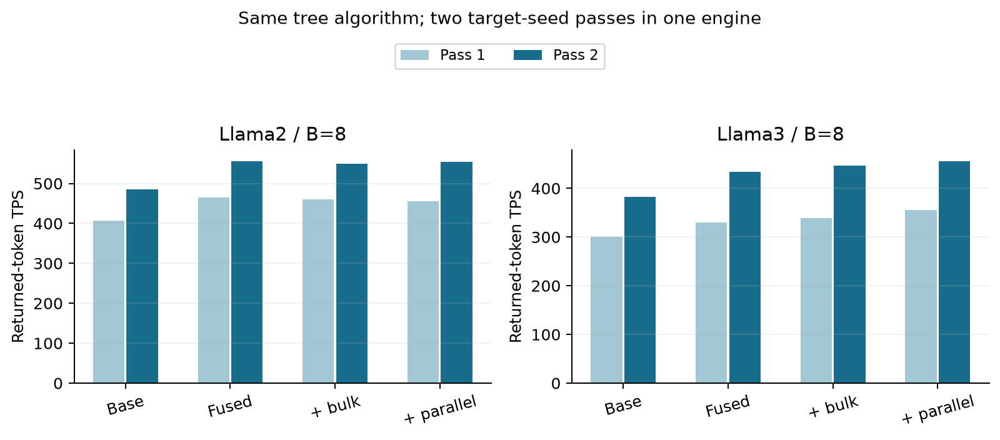

# DUET Round4: 이 서버의 dense-model 검증과 최적화

시작 기준: `feat/duet-mlsys-coverage@696e92c`, 최종 runtime/bench/test commit: `c0600ea`. 논문 기준은 `a82f7d2`. 다른 서버에서 작업 중인 변경을 가져오거나 해당 서버의 GPU를 사용하지 않았다. **전체 계획과 원인 분리 대조군까지 완료했다. GPU job94개 전부 정상 종료,178개 cell의 실제 반환 token/시간 집계 검증 통과.**

전체 branch 인수인계 기준 문서: [MERGE_REVIEW.md](../MERGE_REVIEW.md). 전체 수치: [TABLES.md](TABLES.md), [RESULTS.csv](RESULTS.csv), [RESULTS.json](RESULTS.json). 수식: [THEORY.md](THEORY.md). 원시 결과는 삭제하지 않으며 Git에는 검증 가능한 gzip 사본을 보존한다. Full-vocabulary NPZ는 약238MiB의 `local_calibration_snapshots.tar`로 별도 보관하고, Git에는 고정 table/compact audit/각 파일·bundle SHA를 남겼다.

## 최종 결론

**검증 완료 범위:** full dense 두 모델 pair에서 GPU job94개를 모두 완료했다. 그중62개 job은 전체480질문을 사용했고, target-seed pass는132회다. 전체178개 cell의 실제 반환3,614,764token을 event/step/counter와 대조한1,958개 집계 검사에서 불일치가 없었다. 할당 GPU에 외부 process가 겹친 기록도 없었다. 기본 경로와 fused+bulk+parallel 경로 각각288/288 회귀 검사가 통과했다.

**AL을 우선한 최종 검증 조합:** K1/K2=4/2, 기존 reach+gain+frontier table, miss chain4, fused mask/fanout + bulk export. Root 후보 수식은 그대로다. 아래 비교는 두 arm 모두 같은480질문/target seed2026·2027/draft startup seed0다. AL*는 cap/clip terminal event 제외, TPS*는 경계 batch-step의 token과 시간을 함께 제외했다. TPS는 후속 pass 값을 사용하며 괄호에는 제외 전 실제 반환 TPS를 함께 썼다.

| 모델/B8 | 기존 AL* → 조합 AL* | AL* 개선 | ΔAL* 95% CI | 기존 TPS* → 조합 TPS* (전체 TPS) |
|---|---:|---:|---|---|
| llama2 | 1.9808 → 2.0476 | +3.37% | [+0.0367, +0.0989] | 480.1 → 498.4 (484.5 → 513.3) |
| llama3 | 2.3736 → 2.5376 | +6.91% | [+0.1233, +0.2031] | 381.8 → 422.0 (382.2 → 411.3) |

이 조합의 AL 개선에는 **miss node2→4 확대 효과가 포함**된다. 이를 모두 tree 점수 개선으로 주장하지 않는다. 같은 corpus에서 구성 요소를 본 뒤 확인한 조합이며, 새로운 미관측 test set의 확증도 아니다. 검증한 후보 중 AL 우선 선택지이지 모든 parameter 조합의 최적성 증명은 아니다.

**구성 요소별 결론:**

1. **기존 tree 점수 개선은 Llama3에서 유효했다.** Miss2/G=M8·4를 고정한3pass 비교에서 historical reach+gain+frontier의 AL*는 Llama3 +1.91%(ΔCI [+.0172,+.0746]), Llama2 +0.63%(ΔCI [-.0096,+.0350])다. Llama2의 우위는 확정하지 않는다. Legacy B1에서도 Llama3 +2.72%, Llama2 +1.49%이며 후자는 CI가0을 포함한다.
2. **8질문 dense calibration은 필수가 아니었다.** Dense reach+gain+frontier는 q-path 대비 Llama3 +2.10%, held-out472에서 +2.12%였으나, historical table 자체와 비교한 추가 ΔAL* CI는 Llama3 [-.0277,+.0335], Llama2 [-.0128,+.0305]다. 보정 표본이 작고 수집B1/평가B8의 context 이동도 있어 새 보정이 더 좋다고 확정하지 않는다.
3. **Miss를 무조건 짧게 하거나 넓히는 것은 AL 목표에 맞지 않았다.** 기본 miss는 이미 chain2다. B8에서 chain4의 AL*는 Llama2 1.991→2.030, Llama3 2.382→2.469로 증가했다. 같은4-node의 tree2x2는 각각2.010/2.409로 chain4보다 낮았다. 이는 첫 sibling만 다음 깊이로 확장하는 이번 얕은 설계의 결과이며, 모든 token tree/SpecInfer의 열등성을 뜻하지 않는다. Star는 구조상 AL<=2라 Llama3 chain4 miss 조건부 AL≈2.31을 따라갈 수 없다.
4. **Llama3에서는 miss4에서도 tree 점수의 추가 AL 이득이 남았다.** Target seeds2026·2027로 맞춘 AL-only 분석에서 chain4 조건의 score 개선 ΔAL*는 Llama3 +.0888(CI [+.0499,+.1272]), Llama2 +.0120(CI [-.0182,+.0430])다. 조합 arm의 kernel 구현도 달라 TPS의 완전 factorial 비교는 아니며, 별도로 확인한 구현 동등성 범위에서 AL을 해석한다. 두 요소의 interaction CI는 양 모델 모두0을 포함하므로 양의 synergy를 확정하지 않는다. Llama2의2seed 결과만 골라3seed 주 분석보다 강한 결론을 내리지 않는다.

**알고리즘을 바꾸지 않은 실행 최적화:** K4/2·q-path·miss2의 전체480개 출력이 매 pass 모두 동일했다. Fused/bulk/parallel의 main 비교3개×2모델×2pass, 그리고 독립 draft seed1의 보조 pair 비교에서도 출력 동등성을 확인했다. B1 두 모델의 fused+bulk 비교도 전체480출력과 AL이 동일하다.

| 모델/B8 | 같은 AL을 유지한 관측 최고 설정 | 후속 pass 전체 TPS | 경계 제외 TPS* |
|---|---|---:|---:|
| llama2 | fused | 484.5 → 556.2 (+14.8%) | 480.1 → 551.2 |
| llama3 | fused_bulk_parallel | 382.2 → 456.0 (+19.3%) | 381.8 → 455.0 |

별도 GPU pair·draft seed1/target3030·3031의 fresh-engine 확인에서 fused+bulk 후속 pass TPS는 Llama2 470.0→532.3(+13.3%), Llama3 344.9→398.5(+15.6%)였다. Pair별 절대 TPS는 합치지 않는다. Llama2에서는 bulk/parallel을 더 켜도 fusion 단독보다 빠르지 않았고, Llama3의 parallel 추가 약2% 이득은 별도 process 반복으로 더 확인할 여지가 있다. B1 Llama2에서 같은 최적화의 TPS 이득이 거의 없었던 것은 이미 draft가 숨는 조건과 일관된다. Tree CUDA graph를 매번 다시 만들던 문제를 고친 것이 아니라 graph 안의 작은 kernel/metadata 비용을 줄였다.

**Phase 예산 축소의 원인 분리:** K2/1을 그대로 쓰면 default miss도1로 줄어든다. 따라서 miss2를 고정한 추가 full480 대조를 완료했다. 아래는 같은 fused+bulk, 같은 miss2이며 phase/node 예산만 K4/2·G8/4에서 K2/1·G4/2로 바뀐다.

| 모델/B8 | K4/2 AL* → K2/1 AL* | AL* 변화 | 후속 pass 전체 TPS |
|---|---:|---:|---:|
| llama2 | 1.9808 → 1.7501 | -11.64% | 549.9 → 545.3 |
| llama3 | 2.3736 → 2.0497 | -13.65% | 446.0 → 508.0 |

Llama3에서는 짧은 phase가 TPS를 더 높일 수 있지만 AL을 희생한다. **사용자가 정한 AL 우선 목적에는 K4/2 조합을 유지하는 쪽이 맞다.** Profile에서 두 phase가 시간 안에 들어온다는 조건만으로 최적 parameter가 정해지지 않는다. K를 바꾸면 depth/node/query shape와 target latency도 바뀌므로 이들을 포함한 AL/시간 비교가 필요하다. 여기서는 node budget도 함께 바뀌는 실제 설정을 비교했으며, 모든 K/N 조합을 sweep한 것은 아니다.

**적용 지침:** G>M proposal-law 수정과 실제 반환/경계 집계는 공통으로 채택한다. AL 우선 실행은 `*_budget_plan.json`의 `*_combined_chain4` job을 사용한다. 동일 AL에서 TPS를 우선하는 K4/2 실행은 Llama2의 `*_fused`, Llama3의 `*_fused_bulk_parallel` job이 이번 관측 최고다. 새 성능 옵션의 기본값은0으로 남겨 원 설정 재현/새 하드웨어 대조가 가능하게 했고, 검증한 plan은 필요한 옵션을 명시한다. 이 옵션들은 새 확률 threshold가 아니라 구현 ablation용이다. 다른 서버에서는 위 preset으로 시작하고 backend/hardware 변경 후 parity와 performance를 재확인한다.

**남은 범위:** 이 서버의 위94개 실행과 correctness/집계 검증은 완료했다. Dense70B·Blackwell targetTP2, 긴 출력1024/장문 전체 입력, 새 root 수식과의 결합, 다른 workload·독립 seed에서 작은 AL 이득의 재현은 후속이다. 이번 결과는 신규 SSD/Mirror-SD baseline 비교가 아니므로 그 대비 우위를 이 수치만으로 주장하지 않는다.

## 실험 범위와 비교 기준

- Full dense LayerSkip-Llama2-7B + AMD-Llama-135m(FP16), LayerSkip-Llama3-8B + Qwama-0.5B-Instruct(BF16). 양자화·부분 layer 대역 모델이 아니다.
- 전체 480개 question의 **첫 turn**을 사용했다. MTBench, translation, summarization, QA, math reasoning, RAG 각80개. 모든 대화 turn을 실행한 것은 아니다. 입력 cap512, 출력 cap64, EOS 적용. 입력이 잘린 질문은 Llama2 141/480개, Llama3 136/480개이며 전체 question 목록을 사용한 것이지 모든 원문 token을 사용한 것은 아니다.
- Tree/miss 주요 비교 T=.7, B8은 target seed2026/27/28의3회 pass, B1은2026의1회 pass. Draft seed0은 process 시작 시 적용되고 cell 사이에 RNG가 계속된다. 동일 engine의 pass를 독립 process replica라 부르지 않는다.
- Root 후보 수식과 위치 예산 수식은 기존 논문 branch 동작으로 고정했다. 이번 AL 비교에 `e(1-q)` root 개선을 섞지 않았다.
- 기본 K1/K2=4/2, exit21, P1/P2 generation/verification node budget8/4, G=M. 별도 G>M 실행은 correctness smoke다. 예산 축소 비교는 K1/K2=2/1과 node budget4/2로 함께 변경한다.
- GPU2,3(PIX)는 Llama2 B8,4,5(PIX)는 Llama3 B8. B1은 Llama2 0,1(NODE, 같은 NUMA), Llama3 6,7(PIX). 동일 모델의 비교는 같은 pair에서 했다. 서로 다른 topology인 두 모델의 절대 TPS를 직접 대조하지 않는다.
- 모든 GPU는 시작 시 비어 있었다. 공유 자원을 쓰는 여러 pair의 동시 실행과 CPU/clock 변동이 남아 있으므로, 소수 TPS 차이에는 독립 재실행이 필요하다.

## 1. 상한/EOS 경계 집계

검증 길이(`accepted_len`)와 실제 반환 길이(`emitted_len`)를 구분한다. 상한에서 검증한5개 중2개만 반환했다면, TPS에는2개만 넣는다. 이번에는 사용자 요청에 따라 경계 제외 지표도 추가했다.

- `AL*`: 출력 cap 도달 또는 suffix clipping이 있는 **마지막 sequence event**를 제외한다. 그 이전의 정상 step은 남긴다.
- 경계 제외 TPS: 위 event가 하나라도 있는 **batch step 전체**에서 token과 시간을 함께 제외한다. 공유 batch 시간에서 해당 요청의 시간만 임의로 나누지 않는다.
- 전체 TPS: 모든 실제 반환 token / 모든 decode 시간. 요청 전체를 임의로 지우지 않고 원시 결과와 함께 보존한다.
- Cap 도달 요청 전체 삭제는 출력 결과에 따른 selection이다. 이전 논문에서 긴 입력을 사전 기준으로 제외한 것과 같다고 말할 수 없다. 현재 cap64에서는 다수 요청이 상한에 도달하므로 전체 삭제하면 비교 corpus 자체가 크게 바뀐다.

`TABLES.md`에 원시 AL, AL*, cap 요청 수, 제외 event 수, 전체/경계 제외 TPS를 함께 둔다. 옛 counter의 이번 run 과대계수를 옛 논문 TPS에 그대로 곱해 보정하지 않는다.

## 2. 논문 breakdown과 P1/P2 deadline

원본 PDF의 Fig5를 직접 확인했다. 논문은 dense70B/TinyLlama, target TP2 + draft1GPU, RTX PRO6000 Blackwell3개, B1, exit56, K1/K2=8/4다. 현재의7B/8B, target1GPU, RTX4090과 latency 비율이 같다는 가정은 성립하지 않는다.

논문 cache-hit timeline의 정규화 비율은 target sync9%, pre61%, post24%, sampling6%, proxy1.7%(겹치는 구간), draft align8%, P1 42%, proxy wait22%, P2 27%다. Target model 완료와 acceptance/postprocess 완료는 다른 마감이다. 논문 평균 timestep과 조건부 그림 비율을 곱하여 새로운 정확한 latency를 만들지 않는다.

실제 step별 다음 값들을 CUDA event로 잰다.

\[
C_1=a+D_1,\qquad C_2=\max(C_1,P)+D_2.
\]

`a`는 glue 종료, `P`는 독립 recv stream에서 확인한 proxy 수신 완료, `C1/C2`는 phase 완료다. P1 조건은 `C1<=P`, P2의 다음 검증 준비 조건은 `C2<=F_ready`다. Target model 내부에만 완전히 숨는 더 강한 조건 `C2<=F_model`도 따로 계산한다.

- Graph capture가 있는 step과 앞20step을 제외한다. B8 분석은 **실제 활성 요청도8개인 step**만 쓴다. 끝부분 drain B1/B2를 B8 표본으로 넣지 않는다.
- Timing 진단은 B1도 `SSD_BATCHED_TREE=1`인 통합 경로다. Legacy B1 tree 점수 성능표와 경로를 혼동하지 않는다.
- B1 진단은16질문/cap32, B8 주 진단은48질문/cap64다. 전체480 AL/TPS 실험과 구분한다.
- Timeline profile의 TPS는 성능표에 사용하지 않는다. Cross-process CUDA/host anchor 정렬 오차 때문에 0에 매우 가까운 margin은 엄격한 물리적 보장으로 해석하지 않는다.
- K1/K2를 바꾸면 node budget과 target query bucket도 달라진다. Target latency를 상수로 두고 draft step만 나누는 단순 계산으로 최적 K를 결정할 수 없다.
- All-hit는 JIT miss 계산이 없어지는 조건이다. P1/P2 생성 자체가 늦으면 all-hit여도 다음 step이 기다린다.

[실제 단일 step timeline 그림](figs/04_actual_step_timeline.png)은 서로 다른 step의 중앙값을 이어 붙인 그림이 아니다. 각 설정의 median P2 margin에 가장 가까운 실제 step을 표시했다.

## 3. 이전 tree 개선의 실제 적용

이전 연구의 hook을 그대로 가져오면 실행기를 refactor한 현재 경로에서 호출되지 않는다. 이번에는 `P2TreeExecutor.iter_rounds`에 명시적으로 연결했으며 P1/P2 및 batched executor가 공통으로 사용한다.

| 변경 | 동작 | 비교에서 고정한 것 |
|---|---|---|
| Reach | `부모 reach × 앞선 sibling 거절확률 × 현재 sibling 수락률 추정` | 실제 q, WOR 샘플러, 검증 수식 |
| Gain | root별 node 예산 아래 `Σ reach_i × gamma(c_i)`를 최대화하는 작은 정수 배분 | 요청별/root별 독립 예산, future-round reserve |
| Frontier | 현재 깊이뿐 아니라 아직 확장하지 않은 이전 깊이 후보도 선택 | 같은 최대 node/forward 예산 |

`q_path / reach / q_gain / reach_gain / reach_frontier / reach_gain_frontier`를 분리했다. 이는 샘플링할 **미래 자식의 부모와 개수**를 정하는 정책이다. 이미 뽑은 토큰을 보고 사후에 지우는 pruning과 다르다. Gain의 최적성은 해당 round의 추정 목적함수에 대한 것으로, 실제 전체 AL의 전역 최적성은 아니다.

첫 비교는 기존 연구의 calibration table을 그대로 이식했다. 별도 dense calibration은 사전 지정8개 질문(0,60,120,180,240,300,360,420)의 관측값으로 고정한 뒤 평가했다. Llama2는95 snapshot/109 internal contexts, Llama3는49/71로 작은 보정 표본이다. 보정 수집은 legacy B1이고 주 평가는 unified B8이므로 batch/context 분포 이동까지 제거한 보정은 아니다. 전체480 외에 보정 질문을 두 arm 모두에서 뺀472개를 따로 보고한다. 신경망 추가 학습은 없지만 경험적 scalar 보정이며 순수 수학식만으로 수락률을 알아낸 것은 아니다.

Gamma의 c1/c2는 정확한 기대값 계산, c3는 head32 + tail256 IID Rao–Blackwell 적분이다. 저장한 수치적 integration SE를 보정의 일반화 오차로 해석하지 않는다. 작은 vocabulary 전수 참조와30개 무작위 사례에서 계산을 대조했다(최대오차3.33e-16).

## 4. Cache miss: chain 길이와 얕은 tree

중요한 정정: **기본 miss는 이미 chain2**다. `Config.duet_jit_short=True`가 초기화 중 환경 변수에 반영되므로, 초기 env snapshot만 보고 chain4라고 추정하면 틀린다. 실제 baseline의 모든 source0 `valid_k`가2임을 확인했다. 명시적인 chain2 arm은 같은 조건의 반복이며 새로운 개선이 아니다. 새 report에는 초기 env 외에 resolved config와 관측 길이 histogram을 기록한다.

| miss 구성 | 직렬 draft forward | node 수 | 최대 깊이 |
|---|---:|---:|---:|
| chain1 | 1 | 1 | 1 |
| chain2(기본) | 2 | 2 | 2 |
| chain4 | 4 | 4 | 4 |
| star3 | 1 | 3 | 1 |
| tree2x2 | 2 | 4 | 2 |

얕은 tree는 각 부모에서 ordered-WOR sibling을 뽑고 **첫 sibling만** 다음 round에서 확장한다. 모든 sibling과 원래 parent logits를 남기며 target verifier는 실제 proposal q로 검증한다. Miss tree도 수락 경로의 KV를 stage/restore한다. Single-draft 얕은 tree로 [SpecInfer](https://arxiv.org/abs/2305.09781)의 token-tree 발상을 검토한 것이며 전체 SpecInfer 시스템 재현은 아니다.

AL은 `1+Σ_d P(수락 길이>=d)`다. Star는 깊이1이므로 AL상한2, tree2x2는 깊이2이므로 상한3이다. 폭을 넓혀 얕은 coverage를 높여도 뒤쪽 수락 깊이를 포기하는 비용이 있다.

`tree2x2 vs chain4`는 같은4-node 대조다. `star3 vs chain1`은 node 수까지 달라진다. 평균 AL만 아니라 miss 조건부 AL, P1/P2 hit, TPS를 함께 분석한다. Physical target bucket이 같다면 chain을 짧게 해도 target 계산은 같은 폭으로 실행될 수 있다. 또한 miss 후 context가 달라져 다음 cache 구성이 바뀌므로, 전체 AL 차이를 miss 조건부 AL만으로 설명하지 않는다.

## 5. Legacy B1 G>M proposal 법칙 수정

기존 B1은 G개 생성 후 실제 sampled confidence를 보고 M개 subtree를 남길 수 있었다. Parent/sibling closure만 지켜도, 살아남은 token의 확률 법칙이 원래 q와 같다는 보장은 없다. 이를 target에서 원래 q로 검증하면 편향이 가능하다.

이번 수정:

- P1 precompute의 confidence-selected view cache를 무효화한다.
- P1/P2 hit에서 같은 생성 순서의 앞M개를 남긴다. Parent가 먼저 나오고 sibling prefix가 유지된다.
- Parent-q reference와 실제 로그잇 행을 함께 remap한다. Equal G=M은 기존 zero-copy 경로다.
- 원 helper는 negative control용으로 남기되 “lossless-safe”라는 잘못된 docstring을 제거했다. Production에서 해당 rerank helper를 더 이상 호출하지 않는다.

실제 helper body를 로딩한18개 유한 tree 결과 + 모든 acceptance coin branch를 전수 계산했다. Target `(0.4,0.3,0.3)`에서 옛 점수 pruning은 `(0.4,0.31875,0.28125)`, TV=.01875였고 고정 prefix는 정확히 target과 일치했다. **편향이 존재하는 반례이며 실제 LLM 편향의 빈도/크기 추정은 아니다.** 두 phase, stale precompute cache, qref remapping unit test와 두 full model의 G>M smoke를 추가했다. 이번 full 성능표의 G=M 설정에는 옛 pruning이 적용되지 않는다. 옛 논문 전체 run의 G/M 설정은 원 로그를 통해 별도로 확인해야 한다.

## 6. Tree CUDA graph 내부 최적화

Tree graph는 이미 재사용되고 있었다. 문제는 B8에서 요청별 여러 작은 bookkeeping kernel과 CPU metadata export가 쌓이는 데 있었다.

- `SSD_TREE_FUSED_MATH`: mask byte packing과 round-robin fanout을 각각 fused kernel로 계산한다. 같은 부모 priority, tie 순서, root별 예산, future reserve를 유지한다. Gain 정책의 별도 최적화는 이 round-robin kernel로 바꾸지 않는다.
- `SSD_BATCH_TREE_BULK_EXPORT`: P1/P2의 독립 persistent arena에서 얻은 작은 cache metadata를 한 번의 D2H로 내린다. 동일 key 충돌 시 P1 우선 삽입과 실제 logits 참조를 보존한다.
- `SSD_TREE_PARALLEL_INSERT`: 이미 넓은 query에 사용하던 child insertion 경로를 작은 폭에도 적용하는 대조다. 추가 수학적 tree 파라미터가 아니라 구현 선택이다.

Mask는 가변 prefix/glue,63-bit ancestor word 경계, invalid lane, mutable graph replay에서 byte 단위로 검사했다. Fanout은48개 무작위 사례와 tie/reserve를 검사했다. 두 모델의 T0/.7 32개 smoke는 fused/bulk 모두 baseline token output과 일치했다. Profile용48개 T.7 출력도 fused와 baseline이 일치했다. Full matrix는 별도 표에 출력 동일 질문 수도 기록한다.

Llama2의 개별 traced replay에서 P1 kernel 수8040→4056, GPU kernel time16.43→11.56ms, P2는4096→2144,6.46→4.18ms였다. **단일 replay의 진단 수치이며 전체 TPS와 혼동하지 않는다.** Fusion 이후에도 model attention/GEMM, sorting, insertion 등의 비용이 남는다.

## 7. 검증·재현·한계

- 최종 source의 기본 경로와 fused+bulk+parallel 경로는 각각288/288 검사 통과(`final_checks.json`).
- 초기280 regression 중1건은 metrics가 없는 test double에서 계측 추가가 실패한 것이었다. Optional metrics 접근으로 수정한 재실행은280/280 통과했다. 실패 로그도 남겼다.
- 새로운 per-root allocation, reach/q 보존, B1 prefix serving, miss tree q/first-sibling backbone, bulk metadata 동등성 검사를 추가했다.
- 새 miss tree의 greedy smoke는 Llama2 7/8, Llama3 8/8 출력 일치였다. Llama2 최초 차이의 독립 HF 재검증은 token383/16855가 FP16 logit6.12109375로 정확한 tie였다. 작은 진단에서 non-tie 위반을 찾지 못한 것이며 모든 shape의 bitwise equality 보장은 아니다.
- Full480은 이 저장된 corpus 전체이지 모든 가능한 workload를 대표한다는 뜻은 아니다. Cap64, T.7, B1/B8의 한계가 있고 긴 출력/T0 전체 matrix/70B Blackwell 재현은 별도다.
- CI는 질문 resampling이다. Target seed3개만으로 process/clock 독립성을 확보하지 않았다. 여러 정책을 검토했으므로 한 개 nominal CI만으로 보편적 우위를 주장하지 않는다.
- `RESULTS.json`의 source별 AL 분해는 전체 차이를 hit mixture와 조건부 AL로 나누는 정확한 산술 분해다. Prefix/RNG가 변하므로 같은 prefix를 고정한 counterfactual causal effect라고 주장하지 않는다.

실행 계획은 `*_plan.json`, 완료 명령·exit status는 각 directory의 `campaign.json`, 로그는 `*.log`다. Full-vocabulary calibration NPZ는 용량 때문에 Git에 직접 넣지 않으며 compact audit/고정 table/원본 SHA와 재수집 명령을 보존한다. `archive_results.py --restore`로 gzip 원시 JSON을 복구한 뒤 `analyze_results.py`, `analyze_timeline.py`, `make_tables.py`, `make_figs.py` 순서로 재생성한다.

T>0에서 tree 정책이나 depth가 바뀌면 RNG 소비 순서도 달라지므로 동일 seed의 개별 문장이 같을 필요는 없다. `OPTIMIZATION_OUTPUT_PARITY.json`의 bitwise 검사는 알고리즘이 같은18개 cell(8,640개 question 출력 쌍)에만 적용하며 모두 일치했다. 정책이 다른 short/combined arm의 낮은 동일출력 비율을 target 분포 보존 실패로 해석하지 않는다. 분포 보존은 실제 q와 비선견적 미래 확장/ordered-WOR 검증 계약으로 따로 판단한다.
