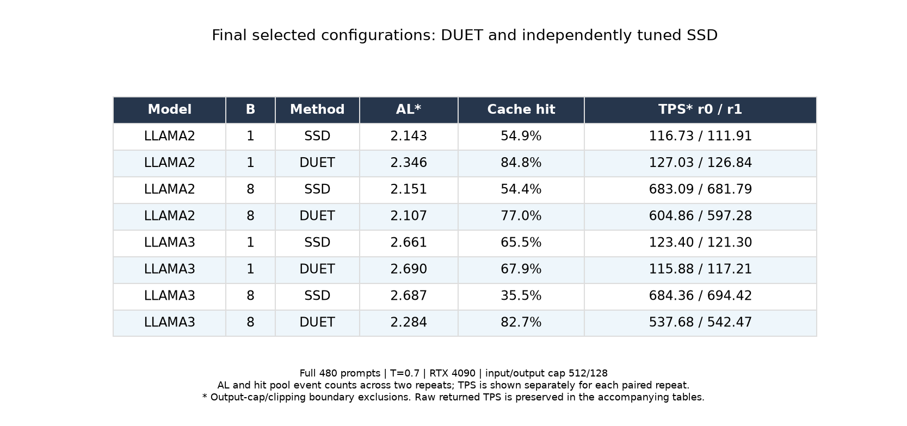

# Round5 — 논문 형식의 성능 표와 전체 breakdown

성능 지표와 파라미터를 분리하고, 기존 논문의 status별 평균 breakdown 및 target/draft 정렬 timeline 표시 방법을 적용했다. 이 문서는 기존 완료 실험을 재분석한 것이다. 새 GPU 실험은 실행하지 않았다.

- [검색 가능한 전체 실험·그래프 index](index.html)
- [파라미터 표](PARAMETERS.md) · [전체 설정 CSV](ALL_PARAMETERS.csv)
- [전체 487개 실험 CSV](ALL_EXPERIMENTS.csv) · [691개 pass CSV](ALL_PASSES.csv) · [full480 실험 70개 CSV](FULL480.csv)
- [최종 비교 breakdown 모음 PDF](FINAL_BREAKDOWNS.pdf) · [모든 실험 그림 PDF](ALL_BREAKDOWNS.pdf)
- [수치·페이지·링크 검증 기록](AUDIT.json)

## 지표 정의와 비교 범위

- **Batch:** 실행 설정의 최대 동시 요청 수. 종료 구간의 실제 batch는 더 작을 수 있다.
- **AL\*:** 수락 draft + recovery/bonus 토큰 수. 출력cap/clipping이 발생한 마지막 verification event 제외.
- **Cache hit:** 전체 verification event 중 hit 비율. 기존 보고서 counter와 같은 분모이며 AL* 제외 집합과 다르다. B>1 all-hit batch 비율과도 다르다.
- **TPS\*:** boundary 요청이 들어간 batch step의 시간과 토큰을 모두 제외. 실제 반환 토큰 TPS도 병기한다. TPS는 token/s이며 batch 전체 처리량이다.
- AL·hit은 반복별 event 수를 합쳐 계산. TPS는 GPU쌍/반복을 섞어 평균내지 않고 r0/r1 각각 표시. 두 값은 신뢰구간이 아니다.
- 최종 표는 비계측 full480 measured pass. Profile48의 시간/AL/TPS는 별도 진단 자료다.

## 최종 처리량 우선 설정

| 모델 | Batch | 방법 | AL* | Cache hit | TPS* (반복별) | 실제 반환 TPS (반복별) |
|---|---:|---|---:|---:|---|---|
| llama2 | 1 | [SSD](runs/llama2_b1_final_ssd_fast_r0.html) | 2.143 | 54.9% | 116.73 / 111.91 | 116.73 / 112.05 |
| llama2 | 1 | [DUET](runs/llama2_b1_postopt_final_r0.html) | 2.346 | 84.8% | 127.03 / 126.84 | 127.88 / 127.24 |
| llama2 | 8 | [SSD](runs/llama2_b8_final_ssd_fast_r0.html) | 2.151 | 54.4% | 683.09 / 681.79 | 687.46 / 686.37 |
| llama2 | 8 | [DUET](runs/llama2_b8_opt_fast_r0.html) | 2.107 | 77.0% | 604.86 / 597.28 | 606.62 / 599.95 |
| llama3 | 1 | [SSD](runs/llama3_b1_final_ssd_fast_r0.html) | 2.661 | 65.5% | 123.40 / 121.30 | 122.71 / 120.78 |
| llama3 | 1 | [DUET](runs/llama3_b1_stream_fast_r0.html) | 2.690 | 67.9% | 115.88 / 117.21 | 115.30 / 116.48 |
| llama3 | 8 | [SSD](runs/llama3_b8_final_ssd_fast_r0.html) | 2.687 | 35.5% | 684.36 / 694.42 | 682.66 / 692.40 |
| llama3 | 8 | [DUET](runs/llama3_b8_stability_final_r0.html) | 2.284 | 82.7% | 537.68 / 542.47 | 539.27 / 541.64 |



각 DUET/SSD 쌍은 같은 GPU에서 비교했다. 두 반복의 GPU쌍은 달라질 수 있다. 48개로 설정을 선택했고 이번 선택에서 제외한432개 분석은 기존 REPORT에 있다. 기존 보유480 first-turn 입력이며 원 SpecBench 전체나 70B/B6000 논문 환경 재현이 아니다.

## AL 우선 설정 — 최초 동결점

| 모델 | Batch | 방법 | AL* | Cache hit | TPS* (반복별) | 실제 반환 TPS (반복별) |
|---|---:|---|---:|---:|---|---|
| llama2 | 1 | [SSD](runs/llama2_b1_final_ssd_al_r0.html) | 2.259 | 47.4% | 115.63 / 115.44 | 115.90 / 115.70 |
| llama2 | 1 | [DUET](runs/llama2_b1_final_duet_fast_r0.html) | 2.365 | 85.4% | 125.79 / 125.62 | 126.38 / 126.36 |
| llama2 | 8 | [SSD](runs/llama2_b8_final_ssd_al_r0.html) | 2.310 | 46.6% | 619.52 / 628.50 | 627.83 / 636.56 |
| llama2 | 8 | [DUET](runs/llama2_b8_final_duet_al_r0.html) | 2.319 | 82.0% | 469.30 / 483.18 | 472.21 / 485.35 |
| llama3 | 1 | [SSD](runs/llama3_b1_final_ssd_al_r0.html) | 3.011 | 28.3% | 95.42 / 94.86 | 95.45 / 94.58 |
| llama3 | 1 | [DUET](runs/llama3_b1_final_duet_al_r0.html) | 2.977 | 67.8% | 93.97 / 91.36 | 93.58 / 90.97 |
| llama3 | 8 | [SSD](runs/llama3_b8_final_ssd_al_r0.html) | 3.064 | 47.7% | 402.35 / 392.32 | 402.40 / 393.12 |
| llama3 | 8 | [DUET](runs/llama3_b8_final_duet_al_r0.html) | 2.900 | 85.8% | 334.87 / 334.21 | 332.50 / 335.67 |

## B2/B4 및 긴 입력·출력 — 설정 이전 실험

| 모델 | Batch | 방법 | AL* | Cache hit | TPS* (반복별) | 실제 반환 TPS (반복별) |
|---|---:|---|---:|---:|---|---|
| llama2 | 2 | [SSD](runs/llama2_b2_scale_ssd.html) | 2.153 | 55.0% | 213.61 | 213.88 |
| llama2 | 2 | [DUET](runs/llama2_b2_scale_duet.html) | 2.149 | 77.5% | 216.08 | 215.98 |
| llama2 | 4 | [SSD](runs/llama2_b4_scale_ssd.html) | 2.123 | 54.4% | 383.27 | 384.27 |
| llama2 | 4 | [DUET](runs/llama2_b4_scale_duet.html) | 2.108 | 76.6% | 365.46 | 365.79 |
| llama2 | 8 | [SSD](runs/llama2_b8_long_ssd.html) | 2.408 | 60.8% | 735.69 | 736.20 |
| llama2 | 8 | [DUET](runs/llama2_b8_long_duet.html) | 2.359 | 80.1% | 647.41 | 647.55 |
| llama3 | 2 | [SSD](runs/llama3_b2_scale_ssd.html) | 2.675 | 35.1% | 200.53 | 199.79 |
| llama3 | 2 | [DUET](runs/llama3_b2_scale_duet.html) | 2.389 | 81.8% | 188.69 | 187.70 |
| llama3 | 4 | [SSD](runs/llama3_b4_scale_ssd.html) | 2.696 | 36.2% | 368.00 | 366.44 |
| llama3 | 4 | [DUET](runs/llama3_b4_scale_duet.html) | 2.411 | 81.8% | 312.43 | 311.12 |
| llama3 | 8 | [SSD](runs/llama3_b8_long_ssd.html) | 2.921 | 42.6% | 745.26 | 741.49 |
| llama3 | 8 | [DUET](runs/llama3_b8_long_duet.html) | 2.581 | 84.8% | 518.81 | 520.54 |

batch_transfer는 입력512/출력128, long_transfer는 입력1024/출력256이다. 각 조건 1회 measured pass이며 최종 B8 재선택 이전의 설정을 이전했다.

## 최종 설정의 세부 breakdown

성능 측정(full480)과 세부 trace(tuning48)는 별도 실행이다. 아래 연결은 모델·B·T·알고리즘/노드/구현 옵션을 맞춘 진단이다. 입력 집합·출력cap·seed가 같다는 뜻이 아니며, 해당 값을 각 그림에 표시했다.

| 목적 | 모델 | B | 방법 | 원본 trace와 그림 |
|---|---|---:|---|---|
| Final TPS-priority | llama2 | 1 | SSD | [llama2_b1_ssd_refine_k4_f7](runs/llama2_b1_ssd_refine_k4_f7.html) · [PNG](figs/llama2_b1_ssd_refine_k4_f7.png) · [PDF](figs/llama2_b1_ssd_refine_k4_f7.pdf) |
| Final TPS-priority | llama2 | 1 | DUET | [llama2_b1_postopt_profile_k1_down](runs/llama2_b1_postopt_profile_k1_down.html) · [PNG](figs/llama2_b1_postopt_profile_k1_down.png) · [PDF](figs/llama2_b1_postopt_profile_k1_down.pdf) |
| Final TPS-priority | llama2 | 8 | SSD | [llama2_b8_ssd_refine_k4_f7](runs/llama2_b8_ssd_refine_k4_f7.html) · [PNG](figs/llama2_b8_ssd_refine_k4_f7.png) · [PDF](figs/llama2_b8_ssd_refine_k4_f7.pdf) |
| Final TPS-priority | llama2 | 8 | DUET | [llama2_b8_opt_l0_profile_trim1](runs/llama2_b8_opt_l0_profile_trim1.html) · [PNG](figs/llama2_b8_opt_l0_profile_trim1.png) · [PDF](figs/llama2_b8_opt_l0_profile_trim1.pdf) |
| Final TPS-priority | llama3 | 1 | SSD | [llama3_b1_ssd_refine_k4_f7](runs/llama3_b1_ssd_refine_k4_f7.html) · [PNG](figs/llama3_b1_ssd_refine_k4_f7.png) · [PDF](figs/llama3_b1_ssd_refine_k4_f7.pdf) |
| Final TPS-priority | llama3 | 1 | DUET | [llama3_b1_stream_l0_profile_s1](runs/llama3_b1_stream_l0_profile_s1.html) · [PNG](figs/llama3_b1_stream_l0_profile_s1.png) · [PDF](figs/llama3_b1_stream_l0_profile_s1.pdf) |
| Final TPS-priority | llama3 | 8 | SSD | [llama3_b8_ssd_k4_f1](runs/llama3_b8_ssd_k4_f1.html) · [PNG](figs/llama3_b8_ssd_k4_f1.png) · [PDF](figs/llama3_b8_ssd_k4_f1.pdf) |
| Final TPS-priority | llama3 | 8 | DUET | [llama3_b8_stability_profile_4](runs/llama3_b8_stability_profile_4.html) · [PNG](figs/llama3_b8_stability_profile_4.png) · [PDF](figs/llama3_b8_stability_profile_4.pdf) |
| AL-priority (original frozen) | llama2 | 1 | SSD | [llama2_b1_ssd_k6_f5](runs/llama2_b1_ssd_k6_f5.html) · [PNG](figs/llama2_b1_ssd_k6_f5.png) · [PDF](figs/llama2_b1_ssd_k6_f5.pdf) |
| AL-priority (original frozen) | llama2 | 1 | DUET | [llama2_b1_refine_e21_k12_2_r2](runs/llama2_b1_refine_e21_k12_2_r2.html) · [PNG](figs/llama2_b1_refine_e21_k12_2_r2.png) · [PDF](figs/llama2_b1_refine_e21_k12_2_r2.pdf) |
| AL-priority (original frozen) | llama2 | 8 | SSD | [llama2_b8_ssd_k8_f5](runs/llama2_b8_ssd_k8_f5.html) · [PNG](figs/llama2_b8_ssd_k8_f5.png) · [PDF](figs/llama2_b8_ssd_k8_f5.pdf) |
| AL-priority (original frozen) | llama2 | 8 | DUET | [llama2_b8_tree_al_compute3](runs/llama2_b8_tree_al_compute3.html) · [PNG](figs/llama2_b8_tree_al_compute3.png) · [PDF](figs/llama2_b8_tree_al_compute3.pdf) |
| AL-priority (original frozen) | llama3 | 1 | SSD | [llama3_b1_ssd_k8_f1](runs/llama3_b1_ssd_k8_f1.html) · [PNG](figs/llama3_b1_ssd_k8_f1.png) · [PDF](figs/llama3_b1_ssd_k8_f1.pdf) |
| AL-priority (original frozen) | llama3 | 1 | DUET | [llama3_b1_refine_e16_k6_4_r2](runs/llama3_b1_refine_e16_k6_4_r2.html) · [PNG](figs/llama3_b1_refine_e16_k6_4_r2.png) · [PDF](figs/llama3_b1_refine_e16_k6_4_r2.pdf) |
| AL-priority (original frozen) | llama3 | 8 | SSD | [llama3_b8_ssd_k8_f3](runs/llama3_b8_ssd_k8_f3.html) · [PNG](figs/llama3_b8_ssd_k8_f3.png) · [PDF](figs/llama3_b8_ssd_k8_f3.pdf) |
| AL-priority (original frozen) | llama3 | 8 | DUET | [llama3_b8_combo_al_k2_3](runs/llama3_b8_combo_al_k2_3.html) · [PNG](figs/llama3_b8_combo_al_k2_3.png) · [PDF](figs/llama3_b8_combo_al_k2_3.pdf) |

## 그림을 읽는 방법

- 세부 trace337개: 위쪽은 status별 target/draft stage 평균(ms), 아래 왼쪽은 논문 색상의 평균 정렬 schematic(%), 오른쪽은 실제 기록된 대표 step(ms).
- 대표 step은 각 상태에서 target request→ready 시간이 중앙값에 가장 가까운 관측값이다. Target/draft는 같은 step ID로 연결하며, 현재 wait와 겹치는 직전 P2/cache-build 구간도 오른쪽에 표시한다.
- 정규화 schematic은 **동일 status 모집단**의 평균 시작/끝 offset을 평균 target window로 나눈 값이다. 서로 다른 component median을 이어붙이지 않는다. 평균 그림은 실제 단일 step이 아니다. 모든 sample에 있는 구간만 평균 timeline에 표시하며, 일부 sample에만 있는 구간도 위쪽 막대에서는 없는 sample을 0으로 포함해 집계한다.
- 기존 그림의 공통 hit/miss target 비용 가정과 고정 퍼센트는 재사용하지 않았다. 이번에는 verification 폭이 다를 수 있으므로 실제 상태별 비용과 shape를 보존한다.
- Wait/sync에는 통신 및 노출된 draft 대기가 포함된다. 측정 없이 순수 sync와 miss stall을 분리하지 않았다. 작은 빈 구간은 unlabelled gap이며 CPU 연산이라고 단정하지 않는다.
- P1/P2 total과 replay child를 중복 합산하지 않는다. Proxy side stream은 별도 행으로 표시하고 target 직렬 막대에 더하지 않는다. `batch_proxy_receive`의 긴 대기 구간을 proxy 연산 시간으로 해석하지 않는다.
- B1은 P1 hit/P2 hit/miss. B>1은 P1-only hit, P2-only hit, mixed hits, mixed hit/miss, all miss를 구분한다. B>1의 hit 표시는 batch 내 전 요청이 그 상태인 경우다.
- 진단 그림은 초기19개 step, 알려진 capture와 직후 step, 불완전 batch, 출력경계 batch, 불완전 trace를 제외한다. 제외 수와 각 상태 n을 저장한다. 초기 trace에 없던 capture label은 사후 복원하지 못한다.
- 비계측150개: phase별 GPU 시간을 복원할 수 없어 실제 wall time을 cache 상태별로 분해하고 source별 AL·전체 pass TPS를 그렸다. 느린 step은 임의로 제거하지 않았다.
- 모든 487개 실험에 그림이 있고 691개 pass는 전부 표에 남겼다. 실험 그림은 마지막 pass 기준이며 비계측 그림의 오른쪽 아래에는 모든 pass를 표시한다. 실패4개는 별도 목록에 보존한다.
- 알려진 오염 timing 1개는 EXCLUDED로 표시한다. 이는 유효한 속도 비교에 쓰지 않는다.

## 원본 표시 방법과 재현

- 논문 schematic: `ssd/tools/duet_timeline/plot_paper_fig4_schematic_pct.py` (색상 직접 import).
- Status 평균: `ssd/experiments/paper_baselines/new_exp/mesa_k1_7_k2_5_dfo2_pfo1_exit56_profile1_seed42_20260521/plot_breakdown_by_status.py`.
- 실제 정렬 원칙: `ssd/bench/plot_duet_aligned_timeline.py`.

그림 도구 의존성: numpy, matplotlib, pypdf (이번 PDF 병합은 pypdf 6.19.0 사용).

```bash
python results/mlsys_coverage/round5/archive_results.py --restore
python results/mlsys_coverage/round5/make_paper_view.py --rebuild-data
```

`python results/mlsys_coverage/round5/audit_paper_view.py`로 coverage·TPS 재집계·구간 합·PDF 페이지·링크를 검사한다.

모든 분석·그림 생성은 CPU만 사용한다. 표의 원본 path, source SHA, step IDs, component 평균은 DATA.json과 BREAKDOWN_COMPONENTS.csv에 있다.
