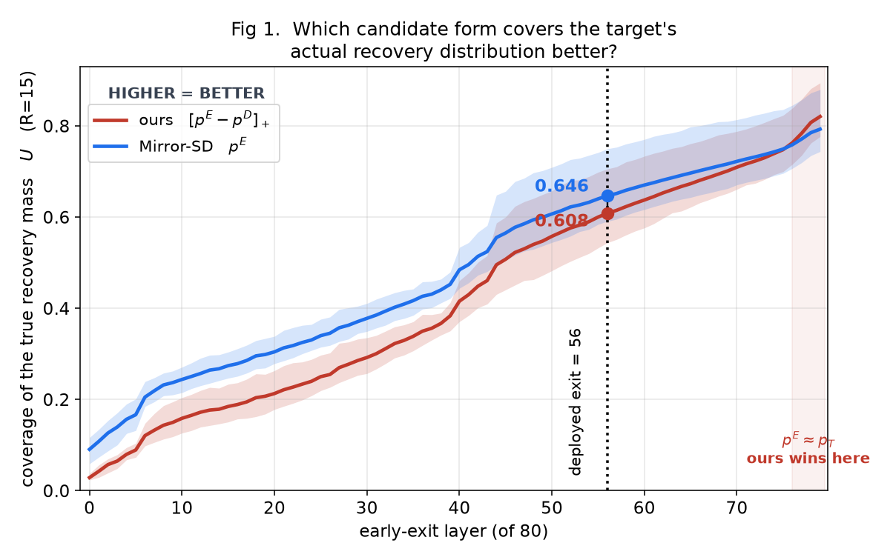
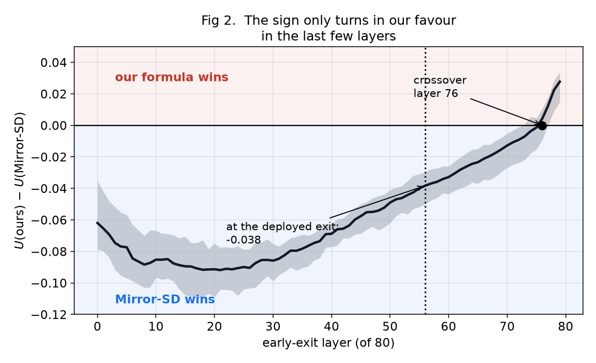
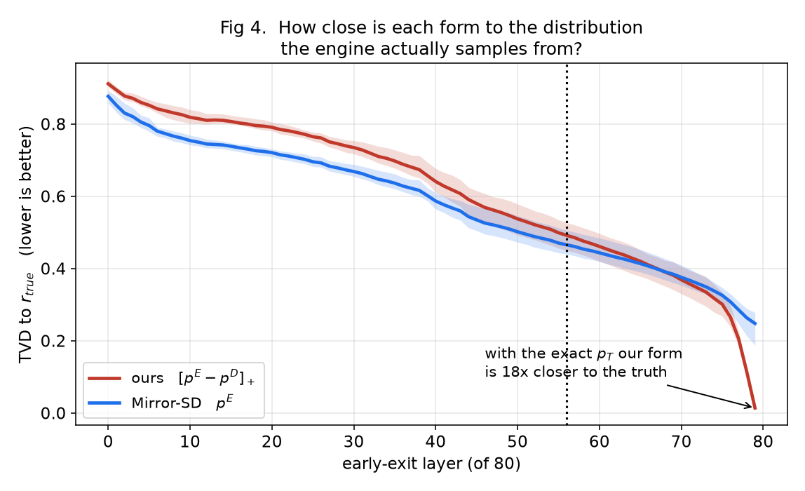
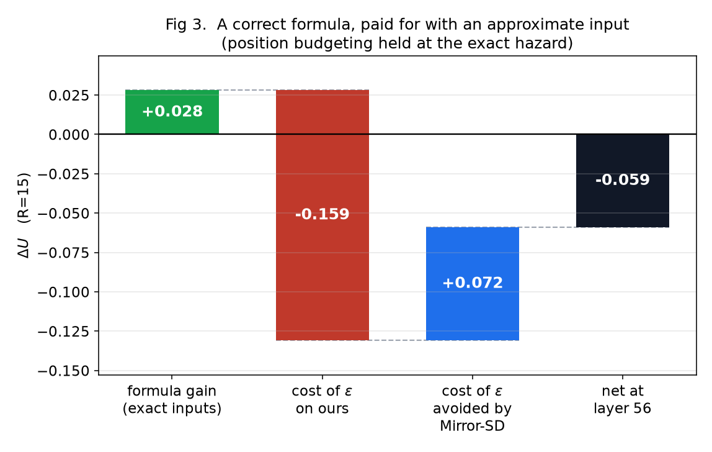
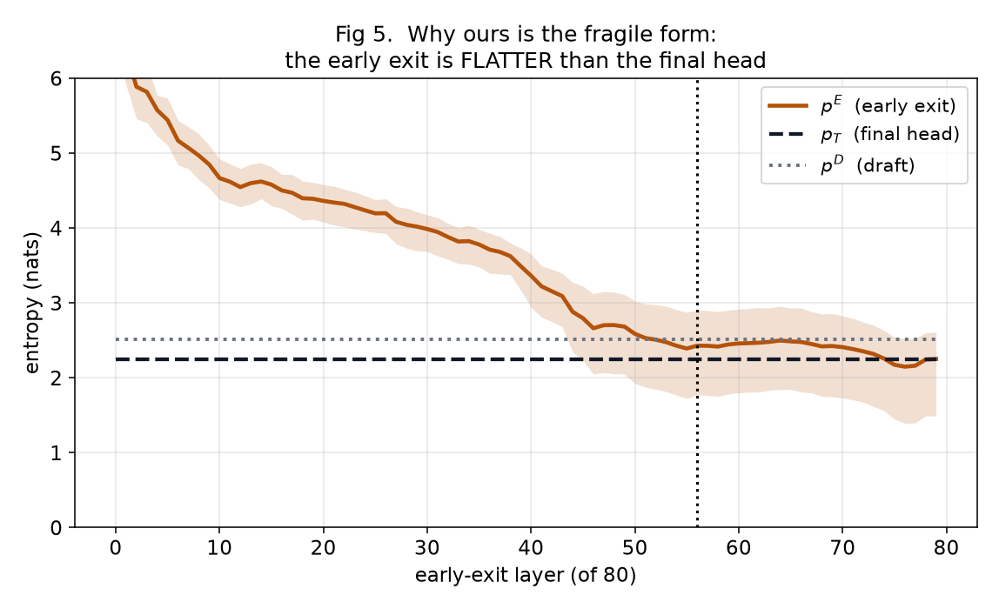
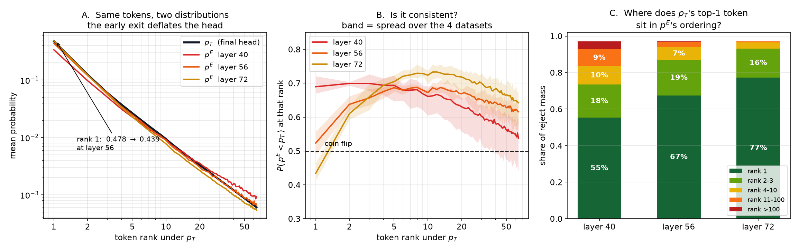
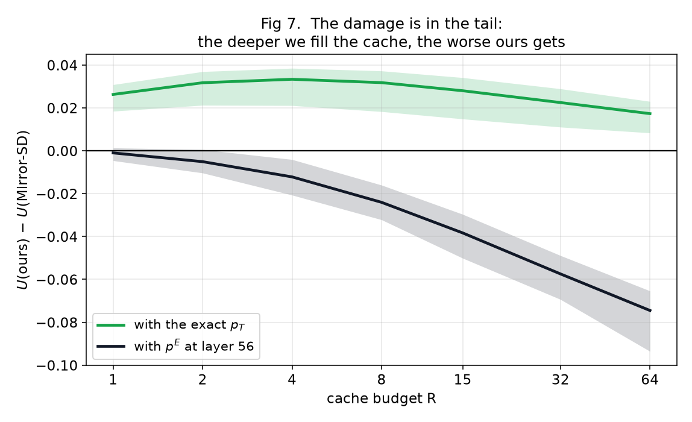
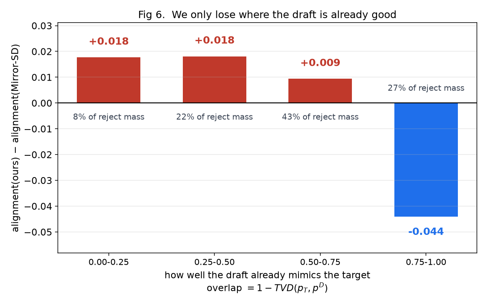
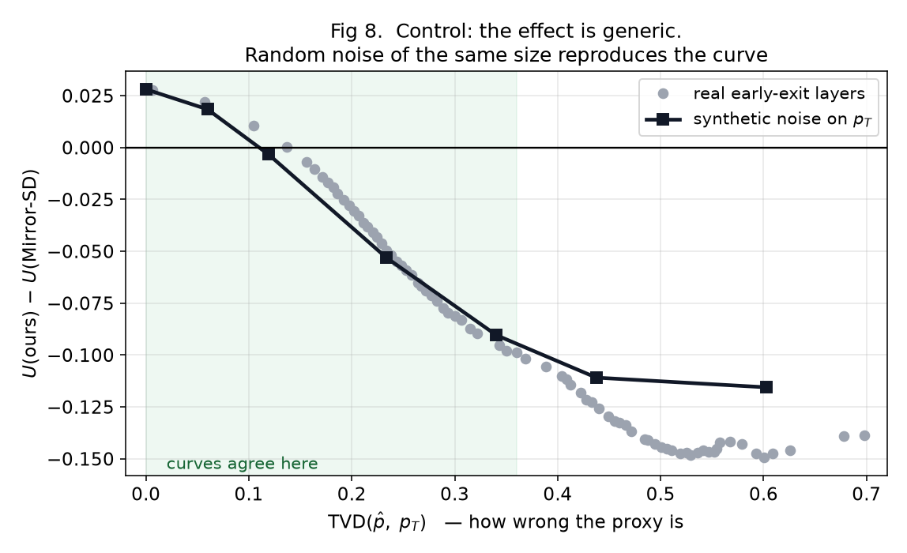
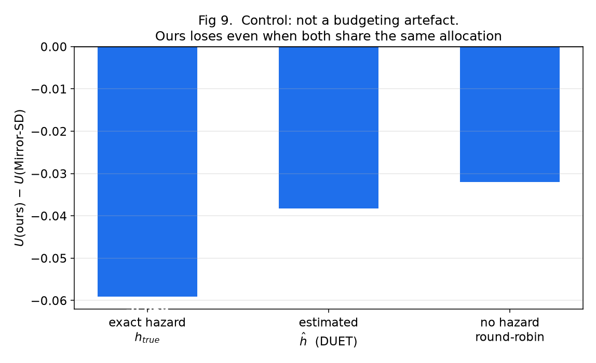

# P2 후보 수식 분석 — `[p^E − p^D]₊` vs Mirror-SD식 `p^E`

**작성일** 2026-09-09 · **브랜치** `feat/duet-proxy-source-ablation` (미커밋)
**규모** 4 데이터셋 × 3 seed = 12런, 총 **34,150 step**
**재생성** `python make_numbers.py > NUMBERS.txt` · `python make_figs.py`
**이어서 작업하려면** → [HANDOVER.md](HANDOVER.md) (브랜치 상태, 환경 함정, 다음 과제)

**2026-09-10 추가 측정:** [위치별 엔트로피 차이 분포](entropy/REPORT.md).
12런·34,702 step을 새로 측정했다. Layer 56에서 draft 위치 동일 가중 평균 차이는
+0.1589 nats, 절대차 중앙값은 0.3042 nats이며 증가·감소가 모두 나타난다.
아래 본문의 엔트로피 수치는 기존 probe의 step 내 기각 가중 평균이다.
위치별 분포, 다른 가중 방식, 최종 head 수치 오차 통제는 추가 보고서를 기준으로 본다.

**공유 분석의 수식·실험 재검토:** [shared_review/REPORT.md](shared_review/REPORT.md).
아래의 `Mirror-SD` 표기는 DUET 안에서 pE 단독 점수를 사용하는 ablation이며 전체
Mirror-SD 시스템 비교가 아니다. 평탄화라는 단일 원인으로 단정할 수 없으며,
후속 검토는 support 누락, 순위, 확률값의 모양, 위치 h와 보정 목적을 분리한다.

---

## 요약

DUET의 P2 후보 점수 `P_iv = h_i · r_i(v)`는 **수식으로서 옳습니다.** 참값을 넣으면
이 목적함수의 Bayes 최적이고 참값 `p_T` 단독 랭킹보다 **+0.028** 낫습니다
(12런 전부 양수). 그러나 `p^E`로 계산하는 순간 부호가 뒤집혀 배포 조건에서
**−0.038**이 됩니다.

평탄화는 가능한 오류 기전 중 하나입니다. 그러나 위치별 entropy는 증가·감소가 모두
나타나며, 평균 entropy만으로 support/순위 오류나 최적 보정 방향을 결정할 수 없습니다.
아래의 “27% 구간”은 별도의 step 내 reject 가중 **분포 내적** 진단에서 얻은 비중입니다.
전체 top-R coverage 손실의 27%/73% 원인 분해나 단순 context 개수 비율이 아닙니다.

---

## 1. 무엇을 측정했는가

엔진은 위치 `i`에서 기각이 발생하면 recovery 토큰을 다음 분포에서 뽑습니다
(`ssd/ssd/utils/verify.py:174`, `adj = (p_fallback - q_slice).clamp(min=0)`).

```
r_true[i] = normalize( [p_T[i] − p^D[i]]₊ )     i < K,  draft 토큰 y_i 는 자동 0
r_true[K] = p_T[K]                              전부 수락된 경우의 bonus 위치
```

cache에 `R`개의 `(위치, 토큰)` 쌍 `C`를 넣었을 때 **적중 확률의 기댓값**은

```
U(C) = Σ_{(i,v) ∈ C}  h_true[i] · r_true[i][v]
```

`h_true`(참 hazard)와 `r_true`는 target 최종 logits와 draft logits만으로 계산한
참값입니다. **고정된 step의 recovery token을 다시 추출하는 샘플링 잡음은 없습니다.**
생성 prefix와 draft 경로 자체의 변동은 남으므로, 전체 실험 평균의 불확실성은 별도로 봐야 합니다.

`U`는 격자 위의 단순 top-R 선택이므로 최적해는 `top-R of (h_true · r_true)` 이고,
이는 **`P_iv = h_i·r_i(v)`에 참값을 넣은 것과 동일**합니다. 즉 우리 수식은
이 목적함수의 최적해이며, 어떤 정책도 이를 넘을 수 없습니다(측정 불변식으로 사용).

> **`U`는 왜 1.0이 아닌가.** 전체 질량은
> `Σ_i h_true[i] · Σ_v r_true[i][v] = 1` 이지만, `r_true[i]` 는 32,000개 토큰에
> 걸친 분포이고 이 only-proxy 구성의 실제 verify 위치는 `K+1 = 5` 개입니다.
> Config의 K1=8을 실제 verify K로 해석하면 안 됩니다. 즉 **5 × 32,000 격자에서 15칸만
> 고르는 것**이라 나머지 질량은 꼬리에 남습니다. **분포를 완벽히 알아도 target 의
> 추출은 무작위**이므로, `U` 는 "그 추출이 캐싱한 15개 안에 떨어질 확률"입니다.
> 예산을 늘리면 실제로 1에 수렴합니다.
>
> | R | 1 | 2 | 4 | 8 | 15 | 32 | 64 |
> |---|---|---|---|---|---|---|---|
> | 상한 | 0.441 | 0.565 | 0.671 | 0.758 | **0.821** | 0.879 | 0.919 |
>
> 따라서 `U(참값) = 0.8208` 대 `상한 = 0.8210` 은 **우리 수식이 이 예산에서
> 가능한 최선을 달성했다**는 뜻입니다(차이 0.0002 는 위치별 top-64 절단 후
> 정규화의 미세 차이). 같은 예산에서 Mirror-SD 는 0.7928 에 그칩니다.

**측정 방식**: 실제 DUET 런 안에서 매 step마다 여러 정책을 **동시에** 채점합니다.
정책들이 같은 step을 보므로 궤적 분기와 엔진 비결정성이 비교에서 상쇄됩니다(paired).
`p^E`는 target forward가 어차피 지나가는 **80개 레이어 전부**에서 tap합니다.

**조건**: 70B AWQ(calibrated) + TinyLlama-1.1B, chain, only-proxy(K1=0),
exit 56, K1=8/K2=4, p2_budget 15, temp 1.0, B=1,
humaneval/alpaca/c4/gsm 각 32 프롬프트 × 256 토큰.

---

## 2. 결과 1 — 어느 쪽이 더 잘 맞추는가



두 형태의 절대 성능입니다. **이 그림은 위에 있는 선이 더 좋은 것**이고,
배포 지점인 56층(점선)에서 **파란 선(Mirror-SD)이 위에 있습니다.**

| exit 56, R=15 | 우리 수식 | Mirror-SD | 상한 |
|---|---|---|---|
| 전체 평균 | **0.6081** | **0.6464** | 0.8210 |

> **⚠️ 읽을 때 주의 — 구간을 먼저 보십시오.**
> 빨간 선(우리)이 파란 선을 넘는 곳은 오른쪽 끝 **76~79층뿐**입니다. 그 구간은
> `p^E ≈ p_T` 가 되어 근사 오차가 사라진 지점이고, §3에서 "수식 자체는 옳다"고
> 하는 것이 바로 거기입니다. 두 서술은 모순이 아니라 **구간이 다릅니다.**
>
> | 구간 | 위에 있는 선 | 의미 |
> |---|---|---|
> | 0 ~ 75층 | 파랑 (Mirror-SD) | **실제로 쓸 수 있는 모든 exit layer** |
> | 76 ~ 79층 | 빨강 (우리) | 오차가 사라진 구간, 실행 불가 |
>
> 또한 **그림마다 좋은 방향이 다릅니다.** Fig 1·2·7은 **높을수록** 좋고,
> Fig 4(분포 거리)는 **낮을수록** 좋습니다.



같은 데이터를 차이로 본 것입니다. **곡선 전체가 음수 영역에 있다가 76층에서야
0을 넘습니다.**

| 데이터셋 | 격차 (exit 56) | 교차 레이어 |
|---|---|---|
| alpaca | −0.0342 | 75 |
| c4 | −0.0407 | 75 |
| gsm | −0.0341 | 74 |
| humaneval | −0.0442 | 77 |

**12런 전부 음수**이고 산포도 작습니다(±0.003~0.010). 데이터셋과 seed를 바꿔도
부호가 뒤집히지 않습니다.

> **해석**: 교차점이 74~77층(93~96% 지점)이라는 것이 실무적으로 결정적입니다.
> 그 지점에서 exit하면 proxy가 거의 최종 시점에 도착해 P2가 할 일이 없습니다.
> **시간 이득이 있는 어떤 exit layer에서도 현재 형태로는 `p^E` 단독보다 못합니다.**

---

## 3. 결과 2 — 그런데 수식 자체는 옳다



두 형태가 **엔진이 실제로 샘플링하는 분포 `r_true`에 얼마나 가까운지**를 잰
것입니다. **이 그림은 낮을수록 좋습니다**(Fig 1과 방향이 반대).

이 절은 **오차가 없을 때** 어느 수식이 옳은지를 다룹니다 — §2가 다룬 배포 조건
(56층)과는 다른 질문입니다.

최종층(79, 오차 없음)에서:

```
우리 수식     TVD = 0.0134     ← 사실상 정확
Mirror-SD     TVD = 0.2475     ← 18배 멀다
```

**`p_T`를 알고 있다면 우리 수식이 압도적으로 옳습니다.** "draft 질량이 큰 토큰을
제외하면 더 잘 맞는다"는 직관이 데이터로 확인됩니다.

그런데 왼쪽으로 갈수록(얕은 레이어) 빨간 선이 파란 선 위로 올라갑니다. 56층에서
`TVD(우리) − TVD(Mirror-SD) = +0.026`, 즉 **우리 형태가 더 나쁜 근사**가 됩니다.

커버리지로 봐도 같습니다. 참값에서의 이득:

| 데이터셋 | seed 7 | 42 | 123 | 평균 |
|---|---|---|---|---|
| alpaca | +0.0330 | +0.0301 | +0.0331 | **+0.0321** |
| c4 | +0.0341 | +0.0335 | +0.0317 | **+0.0331** |
| gsm | +0.0322 | +0.0321 | +0.0301 | **+0.0314** |
| humaneval | +0.0163 | +0.0148 | +0.0149 | **+0.0154** |

**12/12 양수, 산포 ±0.0015 이하.**

---

## 4. 결과 3 — 부호가 뒤집히는 이유



`h`를 참값으로 고정해 `r`만의 효과를 분리한 분해입니다.

```
수식의 이득          +0.028      (참값에서 우리가 낫다)
우리 형태의 ε 비용   −0.159      (근사 오차로 잃는 양)
Mirror-SD의 ε 비용   +0.072      (저쪽은 덜 잃는다)
─────────────────────────────
순 결과              −0.059      항등식 잔차 0.00e+00
```

**같은 오차인데 우리 형태가 2.2배 더 손해를 봅니다.** 수식의 이득(+0.028)이
그 차이(0.087)에 완전히 삼켜집니다.

> 위 표는 `h`를 참값으로 고정한 값입니다. §2의 배포 조건 격차(−0.038)는 `h`도
> 추정치(`ĥ`)를 쓴 것으로, `ĥ`가 부정확해 예산이 덜 집중되는 만큼 격차가 오히려
> 작아집니다.

---

## 5. 왜 우리 형태가 오차에 취약한가



핵심 관찰입니다. **early exit은 최종 분포보다 훨씬 평평합니다.**

```
layer 56:  H(p^E) − H(p_T) = +0.178
layer 32:  H(p^E) ≈ 3.6   vs  H(p_T) ≈ 1.4
```

그리고 `p^E`는 draft 쪽으로 끌리지 **않습니다** —
`TVD(p^E,p^D) − TVD(p_T,p^D) = +0.039 > 0`. 즉 early exit은 "draft를 닮은 분포"가
아니라 **아직 확신을 못 굳혀 꼬리에 질량을 흩뿌린 분포**입니다.

이 성질이 뺄셈과 결합하면:

```
머리 토큰:  p_T=0.30, p^D=0.25, p^E=0.25  (평평해서 머리가 낮음)
            참 residual 0.05  →  추정 residual 0.00      사라짐

꼬리 토큰:  p_T=0.001, p^D=0.0001, p^E=0.01 (평평해서 꼬리가 높음)
            참 residual 0.0009 →  추정 residual 0.0099   승격
```

`p^D`는 `p_T`의 **머리와 상관**되어 있습니다. 따라서 빼면 머리만 깎이고, `p^E`가
꼬리에 잘못 얹은 질량은 그대로 남아 순위 위로 올라옵니다. Mirror-SD식은 `p^E`의
머리 순서를 그대로 쓰므로 이 함정을 피합니다.

### 5.1 `p^E` 는 `p_T` 와 정확히 어떻게 다른가



`p_T` 순위로 토큰을 줄 세우고 **같은 토큰에서** `p^E` 를 읽었습니다
(4 데이터셋, seed 42, `probe_rankprofile_20260910`).

**A. 머리를 깎습니다.**

| `p_T` 순위 | `p_T` | `p^E`@40 | `p^E`@56 | `p^E`@72 |
|---|---|---|---|---|
| 1 | 0.4837 | 0.3327 | 0.4363 | 0.4826 |
| 5 | 0.0262 | 0.0227 | 0.0253 | 0.0234 |
| 20 | 0.0032 | **0.0037** | 0.0030 | 0.0026 |
| 64 | 0.0006 | **0.0009** | 0.0006 | 0.0005 |

40층에서는 머리가 크게 깎이고 꼬리가 **올라갑니다**(굵게) — 전형적인 평탄화입니다.
56층에서는 머리만 8% 깎이고 꼬리는 비슷한데, 깎인 질량이 **64위 밖 깊은 꼬리로
흩어졌다**는 뜻입니다(엔트로피 +0.178 과 일치).

**B. 일관성은 축에 따라 다릅니다.**

| 축 | 일관성 |
|---|---|
| 데이터셋 간 | **일관적** — 밴드가 좁음 |
| 레이어 간 | **일관적** — 깊어질수록 단조 완화 |
| 위치 간, **1위 토큰** | **비일관적** — L56 에서 `P(p^E<p_T)=0.526`, 동전 던지기 |
| 위치 간, 5~50위 | **일관적** — 0.66~0.68 로 꾸준히 깎임 |

1위 토큰의 평균 확률이 깎이는 것은 **모든 위치에서 조금씩이 아니라 일부 위치에서
크게** 깎이기 때문입니다.

**C. 순서 보존 — 여기가 실질적 문제입니다.**

| layer | 1위 | 2-3위 | 4-10위 | 11-100위 | >100위 |
|---|---|---|---|---|---|
| 40 | 55.3% | 18.1% | 10.0% | 9.2% | 4.5% |
| 56 | **67.4%** | 19.5% | 6.9% | 3.0% | 0.4% |
| 72 | 77.3% | 15.8% | 3.3% | 0.7% | 0.0% |

**56층에서 `p_T` 의 1위 토큰이 `p^E` 에서도 1위인 경우는 67% 뿐입니다.**

> **이것이 뺄셈과 결합하는 방식.** Mirror-SD 식은 `p^E` 의 순서를 그대로 쓰므로
> 1위가 2위로 밀려도 top-15 안에는 남습니다. 우리 형태는 그 흔들리는 머리에서
> `p^D` 를 빼므로 `[p^E−p^D]₊` 가 0 이 되거나 엉뚱한 토큰이 튀어오릅니다.
> 즉 "평평하다"의 실체는 **머리 확률의 크기보다 머리 순서의 불안정성**이며,
> 그것이 뺄셈에 치명적입니다.

> ⚠️ **측정 바닥.** 79층에서 1위 일치율이 96.6% 로 100% 가 아닙니다. probe 는
> rank0 lm_head 복제본으로, `p_T` 는 TP gather 로 계산해 축약 순서가 달라 근소한
> tie 에서 argmax 가 갈립니다(`TVD=0.0064`). 의미 있는 차이가 아니며, V3 검증이
> 이 바닥에 영향받지 않음을 보여줍니다.



예측이 확인됩니다. **cache를 깊이 채울수록 격차가 벌어집니다** — R=1에서 −0.001,
R=64에서 −0.075. 머리에서는 멀쩡하고 꼬리에서 무너집니다.

참값에서는 오히려 R이 커질수록 이득이 *줄어들므로*(초록), 깊이 자체가 아니라
**깊이 × 오차의 상호작용**이 원인입니다.

---

## 6. 결과 4 — 언제 우리가 지는가



**배포 지점인 56층에서만** 계산한 분해입니다. 각 위치를
`overlap = 1 − TVD(p_T, p^D)`(draft가 target을 얼마나 잘 흉내내나)로 나눴습니다.

> **지표가 Fig 1~3과 다릅니다.** 여기서는 top-R 커버리지 `U` 가 아니라
> **정렬도** `Σ_v r_true(v)·r̂(v)` 를 씁니다. 예산 선택 과정 없이 분포 자체의
> 일치도를 보므로 위치별로 쪼개기에 적합합니다. 절대값이 Fig 1 과 다른 이유입니다.

**우리는 73% 구간에서 이기고, draft가 target을 잘 흉내내는 27% 구간에서만
집니다.** 다만 지는 폭(−0.044)이 이기는 폭(+0.009~+0.018)을 압도합니다.

질량으로 가중하면 합계가 나옵니다.

| overlap | 질량 | 우리 | Mirror-SD | 차이 | 질량가중 기여 |
|---|---|---|---|---|---|
| 0.00–0.25 | 8.2% | 0.3853 | 0.3676 | +0.0177 | **+0.00145** |
| 0.25–0.50 | 22.1% | 0.2750 | 0.2569 | +0.0181 | **+0.00400** |
| 0.50–0.75 | 42.5% | 0.2363 | 0.2269 | +0.0094 | **+0.00400** |
| 0.75–1.00 | 27.2% | 0.2506 | 0.2948 | −0.0441 | **−0.01200** |
| **합계** | 100% | | | | **−0.00256** |

이기는 세 구간의 기여 합(**+0.0094**)을 지는 한 구간(**−0.0120**)이 넘어섭니다.
즉 56층에서 지는 것은 "전반적으로 열등해서"가 아니라 **한 구간에서 크게 잃기
때문**입니다.

> **승패가 무작위가 아니라 체계적입니다.** `overlap` 이라는 관측 가능한 축으로
> 깔끔하게 갈립니다 — overlap 이 크면 `[p_T − p^D]₊` 가 **거의 같은 두 분포의
> 차**가 되어 값이 작아지는데 `p^E` 의 오차는 그대로이므로 상대오차가
> 폭발합니다. §11 의 "조건부 전환" 제안이 여기서 나옵니다.

메커니즘상 필연입니다. overlap이 크면 `[p_T − p^D]₊`가 **거의 같은 두 분포의 차**가
되어 값이 작아지는데 `p^E`의 오차는 줄지 않습니다. overlap이 작으면
residual ≈ `p_T`라 오차 영향이 작고 제외 효과만 순이득으로 남습니다.

> **이것이 가장 실행 가능한 발견입니다.** "수식을 버려라"가 아니라
> **"어디서 쓸지를 골라라"** 로 읽는 것이 타당합니다.

---

## 7. 통제 실험 — 다른 설명 배제

### 7.1 일반적 잡음인가, early exit 특유의 성질인가



`p_T`에 크기 `δ`의 **인공 lognormal 잡음**만 넣어 두 형태를 비교했습니다.
early exit의 구조적 특성을 완전히 배제한 조건입니다.

**TVD ≤ 0.36 구간(초록 영역)에서 실제 레이어들이 합성 곡선 위에 얹힙니다.**
교차 TVD도 인공 0.11 / 실제 0.135로 근접합니다. 즉 우리 형태의 취약성은
early exit 특유의 성질이 아니라 **뺄셈 연산 자체의 성질**입니다.

> ⚠️ **TVD > 0.4에서는 실제 곡선이 합성 곡선 아래로 벗어납니다**(실제가 더 나쁨).
> 얕은 레이어에서는 구조적 편향이 추가로 작용한다는 뜻이고, 이 부분은
> 설명되지 않았습니다. 배포 구간(TVD 0.24)은 일치 영역 안입니다.

### 7.2 위치 배분 때문인가



round-robin은 두 형태에 **동일한 위치 배분**을 강제합니다. 그래도 우리가 집니다
(−0.032). **원인은 위치 배분이 아니라 토큰 순위 자체입니다.**

배분이 정확할수록 격차가 커지는 것(unif −0.032 → `ĥ` −0.038 → `h_true` −0.059)은
**증폭**이지 원인이 아닙니다. 예산이 한 위치에 몰릴수록(유효 위치 수 **1.93** / 9)
그 위치 꼬리의 순위 판단 하나에 모든 예산이 걸리기 때문입니다.

### 7.3 후보 풀 절단 아티팩트인가

| `top_m` | alpaca | c4 | gsm | humaneval |
|---|---|---|---|---|
| 16 | −0.0344 | −0.0398 | −0.0335 | −0.0441 |
| 32 | −0.0342 | −0.0401 | −0.0340 | −0.0443 |
| 64 | −0.0342 | −0.0407 | −0.0341 | −0.0442 |

**완전히 평평합니다.** 절단 아티팩트가 아닙니다.

---

## 8. 부수 발견 — `ĥ`의 품질

| 지표 | layer 56 |
|---|---|
| `TVD(ĥ, h_true)` | **0.298** |
| 기각 위치 top-1 정확도 | **0.668** |
| `h` 가중의 이론적 가치 | **+0.101** |
| `h` 가중의 실현 가치 | **+0.034** |
| 유효 배분 위치 수 (9 중) | **1.93** |

`ĥ`는 uniform보다 낫지만 **가능한 것의 34%만 건집니다.** 기각 위치를 67%만
맞춥니다. `r`과 `h` 양쪽 모두에서 근사 오차가 주된 손실원입니다.

`α̂` 추정에는 증폭 단계가 셋 있습니다 — ① 나눗셈 `p^E(y)/p^D(y)`,
② 뺄셈 `1 − α̂`(α가 1에 가까울 때 상대오차 폭발), ③ 누적곱. 구조적으로
`h[K]`(all-accept)는 견고하고 `h[i<K]`(기각 위치)가 가장 불안정한데,
**두 형태가 갈리는 곳이 정확히 `i<K`** 입니다.

---

## 9. 측정 신뢰성

결과가 반직관적이므로 검증을 기록합니다. V1–V5는 **버그가 있으면 반드시 깨지는**
검사입니다.

| # | 검증 | 결과 |
|---|---|---|
| V1 | probe의 layer 56 hidden이 엔진 `exit_hidden`과 일치 | `max\|차이\| = 0.000e+00` (비트 단위) |
| V2 | 어떤 정책도 Bayes 최적 상한 초과 불가 | `ceiling − U(참값) = +0.0002`, 초과 없음 |
| V3 | ε→0 극한에서 실측이 이론 bias와 일치 | 실측 **+0.0277** vs 이론 **+0.0280** |
| V4 | 분해 항등식 `gap = bias − (ε_r − ε_p)` | 잔차 **0.00e+00** (12런 전부) |
| V5 | 최종층에서 우리 형태가 `r_true` 재현 | `TVD = 0.0134` |
| V6 | 레이어 0→79, 예산 1→64 단조성 | 전부 매끄럽게 단조 |
| V7 | `top_m` 통제 | §7.3 |
| V8 | 위치 배분 통제 | §7.2 |
| V9 | 인공 잡음 통제 | §7.1 |

---

## 10. 한계 — 결과를 인용하기 전에 반드시 읽을 것

1. **`only-proxy` 조건입니다.** P1을 끈 ablation 구성이며 champion이 아닙니다.
   P1이 켜지면 P2는 cache의 일부만 담당하므로(측정 당시 P2 hit 0.037 대
   P1 hit 0.726) 효과가 크게 희석됩니다. **champion 조건에서 재확인 필요.**
2. **hit이 속도로 옮겨간다는 보장이 없습니다.** 별도 엔진 실험에서 P2 hit이
   0.556~0.639로 갈렸는데 tokens/step은 2.87~2.88로 동일했습니다.
   `docs/duet/12-experiment-summary.md`의 첫 finding(*"cache-hit gains don't
   carry tokens"*)과 일치합니다. **이 개선이 TPS로 이어질지는 미검증.**
3. **draft가 TinyLlama-1.1B로 고정**입니다. 수식의 이득은 target–draft 격차에
   의존합니다. **더 강한 draft(overlap 상승)면 우리가 더 불리해집니다.**
   §6의 분해가 직접 예측하는 바이고, 다른 draft 조합에서 재확인이 필요합니다.
4. **TVD > 0.4 구간의 불일치**(§7.1)는 설명되지 않았습니다.
5. **c4는 95/100 프롬프트만 사용**했습니다. 나머지 5개는 2048 컨텍스트에
   256 토큰 생성 여유가 없어 제외했습니다(`~/ssd_datasets/README.txt`에 기록).
6. **각 데이터셋 100 프롬프트 풀**에서 32개를 뽑았습니다. `paths.py`가 요구하는
   `*_data_10000.jsonl`은 실제로 100행 파일에 대한 심볼릭 링크입니다.

---

## 11. 다음 단계

진단은 **"수식이 틀렸다"가 아니라 "부정확한 입력에 취약한 형태다"** 이고,
취약성의 임계값이 정량화되었습니다 — **`TVD(p̂, p_T) ≈ 0.12`**. 배포 지점은
0.239로 그 두 배입니다.

- **(a) 조건부 전환** — overlap이 큰 위치에서만 Mirror-SD식으로 전환.
  §6이 27% 구간을 특정했습니다. overlap은 `TVD(p^E, p^D)`로 런타임 추정
  가능하나, 그 추정 역시 `p^E` 오차를 겪으므로 별도 검증이 필요합니다.
- **(b) ε에 강건한 형태** — 뺄셈 대신 곱셈형(`p^E · (1−p^D)^λ` 등).
  probe 격자에 `r` 후보를 추가하면 같은 런에서 평가됩니다.
- **(c) `p^E` 개선** — 여러 레이어 결합이나 보정 헤드로 TVD를 0.12 아래로.

계획서의 "tree 구성 재설계"가 여기서 출발할 수 있습니다.

---

## 12. 산출물

```
HANDOVER.md        인수인계 — 브랜치/환경/다음 과제
REPORT.md          이 문서
NUMBERS.txt        인용된 모든 수치 — 데이터셋 × seed 원값까지
make_numbers.py    수치표 재생성
make_figs.py       그래프 재생성
figs/
  01_coverage.png            두 형태의 절대 커버리지
  02_gap.png                 격차와 교차점
  03_decomposition.png       bias / ε 비용 폭포
  04_approximation.png       r_true 까지의 거리
  05_entropy.png             p^E 가 평평하다는 증거
  06_where_we_lose.png       overlap 구간별 승패
  07_budget.png              예산 R 스윕
  08_noise_control.png       인공 잡음 통제
  09_allocation_control.png  위치 배분 통제
  10_pE_vs_pT_rank.png       p^E 가 p_T 와 어떻게 다른가 (순위 프로파일)
```

**원시 probe 출력**:
`ssd/experiments/proxy_source_ablation/probe_ds_seed_20260909/out/*.json` (12개, 본 분석)
`ssd/experiments/proxy_source_ablation/probe_rankprofile_20260910/out/*.json` (4개, §5.1)

**구현**: `ssd/ssd/engine/helpers/exit_probe.py`(측정),
`ssd/ssd/models/llama3.py`(레이어 tap), `ssd/ssd/engine/verifier.py`(훅),
`ssd/ssd/engine/helpers/cudagraph_helpers.py`(tap 자체 검증)

> **모델 경로 주의.** `--model_path`는 반드시 캘리브레이션 디렉터리
> (`/home/chokwans99/awq_calibrated/layerskip_llama2_70b`)여야 합니다. AWQ fold가
> 선행 RMSNorm을 `1/s`로 수정해 그곳에 저장하므로, 원본 모델을 가리키면 항등식이
> 깨져 **모든 지표를 통과하면서 유창해 보이는 쓰레기**가 생성됩니다.
