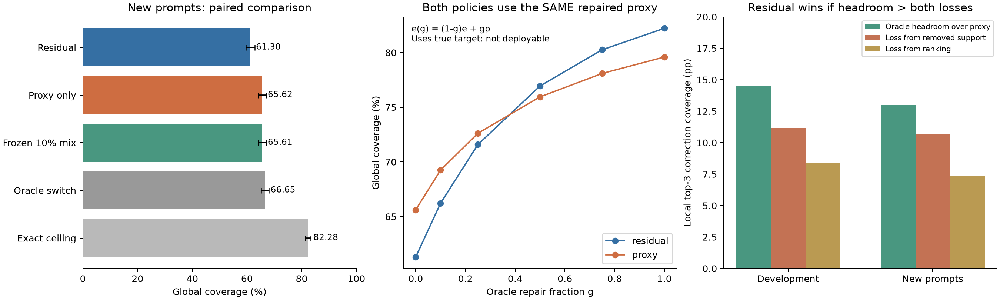

# Residual 대 only-proxy: 직접 비교, 실패 원인, 개선 조건

2026-09-12. **현재 exit=56 설정의 `[e-q]+`가 only-proxy보다 우수하다는 결론은
데이터가 지지하지 않는다.** 기존 데이터의 열세가 새로운 128개 프롬프트에서도
재현됐다. 반면 target에 가까운 proxy로 바꾸면 residual의 우위가 나타나는 것도
확인했다. 따라서 residual 목적함수는 타당하지만, 현재 proxy의 후보 삭제·순위 오류가
그 이익보다 크다는 것이 이번 분석의 결론이다.

전체 수학과 증명은 [THEORY.md](THEORY.md), 모든 정책의 수치는
[TABLES.md](TABLES.md), [policies.csv](policies.csv)에 있다.

**1. 무엇을 실제로 검증했는가**

Target은 AWQ 보정 LayerSkip Llama2-70B, draft는 TinyLlama-1.1B-Chat이다.
Exit=56, sampling T=1, B=1, 실제 chain K=4, 위치별 top-M=17, 총 root 예산=15를
사용했다. 데이터셋은 alpaca/c4/gsm/humaneval이다.

기존 128개 프롬프트×2 seed의 분포를 다시 분석했고, 기존 프롬프트와 중복되지 않는
**128개 새 프롬프트×seed 7**을 실제 모델로 추가 생성했다. 새 실행은
**11,616 verification step**, 저장한 **1,509 step / 7,545 context**이며,
이 중 correction 위치는 **6,036개**다. 각 context에서 전체 32,000 vocabulary의
p, q, e를 float32로 저장했다. 최종 모델 출력과 probe tap은 일치했다.

새 정책 선택에는 기존 128개 프롬프트 전체를 development로 사용했다. 과거의
held-out 부분도 여러 번 살펴봤기 때문에 이번 새 정책의 독립 검증 자료로 재사용하지
않았다. 고정 점수 25개와 두 종류의 선택기를 기존 데이터에서 비교하여 정책을
**2026-09-12 07:48:27 UTC에 고정한 뒤** 새 프롬프트의 후보 성능을 평가했다.
[frozen_policies.json](frozen_policies.json)에 선택 결과와 입력 hash를 보존했다.

새 프롬프트는 각 원본 파일의 33–64행이며, 텍스트 중복을 검사했다. 벤치마크의
`--prompt_offset`은 현재 로더에서 사용되지 않으므로 별도 데이터 디렉터리를 만들어
실제로 다른 입력을 읽게 했다. 출처·행 번호·hash는
[datasets.json](../../../ssd/experiments/proxy_source_ablation/probe_direct_20260912/datasets.json)에 있다.

실행의 `--duet_only_proxy`는 **DS 없이 PS만 사용하는 실행 모드**라는 뜻이다.
후보 점수를 e-only로 바꾼다는 의미와 구별해야 한다. 저장된 동일 경로에 대해
residual/e-only/개선 점수들을 각각 replay했다. 각 정책을 켠 전체 시스템의 TPS 실험은
이번 분석에 포함하지 않았다. GPU 3–7에서 새 실험을 완료했고 점유를 해제했다.

주 지표는 다음 verification 이후 필요한 correction/bonus root가 15개 후보에
들어갈 이론적 확률인 **coverage**다. 같은 prompt 안에서 step 평균, seed 평균을
계산한 뒤 prompt와 dataset을 같은 비중으로 평균했다. 95% CI는 dataset 안에서
prompt cluster를 4,000회 paired bootstrap한 결과다. 여러 step이나 두 seed를
서로 독립인 prompt로 취급하지 않았다. CI는 이 프롬프트 표본의 불확실성이고,
모든 모델·layer·seed·워크로드에 대한 보장은 아니다.

**2. 독립 검증에서 실제로 어느 쪽이 나았는가**

| 정책 | 기존 데이터 | 새 프롬프트 | 새 데이터에서 only-proxy 대비, %p (95% CI) |
|---|---:|---:|---:|
| 기존 residual `[e-q]+` | 60.057% | **61.297%** | **−4.321 [−5.164, −3.526]** |
| only-proxy `e` | 64.014% | **65.618%** | 기준 |
| 기존 데이터에서 선택한 10% residual 혼합 | 64.034% | 65.606% | −0.013 [−0.142, +0.105] |
| 단일 임계값 선택기 | 64.014% | 65.618% | 0.000 |
| Ridge 선택기 | 64.014% | 65.618% | 0.000 |
| 매 step 두 정책 중 좋은 것을 고르는 oracle | 65.239% | 66.647% | +1.029 [+0.889, +1.174] |

두 선택기는 e,q에서 계산한 entropy, peak 확률, argmax 일치, proxy–draft TV,
추정 bonus 확률, residual 집중도 등 13개 feature만 사용할 수 있게 했다. 단일
임계값 규칙은 residual을 선택하는 양의 이득을 찾지 못해 always-proxy가 선택됐다.
Ridge는 prompt 단위 4-fold 검증으로 regularization을 고정했고, 최종 모델도
development와 새 데이터 모두에서 proxy를 선택했다. 따라서 이 표의 0은 학습된
선택기가 추가 이득을 만들지 못했다는 뜻이다.

새 데이터에서 residual의 열세는 alpaca −3.521%p, c4 −5.119%p,
gsm −3.024%p, humaneval −5.622%p로 네 데이터셋 모두에 나타났다.

그렇다고 residual이 모든 상황에서 지는 것은 아니다. 새 데이터에서 prompt 균형
가중 기준 residual이 이기는 step은 **40.50%**, only-proxy가 이기는 step은
**42.21%**, 동률은 **17.29%**다. 차이는 승패 횟수보다 손익 크기에 있다.

| 상황 | 해당 step에서 평균 coverage 차이 | 전체 평균에 기여 |
|---|---:|---:|
| Residual이 이김 | +2.540%p | +1.029%p |
| Only-proxy가 이김 | −12.676%p | −5.350%p |
| 합계 | | **−4.321%p** |

즉 residual의 일부 성공은 작고 실패는 더 크다. 항상 residual을 쓰는 대신 둘 중
잘 고르는 방식도, **현재 두 정책과 이 replay 경로에 한정하면**, 완벽한 선택기로
얻을 수 있는 추가 이득이 1.029%p다. 더 정교한 선택기가 절대 불가능하다는 뜻은
아니지만, 이 경로만으로 큰 개선을 기대할 근거는 약하다.

**3. 수학적으로 직접 비교해야 할 것은 무엇인가**

p=target, q=draft, e=proxy이고

\[
R=\frac{[p-q]_+}{Z},\qquad \widehat R=\frac{[e-q]_+}{\widehat Z}
\]

일 때, fixed-k 후보 집합 S의 성능은 C(S)=Σ_{v∈S}R_v다. 따라서

\[
\boxed{\Delta=C(S_r)-C(S_e)
=\text{새로 넣은 후보의 실제 R 질량}-\text{뺀 후보의 실제 R 질량}.}
\]

e=p이면 residual의 top-k는 true R의 top-k여서 이 목적함수에 최적이다. 그때
only-proxy보다 strict하게 나아지는 이유는 q를 빼면 실제 correction에 중요한
토큰들이 후보 경계를 넘어 올라오기 때문이다. 두 후보 집합의 질량이 같으면 동률이다.

이전의 TV 상한

\[
\operatorname{TV}(R,\widehat R)\leq
B=\min\left(1,\frac{\delta}{\max(Z,\widehat Z)}\right),
\qquad\delta=\operatorname{TV}(p,e)
\]

은 residual의 오차 상한이다. only-proxy와 직접 비교하려면 추가로
TV(R,e) 또는 C(S_e)를 비교해야 한다. 충분조건의 예는 다음과 같다.

| 결론 | 충분조건 | 의미 |
|---|---|---|
| TV에서 residual이 더 가까움 | B < TV(R,p)−δ | residual 추정 오차가 target 자체를 correction 대신 쓴 차이보다 작음 |
| 후보 coverage에서 residual이 더 좋음 | G_e > 2B | 현재 proxy 후보 대비 oracle 개선 여지 G_e가 residual 후보 regret 상한보다 큼 |
| true residual top-k를 그대로 보존 | a_(k)−a_(k+1) > 2η | 중요한 후보 경계의 점수 차이가 토큰별 오차보다 큼 |
| 현재 두 후보 집합에서 residual이 더 좋음 | Γ > min(2δ,2kη) | residual이 주장하는 후보 교환 이익이 최대 오차보다 큼 |

여기서 a=[p−q]+, η=max|p−e|, Γ=b(S_r)−b(S_e), b=[e−q]+이고
G_e=C(S*)−C(S_e), S*=Top-k(R)다. 모두 충분조건이므로 조건을 만족하지 않는다는
이유만으로 residual이 패배한다고 결론내리지 않는다. 현재 실제 모델에서는 raw-score
충분조건을 인증한 event가 없었으며, 상계가 꽤 보수적이었다.

또한 이 정리들의 δ,η는 full target을 사용해 측정한 값이다. 실행 중 알려진 숫자로
간주할 수 없다. y 제외 전 분포의 TV 상한을 y 제외 후 정규화한 분포에 그대로
대입하지도 않았다. 정리별 정확한 적용 범위와 증명은 [THEORY.md](THEORY.md)에 있다.

**4. 현재 residual은 왜 지는가: 후보 예산을 반영한 정확한 분해**

원인 분석에서는 위치별 후보 3개를 사용하고 true 최초 rejection 확률 h로 가중했다.
이 표는 bonus를 제외한 **조건부 correction coverage**라서 앞의 전역 15개 후보
표와 분모가 다르다.

S*는 true R의 최적 후보이고, 현재 residual이 지우지 않은 후보 안에서 R로 가장
잘 고른 coverage를 C_support라고 두면

\[
\boxed{\Delta=
\underbrace{[C(S^*)-C(S_e)]}_{\text{현재 proxy 대비 개선 여지}}
-\underbrace{[C(S^*)-C_{\rm support}]}_{\text{후보 삭제 손실}}
-\underbrace{[C_{\rm support}-C(S_r)]}_{\text{순위 손실}}.}
\]

| 항목 | 기존 데이터 | 새 프롬프트 |
|---|---:|---:|
| True R top-3 | 68.514% | 69.530% |
| Only-proxy top-3 | 53.976% | 56.514% |
| Residual top-3 | 48.940% | 51.505% |
| 현재 proxy 대비 개선 여지 | +14.539%p | **+13.016%p** |
| 후보 삭제 손실 | −11.157%p | **−10.665%p** |
| 순위 손실 | −8.418%p | **−7.360%p** |
| Residual−only-proxy | **−5.036%p** | **−5.009%p** |

새 데이터에서는 얻을 수 있던 13.016%p보다, 후보를 지우고 순서를 틀려서 잃은
18.024%p가 더 크다. 이것이 직접적인 패배 원인이다. 전체 vocabulary에서
`e≤q`로 지워진 실제 R 질량은 기존 22.038%, 새 데이터 20.658%다. 이 전체 삭제
질량에는 k=3 예산으로 원래 선택하지 못할 꼬리도 포함되므로, 위의 예산 기준 삭제
손실 10.665%p와 혼용하면 안 된다.

실제 top-k가 0점 토큰을 채우는 경우도 반영했다. Support 제한 oracle에 실제
선택된 0점 토큰을 포함하여 두 손실을 항상 비음수가 되게 하고 분해 항등식을
모든 context에서 검사했다. 0점 후보가 선택되는 reject-event 비중은 새 데이터에서
0.091%였다.

**5. 단순히 draft≈target인 극단적인 경우 때문인가**

작은 Z에서 정규화가 불안정해지는 현상은 실제로 있다. 그러나 새 데이터에서
Z<0.1인 위치는 전체 rejection-event 질량의 **2.094%**였다. 큰 Z 구간에서도
residual의 열세는 남았다. 예를 들어 Z≥0.6 구간의 local coverage 차이는
−3.742%p였다. 따라서 전체 열세를 작은 Z의 극단적 증폭만으로 설명할 수 없다.

관측한 true proxy 오차와 Z를 동시에 나누면 다음과 같다. 문턱값은 원인 분석용이며
실행 가능한 선택기 성능이 아니다. δ에는 full target이 필요하다.

| 조건 | 새 데이터의 event 비중 | Local residual−proxy |
|---|---:|---:|
| δ<0.2, Z≥0.4 | 12.149% | +0.109%p |
| δ<0.2, Z<0.4 | 14.895% | −3.666%p |
| δ≥0.2, Z≥0.4 | 48.747% | −4.451%p |
| δ≥0.2, Z<0.4 | 24.208% | −9.527%p |

낮은 오차와 큰 Z가 함께 있으면 손실이 줄어드는 방향은 보인다. 하지만 첫 행의
작은 양의 평균만으로 유의한 우위나 범용 문턱값을 주장하지 않는다. 실제로 좋은
후보 교환의 여지가 작으면, 낮은 오차에서도 추가 이득이 작을 수 있다.

**6. 실제 residual과 only-proxy를 같은 기준으로 비교한 TV**

새 데이터에서 두 정책을 모두 **같은 true R**에 비교했다.

| 분포 비교 | Residual | Only-proxy |
|---|---:|---:|
| 전체 vocabulary, y 제외 전 TV | **0.47057** | 0.49563 |
| 두 정책 모두 y 제외 후 정규화한 TV | 0.46717 | **0.45253** |

TV(p,e)는 별도로 0.32955다. TV(R,Rhat)가 TV(p,e)보다 크다는 사실만으로
only-proxy가 더 낫다고 말하면 비교 대상이 달라 잘못된 추론이 된다.

위 표처럼 제외 전에는 residual이 R에 더 가까운데도 실제 top-k coverage에서는
진다. TV는 vocabulary 전체의 차이를 합산하고, top-k coverage는 제한된 후보들의
선택에 민감하기 때문이다. 실제 전역 정책에는 위치 확률과 top-M 재정규화까지
들어간다. 따라서 최종 판단은 실제 후보 선택으로 해야 한다.

**7. Uniform 평탄화 모형이 실제 proxy를 설명하는가**

이전 가정 e=cp+(1−c)u, u=uniform을 각 context에 직접 맞췄다. c∈[0,1]에서
TV(e,cp+(1−c)u)를 최소화하는 c를 weighted median으로 정확히 계산했다.
따라서 이번에는 임의의 c나 entropy만 맞춘 모형이 아니다. 그래도 p를 사용하므로
oracle 진단이며 실행 가능한 보정기는 아니다.

| 항목, reject-event 가중 | 기존 데이터 | 새 프롬프트 |
|---|---:|---:|
| TV(e,p) | 0.33717 | 0.32955 |
| 최적 uniform 혼합모형과 e의 TV | 0.32906 | 0.32107 |
| 최적 c의 평균 | 0.94580 | 0.94441 |

새 데이터에서 최선의 uniform 혼합을 허용해도 e에 대한 TV가 p 자체를 쓴 경우보다
**약 2.57%만 감소**했다. 이 모형에 가까운 proxy라고 보기 어렵다. 그 모형으로 실제
e를 대체하면 local residual coverage가 67.856%로, 실제 e의 51.505%와 크게
달라졌다. 모형의 residual 우위를 실제 e의 우위로 가져올 수 없는 이유다.

Proxy는 항상 평평하지도 않다. 새 데이터에서 H(e)−H(p)>0.05 nat인 event 비중은
48.208%, <−0.05 nat는 42.676%였다. 전자에서는 residual이 local −7.405%p,
후자에서도 −3.406%p 낮았다. 평균 entropy 차이는 +0.21570 nat지만, 이 평균을
고치는 것만으로 필요한 토큰의 확률이나 순위가 바로잡히지는 않는다.

**8. Proxy를 실제로 더 정확하게 만들면 residual이 이기는가**

임의의 평탄화 모형을 씌우는 대신, 실제 proxy 오차의 방향을 유지하면서

\[
e_\gamma=(1-\gamma)e+\gamma p
\]

로 줄였다. 이 경우 eγ−p=(1−γ)(e−p)이므로 TV와 토큰별 오차가 정확히 1−γ배로
줄어든다. **Residual과 only-proxy 양쪽 모두 같은 eγ를 사용했고**, 위치 확률도
그 eγ로 다시 계산했다.

| 제거한 실제 proxy 오차 γ | 새 데이터 residual | 새 데이터 only-proxy | 차이 (95% CI), %p |
|---:|---:|---:|---:|
| 0% | 61.297% | 65.618% | −4.321 [−5.164, −3.526] |
| 10% | 66.220% | 69.247% | −3.027 [−3.780, −2.301] |
| 25% | 71.583% | 72.614% | −1.032 [−1.571, −0.514] |
| 50% | **76.946%** | 75.946% | **+0.999 [+0.651, +1.331]** |
| 75% | **80.257%** | 78.091% | **+2.165 [+1.889, +2.408]** |
| 100% | **82.220%** | 79.594% | **+2.627 [+2.459, +2.810]** |

이것은 **현재 proxy의 실제 오차를 줄이면 residual의 상대적 우위가 회복될 수 있다**는
실험적 근거다. 기존 데이터에서도 γ=0.25에서는 지고 0.5에서는 이기는 방향이
재현됐다. 다만 “어떤 방식으로든 TV를 절반 줄이면 이긴다”는 정리가 아니다.
이 실험은 오차 방향을 유지한 특정 보정 경로다. γ=0.5에서도 humaneval의 평균
차이는 −0.025%p였으므로 네 task 모두에서 이기는 문턱값이라고 할 수도 없다.

Full target p를 이미 사용한 oracle 결과를 구현 가능한 early-exit 성능으로
보고하지 않는다. 100% 보정의 residual도 82.220%이며, 정확한 전역 hR top-15
상한 82.283%와 조금 다른 것은 위치별 top-17 재정규화 때문이다.

**9. 위치 확률 h를 고치는 것과 후보 분포를 고치는 것은 다른가**

두 요인을 분리한 새 데이터의 결과다.

| 후보에 사용하는 분포 | 위치 확률 | Residual | Only-proxy | 차이 |
|---|---|---:|---:|---:|
| 현재 e | 현재 hhat | 61.297% | 65.618% | −4.321%p |
| 현재 e | 정확한 h | 66.565% | 73.205% | −6.640%p |
| 정확한 p | 현재 hhat | 73.098% | 70.537% | +2.562%p |
| 정확한 p | 정확한 h | 82.220% | 79.594% | +2.627%p |

h만 고쳐도 coverage는 많이 늘지만, 현재 residual이 only-proxy를 이기지는
못한다. **현재 열세를 뒤집는 데에는 후보 source의 확률·순위 품질 개선이 중요하다.**
두 요인의 이득은 상호작용하므로 각 행의 개선량을 단순히 더하지 않는다.

**10. 실현 가능한 단순 개선은 어디까지 해봤는가**

기존 두 점수에 더해, `[e−λq]+`의 λ=0.1/0.25/0.5/0.75,
정규화된 e/residual의 10/25/50/75% 혼합,
`e·(e/(e+q))^β`의 β=0.25/0.5/1/2,
temperature τ=0.8/0.9/1.1/1.25에서 두 원래 정책,
τ=0.9와 혼합 25/50/75% 조합을 비교했다. 총 25개 고정 정책이다.

가장 좋은 development 정책은 10% 혼합이었지만, 새 데이터에서 only-proxy보다
나아지지 않았다. 25개 중 새 데이터의 평균이 only-proxy보다 높은 정책은 없었다.
일부 작은 변화의 CI는 0을 포함하므로 모두 통계적으로 더 나쁘다고 주장하지도 않는다.
전체 결과는 [TABLES.md](TABLES.md)에 공개했다.

약한 뺄셈과 support 보존은 기존 residual의 큰 손실을 줄이는 데에는 효과가 있었으나,
이번 범위에서 baseline을 넘는 방법을 찾지는 못했다. 이 결과를 숨기고 최선의
development 결과만 발표하면 개선을 과장하게 된다.

**11. 우리 방식을 좋게 만들기 위한 구체적인 결론**

첫째, 현재 `[e−q]+`의 무조건 적용이나 entropy 기반 단일 temperature 조절을
주요 개선 주장으로 삼기 어렵다. 작은 scalar 조정과 단순 gate를 이번에 검증했지만
독립 데이터에서 우위를 확인하지 못했다.

둘째, 학습·보정의 목표를 중요한 correction 후보로 옮길 근거가 생겼다. 지워지면
안 되는 토큰은 p_v>q_v인 토큰이고, 삭제 조건은 e_v−p_v≤−(p_v−q_v)다.
현재 관측에서는 후보 삭제 손실과 남은 후보 순위 손실 둘 다 크다. 따라서 proxy head나
보정기를 학습한다면 **true residual support 복원, 후보 경계의 순위, h 가중 coverage**를
평가해야 한다. 전체 target KL만 좋아지는 것을 성공 기준으로 삼을 수 없다.
학습 시 teacher의 p,q로 R을 만들고 residual에 대한 loss와 후보 순위/coverage를
평가하는 방안은 이 결과에서 도출한 다음 연구 방향이다. **이번에 그러한 새 head를
학습해 우위를 달성했다는 뜻은 아니다.**

셋째, global 후보 선택에서는 h도 별도로 개선할 가치가 있다. 다만 h 개선 자체를
residual 대 only-proxy 우위의 근거로 혼동하면 안 된다. 같은 개선을 양쪽에 적용해
비교해야 한다.

넷째, DUET 전체의 DS+PS 구성을 평가할 때는 DS가 이미 준비한 후보를 제외한
**추가 coverage**를 비교해야 한다. 앞선 [shared_review](../shared_review/REPORT.md)의
고정 DS 참조 실험에서도 DS가 일부 삭제 질량을 보완했지만, 같은 총 예산에서
residual 우위를 확정하지 못했다. 실제 P1 스케줄과 분기 완료 시간을 포함한 시스템
실험은 이 고정 집합 계산과 구분해야 한다.

다섯째, deeper exit는 proxy 정확도와 target suffix에 남는 overlap 시간을 동시에
바꾼다. 그러므로 layer를 늦추어 coverage를 높인 것만으로 TPS 개선을 결론낼 수 없다.
논문의 시스템 주장은 같은 GPU 자원, 같은 lossless target, 후보·분기 예산과 지연시간을
맞춘 전체 실행으로 검증해야 한다.

현재 근거로 지지할 수 있는 연구 주장은 **“correction의 올바른 목적분포는 residual이며,
early-exit 오차에 의한 후보 삭제와 순위 손실을 제어해야 그 이익이 나타난다”**이다.
기여를 강화하려면 그 손실을 실제로 줄이는 학습/보정 또는 DS·PS 예산 정책을 만들고,
정확도뿐 아니라 비용을 포함한 독립 실험에서 우위를 보여야 한다.

**12. Lossless와 이번 비교의 관계**

기존 chain 구현 감사에서 실제 correction은 full target의 `[p−q]+`로 뽑고,
그 correction을 key로 cache를 조회했다. Cache root는 이미 확정된 token이며,
그 다음 draft continuation만 실제 draft q를 분모로 검증한다. Candidate scoring에
쓰는 proxy residual을 acceptance의 draft 분포 대신 사용하는 경로가 아니다.

이번 정책 비교는 저장 분포에 대한 후보 선택만 바꿨다. Sampler, verify, cache 조회를
변경하지 않았고, 이전에 검증한 production 파일 5개의 hash도 일치했다.
기존 [검증 결과](../shared_review/followup_verify_checks.json)는 production sampler/chain
verify를 이용한 600,000 proposal 검사와 cache hit/miss·잘못된 key 검사다.
따라서 후보 선정의 손실과 출력분포의 lossless는 별개의 문제다. 이 확인은 임의의
tree/EAGLE/temperature 모드 전체나 GPU KV 구현 전체의 정확성 증명을 대체하지 않는다.
여기서 target은 실험에 사용한 AWQ target이지 원래 비양자화 checkpoint가 아니다.

[표준 stochastic SD](https://proceedings.mlr.press/v202/leviathan23a.html)의 residual 목적과,
[Mirror-SD §3.1](https://arxiv.org/html/2510.13161v2#S3.SS1)의 early-exit top-κ 후보라는
아이디어를 구분해 비교했다. 본문의 only-proxy는 **DUET 안에서 동일 조건으로 비교한
후보 점수 ablation**이다. 이 결과로 Mirror-SD 전체 시스템의 우열, 특정 중간 layer의
보편적 우위, 신규성까지 증명했다고 해석하지 않는다.

**13. 재현 자료와 검사**

- [PROTOCOL.md](PROTOCOL.md): 실험 범위와 분리 원칙.
- [analyze.py](analyze.py): 고정 분포 replay, 정확한 손실 분해, oracle repair 및 uniform fit.
- [summarize.py](summarize.py), [frozen_policies.json](frozen_policies.json): 선택과 독립 검증.
- [development_summary.json](development_summary.json), [confirmation_summary.json](confirmation_summary.json): 전체 평균, CI, 조건부 결과.
- [paired_diagnostics.json](paired_diagnostics.json): 같은 보정 proxy의 두 정책 간 paired 차이.
- [theory_checks.py](theory_checks.py), [theory_checks.json](theory_checks.json): 60,000개 합성 분포에서 부등식·충분조건·반례 확인.
- [audit.json](audit.json): 새 prompt 중복 0, 분포 유효성, 코드·분포 hash 및 정책 고정 순서 확인.
- [comparison.pdf](comparison.pdf): 공유 가능한 그림.

기존 8개 실행의 두 baseline과 local coverage를 GPU에서 모두 재현했다.
CPU에서 top-k를 돌리면 0점·동점 후보 선택이 GPU와 달라지는 경우가 있어,
최종 모든 비교는 원래 실험과 같은 GPU top-k로 통일했다. 새 분포의 float32 확률합
최대 오차는 6.75×10⁻⁷ 미만이며, 새 입력의 development 중복은 0개다.
실험용 GPU 3–7의 실행은 종료됐다. 기존 엔진의 사용자 변경 사항은 보존했다.
