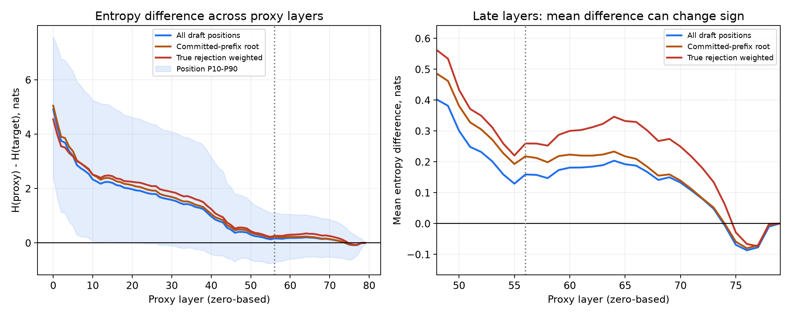
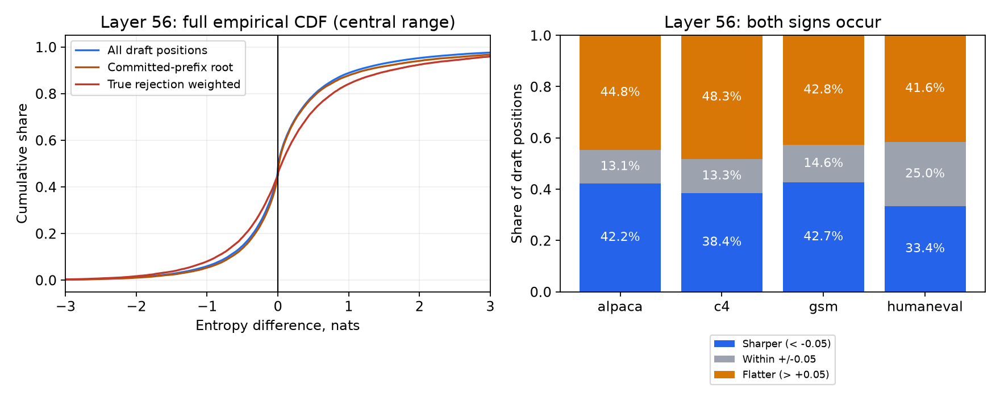

# Proxy–target entropy difference: per-context measurement

`ΔH = H(pE) − H(pT)`, 자연로그 기준 nats. 양수는 proxy의 엔트로피가 더 큼.

검증 완료 12런, 384개 생성, 128개 dataset–prompt ID, 34,702 step, 173,510개 context.
70B AWQ(calibrated) + TinyLlama, B=1, T=1, only-proxy chain, exit=56, K1/K2=8/4, P2 budget=15. 모든 80개 layer를 같은 context에서 비교.

실제 관찰된 verify chain 길이 K와 step 수: `{'4': 34702}`. K1 설정값과 각 step의 실제 K는 구분한다.

Layer 56에서 draft 위치를 동일 가중하면 target의 평균 엔트로피는 2.0465, proxy는 2.2055 nats다. 평균 차이는 **+0.1589 nats**, 절대차 중앙값은 **0.3042 nats**다. 평균적인 평탄화 방향과 개별 위치에서의 변화 크기는 구분해야 한다.

엄격한 부호 기준으로 증가 위치는 52.6%이며 그 안의 평균 차이는 +0.7127 nats, 감소 위치는 47.4%이며 그 안의 평균 차이는 -0.4554 nats다. 증가와 감소가 섞여 있고, 증가량이 더 커서 전체 평균이 양수가 된다.

## Layer 56

행을 합쳐 집계한 경험분포. `positions`는 bonus를 제외한 모든 draft 위치를 동일 가중하며, 실제 거절 이후의 반사실적 draft context도 포함한다. `root`는 각 step의 확정된 prefix 뒤 첫 위치만 사용한다.

| 집계 | 평균 | 중앙값 | P10 ~ P90 | 절대차 평균 / 중앙값 | 더 뾰족 | 유사 | 더 평평 |
|---|---:|---:|---:|---:|---:|---:|---:|
| positions | +0.1589 | +0.0093 | -0.7039 ~ +1.1140 | 0.5907 / 0.3042 | 39.5% | 16.1% | 44.5% |
| all_contexts | +0.1458 | +0.0079 | -0.7164 ~ +1.0921 | 0.5883 / 0.3047 | 39.8% | 15.9% | 44.2% |
| root | +0.2176 | +0.0149 | -0.6569 ~ +1.2375 | 0.6186 / 0.2950 | 37.9% | 16.9% | 45.2% |
| reject_event | +0.2594 | +0.0544 | -0.8663 ~ +1.5984 | 0.7817 / 0.4376 | 41.3% | 8.4% | 50.3% |
| reject_conditional | +0.2009 | +0.0229 | -0.8152 ~ +1.3475 | 0.6980 / 0.3815 | 41.5% | 10.9% | 47.6% |
| bonus | +0.0931 | +0.0031 | -0.7741 ~ +1.0149 | 0.5785 / 0.3062 | 41.3% | 15.5% | 43.2% |
| recovery | +0.2041 | +0.0208 | -0.8009 ~ +1.3375 | 0.6889 / 0.3671 | 40.4% | 12.4% | 47.2% |

유사 구간은 `|ΔH|≤0.05 nats`라는 서술용 기준이며 유의성 검정이 아니다. 엄격한 양수/음수 비율은 summary.csv에 함께 기록.
`all_contexts`는 bonus까지 포함한 모든 위치를 동일 가중. `reject_event`는 실제 첫 기각 확률 h_i로 가중. `reject_conditional`은 step별 기각확률을 먼저 정규화한 뒤 유효 가중치 합으로 나눔. `recovery`는 bonus까지 포함한 h_i 가중.

프롬프트별 평균을 낸 뒤 seed를 평균하고 dataset을 동일 가중한 layer-56 평균: **+0.1512 nats**. Dataset 내 prompt 단위 bootstrap 95% 구간: **[+0.1236, +0.1783]** (2,000회). 토큰을 독립 표본으로 bootstrap하지 않음.

## 데이터셋별 layer 56 (positions)

| 데이터셋 | 평균 | 중앙값 | P10 ~ P90 | 절대차 평균 / 중앙값 | 더 뾰족 | 유사 | 더 평평 |
|---|---:|---:|---:|---:|---:|---:|---:|
| alpaca | +0.1468 | +0.0057 | -0.7943 ~ +1.1828 | 0.6355 / 0.3431 | 42.2% | 13.1% | 44.8% |
| c4 | +0.2296 | +0.0330 | -0.7310 ~ +1.3678 | 0.6773 / 0.3438 | 38.4% | 13.3% | 48.3% |
| gsm | +0.0736 | -0.0002 | -0.7079 ~ +0.8746 | 0.5186 / 0.3002 | 42.7% | 14.6% | 42.8% |
| humaneval | +0.1944 | +0.0088 | -0.5334 ~ +1.1084 | 0.5201 / 0.2134 | 33.4% | 25.0% | 41.6% |

## 레이어별 (positions)

| Layer | 평균 | 중앙값 | P10 ~ P90 | 절대차 평균 / 중앙값 | 더 뾰족 | 유사 | 더 평평 |
|---|---:|---:|---:|---:|---:|---:|---:|
| 0 | +4.9152 | +4.8571 | +2.4241 ~ +7.5787 | 4.9230 / 4.8571 | 0.4% | 0.2% | 99.3% |
| 16 | +2.1248 | +1.7970 | +0.0236 ~ +4.8916 | 2.2163 / 1.8107 | 8.0% | 2.9% | 89.2% |
| 32 | +1.4740 | +1.0322 | -0.1749 ~ +3.9705 | 1.6149 / 1.0950 | 13.1% | 5.0% | 81.8% |
| 40 | +0.9713 | +0.4957 | -0.4227 ~ +3.1556 | 1.2182 / 0.6865 | 21.4% | 8.1% | 70.5% |
| 48 | +0.4016 | +0.1344 | -0.5607 ~ +1.7178 | 0.7399 / 0.3909 | 30.2% | 13.0% | 56.8% |
| 56 | +0.1589 | +0.0093 | -0.7039 ~ +1.1140 | 0.5907 / 0.3042 | 39.5% | 16.1% | 44.5% |
| 64 | +0.2036 | +0.0288 | -0.5149 ~ +1.0393 | 0.5165 / 0.2691 | 34.8% | 17.7% | 47.4% |
| 72 | +0.0793 | -0.0071 | -0.5494 ~ +0.7606 | 0.4277 / 0.2396 | 42.5% | 19.4% | 38.1% |
| 74 | -0.0065 | -0.0353 | -0.5939 ~ +0.5676 | 0.3866 / 0.2229 | 47.8% | 20.2% | 32.0% |
| 75 | -0.0691 | -0.0665 | -0.6373 ~ +0.4211 | 0.3690 / 0.2144 | 52.5% | 20.8% | 26.7% |
| 76 | -0.0868 | -0.0761 | -0.5784 ~ +0.3256 | 0.3222 / 0.1918 | 54.1% | 22.0% | 23.8% |
| 77 | -0.0773 | -0.0505 | -0.4556 ~ +0.2203 | 0.2409 / 0.1362 | 50.1% | 27.3% | 22.6% |
| 78 | -0.0098 | -0.0019 | -0.2015 ~ +0.1639 | 0.1256 / 0.0668 | 31.6% | 42.2% | 26.2% |
| 79 | -0.0000 | +0.0000 | -0.0153 ~ +0.0151 | 0.0106 / 0.0031 | 2.8% | 94.4% | 2.8% |

## 검증 및 범위

- 전체 어휘 32,000개를 사용. 토큰 제외, top-k 절단, residual 정규화 전의 pE/pT 자체를 비교.
- rank0 full lm_head replica로 pE 계산; 실제 TP 최종 logits로 pT 계산. layer 56 hidden tap의 엔진 일치 확인.
- uniform/delta 분포의 ±log(V), 동일 분포의 0, 가변 K, RNG 불변, 마지막 부분 chunk 저장을 검사.
- 확률합 최대 오차 1.07e-06; 모든 step의 h_i 합≈1 및 contiguous step 확인. 기각질량 0인 step 906개는 기각 가중 집계의 분모에서도 제외.
- layer 79 차이는 head 연산 경로의 수치 차이를 평가하는 기준. 숫자가 작아도 엄격한 부호 비율은 0이 아닐 수 있음.
- 각 dataset 파일의 앞 32개 프롬프트를 사용하며 seed는 생성 난수만 바꿈. 이 모델·temperature·only-proxy 궤적에 대한 결과이며 champion/TPS나 전체 언어 모델로 일반화하지 않음.
- 모든 개별 scalar 관측치는 원시 NPZ에 보존. 종료 시 최종 부분 chunk도 flush. complete.json이 있는 검증된 런만 집계.

분위수는 가중 경험 CDF의 역함수로 계산한다. summary.csv의 ALL은 모든 관측 행을 합친 결과이며, prompt bootstrap의 동일 프롬프트·dataset 가중 평균과 분모가 다르다.

재생성: `OPENBLAS_NUM_THREADS=1 ssd/.venv/bin/python results/residial_dist/entropy/aggregate.py`

## 동일 head 연산 경로를 사용한 통제

추가 통제는 layer 56과 layer 79의 replica-head 엔트로피를 직접 빼서, 실제 TP head와 replica head 사이의 수치 차이를 제거한다. 주 결과의 참조는 여전히 실제 엔진의 최종 분포이며, 아래는 통제용이다.

| 참조 및 집계 | 평균 | 중앙값 | P10 ~ P90 | 절대차 평균 / 중앙값 | 더 뾰족 | 유사 | 더 평평 |
|---|---:|---:|---:|---:|---:|---:|---:|
| TP final, positions | +0.1589 | +0.0093 | -0.7039 ~ +1.1140 | 0.5907 / 0.3042 | 39.5% | 16.1% | 44.5% |
| Replica final, positions | +0.1590 | +0.0092 | -0.7032 ~ +1.1135 | 0.5909 / 0.3042 | 39.5% | 16.0% | 44.5% |
| TP final, root | +0.2176 | +0.0149 | -0.6569 ~ +1.2375 | 0.6186 / 0.2950 | 37.9% | 16.9% | 45.2% |
| Replica final, root | +0.2177 | +0.0156 | -0.6582 ~ +1.2377 | 0.6189 / 0.2944 | 37.9% | 16.7% | 45.3% |
| TP final, reject_event | +0.2594 | +0.0544 | -0.8663 ~ +1.5984 | 0.7817 / 0.4376 | 41.3% | 8.4% | 50.3% |
| Replica final, reject_event | +0.2597 | +0.0545 | -0.8611 ~ +1.5994 | 0.7820 / 0.4377 | 41.3% | 8.4% | 50.3% |
