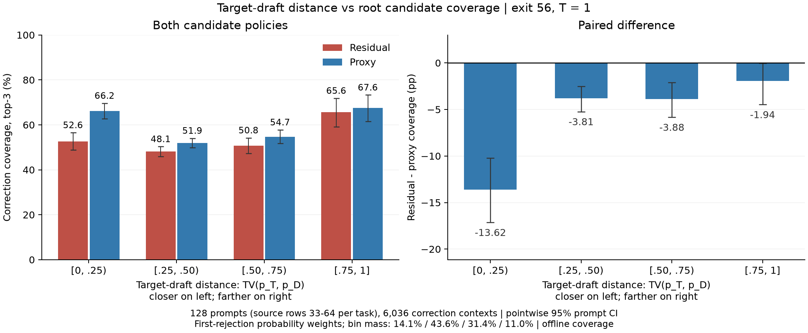
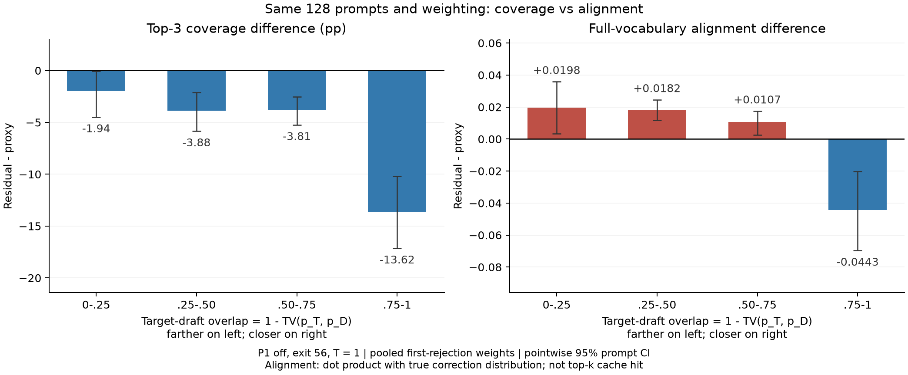

# Target–draft 차이에 따른 root 후보 성능

- **볼 실험:** 9/12 direct_comparison의 confirmation. AWQ LayerSkip70B/TinyLlama1.1B, exit56, T1, K4, P1 off.
- **볼 그림:** [TV–coverage](04_tv_coverage.png) · [PDF](04_tv_coverage.pdf). 이전 Fig.6과 같은 overlap 축으로 두 지표를 비교하려면 [coverage–alignment 대조](05_overlap_coverage_alignment.png) · [PDF](05_overlap_coverage_alignment.pdf).
- 2026-10-01 기존 저장 결과를 CPU로 재집계. 추가 모델 실행·정책 선택 없음.

## “새 프롬프트”의 정확한 의미

같은 네 benchmark의 다른 입력을 사용한 것. 아래 행 번호는 실험용 processed JSONL의 1-based 번호.

| 분석 단계 | Dataset별 사용 입력 | 전체 개수 |
|---|---|---:|
| 초기 분석 / 9/10 replay | 각 dataset의 1–32행 | 4×32=128 |
| **이 그림: direct comparison 확인** | **각 dataset의 33–64행** | **4×32=128** |
| 별도 training-free 확인 | 각 dataset의 65–88행 | 4×24=96 |

- Dataset: Alpaca, C4, GSM8K, HumanEval. 새 dataset을 도입했다는 의미가 아님.
- 원본: /home/chokwans99/ssd_datasets/processed_datasets/ 아래 alpaca/alpaca_data_10000.jsonl, c4/c4_data_10000.jsonl, gsm8k/gsm8k_data_10000.jsonl, humaneval/humaneval_data_10000.jsonl.
- 행 번호·문자열 hash·실제로 읽은 파일: [direct datasets.json](../../../ssd/experiments/proxy_source_ablation/probe_direct_20260912/datasets.json), [training-free datasets.json](../../../ssd/experiments/proxy_source_ablation/probe_training_free_20260912/datasets.json).
- 이번 그림에는 **33–64행의128개만 사용**. 96개 자료나 서로 다른 온도를 혼합하지 않음.

## 1 차이와 coverage

- x축: $d=\mathrm{TV}(p_T,p_D)=\frac12\sum_v|p_T(v)-p_D(v)|$. 왼쪽은 비슷한 분포, 오른쪽은 다른 분포.
- y축: 같은 correction 위치에서 residual 점수와 proxy 점수로 각각 후보3개를 골랐을 때 실제 correction token을 포함할 확률.
- Residual 점수는 $[e-q]_+$, proxy 점수는 e. 관측 draft token 제외는 동일 적용. 저장된 GPU top-3 결과 사용.
- 실제 첫 거절 확률 $h_i$로 가중. Bonus는 제외. 위치별 고정 top3를 비교하므로 전역15개 예산 배분의 효과는 포함하지 않음.

| $\mathrm{TV}(p_T,p_D)$ | Residual coverage | Proxy coverage | 차이, %p [pointwise 95% CI] |
|---|---:|---:|---:|
| [0,.25) | 52.57% | 66.19% | **−13.62 [−17.14,−10.21]** |
| [.25,.50) | 48.13% | 51.94% | −3.81 [−5.24,−2.54] |
| [.50,.75) | 50.78% | 54.66% | −3.88 [−5.84,−2.10] |
| [.75,1] | 65.64% | 67.59% | −1.94 [−4.48,−.05] |

- **관측:** draft와 target이 가까운 구간에서 손실이 가장 크며, 나머지 구간에도 평균 coverage 열세 존재.
- CI는 dataset별 prompt-cluster paired bootstrap4,000회. 사후 구간 분석의 pointwise 구간이며, 네 구간의 동시 신뢰구간은 아님. 특히 마지막 구간의 상한은0에 가까움.
- 재집계 검증: 네 구간의 거절 질량 가중 평균은 기존 direct_comparison의 local gap −5.009%p와 일치. 전역 root15 gap −4.321%p와 다른 지표.

## 2 같은 데이터의 alignment와 비교

- x축은 초기 Fig.6과 같은 overlap $=1-d$. **오른쪽이 target과 draft가 비슷한 구간**이므로 위 TV 그림과 방향이 반대.
- 두 패널은 같은128개 prompt, 같은6,036개 correction context, 같은 구간·가중치.
- Alignment는 $\sum_v R_v\widehat R_v$ 대 $\sum_v R_v\widetilde e_v$. 추정 분포는 관측 draft token을 제외하고 전체 vocabulary에서 정규화. 두 분포 사이의 거리가 아닌 내적임.

| Overlap | Coverage 차이, %p | Alignment 차이 |
|---|---:|---:|
| 0–.25 | −1.94 | +.01976 |
| .25–.50 | −3.88 | +.01815 |
| .50–.75 | −3.81 | +.01065 |
| .75–1 | **−13.62** | **−.04433** |

- **초기 Fig.6의 부호 패턴은 후속 입력에서도 나타남.** Alignment에서 세 구간 양수, 높은 overlap 구간 음수.
- 그러나 동일 데이터에서도 coverage는 네 구간 모두 평균이 음수. 따라서 이전/후속의 차이를 단순히 prompt가 달라진 탓으로 설명할 수 없음.
- 이 대조는 지표에 따라 우열이 달라질 수 있음을 직접 확인. 초기34,150step의 모든 차이를 원인별로 완전히 분리한 결과는 아님.
- 초기 Fig.6은 step 내 거절 가중치 정규화 후 run 평균. 위 그림은 pooled h 가중. 현재 데이터에 step 내 정규화를 적용한 민감도 계산에서도 coverage 네 구간 음수/alignment 세 구간 양수의 부호 패턴 유지. 수치는 JSON/CSV에 별도 보존.
- Overlap 표의 구간은 TV 구간을 역순 표시한 것. 내부 경계의 포함 방향은 TV 표 기준.

## 3 표본 수와 이전 입력에서의 재현

- 128개 입력의11,616 verification step 중 stride8로 저장한1,509step, correction 위치6,036개를 사용.
- TV 구간별 $h_i>0$인 위치 수: 1,452 / 1,454 / 805 / 315. 기여 prompt 수: 128 / 128 / 124 / 96.
- 같은 prompt가 여러 구간에 포함될 수 있으므로 위 기여 prompt 수를 더하지 않음.
- 기존1–32행 입력의9/10 replay(2seed)도 같은 TV 구간으로 재집계한 coverage 차이는 −11.45/−4.18/−3.31/−4.32%p. 이 값은 초기 Fig.6의9/9 실행과 같은 경로라는 뜻은 아님.
- Full dataset, 다른 model pair, dense target 및 P1-on의 일반적 결론으로 확대하지 않음. 실제 cache hit가 아닌 후보 coverage.

## P1이 있는 경우의 범위

- 위 TV/overlap 그래프는 **P1 off**. 실제 P1 on에서 같은 구간별 그래프를 측정한 결과는 아직 없음.
- 기존 고정 DS12 참조 분석은 [주 보고서의 P1 항목](REPORT.md)에 정리. DS12+P2추가3개는 residual57.28%/proxy57.84%, 추가15개는69.10%/70.45%.
- 이 참조 실험은 기존1–32행 입력의9/10 replay이고, draft의 q top3을 준비 완료된 집합으로 가정. 실제 P1 scheduler/tree, 준비 시간, 중단/재사용을 재현한 P1-on 실험으로 사용하지 않음.
- P1 평가에서는 실제 준비 완료된 root 집합 D를 저장하고, 중복 제외 후 P2가 더하는 coverage를 비교해야 함. e(1-q)와 위치 보정도 같은 D/예산 조건에서 별도 검증 필요.

## 재현 자료

- [코드](make_distance_figures.py), [전체 수치·조건](distance_summary.json), [표](distance_tables.csv).
- 최초 실행: OPENBLAS_NUM_THREADS=1 OMP_NUM_THREADS=1 ssd/.venv/bin/python results/residial_dist/root_progress_20261001/make_distance_figures.py
- 그림 재생성은 --reuse-alignment 옵션으로 CPU alignment 캐시 재사용 가능. 캐시 로드 시 metric/manifest hash와 step 일치 검사.
- 기존 GPU top-3를 재선택하지 않음. Alignment만 저장 full-vocab 분포에서 CPU float64로 계산했고 step/seq_id/Z 일치, 분포 확률합, 유한값을 검사.
