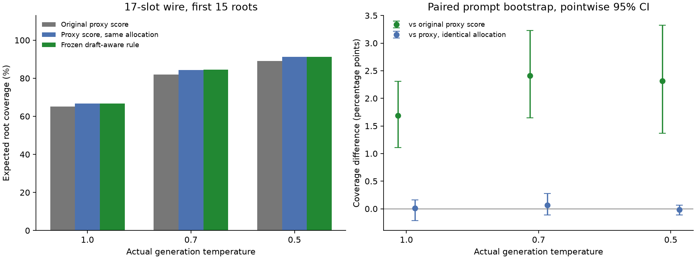

# 학습 없는 DUET 후보 개선: 수식, 독립 검증, 실제 실행

2026-09-12. 먼저 결론을 구분한다.

1. **기존 proxy-score 기준선보다 좋아지는 방향은 찾았다.** 가장 일관된 이득은
   draft를 강하게 빼는 데서가 아니라, **어느 거절 위치에 후보 예산을 줄지 추정하는
   방법**을 바꾸는 데서 나왔다. 같은 early-exit, 같은 모델, 같은 15개 root 예산이다.
2. **원래 $[e-q]_+$는 이번 독립 데이터에서도 평균적으로 열세다.** 낮은 T에서도
   역전하지 않았다. 이 결과는 “모든 가능한 방법 중 proxy-only가 최적”이라는 증명이 아니다.
3. **완만한 draft 할인도 시험했지만, 동일한 위치 배분의 proxy-only를 확실히 이겼다고
   주장할 증거는 아직 부족하다.** 처음 나타난 T=1의 +0.125%p는 실제 wire와 동점
   처리를 맞춘 검증에서 +0.011%p로 줄고 신뢰구간이 0을 포함했다.
4. 새 head나 모델 학습은 하지 않았다. 탐색 데이터에서 스칼라와 규칙을 선택한 뒤
   별도 프롬프트에 적용했다. 실제 verifier/sampler 소스는 수정하지 않았다.
5. **실제 속도 개선은 확인하지 못했다.** 분석 작업 없이 반복한 두 seed에서
   배분 개선의 출력 TPS 변화는 +4.72%, −7.81%로 엇갈렸고, 합산은 −1.61%였다.
   따라서 현재 결과로 DUET가 Mirror-SD보다 빨라졌다고 주장할 수 없다.



전체 증명은 [THEORY.md](THEORY.md), 모든 동결 정책 수치는 [TABLES.md](TABLES.md),
실험 정의는 [PROTOCOL.md](PROTOCOL.md)에 있다. 이번 비교의 “proxy-only”는
**동일 DUET 엔진에서 후보 점수를 e로 정하는 ablation**이다. 위치 추정에는 기존부터
q가 들어간다. Mirror-SD 전체 구현의 속도를 직접 측정한 결과는 아니다.
[Mirror-SD 원문](https://arxiv.org/html/2510.13161v2#S3.SS1)은 early-exit 후보 외에도
분기 확장, speculative streaming, 실행 배치를 포함한다.

## 1. 실험을 어떻게 분리했는가

| 항목 | 설정 |
|---|---|
| Target | AWQ 보정 LayerSkip Llama2-70B, TP=4 |
| Draft | TinyLlama-1.1B-Chat |
| Early exit | 56층, 기존 norm/head 그대로 |
| 실행 | B=1, chain, 실제 K=4, 최대 출력 256 |
| 후보 | 위치별 M=17, 실제 root 예산 15, wire 여유분 포함 17 |
| Temperature | 실제 target/draft 생성 T=1, 0.7, 0.5 |
| 데이터 | Alpaca, C4, GSM, HumanEval |
| 탐색 | 기존에 본 256개 프롬프트의 T=1 기록 + 그중 64개에서 새 T=0.7/0.5 생성 |
| 독립 확인 | 기존과 중복 없는 **96개 프롬프트**, 각 T에서 동일한 96개 사용 |
| 저장 | 전체 32,000 vocabulary의 p/q/e, float32, prompt별 verification step 간격 8 |
| 학습 | 없음. 추가 forward/head/회귀모형 없음 |

기존 T=1의 384 generation과 새 탐색 128 generation을 합쳐 512 generation,
5,796 sampled verification step에서 정책을 선택했다. 독립 확인은 288 generation,
23,854 verification step 중 **3,112 step / 15,560 위치**다. 288개가 모두 다른
프롬프트라는 뜻은 아니다. 96개 프롬프트를 세 temperature에서 실행했다.

55개 점수/순위 규칙 × 정규화 2개 × 위치 가중치 24개 = **2,640개 조합**을 비교했다.
정책과 개발 결과 hash를 [frozen.json](frozen.json)에 고정한 시각은
2026-09-12 13:43:02 UTC이며, 독립 확인 정책 결과 계산보다 앞선다.
이후 확인 데이터를 보고 승자를 새로 골라 독립 검증 결과로 부르지 않았다.

평균은 step → prompt의 seed 평균 → dataset 안의 prompt 평균 → 4개 dataset 평균이다.
CI는 dataset별 **prompt 단위 paired bootstrap 4,000회**다. 토큰/위치를 독립 표본으로
세지 않았다. 기본 95% CI 외에, 동결된 주 비교 6개에는 20,000회 bootstrap으로
Bonferroni 구간도 계산했다. 아래 구현 민감도 검사는 별도 robustness 분석이다.

`--duet_only_proxy`는 **DS를 끄고 PS만 실행하는 옵션**이다. 후보 점수를 e로 바꾸는
옵션은 `--duet_proxy_source proxy`다. 두 의미를 혼용하지 않았다.

## 2. 개선된 조합의 독립 검증 결과

아래는 동결한 replay(topk 15) 결과다. Coverage는 선택한 캐시 root들이 실제 correction
또는 bonus token을 포함할 조건부 확률의 평균이다. 실제 cache hit/TPS와는 구별한다.

| T | 원래 residual | 기존 proxy 점수 | 개선 조합 | 기존 proxy 대비 |
|---|---:|---:|---:|---:|
| 1.0 | 61.762% | 65.039% | 66.812% | +1.772%p |
| 0.7 | 78.275% | 82.042% | 84.430% | +2.388%p |
| 0.5 | 85.100% | 88.931% | 91.327% | +2.396%p |

개선 조합은 T=1에서 $s=e\sqrt{1-q}$, T=0.7에서 $s=e(1-q)$,
T=0.5에서 $s=\max([e-q]_+,0.75e)$다. 세 경우 모두 full 정규화와
$\widetilde h=0.75\widehat h+0.25\bar h$를 사용한다. **확인 데이터에서 고른 식이
아니라 탐색에서 동결한 식**이다. $\bar h$의 정의는 다음 절에 있다.

실제 wire 방식(topk 17 후 앞 15개)을 포함해, 같은 동결 정책을 전체 3,112 step에서
다시 계산한 결과는 다음과 같다. 저장 확률에서 복원한 float32 logits를 사용하므로
원래 모델 logits의 비트 단위 재현이라고 부르지는 않는다.

| T | 기존 proxy 점수 | 동일 배분의 proxy 점수 | 개선 조합 | 조합 − 기존 proxy, 95% CI |
|---|---:|---:|---:|---:|
| 1.0 | 65.126% | 66.801% | 66.811% | +1.685 [+1.106, +2.311]%p |
| 0.7 | 82.020% | 84.363% | 84.431% | +2.411 [+1.649, +3.225]%p |
| 0.5 | 89.005% | 91.335% | 91.321% | +2.315 [+1.368, +3.324]%p |

**전체 조합의 이득은 유지된다. 다만 source의 추가 이득은 작고 불확실하다.**

| T | 조합 − 동일 배분의 proxy 점수 | 95% CI |
|---|---:|---:|
| 1.0 | +0.011%p | [−0.217, +0.162]%p |
| 0.7 | +0.068%p | [−0.110, +0.274]%p |
| 0.5 | −0.014%p | [−0.112, +0.068]%p |

T=0.5에서 개발 데이터가 고른 proxy 배분은 `uniform0.05`였고, 조합이 사용한 배분은
`expected_mix0.25`였다. 두 동결 승자만 비교하면 조합이 +1.438%p 높지만, 이것을
floor 점수의 이득으로 해석하면 틀린다. **같은 배분끼리 비교하는 대조군을 추가해
이 혼동을 분리했다.** 결과적으로 q를 부드럽게 반영하는 규칙은 강한 residual의
손실을 줄이지만, proxy 순위 자체보다 확실히 낫다는 결론까지는 가지 않는다.

## 3. 가장 효과가 있었던 것은 위치 확률 추정이다

기존 방법은 관측된 draft token 하나의 비율로

\[
\widehat\alpha_i=\min(1,e_i(y_i)/q_i(y_i)),\qquad
\widehat h_i=\prod_{j<i}\widehat\alpha_j(1-\widehat\alpha_i)
\]

를 계산한다. Proxy 오차가 $e_i(y_i)\ge q_i(y_i)$를 만들면 해당 위치의 추정 거절
확률은 0이 된다. 실제 거절 사건 중 일부가 후보 예산을 거의 못 받게 된다.
독립 데이터에서 실제 사건 확률의 약 **4.3~4.8%**가 $\widehat h_i<10^{-9}$인
거절 위치에 있었다. 이 수치는 전체 step당 사건 질량을 prompt 평균한 값이다.

고정 prefix에서 $Y\sim q_i$라면

\[
\bar\alpha_i
=\mathbb E_Y[\min(1,e_i(Y)/q_i(Y))]
=\sum_v\min(e_i(v),q_i(v))
=1-\operatorname{TV}(e_i,q_i).
\]

전체 분포 overlap으로 계산한 $\bar\alpha_i$에서 누적곱 형태의 $\bar h$를 만든 뒤,

\[
\boxed{\widetilde h_i=0.75\widehat h_i+0.25\bar h_i}
\]

로 섞었다. 관측 토큰의 비율과 전체 분포의 불일치 정보를 함께 사용하는 것이다.
위 기대값 항등식은 정확하지만, $\bar h$가 관측된 전체 draft 경로의 정확한
조건부 거절 분포인 것은 아니다. 이 혼합 비율의 우위는 실험 결과이지 보편적 정리가 아니다.

동결 replay의 ablation에서 **이 위치 가중치만** 바꿔 얻은 이득은 T=1에서
+1.612%p, T=0.7에서 +2.345%p, T=0.5에서 +2.334%p였다.
이는 source 점수의 작은 추가 이득보다 훨씬 크다.

## 4. 전체 정규화가 필요한 이유와 실제 기여

현재 점수 $s_{iv}$의 전체 허용 질량을 $A_i$, 상위 17개 질량을 $m_i$라 하면

\[
J^{\rm old}_{iv}=\widehat h_i s_{iv}/m_i,
\qquad J^{\rm full}_{iv}=\widehat h_i s_{iv}/A_i.
\]

기존 점수는 full 점수에 $A_i/m_i$를 곱한 것이다. 상위 17개 밖에 질량이 많이
남는 위치일수록 점수가 부풀어, 위치 간 예산 비교에 편향을 준다.
정확한 target residual과 h를 넣어도 이 재정규화 때문에 전역 최적 후보를 놓칠 수
있다는 반례를 증명하고 수치 검사했다.

다만 **이번 데이터에서 이 변경만의 평균 이득은 상대적으로 작았다**.
T=1 +0.412%p, T=0.7 +0.061%p, T=0.5 +0.004%p다.
수학적으로 타당한 개선점이라는 이유로 실측 기여를 과장하지 않았다.

## 5. 왜 원래 residual은 여전히 지는가

한 위치의 top-3에서 residual이 새로 넣은 집합을 I, 뺀 집합을 O라 하자.
$a=[p-q]_+,b=[e-q]_+,\eta=b-a$에 대해

\[
\Delta=\frac{\Gamma-E}{Z},\quad
\Gamma=b(I)-b(O),\quad E=\eta(I)-\eta(O).
\]

아래는 **실제 rejection-event 가중 평균**이다. 앞의 전역 15-root prompt 평균과
다른 지표이며, 각 항을 같은 가중치로 계산했으므로 정확히 합쳐진다.

| T | 추정 교환 이득 Γ/Z | 실제 교환 오차 E/Z | 실제 차이 Δ |
|---|---:|---:|---:|
| 1.0 | +3.834%p | 7.362%p | −3.528%p |
| 0.7 | +2.223%p | 8.800%p | −6.576%p |
| 0.5 | +1.183%p | 8.453%p | −7.270%p |

큰 항은 **빼버린 후보의 과소평가**였다. $\eta(O)/Z$는 각각 −6.422, −8.467,
−9.029%p였다. Residual이 넣은 후보를 전부 과대평가해서만 생긴 결과가 아니다.

또한 residual이 지는 위치가 항상 더 많았던 것도 아니다. T=1에서 이긴 사건 비중은
35.61%, 진 사건 비중은 24.56%였다. 하지만 이겼을 때 평균 +7.39%p, 졌을 때 평균
−25.08%p로 **지는 경우의 손실이 더 컸다**. T=0.7도 이길 때 +5.61%p,
질 때 −35.37%p였다. 평균을 개선하려면 작은 승리를 더 만드는 것뿐 아니라 중요한
후보를 크게 잃는 사건을 줄여야 한다.

## 6. 다양한 source 수정의 판정

| 시도 | 확인한 내용 |
|---|---|
| $[e-\lambda q]_+$, λ=0.1/0.25/0.5/0.75 | 강한 차감 손실은 줄지만, source 단독의 안정적인 역전을 확인하지 못함 |
| $\max([e-q]_+,\rho e)$, ρ=0.25/0.5/0.75/0.9 | 중요한 proxy 후보의 0점 삭제를 막음. 같은 배분의 proxy보다 우월하다는 검증은 부족 |
| $e(1-q)^\beta$, β=0.5/1/2/4 | 상대 오차 민감도가 낮은 대안. T=1의 작은 추가 이득은 wire/동점 검증에서 유지되지 않음 |
| 음의 residual 질량 복구, capped 복구 | sign 오류를 겨냥했지만 동결된 최상위 조합으로 선택되지 않음 |
| $\sqrt{e(1-e)}$ 보너스 | 작은 residual의 불확실성을 보완하려는 규칙. 최종 우위 근거 없음 |
| q/e peak, argmax 일치, TV threshold gating | 모든 위치에서 빼는 것보다 낫지만, 동일 배분 proxy를 확실히 이기지 못함 |
| proxy temperature만 보정 | 원래 residual의 평균 열세를 해결하지 못함 |
| proxy 상위 후보 보호, interval 교환 | 엄밀한 오차 구간이 맞으면 안전한 교환 증명 가능. 실제 선택된 interval1은 no-op이므로 개선으로 세지 않음 |
| h power, uniform 혼합, bonus boost, clipping, overlap 혼합 | **overlap 혼합이 주된 유효 방향** |

모든 평균은 [development_policies.csv](development_policies.csv),
[confirmation_policies.csv](confirmation_policies.csv)에 남겼다. 확인 데이터의 순위표는
추가 탐색 자료이며, 거기서 새 승자를 선택해 검증된 정책으로 부르지 않았다.

## 7. 작은 이득을 확정하기 전에 발견한 재현성 문제

초기 T=1의 +0.125%p는 prompt bootstrap 95% CI뿐 아니라 동결 주 비교의
Bonferroni 구간에서도 양수였다. 그러나 **통계적 구간이 구현 민감도까지 포함하지는
않는다**. 실제 topk 17 wire와 topk 15 replay의 경계 동점이 달랐다.

실제 모델은 BF16 logits를 사용한다. 한 step에서 동점 token 285/437의 선택만으로
실제 coverage가 약 0.982 달라진 사례를 확인했다. 두 토큰의 추정 점수는 같았으므로
둘 다 추정 목적함수에서는 유효한 top-k였다. 이처럼 큰 개별 차이가 평균에서는
0.1%p 정도의 주장에 영향을 줬다.

이 사례는 [numerical_case.json](numerical_case.json), 전체 재평가는
[runtime_snapshot_checks.json](runtime_snapshot_checks.json)에 있다.
**초기 결과를 삭제하지 않고, 작은 source 이득을 확정하지 않는 결론으로 수정했다.**
재현 가능한 동점 규칙을 고정하는 것이 다음 엔진 통합의 선행 조건이다.

## 8. Temperature와 후보 예산에 대한 답

원래 residual − proxy 차이는 T=1, 0.7, 0.5에서 각각 −3.278, −3.767,
−3.831%p였다. **T를 낮추기만 해서 residual의 평균 우위가 생기지는 않았다.**

현재 구현은 y를 후보에서 제외한다. Draft가 결정적으로 되어 $q=\delta_y$이면,
남은 v≠y에서 $[e_v-q_v]_+=e_v$다. 따라서 충분히 낮은 T에서 source 차이가
오히려 작아질 수 있다. 낮은 T의 argmax 오류도 더 확신 있게 나타날 수 있다.

실제 reject-event 가중 $H(e)-H(p)$도 T=1에서 +0.273 nats였지만,
T=0.7에서는 −0.139, T=0.5에서는 −0.186이었다. 낮은 T에서는 이 가중 평균상
proxy가 오히려 더 뾰족한데도 원래 residual이 열세였다. 따라서 평균 평탄화만으로
원인을 설명할 수 없다. T별 생성 경로도 달라지므로 이 차이를 순수한 softmax
temperature 변환의 인과 효과로 해석하지는 않는다.

추가로 동결 규칙을 예산 5/10/15/25/40에서 평가했다(M=max(17,B)). 개선 조합은
이 범위에서 기존 proxy 기준선보다 평균 coverage가 높았다. 그러나 같은 배분의
proxy에 대한 source 추가 이득은 예산에 따라 부호가 바뀐다. 예산을 늘리는 데 따른
draft 계산비용을 포함한 TPS 측정은 이 분석에 포함하지 않는다.
[budget_checks.json](budget_checks.json) 참조.

현재 chain 후보 계산은 실제 T와 무관하게 raw logits에 softmax를 적용한다.
T를 맞춘 후보 계산만의 replay 이득은 T=0.7 약 +0.550%p, T=0.5 약 +0.307%p였으며,
두 경우 모두 95% 구간이 0을 포함했다. 따라서 temperature 불일치만을 원인으로
몰거나, 이를 바꾸면 반드시 빨라진다고 주장하지 않는다. 실제 출력 sampling은
기존부터 요청된 T를 사용하고 있었다.

## 9. 실제 실행과 correctness 검증

실행용 [runtime_policy.py](runtime_policy.py)는 실험 프로세스에서 후보 CUDA graph만
교체한다. 실제로 이 경로가 호출되었는지 K별 횟수를 저장하고, 다른 eager 경로로
빠지면 오류로 중단한다. 검증 분모는 실제 draft sampling에 쓰인 q이고, correction은
실제 target residual에서 뽑는다. 후보 점수를 출력 sampling 분포로 사용하지 않는다.

- 원래 verifier/sampler 및 캐시 lookup 관련 소스 hash가 이전 검사와 같음.
- 현재 T=1/0.7/0.5에서 production CPU sampler/verify **300,000회** 검사 통과.
- BF16/FP16/FP32 입력과 K=1..4에서 후보 tensor 계산 검사, CUDA graph/eager 일치 통과.
- 실제 wire prefix의 추정 점수 최적성 오차는 최대 약 1.2×10⁻⁷. 토큰 동점은 별도 계측.
- 원시 분포의 정규화, 전체 prompt/step ID, stride, dataset 및 snapshot hash 재검사 통과.

이는 GPU/TP/KV 전체 구현에 대한 완전한 lossless 증명은 아니다. 기존 검증의 의미를
보존했는지 확인한 범위를 명시한 것이다. [audit.json](audit.json),
[lossless_checks.json](lossless_checks.json), [runtime_checks.json](runtime_checks.json) 참조.

실제 실행은 총 14회 ×16 prompts =224 generation이다. 초기 10회 screen은 GPU2
분석과 일부 시간이 겹쳤으므로 탐색 자료로만 취급한다([LIVE.md](LIVE.md)).
핵심 배분 비교는 분석 작업을 모두 끝낸 뒤, 같은 T=0.7에서 새 seed903/904와
반대 실행 순서로 다시 측정했다. Target/draft/source=e/출력 길이는 같다.

주요 속도 지표는 **실제로 반환한 4,096 token / generate 전체 시간**이다.
Prefill을 포함하고 모델 적재 시간은 제외한다. 엔진의 decode-token counter에는
출력 길이 한도에서 버리는 끝 토큰이 포함될 수 있어 보조 지표로 함께 저장했다.

| Seed | 기존 proxy 배분 출력 TPS | 개선 배분 출력 TPS | 변화 | Cache hit 변화 |
|---|---:|---:|---:|---:|
| 903 | 80.174 | 83.957 | +4.72% | +2.17%p |
| 904 | 89.133 | 82.169 | −7.81% | −1.18%p |
| 합산 | 84.416 | 83.054 | **−1.61%** | +0.55%p |

합산 처리량은 총 출력 token / 총 시간, 합산 cache hit는 step 가중 비율이다.
16개의 같은 프롬프트와 2개 seed로 측정한 제한된 screen이며 큰 표본의 속도 결론은 아니다.
[LIVE_CLEAN.md](LIVE_CLEAN.md), [live_clean_summary.json](live_clean_summary.json) 참조.

차이를 분해하면 step당 시간은 두 정책 모두 약 35 ms로 비슷했다.
Seed903에서는 토큰/step이 2.975→3.081로 증가했고, seed904에서는 3.287→3.018로
감소했다. 실제 decode TPS는 `평균 토큰/step ÷ 평균 시간/step`이므로 이 차이가
큰 영향을 줬다. 후보 정책이 바뀌면 같은 seed에서도 RNG 소비와 생성 경로가 달라지므로,
이 수락 길이 차이를 정책의 인과 효과로 확정하지 않는다.

이 결과는 **높은 후보 coverage만으로 실제 속도를 설명할 수 없다는 실측 확인**이다.
캐시가 제때 준비되는지, hit 이후 사용 가능한 suffix가 얼마나 긴지, miss 비용이
critical path에 얼마나 남는지도 함께 측정해야 한다. 실제 wire 버전의 후보 graph
자체를 새 head/모델로 바꾼 것은 아니며, GPU 계산 검사는 별도 기록으로 남겼다.

## 10. 연구 방향에 대한 현재 판단

**우선할 방향은 q를 이용해 위치별 후보 예산을 더 잘 배분하는 것이다.**
실제 correction 후보 순위를 원래 residual로 강하게 재편하는 것보다, $\widehat h$의
오류를 줄이는 쪽이 이번 모델/층/예산에서 훨씬 큰 이득을 냈다.
이 문장의 이득은 **coverage에 대한 것**이며, 속도 개선으로 검증되었다는 뜻은 아니다.

실험적으로 가장 단순한 출발점은 $s=e$와 full 정규화,
$\widetilde h=0.75\widehat h+0.25\bar h$의 조합이다. 부드러운 draft 할인은 별도
ablation으로 유지할 수 있지만, 그 자체의 우월성을 논문의 중심 주장으로 삼을 근거는
현재 부족하다. 이렇게 판단한다고 “proxy-only가 모든 방법 중 최적”이라고 결론 내리는
것은 아니다. **시험한 source 후보군에서 더 나은 순위 규칙을 확정하지 못한 것**이다.

MLSys 주장으로 이어가려면 다음 순서가 타당하다.

1. 후보 순위와 동점 처리를 명세로 고정하고, 원래 DUET/개선 DUET/동일 비용 proxy
   기준선을 같은 실행 설정으로 비교한다. 충분한 prompt/seed에서 출력 TPS를 확인한다.
2. 이번에 검증한 위치 추정 개선을 DS가 함께 켜진 실제 DUET에 적용해, 중복 제거,
   prefetch 준비 완료, hit 이후 suffix 길이까지 측정한다. 이번 결과는 PS-only chain이다.
3. 추가 학습 없이, root의 $hR$ 질량뿐 아니라 준비 시간과 재사용할 suffix 길이를
   포함하는 예산 선택을 후속 가설로 검증한다. 이 항목은 이번에 개선이 확정된 방법이 아니다.
4. 모델/exit layer/데이터 규모를 넓히고 Mirror-SD 전체 실행과 공정하게 비교한다.

## 11. 재현 자료

- [THEORY.md](THEORY.md): 목적함수, 교환 오차, 정규화, overlap 위치 추정,
  상대 민감도, 낮은 T의 극한, 동점 문제의 설명과 증명.
- [frozen.json](frozen.json): 확인 결과 전 동결한 정책과 hash.
- [replay.py](replay.py), [aggregate.py](aggregate.py), [diagnostics.py](diagnostics.py):
  정책 평가, prompt 통계, 요인별 ablation.
- [TABLES.md](TABLES.md), [ablations.csv](ablations.csv): 확인 결과 전체 표.
- [confirmation.png](confirmation.png), [confirmation.pdf](confirmation.pdf): 원래 동결 replay.
- [runtime_confirmation.png](runtime_confirmation.png), [runtime_confirmation.pdf](runtime_confirmation.pdf):
  실제 wire 방식으로 재평가한 결과.
- 원시 실행/매핑: `ssd/experiments/proxy_source_ablation/probe_training_free_20260912/`.

확인 replay 재현:

```bash
CUDA_VISIBLE_DEVICES=2 OPENBLAS_NUM_THREADS=1 ssd/.venv/bin/python \
  results/residial_dist/training_free/replay.py \
  --input ssd/experiments/proxy_source_ablation/probe_training_free_20260912/out/confirmation \
  --output results/residial_dist/training_free/confirmation
ssd/.venv/bin/python results/residial_dist/training_free/aggregate.py confirmation
ssd/.venv/bin/python results/residial_dist/training_free/diagnostics.py
```

`aggregate.py development`는 기존 frozen.json을 덮어쓰지 않도록 차단되어 있다.
개발용 v1/v2는 탐색 과정 보존용이며, 확인 계산은 frozen hash와 일치하는 최종 replay.py를 사용한다.
