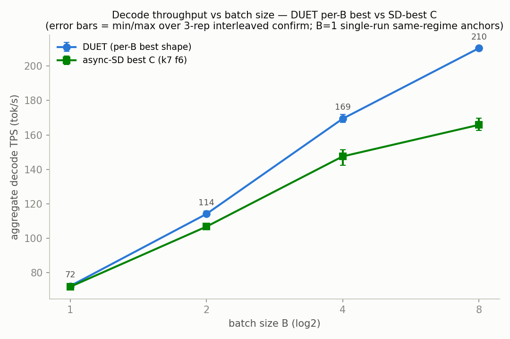
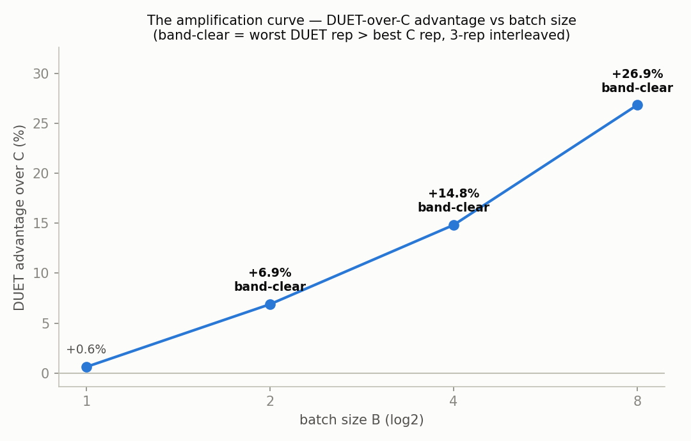
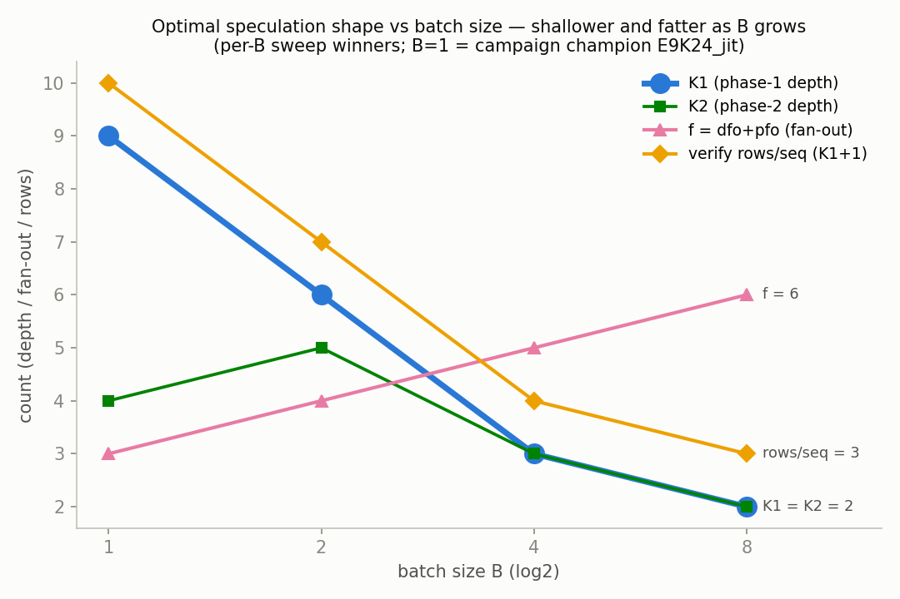
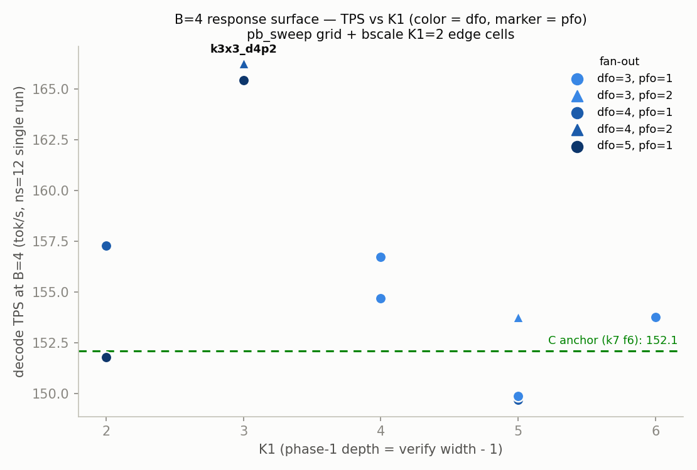
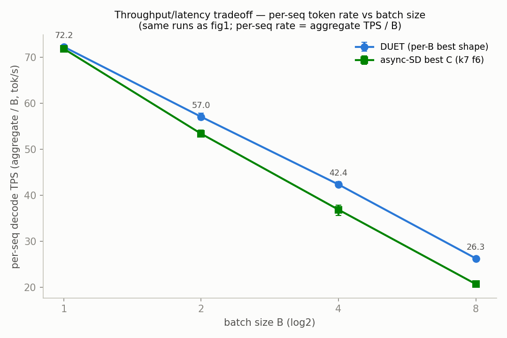

# bscale — B-scaling 스토리, B ∈ {1,2,4,8} (2026-07-19)

**질문** (pb_sweep/RESULTS.md caveat 3을 닫는다): per-B sweep에서는 B=4
grid의 가장자리에 K1=3이 걸쳐 있었고 B=8은 미측정이었으며, 최적값 추세
K1 9 → 6 → 3을 외삽하면 B=8에서 K1 ≈ 2-3이 예상되는 상황이었다.
DUET-over-C 증폭(amplification)은 B=8에서도 계속되는가, K1=3은 B=4에서
진짜 내부(interior) 최적점인가, 그리고 완전한 per-B shape 법칙은
무엇인가?

**설정**: HEAD 4044090, GPU 0-4 (target TP4는 0-3, draft는 4),
in=512 out=256 temp 0.7 seed 42 `--all`, jit-short on, exit=56,
`SSD_FORCE_SPLIT_K1K2=1`, PROFILE=0, uniform phase-1 fan-out
(`[dfo]×(K1+1)`), C = async-SD best (k=7 f=6). Scan: ns=12, 셀당 1회
실행, ports 12970+ (`run_scan.sh`). Confirm: ns=20, 3-rep interleaved
DUET/C, ports 13000+ (`run_confirm.sh`). 실험과 무관한 vLLM이 GPU
6-7에서 idle 상태로 내내 상주 (모든 pb_sweep/verdict 실행과 동일한
조건); scan 시작 시점에 GPU 0-5는 그 외에는 비어 있었다. 셀 명명 규칙:
`b<B>_kAxB_dCpD` = K1=A, K2=B, dfo=C, pfo=D (k=K1+K2, f=dfo+pfo).

## Verdict (결론부터)

**B=8: k2x2_d5p1 (K1=K2=2, dfo=5 pfo=1, k=4 f=6)이 C를 band-clear
(최악 rep이 상대의 최고 rep보다 높은, 구간 겹침 없는 승리)로 이겼다 —
210.39 vs 165.85 (+26.9%)**, spread 209.74-211.11 vs 162.64-169.61
(최악의 DUET rep이 최고의 C rep을 +23.7% 차이로 이김). 이제 증폭
곡선이 2의 거듭제곱 지점마다 전부 측정되었다:

**+0.6% (B=1) → +6.9% (B=2) → +14.8% (B=4) → +26.9% (B=8)**,
B ∈ {2,4,8}에서 band-clear — docs/duet/12 finding 5b는 B=8까지
유지되며 계속 커진다. 최적 shape은 갈수록 더 얕고 더 넓어진다:
**K1 9 → 6 → 3 → 2**, f 3 → 4 → 5 → 6, verify rows/seq (K1+1)
10 → 7 → 4 → 3. 그리고 B=4 edge 셀들은 이 법칙이 "무조건 작을수록
좋다"가 아님을 보여준다: B=4에서 K1=2는 진다 (157.3 < 165.5), 즉
K1=3은 그 지점에서 진짜 내부 최적점이다 — K1 frontier는 B가 두 배 될
때마다 한 단계씩 미끄러진다.

## 1. Phase A — 갭 채우기 scan (ns=12, 셀당 1회 실행)

완료 셀 체크리스트 (계획 11 / 완료 11, 전부 rc=0, Traceback 0건;
config assert에 걸린 셀 없음 — B=8은 v1 constraint set 내부, M4 gate
≤ 8):

| 계획 셀 | 완료 | TPS |
|---|---|---|
| b8_k2x2_d4p1 | yes | 211.61 |
| b8_k2x2_d5p1 | yes | **213.51** (승자) |
| b8_k3x3_d4p1 | yes | 207.92 |
| b8_k3x3_d4p2 | yes | 209.66 |
| b8_k4x4_d3p1 | yes | 189.73 |
| b8_c (k7 f6) | yes | 163.21 |
| b4_k2x2_d4p1 | yes | 157.28 |
| b4_k2x2_d5p1 | yes | 151.79 |
| b4_k3x3_d5p1 | yes | 165.45 |
| b1_e9k24_jit | yes | 72.24 |
| b1_c (k7 f6) | yes | 71.80 |

### 1a. B=8 grid (TPS 내림차순; C anchor k7 f6)

| cell | k | f | TPS | tok/step | t_step (ms) | hit | P1/P2 hit | L_p1 | L_p2 | T_target | T_verify | T_draft |
|---|---|---|---|---|---|---|---|---|---|---|---|---|
| **k2x2_d5p1** | 4 | 6 | **213.51** | 2.40 | 89.9 | 0.90 | .812/.087 | 1.48 | 1.08 | 98.85 | 79.49 | 67.52 |
| k2x2_d4p1 | 4 | 5 | 211.61 | 2.38 | 90.0 | 0.88 | .780/.105 | 1.47 | 1.04 | 98.95 | 79.60 | 66.52 |
| k3x3_d4p2 | 6 | 6 | 209.66 | 2.88 | 109.9 | 0.89 | .768/.126 | 2.03 | 1.40 | 112.62 | 91.05 | 85.09 |
| k3x3_d4p1 | 6 | 5 | 207.92 | 2.83 | 108.9 | 0.86 | .742/.117 | 1.98 | 1.49 | 111.37 | 89.33 | 79.55 |
| k4x4_d3p1 | 8 | 4 | 189.73 | 3.19 | 134.5 | 0.82 | .664/.152 | 2.44 | 1.69 | 137.31 | 111.67 | 104.53 |
| **C (k7 f6)** | 7 | 6 | 163.21 | 3.85 | 188.7 | 0.72 | — | — | — | 191.15 | 156.08 | 115.09 |

pb_sweep의 물리 법칙이 B=8에도 그대로 이어진다: T_verify는 여전히 거의
순수하게 K1만의 함수이고 (K1 = 2/3/4에서 79.5 / ~90 / 111.7 ms; C의
k=7 verify는 64 rows에 156 ms를 지불한다), 모든 DUET 셀이 C를
+16..+31% 이기며, K1 ∈ {2,3} 블록 전체가 2.7% 이내에 몰려 있다
(k2x2_d5p1의 d4p1 대비 마진 +0.9%는 단일 실행 노이즈 안 — scan의
역할은 confirm 후보를 고르는 것이었고, 상위 네 셀 중 어느 것이든
verdict를 지탱했을 것이다). K1=2에서 dfo=5는 phase-1 rows를
dfo×(K1+1) = 15/seq로 유지하며 P1 hit을 .812로 끌어올린다; hit rate은
0.90으로 C의 0.72를 앞선다.

### 1b. B=4 edge 셀 (맥락을 위해 pb_sweep 이웃 셀 포함)

| cell | k | f | TPS | tok/step | t_step (ms) | hit | L_p1 | L_p2 | T_verify | 출처 |
|---|---|---|---|---|---|---|---|---|---|---|
| k3x3_d4p2 | 6 | 6 | 166.27 | 2.84 | 68.3 | 0.89 | 1.95 | 1.52 | 60.08 | pb_sweep |
| k3x3_d4p1 | 6 | 5 | 165.50 | 2.82 | 68.2 | 0.86 | 2.00 | 1.44 | 60.11 | pb_sweep (확정 승자) |
| **k3x3_d5p1** | 6 | 6 | 165.45 | 2.83 | 68.4 | 0.87 | 1.95 | 1.42 | 59.33 | **bscale** |
| **k2x2_d4p1** | 4 | 5 | 157.28 | 2.41 | 61.3 | 0.90 | 1.51 | 0.93 | 53.58 | **bscale** |
| **k2x2_d5p1** | 4 | 6 | 151.79 | 2.30 | 60.6 | 0.88 | 1.38 | 0.96 | 53.96 | **bscale** |
| C (k7 f6) | 7 | 6 | 152.11 | 4.08 | 107.3 | 0.74 | — | — | 89.27 | pb_sweep |

**B=4에서 K1=3은 내부 최적점이지, grid-edge가 만든 착시가 아니다.**
K1을 3 → 2로 낮추면 step 시간은 겨우 7 ms 줄어들지만 (68.2 → 61.3,
−10%) tok/step은 0.41을 잃는다 (2.82 → 2.41, −15%) — B=4에서는 토큰
손실이 이기고 표면은 165.5 → 157.3으로 떨어진다. B=8에서는 같은 한
단계가 19 ms를 절약하면서 (108.9 → 89.9, −17%) 토큰 비용은 동일한
−15%라서 — 그곳에서는 이득으로 뒤집힌다. 이 비교 하나에 shape 법칙
전체가 담겨 있다: **verify 폭(width) 비용 항은 B에 비례해 커지는 반면
(측정값 ≈ K1 한 단계당 B × 2.25 ms), 깊이(depth)가 주는 토큰 가치는
B와 무관하므로, B가 두 배 될 때마다 최적 K1이 grid 한 단계씩
내려간다.** 쉽게 말해, batch가 커질수록 verify GEMM에 들어가는 row
수가 배수로 불어나 트리를 얕게 만들어 얻는 시간 절약은 점점 커지는데,
트리를 깊게 만들어 얻는 step당 토큰 수는 batch 크기와 무관하게
일정하다는 뜻이다. 새로운 B=4 승자는 없으므로 (edge 셀 세 개 모두
< 165.5) B=4 re-confirm은 필요 없었다. 또한 k3x3에서 dfo 4→5는
중립적이다 (165.45 ≈ 165.50) — pfo probe에서 봤던 것과 같은
포화(saturation)다.

### 1c. B=1 동일-조건 anchor (단일 실행, ns=12)

| cell | TPS | tok/step | t_step (ms) | hit | T_target | T_draft |
|---|---|---|---|---|---|---|
| E9K24_jit (champion) | 72.24 | 3.61 | 50.0 | 0.82 | 52.49 | 44.92 |
| C (k7 f6) | 71.80 | 3.74 | 52.1 | 0.71 | 54.57 | 39.20 |

+0.6% — 5-rep out=512 headline (+0.5%)과 일치하고, 단일 실행임을
감안하면 동률(parity)과도 부합한다. 이 anchor들은 곡선의 B=1 지점을 이
캠페인의 나머지와 동일한 ns/out/일자 조건에서 측정해 두기 위해
존재한다 (m6_fix의 ns=20 B=1 지점은 −4.1%였다; 어느 쪽이든 B=1은 동률
수준이고, 증폭 스토리는 이 지점에 기대지 않는다).

## 2. Phase B — B=8 confirm (ns=20, 3-rep interleaved DUET/C)

완료 셀 6/6 (b8_duet_r1..3, b8_c_r1..3), 전부 rc=0, Traceback 0건,
ports 13000-13007.

| rep | DUET k2x2_d5p1 TPS | C TPS |
|---|---|---|
| r1 | 211.11 | 165.31 |
| r2 | 210.33 | 169.61 |
| r3 | 209.74 | 162.64 |
| **평균 ± spread** | **210.39** (209.74-211.11) | **165.85** (162.64-169.61) |

**+26.9%, band-clear** (최악 DUET 209.74가 최고 C 169.61을 +23.7%
차이로 이김). DUET rep spread는 ±0.3% (눈에 띄게 타이트함), C는
±2.1%.

메커니즘 (3-rep 평균): tok/step 2.38 vs 3.83 (비율 0.621) × t_step
90.4 vs 184.7 ms (비율 2.044) → R = 1.269 ✓. TPS는 (step당 수락 토큰
수) ÷ (step당 시간)으로 분해되므로, DUET이 토큰에서 잃는 비율
(0.621)과 step 시간에서 버는 비율 (2.044)을 곱하면 총 배율 R = 1.269,
즉 +26.9%가 정확히 재현된다. 승리는 100% step-time에서 나오며, 그
재원은 verify GEMM이다: DUET은 B×(K1+1) = **24 rows를 verify하는 반면
C는 64 rows** → T_verify 80.7 vs 160.1 ms; T_draft 67.9 vs 117.7
(양쪽 모두 target-bound). Hit rate 0.89 vs 0.73 — any-miss burden
(batch 안에서 최소 한 seq라도 miss할 확률) 1−hit^B는 0.62 vs C의
**0.92**: B개의 시퀀스가 전부 적중해야 그 step이 온전한 빠른 경로를
타는데, B=8에서 C는 step의 92%를 JIT-degraded 상태로 돌린다는 뜻이다.
C는 width 축에서 눈에 띄게 포화 중이다: B=4→8에서 aggregate 이득이
겨우 +12.4% (147.53 → 165.85, step 시간은 거의 두 배 106.9 → 184.7
ms)인 반면 DUET은 +24.2%다 (169.42 → 210.39). batch를 두 배로
늘렸는데 처리량이 12%밖에 안 늘었다는 것은, 늘어난 verify row 비용이
batching의 병렬화 이득을 거의 다 삼켰다는 뜻이다. scan 내부 기준 (같은
날, 같은 ns), B=1→8 aggregate scaling은 DUET ×2.96 vs C ×2.27.

## 3. 완성된 증폭 곡선 (finding 5b, 최종)

| B | 최적 DUET shape | k | f | verify rows/seq | DUET TPS | C TPS | vs C | 근거 |
|---|---|---|---|---|---|---|---|---|
| 1 | E9K24_jit (K1=9 K2=4, list [2×6,1×4]) | 13 | 3 | 10 | 81.91 | 81.52 | **+0.5%** | 5-rep interleaved, out=512 ns=50 (docs/duet/12); 동일-조건 ns=12 anchor: 단일 실행 +0.6% |
| 2 | k6x5_d3p1 (K1=6 K2=5 dfo=3) | 11 | 4 | 7 | 114.09 | 106.73 | **+6.9% band-clear** | 3-rep interleaved, pb_sweep |
| 4 | k3x3_d4p1 (K1=3 K2=3 dfo=4) | 6 | 5 | 4 | 169.42 | 147.53 | **+14.8% band-clear** | 3-rep interleaved, pb_sweep |
| 8 | k2x2_d5p1 (K1=2 K2=2 dfo=5) | 4 | 6 | 3 | 210.39 | 165.85 | **+26.9% band-clear** | 3-rep interleaved, 본 실험 |

B > 1 구간에서는 B가 두 배 될 때마다 이점이 대략 두 배가 된다. B ≥ 2의
모든 승자는 uniform-width K1=K2 shape이며 (vk_max padding — row별
valid_k를 batch 최대값에 맞춰 채우는 padding — 이 0; verdict에서 B>1의
지배적 비용 항으로 지목된 것을 shape 선택으로 구조적으로 0으로 만든
것이다), K1을 한 단계 낮출 때마다 그 대가는 B가 키워주는 verify-width
비용에서 회수된다 — draft forward는 여전히 latency-bound이기 때문이다.

## 4. Figures

**Fig 1 — aggregate decode TPS vs B.** DUET (B별 최적 shape)은 log2
축에서 B=8까지 거의 선형으로 scaling되는 반면, C는 B=4 이후 눈에 띄게
꺾인다: B=8에서 C의 64-row verify는 step 시간을 거의 두 배로 만들면서
처리량은 +12%만 더 얻는 반면, DUET은 매 B마다 K1을 줄여 headroom을
다시 사들인다. Error bar (3-rep interleaved confirm의 min/max)는
B=8의 DUET 쪽에서 marker보다 작다 (±0.3%); B=1 지점은 동일-조건 단일
실행 anchor로, 동률 수준이다.

**Fig 2 — 증폭 곡선.** DUET-over-C 이점은 B = 1 → 2 → 4 → 8에서
+0.6% → +6.9% → +14.8% → +26.9%이며, B ≥ 2 전 구간에서 band-clear
(최악 DUET rep > 최고 C rep, 3-rep interleaved)다. 이것이
docs/duet/12 finding 5b의 완결 측정이다: B>1은 DUET의 영역이고, 이점은
복리로 쌓인다 — B가 두 배 될 때마다 대략 두 배 — 단, B마다
speculation shape을 재튜닝한다는 조건에서다.

**Fig 3 — per-B shape 법칙.** 최적 K1은 B가 두 배 될 때마다 grid 한
단계씩 떨어지고 (9 → 6 → 3 → 2), K2는 K1에 수렴하며 (uniform width =
vk_max padding 0), verify rows/seq (K1+1)는 10 → 3으로 무너지고,
fan-out f는 3 → 6으로 올라가 풀려난 draft 예산을 깊이 대신 폭에 쓴다.
B=1은 draft tile cliff 위에서 토큰을 최적화하고 (deep-narrow), B=8은
target verify GEMM에서 step 시간을 최적화한다 (shallow-fat).

**Fig 4 — B=4 response surface, 이제 양쪽 edge까지.** 12개의 B=4 DUET
scan 셀 전부 (pb_sweep grid + bscale K1=2 edge 셀)를 K1에 대해 그린
것. 표면은 K1 6 → 3으로 단조 상승한 뒤 K1=2에서 떨어진다 (157.3/151.8
< 165.5): K1=3은 내부 최적점이며, pb_sweep의 grid-edge caveat을
닫는다. 색 (ordinal blue ramp)은 dfo, marker는 pfo; dfo/pfo 선택은
최적점 근처에서 셀을 ≤ ~1%만 움직인다 — K1이 지배적 knob이고 나머지는
미세 조정이다.

**Fig 5 — 처리량/지연 tradeoff.** Per-seq 토큰 속도 (aggregate/B)는
두 시스템 모두 B가 커질수록 떨어지지만 — batching은 공짜가 아니다 —
DUET의 곡선은 모든 B > 1에서 C 위에 있고 격차는 벌어진다: B=8에서
26.3 vs 20.7 tok/s/seq (+27%). Fig 1과 같은 실행 데이터다. 서빙
frontier로 읽으면: per-seq latency 목표가 ~70 tok/s 아래라면, DUET은
C보다 더 큰 batch size로 (즉 더 많은 aggregate 처리량으로) 그 목표에
도달한다.

## 5. 권장 per-B config (최종)

모두 `--async --spec --duet --duet_exit_layer 56 --duet_policy b`,
`SSD_FORCE_SPLIT_K1K2=1 SSD_DUET_JIT_SHORT=1`, list가 명시되지 않는 한
uniform phase-1 fan-out 사용:

| B | config | CLI shape | vs C (k7 f6) | 신뢰도 |
|---|---|---|---|---|
| 1 | E9K24_jit | `--k 13 --f 3 --duet_phase1_k 9 --duet_phase2_k 4 --duet_draft_fan_out 2 --duet_split_phase1_fan_out_list 2,2,2,2,2,2,1,1,1,1` | +0.5% | 5-rep, 4/5 cycles, band-clear 아님 |
| 2 | k6x5_d3p1 | `--k 11 --f 4 --duet_phase1_k 6 --duet_phase2_k 5 --duet_draft_fan_out 3` | **+6.9%** | band-clear, 3-rep |
| 4 | k3x3_d4p1 | `--k 6 --f 5 --duet_phase1_k 3 --duet_phase2_k 3 --duet_draft_fan_out 4` | **+14.8%** | band-clear, 3-rep |
| 8 | k2x2_d5p1 | `--k 4 --f 6 --duet_phase1_k 2 --duet_phase2_k 2 --duet_draft_fan_out 5` | **+26.9%** | band-clear, 3-rep |

미측정 B에 대한 경험칙: K1 = K2 ≈ max(2, 9/B를 grid에 반올림),
f = dfo+1로 하되 dfo는 draft의 idle 예산을 채우도록; 애매하면 더 얕은
shape을 택하라 — 표면은 얕은 쪽으로는 완만하게 떨어지고 (B=4에서
−5%) 깊은 쪽으로는 가파르게 떨어진다 (−12..−24%).

## 6. 메커니즘 요약

1. **Verify 폭이 B-scaling을 지배한다.** verify의 한계 비용은 row당
   ≈ 2.25 ms × B (pb_sweep의 B=4에서 측정, B=8에서도 일관: K1 2 → 4에서
   T_verify 79.5 → 111.7 ms ≈ K1 한 단계당 16 ms = 8 × 2.0). 즉 verify
   GEMM에 row 하나를 더 넣는 비용이 batch 크기에 정비례하므로, B가
   커질수록 트리 깊이 한 칸의 값이 그만큼 빠르게 비싸진다. C의 고정
   k=7 (8 rows/seq)은 B=8에서 64 verify rows가 되어 → step당 verify에
   160 ms; DUET은 seq당 3 rows만 verify해서 처리량을 되산다. 승리는
   100% step-time이며, 그 대가로 DUET은 tok/step 2.38 vs C의 3.83을
   지불한다.
2. **Hit 이점은 B와 함께 복리로 쌓인다.** DUET 0.89 vs C 0.73의
   per-seq hit rate → B=8에서 any-miss burden 0.62 vs 0.92 (게다가
   DUET의 miss는 JIT-short라서 더 싸다). batch 전원이 적중해야
   하므로, seq 하나의 작은 hit rate 차이가 B 제곱으로 증폭되는
   구조다. 이것이 M2 mixed hit/miss 설계가 제 역할을 하는 지점이다 —
   miss 하나가 더 이상 hit 일곱 개를 망치지 않는다.
3. **승리한 모든 B ≥ 2에서 K1=K2 (uniform width)** — v1 vk_max
   padding 항 (deep champion 기준 B=4에서 step당 17-21 ms)이
   구조적으로 0이다.
4. **Fan-out은 잔여 knob이다**: 승자 shape에서는 draft idle이 B와
   함께 커지므로 (B=8에서 draft 67.9 vs target 99.2 ms), 더 넓은
   phase-1 (dfo 3 → 4 → 5)은 공짜 hit-rate이다 (B=8 승자의 P1 hit
   .81); 다만 그 효과는 각 최적점 근처에서 ≤ ~1%로 포화한다.
5. **Shape 법칙**: 최적 K1은 B가 두 배 될 때마다 대략 절반이 된다
   (9 → 6 → 3 → 2). 깊이의 토큰 가치는 B-불변인데 폭의 시간 비용은
   B에 선형이기 때문이다. Off-policy continuation 품질 (L_p2 ≈
   1.1-1.7, finding 5a)은 토큰 쪽에 남아 있는 미개척 lever다.

## 7. Caveats (주의사항)

1. **Scan은 ns=12에서 셀당 1회 실행** (단일 실행 노이즈 ±3-4%): B=8
   상위 4개의 순위 (213.5/211.6/209.7/207.9)는 분해 불가능하다 —
   confirm verdict (k2x2_d5p1 vs C, band-clear)만이 결론을 지탱한다.
   k2x2_d4p1은 확정 승자와 통계적으로 구별되지 않는다.
2. **B=8에서 ns가 8의 배수가 아니다**: 12 seqs = full 8-batch 하나 +
   4-seq tail (scan); 20 = 8+8+4 (confirm). Tail step은 full width
   미만으로 돌기 때문에, B=8의 절대 수치에는 더 좁은 batch의 step이
   일부 섞여 있다. DUET과 C는 동일한 admission 패턴을 본다
   (interleaved, 같은 ns/seed), 따라서 vs-C verdict에는 영향이 없다.
3. **B=8에서는 K1=2가 새로운 grid edge다** (K1=1, 즉 2-row verify는
   미측정; B>8도 미측정 — v1 gate가 max_num_seqs를 8로 제한하고,
   seq당 2048 토큰의 KV pool도 곧 병목이 된다). K2>K1은 v1
   constraint에 의해 계속 제외된다.
4. **Regime (측정 조건)**: out=256, in=512, temp 0.7, 프롬프트 셋
   하나 (--all, seed 42), ns=12/20. B=1 지점은 조건에 민감하다
   (out=512 headline +0.5%, 여기 단일 실행 +0.6%, m6_fix ns=20에서는
   −4.1%); B ∈ {2,4,8}의 band-clear verdict는 모두 동일 조건 안에서
   내부적으로 interleaved로 측정되었다.
5. **토큰 가격**: B=8 승자는 C의 tokens/step 중 0.62만 수락한다 —
   토큰당 target 비용을 올리는 요소 (더 긴 context, 더 큰 모델, 더
   비싼 sampling)는 per-B 최적점을 다시 깊이 쪽으로 민다; shape
   법칙의 기울기 (B가 클수록 얕게)는 살아남겠지만, 절대 K1 값은
   아닐 수 있다.
6. **Cross-day drift**: B=2/B=4 confirm 수치는 pb_sweep (2026-07-19,
   같은 GPU/조건)에서 왔고, bscale은 그로부터 ~19-20시간 뒤에 돌았다.
   각 confirm은 내부적으로 interleaved이므로 per-B verdict 각각은
   drift-safe다; B 간 절대 TPS 비교에만 통상적인 day-to-day caveat이
   붙는다. 두 날 모두 GPU 6-7의 동일한 무관 idle vLLM이 상주했다.

재현: `run_scan.sh` (11 cells), `run_confirm.sh` (env-parameterized
winner, `B8_K1=2 B8_K2=2 B8_DFO=5 B8_PFO=1`), `extract.py` (tables),
`plot_figs.py` (figs/, run.log를 직접 파싱); 셀별 raw run.log는
`<cell>/`과 `confirm/<cell>/`에 있음 (uncommitted, standing prune
policy docs/duet/12). pb_sweep 데이터: `../pb_sweep/RESULTS.md`.
