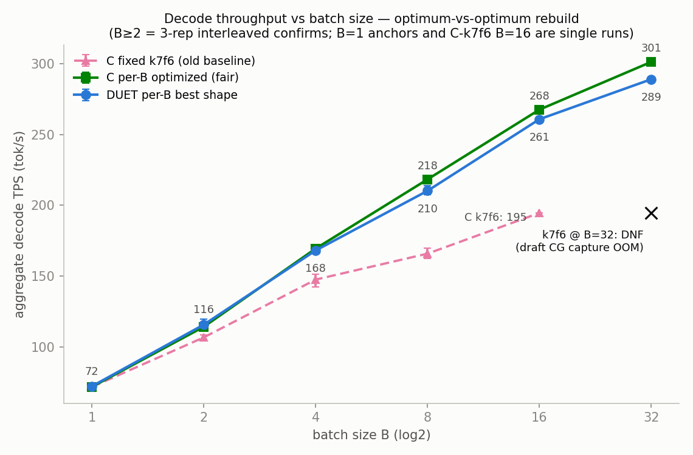
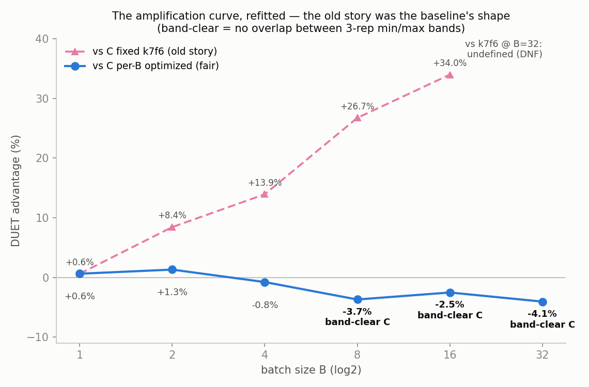
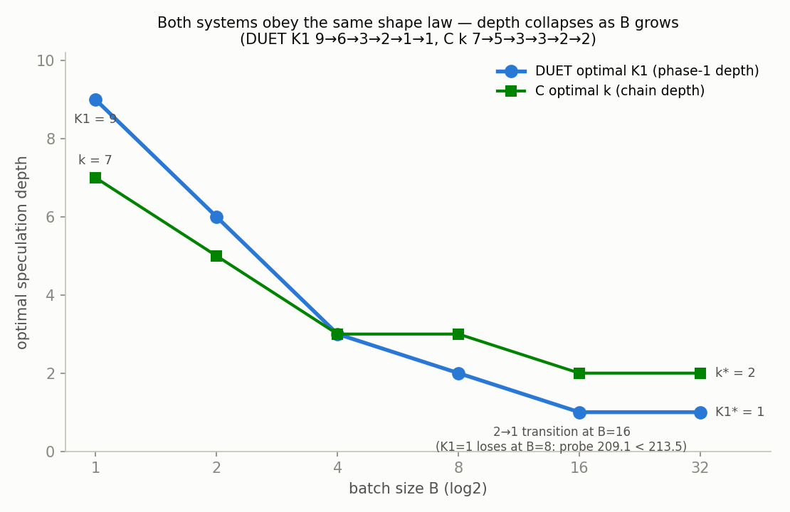
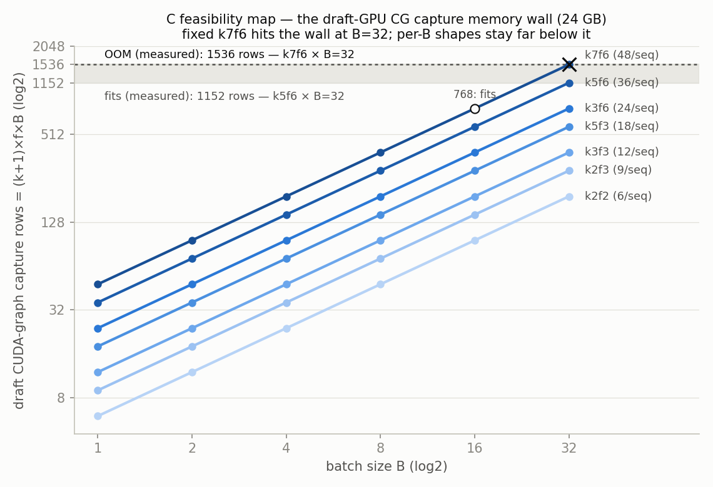
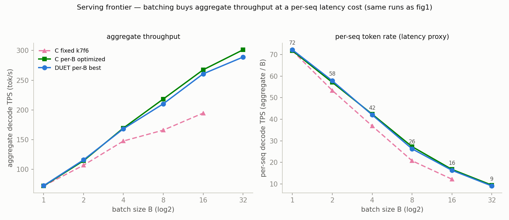

# bscale32 — B=16/32 확장 + C 공정화 재판정 (2026-07-20/21)

**질문 두 가지.** (1) B-scaling 곡선을 B=16/32까지 연장하면 증폭은
계속되는가? (2) 공정성 갭의 해소: 지금까지의 모든 B>1 비교에서 DUET은
B별로 shape을 재튜닝받은 반면, **C(비동기 SD 베이스라인)는 B=1 최적
config(k=7 f=6)에 고정되어 있었다.** C에게도 같은 per-B 최적화를
허용하면 — optimum-vs-optimum으로 곡선을 다시 그리면 — 무엇이 남는가?

## Verdict — 정직한 반전 보고 (결론부터)

**기존 B>1 band-clear 승리(+6.9% / +14.8% / +26.9%, B=2/4/8)는 튜닝되지
않은 C 베이스라인의 산물이었다.** C를 B별로 재최적화하면:

- **B ∈ {2, 4}: 동률** (DUET +1.3% / -0.8%, 3-rep 구간 겹침),
- **B ∈ {8, 16, 32}: C가 band-clear로 이긴다** (DUET -3.7% / -2.5% /
  -4.1%; 세 지점 모두 C의 최악 rep > DUET의 최고 rep).

C의 per-B 최적화 이득은 크다: k7f6 고정 대비 **+9.7% (B=2) → +13.3%
(B=4) → +35.8% (B=8) → +36.0% (B=16)**, 그리고 B=32에서는 k7f6이
draft CUDA-graph capture OOM으로 **아예 실행 불가(DNF)**인 것을 k2f2가
303.99 tok/s로 살려낸다. 즉 "DUET-over-C 증폭 곡선"에서 증폭의
대부분은 DUET이 만든 것이 아니라 **고정 베이스라인이 B와 함께 무너지는
것**이었다. DUET 쪽 수치는 캠페인 간 재현이 정확하다 (B=8 confirm
210.21 vs bscale 210.39) — 변한 것은 C뿐이다.

살아남는 것: **B=1 동률 (champion E9K24_jit, +0.5%)**, B=2의 미세 우위
(+1.3%, 겹침), **K1=1 발견** (B=16/32 DUET 내부 우승, 형상 법칙 K1
9→6→3→2→1→1로 연장), 그리고 **양 시스템이 같은 verify-폭 물리를
탄다는 형상 법칙의 일반화** (C도 k 7→5→3→3→2→2로 얕아진다). DUET은
B>1 처리량 경쟁에서는 재최적화된 C를 이기지 못한다.

## 설정

HEAD cc169e5 (`max_num_seqs` 8→32 해제 + gate smoke), GPU 0-4 (target
TP4 = 0-3, draft = 4), in=512 out=256 temp 0.7 seed 42 `--all
--max_model_len 2048`, `python -O`, timeout 1800s/cell. DUET 셀:
jit-short on, exit=56, policy b, `SSD_FORCE_SPLIT_K1K2=1`, uniform
phase-1 fan-out. C 셀: plain async-SD (`--b B --k K --f F`).
ns 규칙: B∈{2,4,8} → 12(스캔)/20(confirm, 기존과 동일), B=16 → 16,
B=32 → 32 (한 wave). 포트: 스캔 13200+/13300대, confirm 13500+ (step 2).
셀 명명: C = `cb<B>_k<K>f<F>`, DUET = `db<B>_kAxB_dCpD` (K1=A, K2=B,
dfo=C, pfo=D; k=K1+K2, f=dfo+pfo). GPU 6-7에는 이전 캠페인과 동일하게
무관한 idle vLLM 상주. 운영 기록: Phase A 러너가 cb16_k3f3 일시
크래시와 함께 1회 사망 → 재개 스크립트로 완주 (재시도 성공, 최종 전
셀 rc=0, Traceback 0건).

## 1. Phase A — C per-B 최적화 스캔 (31셀, 1-run, 전체 표는 RESULTS_scan.md)

B별 그리드 {k7f6 앵커, k5f6, k3f6, k5f3, k3f3} + 엣지 룰(최얕은 k가
이기면 한 단계 더): B=16에 k2f3/k2f2, B=32에 k2f1 추가. B=32는 k7f6
DNF(게이트 스모크 OOM)라 미실행, k5f6은 경계 프로브로 실행.

| B | k7f6 (고정) | k5f6 | k3f6 | k5f3 | k3f3 | k2f3 | k2f2 | k2f1 | **C-opt** | vs k7f6 |
|---|---|---|---|---|---|---|---|---|---|---|
| 2 | 107.97 | **118.42** | 108.85 | 113.34 | 103.89 | - | - | - | k5f6 118.42 | **+9.7%** |
| 4 | 150.37 | 152.22 | **170.40** | 147.03 | 167.59 | - | - | - | k3f6 170.40 | **+13.3%** |
| 8 | 160.61 | 190.90 | **218.08** | 198.27 | 215.34 | - | - | - | k3f6 218.08 | **+35.8%** |
| 16 | 194.57 | 213.27 | 244.36 | 216.90 | 246.17 | **264.64** | 261.36 | - | k2f3 264.64 | **+36.0%** |
| 32 | **DNF** | 235.92 | 281.60 | 242.08 | 282.81 | 301.04 | **303.99** | 296.42 | k2f2 303.99 | (비교 불가) |

**cb32_k7f6 DNF의 메커니즘**: 비동기 C의 draft는 seq당 MQ_LEN =
(k+1)×f rows를 CUDA graph로 capture한다. k7f6 = 48 rows/seq × B=32 =
**1536-row forward** — 24GB draft GPU에서 capture 중 OOM (22.4GiB 사용,
1.12GiB 할당 실패). 경계는 측정으로 좁혀졌다: **1152 rows (k5f6×32)는
fit, 1536은 OOM.** B=16의 k7f6 (768 rows)은 아직 fit (194.57). 즉 고정
k7f6 배포는 B=32에서 성능 이전에 **실행 가능성**부터 잃는다.

**C의 형상 법칙**: k* 7→5→3→3→2→2 (B=1→2→4→8→16→32), 큰 B에서 f*도
6→3→2로 수렴 (f는 MQ_LEN을 통해 draft 비용/메모리에 선형). DUET의
K1 수축과 같은 물리 — verify 폭의 시간 비용은 B에 선형, 깊이의 토큰
가치는 B-불변 — 가 plain SD에도 그대로 적용된다.

## 2. Phase B — DUET B=16/32 스캔 (10셀, 1-run)

| B | k3x3_d4p1 | k2x2_d5p1 | k2x2_d4p1 | k1x1_d7p1 | k1x1_d5p1 | k1x1_d4p1 | **DUET-opt** |
|---|---|---|---|---|---|---|---|
| 16 | 228.65 | 241.67 | 251.91 | - | **263.50** | 262.43 | k1x1_d5p1 263.50 |
| 32 | - | 268.82 | 270.82 | 288.61 | 290.32 | **290.59** | k1x1_d4p1 290.59 |

**K1=1 (사상 첫 실행)은 구조적 문제 없이 동작하며 B=16/32 모두에서
우승** — 크래시 없음, rc=0, hit 0.87-0.90. B=8 프로브(Phase C에서
실행, ns=12)에서는 209.07 < k2x2 213.51로 패배: **K1* 2→1 전환은
B=16에서 일어난다.** 형상 법칙 연장: K1 9→6→3→2→1→1.

## 3. Phase C — confirm (3-rep interleaved D/C/D/C/D/C, 전체 rep은 RESULTS_confirm.md)

| B | ns | DUET-opt | 평균 (min-max) | C-opt | 평균 (min-max) | DUET vs C-opt | 판정 |
|---|---|---|---|---|---|---|---|
| 2 | 20 | k6x5_d3p1 | 115.73 (112.46-119.45) | k5f6 | 114.24 (112.66-116.62) | **+1.3%** | 겹침 — 동률 |
| 4 | 20 | k3x3_d4p1 | 168.09 (165.74-169.79) | k3f6 | 169.43 (168.18-170.75) | **-0.8%** | 겹침 — 동률 |
| 8 | 20 | k2x2_d5p1 | 210.21 (207.40-213.98) | k3f6 | 218.30 (216.48-219.80) | **-3.7%** | **C band-clear** |
| 16 | 16 | k1x1_d5p1 | 260.72 (259.04-262.37) | k2f3 | 267.51 (264.71-269.40) | **-2.5%** | **C band-clear** |
| 32 | 32 | k1x1_d4p1 | 288.95 (288.91-289.02) | k2f2 | 301.19 (300.80-301.60) | **-4.1%** | **C band-clear** |

B=32 confirm은 전 캠페인을 통틀어 가장 타이트하다 (DUET spread ±0.02%,
C ±0.13%) — 판정에 노이즈 여지가 없다.

## 4. 재구축된 증폭 곡선 (B=1..32, 3-시리즈)

| B | DUET-opt | C-opt | C-fixed k7f6 | DUET vs C-opt | DUET vs C-fixed (구 스토리) |
|---|---|---|---|---|---|
| 1 | 72.24* | 71.80* | 71.80* | **+0.6%** (동률) | +0.5% 헤드라인 |
| 2 | 115.73 | 114.24 | 106.73† | **+1.3%** (겹침) | +6.9% band-clear였음 |
| 4 | 168.09 | 169.43 | 147.53† | **-0.8%** (겹침) | +14.8% band-clear였음 |
| 8 | 210.21 | 218.30 | 165.85† | **-3.7%** (C band-clear) | +26.9% band-clear였음 |
| 16 | 260.72 | 267.51 | 194.57 (스캔 1-run) | **-2.5%** (C band-clear) | (+34.0% — 무의미해진 비교) |
| 32 | 288.95 | 301.19 | **DNF** | **-4.1%** (C band-clear) | 비교 불가 |

\* B=1: bscale 동일-레짐 앵커 (1-run, ns=12). † 기존 캠페인의 3-rep
confirm (pb_sweep/bscale) — 구 헤드라인의 원 수치.

구 증폭 곡선 +0.6 → +6.9 → +14.8 → +26.9%는 **베이스라인 곡선의 붕괴
곡선**이었다: C-fixed는 B=8에서 이미 C-opt보다 -24% 아래에 있었고
(165.85 vs 218.30), B=32에서는 곡선에서 탈락한다. 공정한 곡선에서 DUET은
B=1..4 동률, B≥8에서 -2.5..-4.1%로 일관되게 뒤진다.

## 5. 메커니즘 — 왜 뒤집혔고, 왜 그래도 격차는 작은가

confirm run.log 3-rep 평균 (DUET / C-opt):

| B | tok/step | t_step (ms) | R = tok비 × 시간비 | hit | T_verify (ms) | T_draft (ms) | verify rows/step |
|---|---|---|---|---|---|---|---|
| 8 | 2.36 / 2.82 | 90.0 / 103.4 | 0.837 × 1.149 = **0.962** | 0.877 / 0.783 | 80.5 / 90.9 | 67.4 / 31.2 | 24 / 32 |
| 16 | 1.77 / 2.39 | 108.6 / 143.0 | 0.741 × 1.317 = **0.975** | 0.900 / 0.753 | 96.7 / 123.4 | 75.4 / 22.0 | 32 / 48 |
| 32 | 1.78 / 2.38 | 197.1 / 253.2 | 0.747 × 1.285 = **0.960** | 0.897 / 0.708 | 174.1 / 218.7 | 135.6 / 29.0 | 64 / 96 |

1. **verify-폭 물리는 시스템을 가리지 않는다.** bscale에서 확립한 법칙
   — verify row의 한계 비용 ≈ row당 2.25ms × B, 깊이의 토큰 가치는
   B-불변 — 는 C에도 그대로 적용되고, C는 k를 낮추는 것만으로 그
   이득을 전부 회수한다. B=8에서 C k7f6→k3f6은 verify 64→32 rows,
   t_step 184.7→103.4 ms를 되사면서 tok/step은 3.83→2.82로만 낮아진다.
   기존 비교에서 DUET만 누리던 "얕은 형상 배당"이 공유되는 순간, 남는
   것은 두 시스템의 구조 차이뿐이다.
2. **DUET은 시간 축에서 이기고 토큰 축에서 진다 — 그리고 합이 살짝
   모자란다.** 모든 B≥8에서 DUET의 t_step이 더 짧다 (verify rows/seq
   K1+1=2 vs C의 k+1=3; B=32에서 T_verify 174 vs 219 ms). 그러나
   tok/step 1.78 vs 2.38 (0.75배): DUET k1x1의 speculation 깊이는 C
   k2와 같은 2인데, 두 번째 토큰이 **off-policy proxy 연속** (L_p2
   0.62)이라 on-policy draft 체인의 두 번째 위치(수락 ≈ 0.69)보다
   가치가 낮고, phase-1은 K1=1로 잘려 L_p1 0.81이 상한이다. 이
   토큰-품질 격차 (finding 5a의 off-policy 연속 품질 문제)가 시간
   이득 1.28배를 0.96으로 끌어내린다.

   **⚠ [정정 2026-07-21 — matched-shape 검증]** 위 서술은 서로 다른
   형상(k1x1 vs k2)의 confirm을 비교한 것이라 "토큰 열위"를 격차의
   원인처럼 읽히게 하지만, 사용자의 불변량 논증("같은 draft가 토큰을
   만드니 같은 깊이면 accepted length는 같아야 한다")을 같은 깊이
   스캔 셀로 검증한 결과 **불변량이 성립한다**:
   db32_k2x2_d4p1 vs cb32_k2f2 (둘 다 체인 깊이 2, verify 3행/seq =
   96행) — tok/step **2.38 vs 2.40** (동일), hit-시 2.41 vs 2.52 ×
   hit율 0.88 vs 0.70 (조성만 다르고 합계 동일); B=16 짝
   (db16_k2x2_d4p1 vs cb16_k2f3)도 **2.36 vs 2.39** (동일). 즉 구현
   결함도, 총량 수준의 토큰-품질 격차도 없다. 같은 형상에서의 진짜
   격차는 전부 **verify 내부 시간**이다: 같은 96행에서 T_verify
   248.6 vs 221.1 ms (+27.5 ms, +12.4%), t_step 격차 +27.0 ms와
   정확히 일치 (B=16: T_verify +10.4 ms ≈ t_step 격차 +10.9 ms).
   이 +12%는 mid-verify DUET 블록(early-exit hidden 수집 + proxy
   α̂/ĥ/P_iv 계산 + wire 송신)이 B×rows에 비례해 커진 비용으로, B=1
   에서 "rendezvous mirage"(비병목)로 판정됐던 그 블록이 큰 B에서
   임계 경로가 된 것이다. DUET이 k1x1로 미끄러진 것은 이 오버헤드를
   토큰을 팔아 시간으로 상쇄하려는 합리적 내부 최적화다(t_step
   305.8→220.3 ms). 따라서 처방의 1순위는 L_p2(토큰 축)가 아니라
   **mid-verify proxy 블록의 시간 제거**다 — B==1 전용으로 게이트된
   exit_topm_gather(수집량 축소)/proxy_on_draft(임계 경로 이탈)를
   B>1로 배치화하는 것이 정확히 이 27 ms를 겨냥한다. 단, 오버헤드를
   전부 회수해도 matched-shape은 동률(≈304)이지 역전이 아니다 —
   역전하려면 회수 후 hit 우위(0.88 vs 0.70)가 화폐가 되는 더 깊은
   형상/비싼-miss 레짐으로 이동해야 한다.

   **⚠ [재정정 2026-07-21 — B=32 PROFILE 검증, overlap_profile/]**
   위 문단의 "+27ms = proxy 블록" 귀속은 프로파일로 반증됐다:
   `proxy_compute_send`는 **0.81 ms/step**, exit_logits 1.30 ms —
   proxy 기계장치는 무죄다. 실제 거처는 **exit-이전 CG 세그먼트
   (graph_pre)**: DUET 3.31 ms/layer vs C 2.79 (exit-이후는 2.63으로
   C보다 빠름) — 같은 GEMM이 exit 앞에서만 +19% 느리고, C-속도 환산
   초과분 +29.1 ms가 격차 전부를 설명한다 (후보: TP rank 진입 시차의
   첫 collective 흡수, duet_verify CG capture 품질; rank1-3 프로파일
   필요 — 미해결). 또한 타임라인 검증으로 **overlap 자체는 확인**:
   draft 실작업(68 ms/step, bench의 204 ms는 대기 포함)의 98.8%가
   target-busy 아래 숨고(C도 98.7%), spec_wait는 양쪽 동일 ~14
   ms/step. 따라서 exit_topm_gather/proxy_on_draft 배치화의 기대
   회수는 ~2 ms로 하향; 27 ms 표적은 graph_pre 자체다. 상세:
   overlap_profile/RESULTS.md + 타임라인 그림 2종.
3. **hit 우위는 큰 B에서 화폐 가치를 잃는다.** DUET hit 0.90 vs C
   0.71-0.78은 여전하지만, any-miss 부담 1-hit^B는 B=16에서 0.82 vs
   0.99, B=32에서 0.97 vs ~1.00 — **양쪽 모두 사실상 매 step 어딘가는
   miss인 레짐**이라 "stall 회피"의 빈도 차이가 소멸한다. 게다가
   finding 1 (wrong currency) 그대로, hit은 토큰을 나르지 않는다 —
   M2의 hit/miss 혼합 설계 덕에 DUET의 step은 miss 하나에 깨지지
   않지만, 그것은 C도 마찬가지다 (per-seq 독립 체인).
4. **DUET의 2-phase 파이프라인 비용은 구조적이다.** draft 측 step
   시간이 B=32에서 135.6 ms vs C의 29.0 ms — phase-1 forwards + exit
   rendezvous 대기 + proxy 소비 + phase-2 forwards + JIT 준비의
   합이다. target-bound (217 ms)라 직접 병목은 아니지만 slack이 B와
   함께 줄고 (B=8: 67 vs 99 ms, B=32: 136 vs 217 ms), 이 기계장치가
   사주는 것(K1+1 verify rows, proxy 연속)의 토큰 가치가 C의 단순
   체인보다 낮은 것이 위 2번이다.
5. **C의 f 수축은 메모리 벽의 그림자다.** C-opt의 f*는 B≥16에서
   6→3→2로 무너진다: MQ_LEN=(k+1)×f가 draft CG rows와 capture 메모리에
   선형이라, 폭도 공짜가 아니게 된다. k7f6은 그 벽(1152~1536 rows
   사이, 24GB)에 B=32에서 충돌한다 — fig4.

## 6. 무엇이 살아남는가

1. **B=1 champion은 무사하다.** E9K24_jit +0.5% (5-rep 헤드라인) /
   +0.6% (동일-레짐 앵커) — 이 캠페인은 B=1 결론을 건드리지 않는다.
2. **K1=1 발견**: v1 구현이 K1=K2=1까지 그대로 동작함을 처음 확인
   (전 셀 rc=0, B=32에서 spread ±0.02%). 형상 법칙 K1 9→6→3→2→1→1과
   전환점 (2→1은 B=16; B=8 프로브 209.07 < 213.51) 확정.
3. **형상 법칙의 일반화**: "B가 두 배면 깊이 한 단계 하락"은 DUET
   고유가 아니라 speculation 일반의 법칙 — C의 k*가 같은 곡선을
   그린다 (fig3). 이것이 이 캠페인의 가장 재사용 가치 높은 결과다.
4. **고정-형상 C의 취약성**: k7f6는 B=32에서 DNF — per-B 재튜닝 없는
   SD 배포는 성능(-24..-36%) 이전에 실행 가능성부터 잃는다. DUET의
   얕은 형상들은 draft 메모리 발자국이 작아 이 벽에서 멀다.
5. **미측정 DUET-우호 레짐** (이 캠페인이 닫지 않은 문): 토큰이 더
   비싼 레짐 (긴 context, 더 큰 target, 비싼 sampling — 최적점이 깊이
   쪽으로 회귀하며 DUET의 proxy 연속이 상대적으로 저평가된 자산이
   된다), draft-compute-bound 설정 (동일 draft 예산에서 DUET의 K1+K2
   분할이 유리해지는 지점), 그리고 off-policy 연속 품질 (L_p2 0.62 —
   draft adaptation으로 올릴 수 있다면 위 2번의 토큰 격차가 직접
   줄어든다). 모두 finding 5의 기존 목록과 일치하며, B>1 처리량 축은
   이제 그 목록에서 제외된다. **[정정 2026-07-21: §5.2 정정 블록에
   따라 레버 우선순위가 바뀐다 — 1순위는 mid-verify proxy 블록의
   시간 제거(B>1 배치화된 exit_topm_gather/proxy_on_draft), L_p2는
   그 다음이다.]**

## 7. Figures

**Fig 1 — aggregate decode TPS vs B, 3-시리즈.** 공정한 두 곡선
(DUET-opt, C-opt)은 B 전 구간에서 거의 겹치고 (B≥8에서 C가 소폭 위),
구 베이스라인 C-fixed(k7f6)만 B=4부터 이탈해 B=32에서 DNF로 탈락한다.
구 증폭 곡선의 "벌어지는 격차"는 파란-분홍 간격, 즉 베이스라인의
붕괴였다.

**Fig 2 — 증폭 곡선의 재적합.** 같은 DUET 측정치를 두 베이스라인에
대해 그린 것: vs C-fixed (분홍 점선, 구 스토리 — 이 시리즈는 금일
DUET confirm을 과거 C-fixed confirm rep과 짝지은 것이라 구 헤드라인
+6.9/+14.8/+26.9와 1%p 내외로 다르다)는 +34%까지 치솟지만, vs C-opt
(파랑, 공정)는 +1.3% → -0.8% → -3.7% → -2.5% → -4.1%로 0 아래에
정착한다. B≥8의 세 지점은 C 쪽 band-clear.

**Fig 3 — 형상 법칙은 시스템-불변이다.** DUET K1* (9→6→3→2→1→1)과 C
k* (7→5→3→3→2→2)가 같은 모양으로 무너진다 — 둘 다 verify-폭 비용
(B에 선형) 대 깊이 토큰 가치 (B-불변)의 같은 frontier를 탄다. K1*
2→1 전환은 B=16 (B=8 프로브에서 K1=1은 -2.1%로 패배).

**Fig 4 — C의 실행 가능성 지도.** 비동기 C의 draft CG capture rows =
(k+1)×f×B. 측정으로 좁힌 24GB 벽: 1152 rows는 fit (cb32_k5f6), 1536은
OOM (k7f6×32, 게이트 스모크). 고정 k7f6 선은 B=32에서 벽을 뚫고
(X 마커), per-B 최적 형상들 (k2f3/k2f2)은 벽에서 한참 아래를 지난다 —
per-B 재튜닝은 성능 문제이기 전에 배포 가능성 문제다.

**Fig 5 — serving frontier.** aggregate (왼쪽)와 per-seq 토큰 속도
(오른쪽, aggregate/B). 공정화 후 두 시스템의 frontier는 사실상
포개진다 — B=32에서 DUET 9.0 vs C 9.4 tok/s/seq. bscale에서 그렸던
"DUET frontier가 C 위" 그림은 C-fixed에 대해서만 참이었다.

## 8. 권장 per-B config (공정화 반영, 최종)

**B>1 처리량이 목표라면 SD-best는 per-B 재최적화된 plain async-SD다:**

| B | 권장 시스템 | config | TPS (confirm) |
|---|---|---|---|
| 1 | DUET E9K24_jit ≈ C k7f6 (동률) | 기존 champion CLI | 72.2 / 71.8 |
| 2 | C k5f6 ≈ DUET k6x5_d3p1 (동률) | `--k 5 --f 6` | 114.24 / 115.73 |
| 4 | C k3f6 ≈ DUET k3x3_d4p1 (동률) | `--k 3 --f 6` | 169.43 / 168.09 |
| 8 | **C k3f6** | `--k 3 --f 6` | **218.30** |
| 16 | **C k2f3** | `--k 2 --f 3` | **267.51** |
| 32 | **C k2f2** | `--k 2 --f 2` | **301.19** |

DUET 내부 최적 형상 (참고, DUET을 쓸 이유가 있는 레짐용): B=16
k1x1_d5p1, B=32 k1x1_d4p1 (`--k 2 --duet_phase1_k 1 --duet_phase2_k 1
--duet_draft_fan_out 5|4 --f 6|5`). 어떤 시스템이든 **k7f6을 B>1에
그대로 들고 가면 안 된다** — B=8에서 -24..-27%, B=32에서 DNF.

## 9. Caveats (주의사항)

1. **스캔은 셀당 1-run** (±3-4% 노이즈): 스캔 순위 (예: B=32 k2f2
   303.99 vs k2f3 301.04, B=16 k1x1_d5p1 263.50 vs d4p1 262.43)는
   분해 불가 — 판정은 전부 3-rep interleaved confirm에서 나온다.
2. **ns가 B마다 다르다** (12/16/20/32) — B 간 절대 TPS 비교에는
   admission/tail 효과가 섞인다. 같은 B 안의 D-vs-C 판정은 동일
   ns/seed/interleave라 안전하다. B∈{2,4,8} confirm ns=20은 기존
   캠페인과 동일해 cross-campaign 재현 확인이 성립한다 (210.21 vs
   210.39).
3. **B=1 지점은 bscale 앵커의 재인용** (같은 조건, 전일) — 이 캠페인
   에서 재실행하지 않았다.
4. **fig2의 vs C-fixed 시리즈는 cross-day 혼합** (금일 DUET confirm ÷
   과거 C-fixed rep) — 역사적 헤드라인과 1%p 내외 차이. 공정 시리즈
   (vs C-opt)는 전부 동일-세션 interleaved.
5. **C-fixed B=16 지점은 스캔 1-run** (194.57, ns=16) — C-fixed는 이
   캠페인의 피고이지 판정 기준이 아니므로 confirm하지 않았다.
6. **레짐 한정**: out=256, in=512, temp 0.7, 프롬프트 셋 하나 (--all,
   seed 42), 이 하드웨어 (RTX 3090 ×5, AWQ W4A16 70B + TinyLlama 1B).
   토큰 비용이 달라지는 레짐에서는 §6.5의 미측정 문이 열려 있다.
7. **엣지 미소진**: B=32 C에서 k2f2가 우승했고 k2f1 (296.42)로 f 축
   엣지는 닫았지만 k1은 tree-SD로 무의미해 열지 않았다. DUET B=32는
   k1x1_d4p1 우승으로 dfo 축 아래(d3p1)는 미측정 — 스캔 간격 0.3
   이내라 판정에는 영향 없다.

재현: `run_scan_c.sh` (Phase A) + `run_resume_ab.sh`/`run_edge_c.sh`
(재개 + Phase B + 엣지) + `run_confirm32.sh` (프로브 + 5×3-rep confirm,
승자 형상 하드코딩 아님 — 프로브 결과로 B=8 형상 분기), `extract.py`
(표), `plot_figs.py` (figs/). 셀별 raw run.log는 `cb*/db*/`와
`confirm32/`에 (uncommitted, standing prune policy). 이전 데이터:
`../bscale/REPORT.md`, `../pb_sweep/RESULTS.md`.
