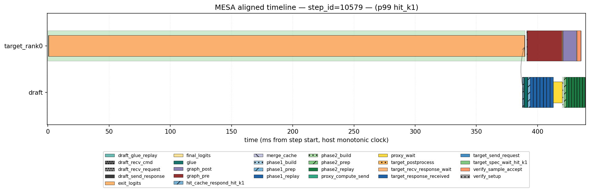
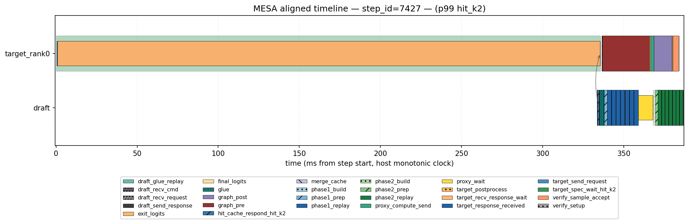
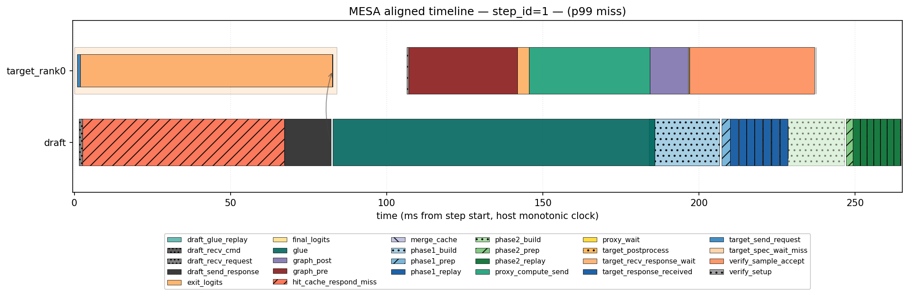

# Final p99 attribution — target_spec_wait

**Target JSON**: `mesa_profile_target_rank0_184434.json` (161124 spans)
**Draft JSON**:  `mesa_profile_draft_184439.json` (510228 spans)

## 1. Per-status target_spec_wait stats

| status | n | mean | p50 | p90 | p99 | max | total (ms) |
|---|---:|---:|---:|---:|---:|---:|---:|
| hit_k1 | 7524 | 4.458 | 4.305 | 5.536 | 6.207 | 389.718 | 33541.76 |
| hit_k2 | 3201 | 4.367 | 4.157 | 5.458 | 6.242 | 335.619 | 13977.89 |
| miss | 2702 | 16.552 | 16.522 | 17.907 | 18.616 | 84.042 | 44722.57 |

## 2. Top-N target_spec_wait outliers and draft attribution

### status = hit_k1

**step_id=10579  target_spec_wait=389.718 ms**

window: 389.188 ms (wall ns 300854663249606 → 300855052437106)

| draft label | draft step_id | Δstep | overlap (ms) | share (%) |
|---|---:|---:|---:|---:|
| `phase1_replay` | 10578 | -1 | 18.188 | 4.7 |
| `phase2_replay` | 10578 | -1 | 14.312 | 3.7 |
| `phase2_prep` | 10578 | -1 | 2.438 | 0.6 |
| `phase2_build` | 10578 | -1 | 0.875 | 0.2 |
| `hit_cache_respond_hit_k1` | 10579 | +0 | 0.875 | 0.2 |
| `phase1_prep` | 10578 | -1 | 0.688 | 0.2 |
| `draft_recv_request` | 10579 | +0 | 0.375 | 0.1 |
| `glue` | 10579 | +0 | 0.355 | 0.1 |
| `draft_send_response` | 10579 | +0 | 0.250 | 0.1 |
| `merge_cache` | 10578 | -1 | 0.062 | 0.0 |

**step_id=4923  target_spec_wait=300.788 ms**

window: 300.000 ms (wall ns 300546378968356 → 300546678968356)

| draft label | draft step_id | Δstep | overlap (ms) | share (%) |
|---|---:|---:|---:|---:|
| `phase1_replay` | 4922 | -1 | 16.312 | 5.4 |
| `phase2_replay` | 4922 | -1 | 13.125 | 4.4 |
| `phase2_prep` | 4922 | -1 | 2.625 | 0.9 |
| `phase2_build` | 4922 | -1 | 0.969 | 0.3 |
| `hit_cache_respond_hit_k1` | 4923 | +0 | 0.969 | 0.3 |
| `phase1_prep` | 4922 | -1 | 0.656 | 0.2 |
| `draft_recv_request` | 4923 | +0 | 0.344 | 0.1 |
| `draft_send_response` | 4923 | +0 | 0.250 | 0.1 |
| `glue` | 4923 | +0 | 0.199 | 0.1 |
| `merge_cache` | 4922 | -1 | 0.062 | 0.0 |

**step_id=1282  target_spec_wait=232.377 ms**

window: 231.578 ms (wall ns 300347748101168 → 300347979679293)

| draft label | draft step_id | Δstep | overlap (ms) | share (%) |
|---|---:|---:|---:|---:|
| `phase1_replay` | 1281 | -1 | 15.633 | 6.8 |
| `phase2_replay` | 1281 | -1 | 12.602 | 5.4 |
| `phase2_prep` | 1281 | -1 | 2.523 | 1.1 |
| `hit_cache_respond_hit_k1` | 1282 | +0 | 0.938 | 0.4 |
| `phase2_build` | 1281 | -1 | 0.898 | 0.4 |
| `phase1_prep` | 1281 | -1 | 0.680 | 0.3 |
| `draft_recv_request` | 1282 | +0 | 0.352 | 0.2 |
| `draft_send_response` | 1282 | +0 | 0.242 | 0.1 |
| `glue` | 1282 | +0 | 0.066 | 0.0 |
| `draft_recv_cmd` | 1281 | -1 | 0.055 | 0.0 |

**step_id=2  target_spec_wait=29.538 ms**

window: 28.924 ms (wall ns 300278921808596 → 300278950732485)

| draft label | draft step_id | Δstep | overlap (ms) | share (%) |
|---|---:|---:|---:|---:|
| `phase2_replay` | 1 | -1 | 14.063 | 48.6 |
| `phase2_build` | 1 | -1 | 8.609 | 29.8 |
| `phase2_prep` | 1 | -1 | 2.723 | 9.4 |
| `hit_cache_respond_hit_k1` | 2 | +0 | 1.207 | 4.2 |
| `draft_recv_request` | 2 | +0 | 0.355 | 1.2 |
| `draft_send_response` | 2 | +0 | 0.230 | 0.8 |
| `glue` | 2 | +0 | 0.123 | 0.4 |
| `merge_cache` | 1 | -1 | 0.070 | 0.2 |
| `draft_recv_cmd` | 1 | -1 | 0.051 | 0.2 |

**step_id=7608  target_spec_wait=7.456 ms**

window: 7.000 ms (wall ns 300693235093356 → 300693242093356)

| draft label | draft step_id | Δstep | overlap (ms) | share (%) |
|---|---:|---:|---:|---:|
| `phase2_replay` | 7607 | -1 | 4.457 | 63.7 |
| `hit_cache_respond_hit_k1` | 7608 | +0 | 0.844 | 12.1 |
| `glue` | 7608 | +0 | 0.324 | 4.6 |
| `draft_recv_request` | 7608 | +0 | 0.312 | 4.5 |
| `draft_send_response` | 7608 | +0 | 0.250 | 3.6 |
| `phase2_prep` | 7607 | -1 | 0.188 | 2.7 |
| `merge_cache` | 7607 | -1 | 0.062 | 0.9 |
| `draft_recv_cmd` | 7607 | -1 | 0.031 | 0.4 |

### status = hit_k2

**step_id=7427  target_spec_wait=335.619 ms**

window: 335.031 ms (wall ns 300683138468356 → 300683473499606)

| draft label | draft step_id | Δstep | overlap (ms) | share (%) |
|---|---:|---:|---:|---:|
| `phase1_replay` | 7426 | -1 | 18.188 | 5.4 |
| `phase2_replay` | 7426 | -1 | 14.312 | 4.3 |
| `phase2_prep` | 7426 | -1 | 2.469 | 0.7 |
| `phase2_build` | 7426 | -1 | 0.938 | 0.3 |
| `hit_cache_respond_hit_k2` | 7427 | +0 | 0.875 | 0.3 |
| `phase1_prep` | 7426 | -1 | 0.656 | 0.2 |
| `glue` | 7427 | +0 | 0.324 | 0.1 |
| `draft_recv_request` | 7427 | +0 | 0.312 | 0.1 |
| `draft_send_response` | 7427 | +0 | 0.219 | 0.1 |
| `merge_cache` | 7426 | -1 | 0.062 | 0.0 |

**step_id=2922  target_spec_wait=262.628 ms**

window: 262.000 ms (wall ns 300437368515231 → 300437630515231)

| draft label | draft step_id | Δstep | overlap (ms) | share (%) |
|---|---:|---:|---:|---:|
| `phase1_replay` | 2921 | -1 | 17.000 | 6.5 |
| `phase2_replay` | 2921 | -1 | 13.688 | 5.2 |
| `phase2_prep` | 2921 | -1 | 2.547 | 1.0 |
| `phase2_build` | 2921 | -1 | 0.906 | 0.3 |
| `hit_cache_respond_hit_k2` | 2922 | +0 | 0.891 | 0.3 |
| `phase1_prep` | 2921 | -1 | 0.672 | 0.3 |
| `draft_recv_request` | 2922 | +0 | 0.312 | 0.1 |
| `draft_send_response` | 2922 | +0 | 0.234 | 0.1 |
| `glue` | 2922 | +0 | 0.152 | 0.1 |
| `merge_cache` | 2921 | -1 | 0.047 | 0.0 |

**step_id=7030  target_spec_wait=6.718 ms**

window: 6.281 ms (wall ns 300661421812106 → 300661428093356)

| draft label | draft step_id | Δstep | overlap (ms) | share (%) |
|---|---:|---:|---:|---:|
| `phase2_replay` | 7029 | -1 | 3.738 | 59.5 |
| `hit_cache_respond_hit_k2` | 7030 | +0 | 0.969 | 15.4 |
| `draft_recv_request` | 7030 | +0 | 0.375 | 6.0 |
| `glue` | 7030 | +0 | 0.262 | 4.2 |
| `draft_send_response` | 7030 | +0 | 0.250 | 4.0 |
| `phase2_prep` | 7029 | -1 | 0.094 | 1.5 |
| `merge_cache` | 7029 | -1 | 0.062 | 1.0 |
| `draft_recv_cmd` | 7029 | -1 | 0.031 | 0.5 |

**step_id=10422  target_spec_wait=6.592 ms**

window: 6.125 ms (wall ns 300846040687106 → 300846046812106)

| draft label | draft step_id | Δstep | overlap (ms) | share (%) |
|---|---:|---:|---:|---:|
| `phase2_replay` | 10421 | -1 | 3.707 | 60.5 |
| `hit_cache_respond_hit_k2` | 10422 | +0 | 0.875 | 14.3 |
| `draft_recv_request` | 10422 | +0 | 0.375 | 6.1 |
| `glue` | 10422 | +0 | 0.355 | 5.8 |
| `draft_send_response` | 10422 | +0 | 0.250 | 4.1 |
| `phase2_prep` | 10421 | -1 | 0.062 | 1.0 |
| `merge_cache` | 10421 | -1 | 0.062 | 1.0 |
| `draft_recv_cmd` | 10421 | -1 | 0.062 | 1.0 |

**step_id=385  target_spec_wait=6.528 ms**

window: 6.109 ms (wall ns 300299655747652 → 300299661857027)

| draft label | draft step_id | Δstep | overlap (ms) | share (%) |
|---|---:|---:|---:|---:|
| `phase2_replay` | 384 | -1 | 4.006 | 65.6 |
| `hit_cache_respond_hit_k2` | 385 | +0 | 0.836 | 13.7 |
| `draft_recv_request` | 385 | +0 | 0.312 | 5.1 |
| `draft_send_response` | 385 | +0 | 0.227 | 3.7 |
| `glue` | 385 | +0 | 0.131 | 2.1 |
| `phase2_prep` | 384 | -1 | 0.102 | 1.7 |
| `merge_cache` | 384 | -1 | 0.059 | 1.0 |
| `draft_recv_cmd` | 384 | -1 | 0.047 | 0.8 |

### status = miss

**step_id=1  target_spec_wait=84.042 ms**

window: 81.720 ms (wall ns 300278684807885 → 300278766528208)

| draft label | draft step_id | Δstep | overlap (ms) | share (%) |
|---|---:|---:|---:|---:|
| `hit_cache_respond_miss` | 1 | +0 | 64.531 | 79.0 |
| `draft_send_response` | 1 | +0 | 14.727 | 18.0 |
| `draft_recv_request` | 1 | +0 | 1.109 | 1.4 |
| `draft_recv_cmd` | None | n/a | 0.543 | 0.7 |

**step_id=904  target_spec_wait=21.478 ms**

window: 17.906 ms (wall ns 300327367616793 → 300327385523043)

| draft label | draft step_id | Δstep | overlap (ms) | share (%) |
|---|---:|---:|---:|---:|
| `hit_cache_respond_miss` | 904 | +0 | 13.430 | 75.0 |
| `phase2_replay` | 903 | -1 | 3.059 | 17.1 |
| `draft_recv_request` | 904 | +0 | 0.367 | 2.1 |
| `draft_send_response` | 904 | +0 | 0.250 | 1.4 |
| `phase2_prep` | 903 | -1 | 0.133 | 0.7 |
| `glue` | 904 | +0 | 0.074 | 0.4 |
| `merge_cache` | 903 | -1 | 0.062 | 0.3 |
| `draft_recv_cmd` | 903 | -1 | 0.047 | 0.3 |

**step_id=1014  target_spec_wait=19.074 ms**

window: 18.633 ms (wall ns 300333363276949 → 300333381909762)

| draft label | draft step_id | Δstep | overlap (ms) | share (%) |
|---|---:|---:|---:|---:|
| `hit_cache_respond_miss` | 1014 | +0 | 13.367 | 71.7 |
| `phase2_replay` | 1013 | -1 | 3.945 | 21.2 |
| `draft_recv_request` | 1014 | +0 | 0.328 | 1.8 |
| `draft_send_response` | 1014 | +0 | 0.258 | 1.4 |
| `phase2_prep` | 1013 | -1 | 0.109 | 0.6 |
| `glue` | 1014 | +0 | 0.109 | 0.6 |
| `merge_cache` | 1013 | -1 | 0.062 | 0.3 |
| `draft_recv_cmd` | 1013 | -1 | 0.047 | 0.3 |

**step_id=457  target_spec_wait=19.072 ms**

window: 18.645 ms (wall ns 300303526108981 → 300303544753512)

| draft label | draft step_id | Δstep | overlap (ms) | share (%) |
|---|---:|---:|---:|---:|
| `hit_cache_respond_miss` | 457 | +0 | 13.316 | 71.4 |
| `phase2_replay` | 456 | -1 | 4.016 | 21.5 |
| `draft_recv_request` | 457 | +0 | 0.332 | 1.8 |
| `draft_send_response` | 457 | +0 | 0.230 | 1.2 |
| `glue` | 457 | +0 | 0.109 | 0.6 |
| `phase2_prep` | 456 | -1 | 0.105 | 0.6 |
| `merge_cache` | 456 | -1 | 0.059 | 0.3 |
| `draft_recv_cmd` | 456 | -1 | 0.051 | 0.3 |

**step_id=576  target_spec_wait=19.038 ms**

window: 18.621 ms (wall ns 300309788544527 → 300309807165621)

| draft label | draft step_id | Δstep | overlap (ms) | share (%) |
|---|---:|---:|---:|---:|
| `hit_cache_respond_miss` | 576 | +0 | 13.266 | 71.2 |
| `phase2_replay` | 575 | -1 | 4.037 | 21.7 |
| `draft_recv_request` | 576 | +0 | 0.320 | 1.7 |
| `draft_send_response` | 576 | +0 | 0.242 | 1.3 |
| `glue` | 576 | +0 | 0.115 | 0.6 |
| `phase2_prep` | 575 | -1 | 0.109 | 0.6 |
| `merge_cache` | 575 | -1 | 0.062 | 0.3 |
| `draft_recv_cmd` | 575 | -1 | 0.055 | 0.3 |
