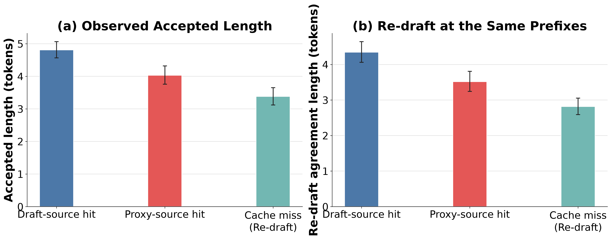
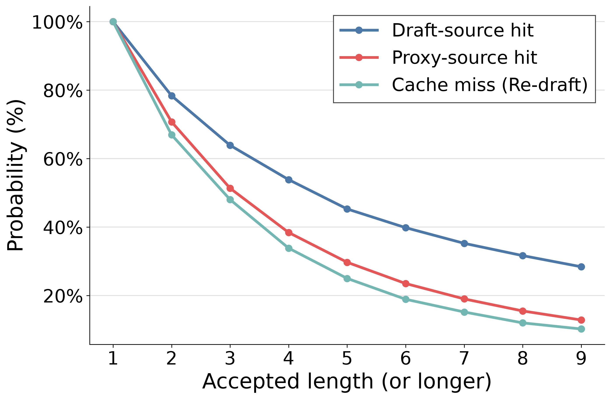

# K1=K2=8 chain source-difficulty study

## 결론

분기 구조와 TPS를 배제하고 `K1=K2=8`인 chain만 비교하면, correction token을
포함한 조건부 accepted length(AL)는 **Draft-source 4.806 > Proxy-source
4.031 > cache miss 3.381** 순서였다. 같은 질문 안에서 비교한
`Proxy-source−Draft-source` 차이는 -0.722 token
`[-0.952, -0.491]`이고, 여섯 Spec-Bench subtask에서 모두 음수였다.

이 결과는 “Proxy-source 생성기가 본질적으로 Draft-source보다 나쁘다”는 뜻이
아니다. 현재 lookup은 Draft-source를 먼저 검사하므로 Proxy-source hit는
`Draft-source miss ∩ Proxy-source hit`인 residual set이다. 즉 Proxy-source는
Draft-source가 회수하지 못한 조건부로 더 어려운 위치를 추가로 포착한다. Cache와
무관하게 실제 확정 prefix에서 TinyLlama를 새로 평가한 결과도 같은 순서였으므로,
관찰된 차이를 Proxy-source cache token/logit 손상으로 설명하기는 어렵다.

## 실험 통제

- LayerSkip Llama-2-70B target, TinyLlama-1.1B draft, exit layer 56
- Draft-source(P1)/Proxy-source(P2) 모두 chain, `K1=K2=8`
- temperature 0.7, top-p 1.0, seed 42, raw prompt
- output cap 512, native context 2,048, RoPE extension 없음
- 영역별 20질문: MT-Bench, Translation, Summarization, QA, Math, RAG
  총 120질문/140 turns
- MT-Bench 두 turn은 한 질문으로 묶고 question-mean과 question-bootstrap
  95% CI 사용
- AL은 전체 AL과 동일하게 correction/recovery token 1개 포함

이 실험은 phase 난이도 통제가 목적이므로 TPS는 해석하지 않는다. Tree arm과
후속 tree parameter 탐색 결과도 논문 근거에서 제외한다.

## Served speculation

| Source | Events | Questions | Question-mean AL [95% CI] | P(AL=1) | P(AL>=5) | valid-k |
|---|---:|---:|---:|---:|---:|---:|
| Draft-source | 7,190 | 116 | 4.806 [4.569, 5.065] | 0.216 | 0.453 | 8 |
| Proxy-source | 2,160 | 110 | 4.031 [3.759, 4.320] | 0.293 | 0.297 | 8 |
| Cache miss (Re-draft) | 1,855 | 120 | 3.381 [3.120, 3.653] | 0.330 | 0.250 | 8 |

| Paired contrast | Shared questions | Mean difference [95% CI] | 음수인 질문 비율 |
|---|---:|---:|---:|
| Proxy-source − Draft-source | 110 | -0.722 [-0.952, -0.491] | 73.6% |
| Cache miss − Draft-source | 116 | -1.343 [-1.662, -1.035] | 82.8% |
| Proxy-source − Cache miss | 110 | +0.633 [+0.336, +0.962] | 32.7% |

Subtask별 `Proxy-source−Draft-source` 차이도 모두 음수였다.

| MT-Bench | Translation | Summarization | QA | Math | RAG |
|---:|---:|---:|---:|---:|---:|
| -0.736 | -0.862 | -0.293 | -0.293 | -1.320 | -0.831 |

## Cache-independent Re-draft

각 fully observed step의 실제 확정 prefix에서 cache를 사용하지 않고
TinyLlama를 teacher-forcing하여 다음 8 token의 greedy agreement와 첫-token
NLL을 다시 계산했다. 이 값은 stochastic verifier AL이 아니라 해당 prefix에
대한 cache-independent draft-difficulty proxy이다.

| Source | Re-draft agreement [95% CI] | First-token NLL [95% CI] |
|---|---:|---:|
| Draft-source | 4.343 [4.062, 4.644] | 1.114 [1.015, 1.212] |
| Proxy-source | 3.514 [3.243, 3.808] | 1.361 [1.241, 1.487] |
| Cache miss | 2.814 [2.593, 3.056] | 2.023 [1.849, 2.210] |

질문 내 `Proxy-source−Draft-source` Re-draft agreement 차이는 -0.729
`[-0.987, -0.485]`이고, 첫-token NLL 차이는 +0.222
`[+0.087, +0.357]`이다. Served AL뿐 아니라 cache를 제거한 재평가에서도
Proxy-source 위치가 더 어려우므로, Proxy-source proposal의 잘못된 token/logit
구성이 주원인이라는 가설은 지지되지 않는다.

## 해석 범위

Draft-source hit을 `H_D`, Proxy-source key match를 `H_P`라고 쓰면 이 실험이
비교하는 집단은
다음과 같다.

- Draft-source: `H_D`
- Proxy-source: `not H_D and H_P`
- Cache miss: `not H_D and not H_P`; 실제 확정 prefix에서 JIT Re-draft

따라서 논문에는 “Proxy-source가 본질적으로 항상 어렵다”가 아니라 다음처럼
쓰는 것이 정확하다.

> 동일한 speculation 길이(`K1=K2=8`)에서 Proxy-source hit의 accepted length는
> Draft-source보다 질문 내 평균 0.72 token 짧았으며, 모든 subtask에서 같은 경향을
> 보였다. 실제 prefix에서 draft model을 cache 없이 다시 평가한 경우에도
> Proxy-source 위치의 agreement는 0.73 token 짧고 첫-token NLL은 0.22 높았다.
> 이는 Proxy-source가 Draft-source가 포착하지 못한 조건부 고난도 위치까지 speculation coverage를
> 확장함을 보여준다.

Miss가 가장 낮다는 결과는 이 해석과 모순되지 않는다. Miss는 “P2보다 더 나쁜
cached proposal”이 아니라 두 cache가 모두 놓친 위치에서 새로 만든 draft이며,
이번 통제에서는 그 위치 집합 자체가 가장 어려웠다.

## Artifacts

- Fixed safe dataset: `balanced_120q_tree_safe.jsonl`
- Chain raw: `runs/t07_s42_chain/raw_tree_safe.jsonl`
- Paper analysis/figure: `analysis_chain_paper/`
- Reproduction: `run_arm.sh`, `analyze_phase.py`, `score_fresh_draft.py`,
  `plot_paper.py`, `make_context_safe_subset.py`, `filter_to_subset.py`

Tree raw와 중단된 tuning 산출물은 진단 기록으로만 보존하며 논문 결과에는
사용하지 않는다.
